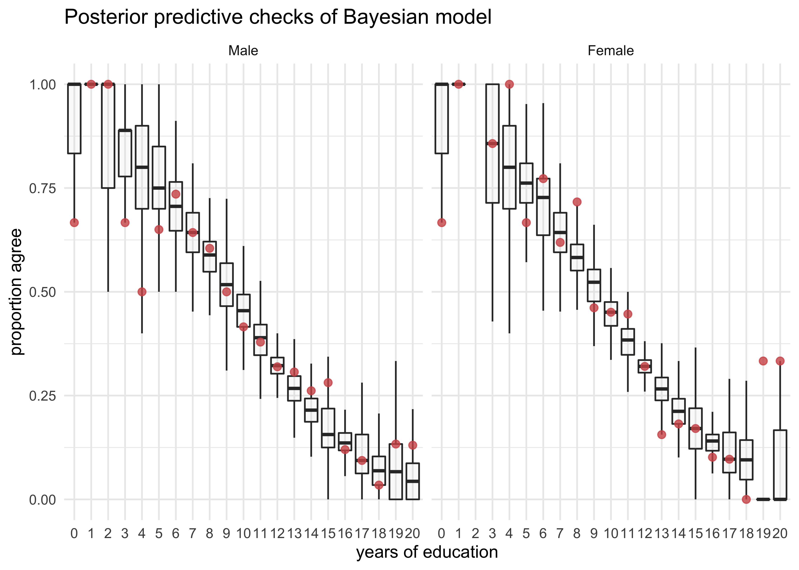
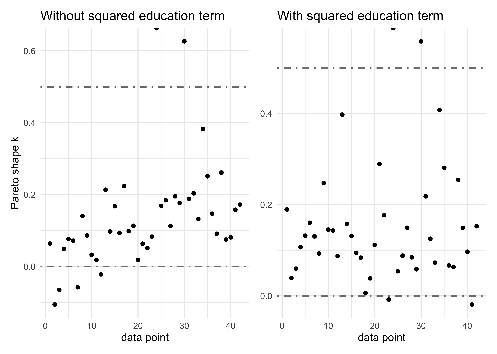
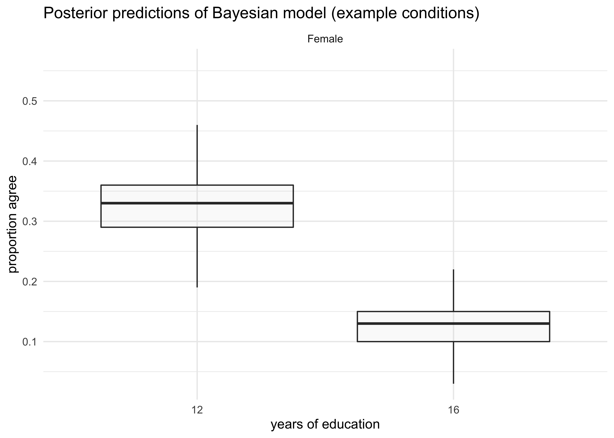
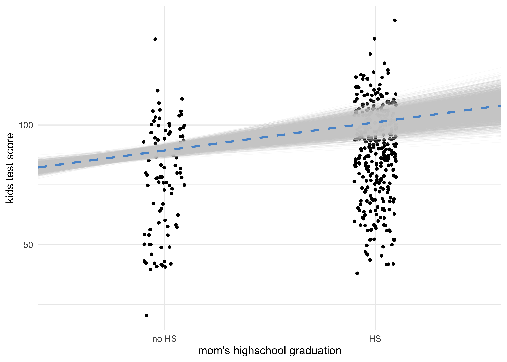
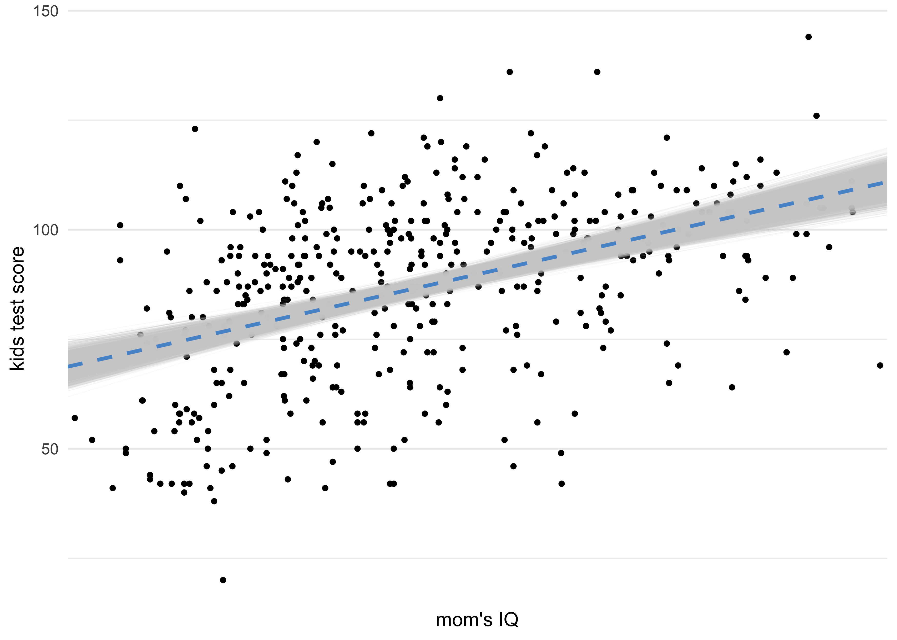
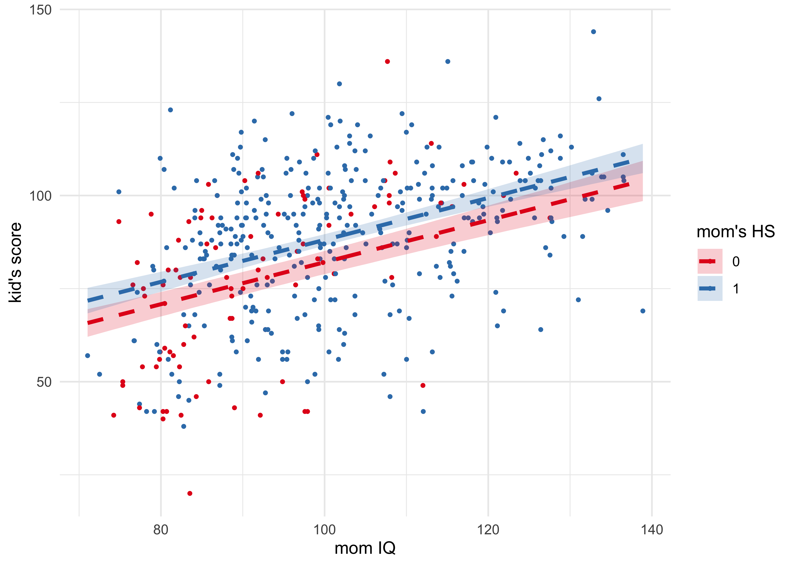
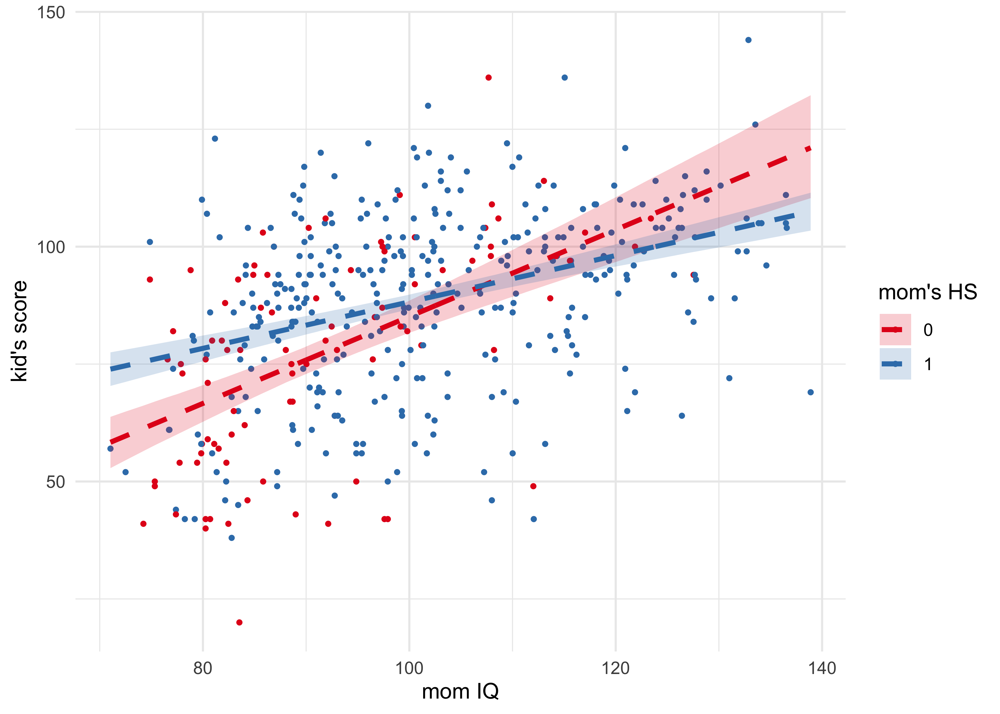
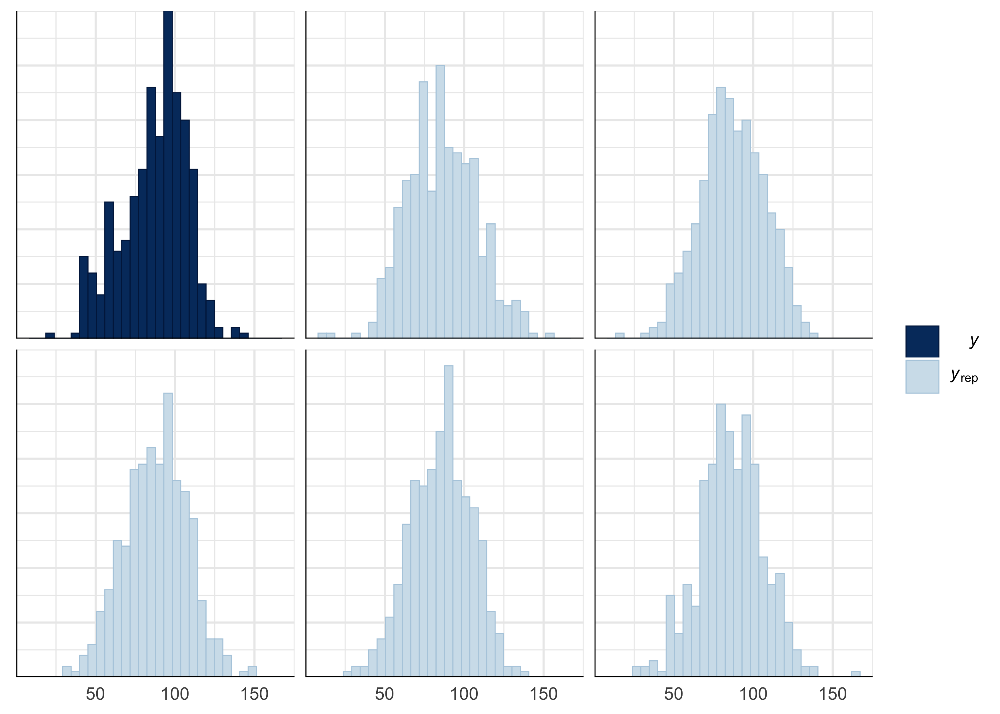
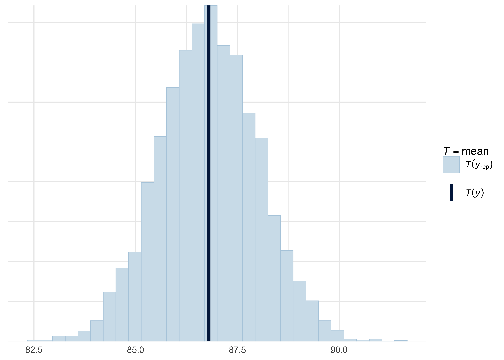
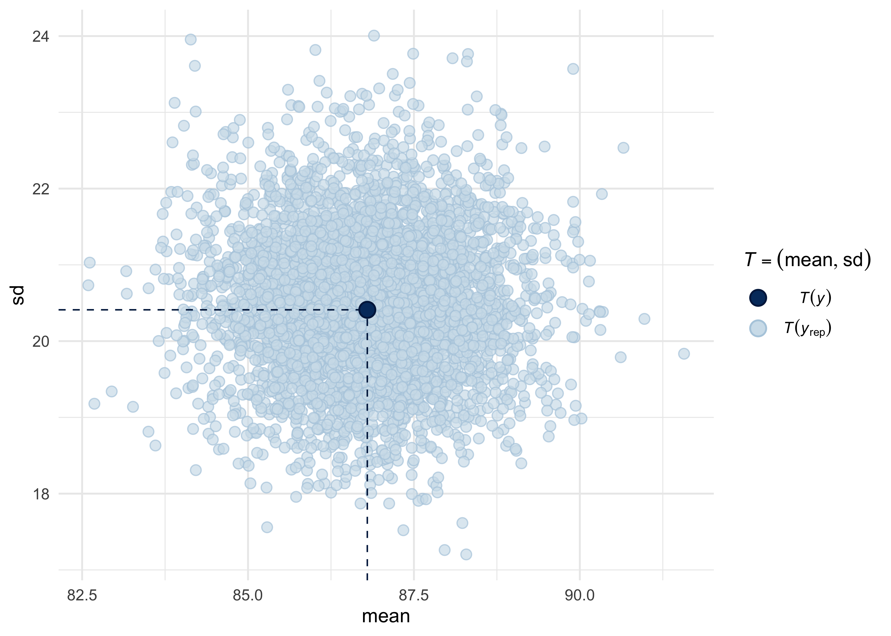

‘rstanarm’
================

[‘rstanarm’ documentation
website.](https://mc-stan.org/rstanarm/index.html)  
[CRAN : ‘rstanarm’](https://cran.r-project.org/package=rstanarm)  
[A link to all ‘rstanarm’
vignettes.](https://mc-stan.org/rstanarm/articles/index.html)

-----

## [How to Use the ‘rstanarm’ Package](https://mc-stan.org/rstanarm/articles/rstanarm.html)

> The four steps of a Bayesian analysis are
> 
> 1.  Specify a joint distribution for the outcome(s) and all the
>     unknowns, which typically takes the form of a marginal prior
>     distribution for the unknowns multiplied by a likelihood for the
>     outcome(s) conditional on the unknowns. This joint distribution is
>     proportional to a posterior distribution of the unknowns
>     conditional on the observed data
> 2.  Draw from posterior distribution using Markov Chain Monte Carlo
>     (MCMC).
> 3.  Evaluate how well the model fits the data and possibly revise the
>     model.
> 4.  Draw from the posterior predictive distribution of the outcome(s)
>     given interesting values of the predictors in order to visualize
>     how a manipulation of a predictor affects (a function of) the
>     outcome(s).

### Step 1: Specify a posterior distribution

  - the default priors in ‘rstanarm’ are designed to be *weakly
    informative*
  - the vignette will use an exampe from the ‘HSAUR3’ package that is a
    survey of whether people agree or disagree with conservative
    statements about women’s roles in society
  - will use a binomial model with a logistic link function

### Step 2: Draw from the posterior distribution

> I am doing the same coding slightly different than presented in the
> vignette, but the models will be the same.

  - for comparison, fit the frequentist model

<!-- end list -->

``` r
data("womensrole", package = "HSAUR3")

d <- womensrole %>%
    mutate(total = agree + disagree,
           row_id = row_number())

womensrole_glm_1 <- glm(cbind(agree, disagree) ~ education + gender,
                        data = d,
                        family = binomial(link = "logit"))

round(coef(summary(womensrole_glm_1)), 3)
```

    #>              Estimate Std. Error z value Pr(>|z|)
    #> (Intercept)     2.509      0.184  13.646    0.000
    #> education      -0.271      0.015 -17.560    0.000
    #> genderFemale   -0.011      0.084  -0.136    0.892

  - fit the same model using ‘rstanarm’

<!-- end list -->

``` r
womensrole_bglm_1 <- stan_glm(cbind(agree, disagree) ~ education + gender,
                              data = d,
                              family = binomial(link = "logit"),
                              prior = student_t(df = 7),
                              prior_intercept = student_t(df = 7),
                              cores = 1,
                              seed = 12345,
                              refresh = 0)

womensrole_bglm_1
```

    #> stan_glm
    #>  family:       binomial [logit]
    #>  formula:      cbind(agree, disagree) ~ education + gender
    #>  observations: 42
    #>  predictors:   3
    #> ------
    #>              Median MAD_SD
    #> (Intercept)   2.5    0.2  
    #> education    -0.3    0.0  
    #> genderFemale  0.0    0.1  
    #> 
    #> ------
    #> * For help interpreting the printed output see ?print.stanreg
    #> * For info on the priors used see ?prior_summary.stanreg

  - frequentist would ask whether the point estimate is greater in
    magnitude than double the estimated standard deviation
  - with Bayesian, we have estimates of the standard deviation
  - can also use the posterior interval to see the uncertainty in the
    estimate of the coefficients
      - these indicate that we believe there is a 95% chance that the
        real value for the coefficients lie in the interval
      - thus we can say that there is effectively 0 probability that the
        real value for \(\beta_\text{education} > 0\)
          - a frequentist cannot make that claim

<!-- end list -->

``` r
ci95 <- posterior_interval(womensrole_bglm_1, 
                           prob = 0.95, 
                           pars = c("education", "genderFemale"))
round(ci95, 3)
```

    #>                2.5%  97.5%
    #> education    -0.300 -0.241
    #> genderFemale -0.176  0.149

### Step 3: Criticize the model

  - minimum requirement for Bayesian estimates is that the model should
    fit the data that the estimates were conditioned on
      - use `posterior_predict()` function to get a matrix of each row
        is a sample from the posterior and each column a data point in
        the original data set

<!-- end list -->

``` r
y_rep <- posterior_predict(womensrole_bglm_1)
dim(y_rep)
```

    #> [1] 4000   42

``` r
y_rep %>%
    as.data.frame() %>%
    as_tibble() %>%
    set_names(d$row_id) %>%
    mutate(post_sample_id = row_number()) %>%
    pivot_longer(-post_sample_id, 
                 names_to = "row_id", 
                 values_to = "post_sample") %>%
    mutate(row_id = as.numeric(row_id)) %>%
    left_join(d %>% select(education, gender, total, row_id), 
              by = "row_id") %>%
    mutate(prop_agree = post_sample / total) %>%
    ggplot(aes(x = factor(education), y = prop_agree)) +
    facet_wrap(~gender, nrow = 1) +
    geom_boxplot(fill = light_grey, alpha = 0.1, outlier.shape = NA) +
    geom_point(data = d %>% mutate(prop_agree = agree / total), 
               size = 2, color = red, alpha = 0.8) +
    labs(x = "years of education",
         y = "proportion agree",
         title = "Posterior predictive checks of Bayesian model")
```

    #> Warning: Removed 4000 rows containing non-finite values (stat_boxplot).

    #> Warning: Removed 1 rows containing missing values (geom_point).

<!-- -->

  - can also model where the effect of education has a quadratic effect

<!-- end list -->

``` r
womensrole_bglm_2 <- update(womensrole_bglm_1, 
                            formula. = . ~ . + I(education^2),
                            refresh = 0)
womensrole_bglm_2
```

    #> stan_glm
    #>  family:       binomial [logit]
    #>  formula:      cbind(agree, disagree) ~ education + gender + I(education^2)
    #>  observations: 42
    #>  predictors:   4
    #> ------
    #>                Median MAD_SD
    #> (Intercept)     2.0    0.4  
    #> education      -0.2    0.1  
    #> genderFemale    0.0    0.1  
    #> I(education^2)  0.0    0.0  
    #> 
    #> ------
    #> * For help interpreting the printed output see ?print.stanreg
    #> * For info on the priors used see ?prior_summary.stanreg

  - frequentists would test the null hypothesis that the new coefficient
    is zero
  - Bayesians ask whether such a model is expected to produce better
    out-of-sample predictions than the model without the new coefficient
      - accomplish this using leave-one-out cross-validation using the
        `loo()` function from the ‘loo’ package

<!-- end list -->

``` r
loo_bglm_1 <- loo(womensrole_bglm_1)
```

    #> Warning: Found 1 observation(s) with a pareto_k > 0.7. We recommend calling 'loo' again with argument 'k_threshold = 0.7' in order to calculate the ELPD without the assumption that these observations are negligible. This will refit the model 1 times to compute the ELPDs for the problematic observations directly.

``` r
loo_bglm_2 <- loo(womensrole_bglm_2)
```

    #> Warning: Found 1 observation(s) with a pareto_k > 0.7. We recommend calling 'loo' again with argument 'k_threshold = 0.7' in order to calculate the ELPD without the assumption that these observations are negligible. This will refit the model 1 times to compute the ELPDs for the problematic observations directly.

  - use the Pareto shape *k* which indicates the effect of each data
    point on the posterior
      - the plots below indiacte there are only a few outliers (with
        values above 0.5)

<!-- end list -->

``` r
p1 <- tibble(pareto_shape_k = loo::pareto_k_values(loo_bglm_1)) %>%
    mutate(sample_num = row_number()) %>%
    ggplot(aes(sample_num, pareto_shape_k)) +
    geom_hline(yintercept = c(0.0, 0.5), lty = 4, color = grey, size = 0.8) +
    geom_point() +
    labs(x = "data point", y = "Pareto shape k",
         title = "Without squared education term")

p2 <- tibble(pareto_shape_k = loo::pareto_k_values(loo_bglm_2)) %>%
    mutate(sample_num = row_number()) %>%
    ggplot(aes(sample_num, pareto_shape_k)) +
    geom_hline(yintercept = c(0.0, 0.5), lty = 4, color = grey, size = 0.8) +
    geom_point() +
    labs(x = "data point", y = NULL,
         title = "With squared education term")

p1 | p2
```

<!-- -->

  - model comparison using the LOO CV
      - indicates there is little difference between the expected
        deviance of the models

<!-- end list -->

``` r
loo_compare(loo_bglm_1, loo_bglm_2)
```

    #>                   elpd_diff se_diff
    #> womensrole_bglm_1  0.0       0.0   
    #> womensrole_bglm_2 -0.6       1.8

### Step 4: Analyze manipulations of predictors

  - frequentists struggle to interpret the estimates complex models
  - Bayesians just inspect the posterior predictive distribution at
    different levels of the predictors
      - make predictions on new data
      - note that the actual number of agrees and disagrees does not
        matter, just the total number surveyed

<!-- end list -->

``` r
newdata <- tibble(agree = c(0, 0),
                  disagree = c(100, 100),
                  education = c(12, 16),
                  gender = factor("Female", levels = c("Male", "Female"))) %>%
    mutate(row_id = row_number(),
           total = agree + disagree)
y_rep <- posterior_predict(womensrole_bglm_2, newdata)

y_rep %>%
    as.data.frame() %>%
    as_tibble() %>%
    set_names(newdata$row_id) %>%
    mutate(post_sample_id = row_number()) %>%
    pivot_longer(-post_sample_id, 
                 names_to = "row_id", 
                 values_to = "post_sample") %>%
    mutate(row_id = as.numeric(row_id)) %>%
    left_join(newdata %>% select(education, gender, total, row_id), 
              by = "row_id") %>%
    mutate(prop_agree = post_sample / total) %>%
    ggplot(aes(x = factor(education), y = prop_agree)) +
    facet_wrap(~gender, nrow = 1) +
    geom_boxplot(fill = light_grey, alpha = 0.1, outlier.shape = NA) +
    labs(x = "years of education",
         y = "proportion agree",
         title = "Posterior predictions of Bayesian model (example conditions)")
```

<!-- -->

-----

## [Estimating Generalized Linear Models for Continuous Data with ‘rstanarm’](https://mc-stan.org/rstanarm/articles/continuous.html)

### Likelihood

\[
\frac{1}{\sigma \sqrt{2 \pi}} e^{-\frac{1}{2} (\frac{y-\mu}{\sigma})^2} \\
\mu = \alpha + \textbf{x}^T \beta
\]

### Priors

  - define priors for the interecpt and coefficients
      - the `prior_intercept` and `prior` arguments of `stan_glm()`

### Linear Regression Example

  - example data:
      - fit regressions predicting cognitive test scores of 3 and 4
        year-olds given the characteristics of their mothers
  - use two predictors:
      - binary indicator for the mother’s high-school graduation
        (`mom_hs`)
      - mother’s IQ (`mom_iq`)
  - four models:
      - two models, each using one predictor
      - one model using both
      - one model using both and an interaction term

<!-- end list -->

``` r
data("kidiq")
d <- as_tibble(kidiq)

post1 <- stan_glm(kid_score ~ mom_hs,
                  data = d,
                  family = gaussian(link = "identity"),
                  seed = 12345,
                  refresh = 0)

post2 <- stan_glm(kid_score ~ mom_iq,
                  data = d,
                  family = gaussian(link = "identity"),
                  seed = 12345,
                  refresh = 0)

post3 <- stan_glm(kid_score ~ mom_hs + mom_iq,
                  data = d,
                  family = gaussian(link = "identity"),
                  seed = 12345,
                  refresh = 0)

post4 <- stan_glm(kid_score ~ mom_hs * mom_iq,
                  data = d,
                  family = gaussian(link = "identity"),
                  seed = 12345,
                  refresh = 0)

summary(post4)
```

    #> 
    #> Model Info:
    #>  function:     stan_glm
    #>  family:       gaussian [identity]
    #>  formula:      kid_score ~ mom_hs * mom_iq
    #>  algorithm:    sampling
    #>  sample:       4000 (posterior sample size)
    #>  priors:       see help('prior_summary')
    #>  observations: 434
    #>  predictors:   4
    #> 
    #> Estimates:
    #>                 mean   sd    10%   50%   90%
    #> (Intercept)    -7.3   13.0 -24.1  -6.8   9.1
    #> mom_hs         46.1   14.4  28.1  46.0  64.4
    #> mom_iq          0.9    0.1   0.7   0.9   1.1
    #> mom_hs:mom_iq  -0.4    0.2  -0.6  -0.4  -0.2
    #> sigma          18.0    0.6  17.2  18.0  18.8
    #> 
    #> Fit Diagnostics:
    #>            mean   sd   10%   50%   90%
    #> mean_PPD 86.8    1.2 85.3  86.8  88.4 
    #> 
    #> The mean_ppd is the sample average posterior predictive distribution of the outcome variable (for details see help('summary.stanreg')).
    #> 
    #> MCMC diagnostics
    #>               mcse Rhat n_eff
    #> (Intercept)   0.3  1.0  1651 
    #> mom_hs        0.4  1.0  1627 
    #> mom_iq        0.0  1.0  1646 
    #> mom_hs:mom_iq 0.0  1.0  1594 
    #> sigma         0.0  1.0  2182 
    #> mean_PPD      0.0  1.0  2647 
    #> log-posterior 0.0  1.0  1408 
    #> 
    #> For each parameter, mcse is Monte Carlo standard error, n_eff is a crude measure of effective sample size, and Rhat is the potential scale reduction factor on split chains (at convergence Rhat=1).

  - plot the actual data with the regression estimates overlayed
      - plot the draws to show variation in the estimates

<!-- end list -->

``` r
draws1 <- as.data.frame(post1) %>%
    as_tibble() %>%
    janitor::clean_names()

d %>%
    ggplot(aes(x = factor(mom_hs), y = kid_score)) +
    geom_jitter(size = 1, width = 0.1) +
    geom_abline(aes(intercept = intercept, slope = mom_hs),
                data = draws1,
                color = light_grey, size = 0.2, alpha = 0.1) +
    geom_abline(intercept = coef(post1)[1], slope = coef(post1)[2],
                color = blue, size = 1, lty = 2) +
    scale_x_discrete(labels = c("no HS", "HS")) +
    labs(x = "mom's highschool graduation",
         y = "kids test score")
```

<!-- -->

``` r
draws2 <- as.data.frame(post2) %>%
    as_tibble() %>%
    janitor::clean_names()
d %>%
    ggplot(aes(mom_iq, y = kid_score)) +
    geom_point(size = 1) +
    geom_abline(aes(intercept = intercept, slope = mom_iq),
                data = draws2,
                size = 0.2, color = light_grey, alpha = 0.1) +
    geom_abline(intercept = coef(post2)[1], slope = coef(post2)[2],
                color = blue, size = 1, lty = 2) +
    scale_x_discrete(labels = c("no HS", "HS")) +
    labs(x = "mom's IQ",
         y = "kids test score")
```

<!-- -->

``` r
pred_data3 <- d %>% 
    modelr::data_grid(mom_hs, mom_iq) %>%
    mutate(id = as.character(row_number()))
post_pred3 <- posterior_linpred(post3, newdata = pred_data3)

pred_data3 %<>%
    mutate(kid_score = apply(post_pred3, 2, mean)) %>%
    bind_cols(apply(post_pred3, 2, rethinking::PI) %>% pi_to_df())


d %>%
    ggplot(aes(x = mom_iq, y = kid_score, color = factor(mom_hs))) +
    geom_point(size = 0.8) +
    geom_ribbon(aes(ymin = x5_percent, ymax = x94_percent, fill = factor(mom_hs)),
                data = pred_data3, 
                alpha = 0.2, color = NA) +
    geom_line(data = pred_data3, size = 1.2, lty = 2) +
    scale_color_brewer(palette = "Set1") +
    scale_fill_brewer(palette = "Set1") +
    labs(x = "mom IQ",
         y = "kid's score",
         color = "mom's HS",
         fill = "mom's HS")
```

<!-- -->

``` r
pred_data4 <- d %>% 
    modelr::data_grid(mom_hs, mom_iq) %>%
    mutate(id = as.character(row_number()))
post_pred4 <- posterior_linpred(post4, newdata = pred_data3)

pred_data4 %<>%
    mutate(kid_score = apply(post_pred4, 2, mean)) %>%
    bind_cols(apply(post_pred4, 2, rethinking::PI) %>% pi_to_df())


d %>%
    ggplot(aes(x = mom_iq, y = kid_score, color = factor(mom_hs))) +
    geom_point(size = 0.8) +
    geom_ribbon(aes(ymin = x5_percent, ymax = x94_percent, fill = factor(mom_hs)),
                data = pred_data4, 
                alpha = 0.2, color = NA) +
    geom_line(data = pred_data4, size = 1.2, lty = 2) +
    scale_color_brewer(palette = "Set1") +
    scale_fill_brewer(palette = "Set1") +
    labs(x = "mom IQ",
         y = "kid's score",
         color = "mom's HS",
         fill = "mom's HS")
```

<!-- -->

### Model comparison

  - leave-one-out cross-validation to compare models

<!-- end list -->

``` r
loo1 <- loo(post1)
loo2 <- loo(post2)
loo3 <- loo(post3)
loo4 <- loo(post4)
loo_compare(loo1, loo2, loo3, loo4)
```

    #>       elpd_diff se_diff
    #> post4   0.0       0.0  
    #> post3  -3.6       2.6  
    #> post2  -6.2       3.9  
    #> post1 -42.4       8.7

### The posterior predictive distribution

  - *posterior predictive distribution*: the distribution of the outcome
    implied by the model after using observed data to updat its beliefs
    about the unknown parameters

#### Graphical posterior predictive checks

  - plot the distributions of the real data and predicted data of
    several draws
      - the dark blue histogram is the real distribution of `kid_score`
        and the light blue histograms are individual samples
      - they should all look similar

<!-- end list -->

``` r
pp_check(post4, plotfun = "hist", nreps = 5)
```

    #> `stat_bin()` using `bins = 30`. Pick better value with `binwidth`.

<!-- -->

  - compare the distribution of some statistic between the real
    distribution and that from many samples
      - the plot below shows the distribution of means of the posterior
        distributions from many samples

<!-- end list -->

``` r
pp_check(post4, plotfun = "stat", stat = "mean")
```

    #> `stat_bin()` using `bins = 30`. Pick better value with `binwidth`.

<!-- -->

  - can plot two statistics at once

<!-- end list -->

``` r
pp_check(post4, plotfun = "stat_2d", stat = c("mean", "sd"))
```

<!-- -->
