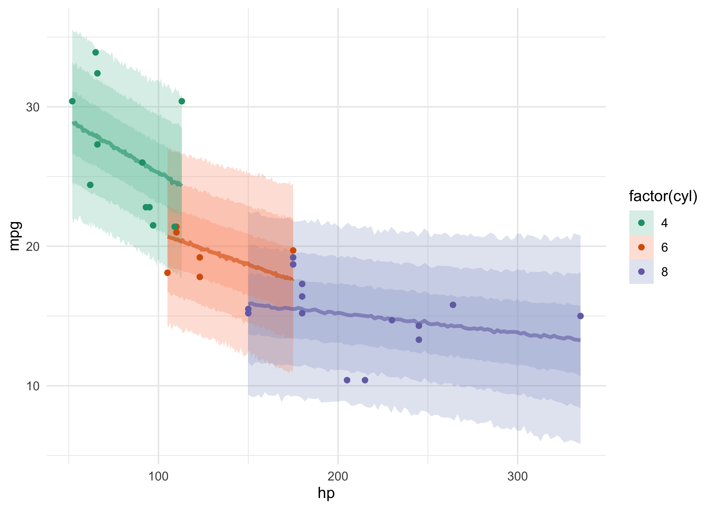

‘tidybayes’
================

[‘tidybayes’ documentation
website.](https://mc-stan.org/rstanarm/index.html)  
[CRAN : ‘tidybayes’](https://cran.r-project.org/package=tidybayes)  
[A link to all ‘tidybayes’
vignettes.](https://mjskay.github.io/tidybayes/articles/)

-----

## [Extracting and visualizing tidy draws from rstanarm models](https://mjskay.github.io/tidybayes/articles/tidy-rstanarm.html)

  - example data set of 10 observations from 5 conditions each

<!-- end list -->

``` r
set.seed(5)
n <- 10
n_condition <- 5
ABC <- tibble(
    condition = rep(c("A","B","C","D","E"), n),
    response = rnorm(n * 5, c(0,1,2,1,-1), 0.5)
)

head(ABC)
```

    #> # A tibble: 6 x 2
    #>   condition response
    #>   <chr>        <dbl>
    #> 1 A           -0.420
    #> 2 B            1.69 
    #> 3 C            1.37 
    #> 4 D            1.04 
    #> 5 E           -0.144
    #> 6 A           -0.301

``` r
ABC %>%
    ggplot(aes(y = condition, x = response)) +
    geom_point()
```

<!-- -->

### Model

  - hierarchical model with shrinkage towards a global mean

<!-- end list -->

``` r
stash("m", depends_on = "ABC", {
    m <- stan_lmer(
        response ~ (1|condition), data = ABC,
        prior = normal(0, 1, autoscale = FALSE),
        prior_aux = student_t(3, 0, 1, autoscale = FALSE),
        adapt_delta = .99,
        refresh = 0
    )
})
```

    #> Loading stashed object.

``` r
m
```

    #> stan_lmer
    #>  family:       gaussian [identity]
    #>  formula:      response ~ (1 | condition)
    #>  observations: 50
    #> ------
    #>             Median MAD_SD
    #> (Intercept) 0.6    0.5   
    #> 
    #> Auxiliary parameter(s):
    #>       Median MAD_SD
    #> sigma 0.6    0.1   
    #> 
    #> Error terms:
    #>  Groups    Name        Std.Dev.
    #>  condition (Intercept) 1.12    
    #>  Residual              0.57    
    #> Num. levels: condition 5 
    #> 
    #> ------
    #> * For help interpreting the printed output see ?print.stanreg
    #> * For info on the priors used see ?prior_summary.stanreg

### Extracting draws from a fit in tidy-format using `spread_draws()`

  - `get_variables()` function to list the raw model variable names
      - `(Intercept)` is the global mean and the `b` parameters are
        offsets from that mean for each condition

<!-- end list -->

``` r
get_variables(m)
```

    #>  [1] "(Intercept)"                             
    #>  [2] "b[(Intercept) condition:A]"              
    #>  [3] "b[(Intercept) condition:B]"              
    #>  [4] "b[(Intercept) condition:C]"              
    #>  [5] "b[(Intercept) condition:D]"              
    #>  [6] "b[(Intercept) condition:E]"              
    #>  [7] "sigma"                                   
    #>  [8] "Sigma[condition:(Intercept),(Intercept)]"
    #>  [9] "accept_stat__"                           
    #> [10] "stepsize__"                              
    #> [11] "treedepth__"                             
    #> [12] "n_leapfrog__"                            
    #> [13] "divergent__"                             
    #> [14] "energy__"

  - `spread_draws()` function to extract posterior samples for the
    variables
      - includes a specification format that can be used to extract
        model variables and their indices

<!-- end list -->

``` r
m %>%
    spread_draws(b[term,group]) %>%
    head()
```

    #> # A tibble: 6 x 6
    #> # Groups:   term, group [1]
    #>   term        group            b .chain .iteration .draw
    #>   <chr>       <chr>        <dbl>  <int>      <int> <int>
    #> 1 (Intercept) condition:A -1.01       1          1     1
    #> 2 (Intercept) condition:A -1.11       1          2     2
    #> 3 (Intercept) condition:A -1.38       1          3     3
    #> 4 (Intercept) condition:A -2.19       1          4     4
    #> 5 (Intercept) condition:A -0.403      1          5     5
    #> 6 (Intercept) condition:A -0.413      1          6     6

``` r
# Can remove the `term` variable because there is only an `(Intercept)` variable
# in the model.
m %>%
    spread_draws(b[,group]) %>%
    head()
```

    #> # A tibble: 6 x 5
    #> # Groups:   group [1]
    #>   group            b .chain .iteration .draw
    #>   <chr>        <dbl>  <int>      <int> <int>
    #> 1 condition:A -1.01       1          1     1
    #> 2 condition:A -1.11       1          2     2
    #> 3 condition:A -1.38       1          3     3
    #> 4 condition:A -2.19       1          4     4
    #> 5 condition:A -0.403      1          5     5
    #> 6 condition:A -0.413      1          6     6

``` r
m %>%
    spread_draws(b[,group]) %>% 
    separate(group, c("group", "condition"), sep = ":") %>%
    head()
```

    #> # A tibble: 6 x 6
    #>   group     condition      b .chain .iteration .draw
    #>   <chr>     <chr>      <dbl>  <int>      <int> <int>
    #> 1 condition A         -1.01       1          1     1
    #> 2 condition A         -1.11       1          2     2
    #> 3 condition A         -1.38       1          3     3
    #> 4 condition A         -2.19       1          4     4
    #> 5 condition A         -0.403      1          5     5
    #> 6 condition A         -0.413      1          6     6

  - use the `sep` argument to parse the variable names further

<!-- end list -->

``` r
m %>%
    spread_draws(b[,group,condition], sep = "[, :]") %>%
    head()
```

    #> # A tibble: 6 x 6
    #> # Groups:   group, condition [1]
    #>   group     condition      b .chain .iteration .draw
    #>   <chr>     <chr>      <dbl>  <int>      <int> <int>
    #> 1 condition A         -1.01       1          1     1
    #> 2 condition A         -1.11       1          2     2
    #> 3 condition A         -1.38       1          3     3
    #> 4 condition A         -2.19       1          4     4
    #> 5 condition A         -0.403      1          5     5
    #> 6 condition A         -0.413      1          6     6

### Point summaries and intervals

  - family of functions for point summaries of posterior distributions
      - follow the naming scheme `[median|mean|mode]_[qi|hdi]()`

<!-- end list -->

``` r
m %>%
    spread_draws(`(Intercept)`, sigma) %>%
    median_qi(`(Intercept)`, sigma)
```

    #> # A tibble: 1 x 9
    #>   `(Intercept)` `(Intercept).lo… `(Intercept).up… sigma sigma.lower sigma.upper
    #>           <dbl>            <dbl>            <dbl> <dbl>       <dbl>       <dbl>
    #> 1         0.604           -0.405             1.63 0.562       0.463       0.706
    #> # … with 3 more variables: .width <dbl>, .point <chr>, .interval <chr>

  - can use `gather_draws()` to get a long format

<!-- end list -->

``` r
m %>%
    gather_draws(`(Intercept)`, sigma) %>%
    head()
```

    #> # A tibble: 6 x 5
    #> # Groups:   .variable [1]
    #>   .chain .iteration .draw .variable   .value
    #>    <int>      <int> <int> <chr>        <dbl>
    #> 1      1          1     1 (Intercept)  1.45 
    #> 2      1          2     2 (Intercept)  1.28 
    #> 3      1          3     3 (Intercept)  1.64 
    #> 4      1          4     4 (Intercept)  2.52 
    #> 5      1          5     5 (Intercept)  0.765
    #> 6      1          6     6 (Intercept)  0.685

``` r
m %>%
    gather_draws(`(Intercept)`, sigma) %>%
    median_qi()
```

    #> # A tibble: 2 x 7
    #>   .variable   .value .lower .upper .width .point .interval
    #>   <chr>        <dbl>  <dbl>  <dbl>  <dbl> <chr>  <chr>    
    #> 1 (Intercept)  0.604 -0.405  1.63    0.95 median qi       
    #> 2 sigma        0.562  0.463  0.706   0.95 median qi

``` r
m %>%
    spread_draws(b[,group]) %>%
    median_qi()
```

    #> # A tibble: 5 x 7
    #>   group            b .lower .upper .width .point .interval
    #>   <chr>        <dbl>  <dbl>  <dbl>  <dbl> <chr>  <chr>    
    #> 1 condition:A -0.401 -1.47   0.611   0.95 median qi       
    #> 2 condition:B  0.397 -0.683  1.45    0.95 median qi       
    #> 3 condition:C  1.22   0.185  2.26    0.95 median qi       
    #> 4 condition:D  0.419 -0.638  1.48    0.95 median qi       
    #> 5 condition:E -1.48  -2.58  -0.462   0.95 median qi

### Posterior fits

  - use `add_fitted_draws()` to mimic `rstanarm::posterior_linpred()`

<!-- end list -->

``` r
ABC %>%
    modelr::data_grid(condition) %>%
    add_fitted_draws(m) %>%
    head()
```

    #> # A tibble: 6 x 6
    #> # Groups:   condition, .row [1]
    #>   condition  .row .chain .iteration .draw .value
    #>   <chr>     <int>  <int>      <int> <int>  <dbl>
    #> 1 A             1     NA         NA     1  0.438
    #> 2 A             1     NA         NA     2  0.168
    #> 3 A             1     NA         NA     3  0.259
    #> 4 A             1     NA         NA     4  0.326
    #> 5 A             1     NA         NA     5  0.362
    #> 6 A             1     NA         NA     6  0.271

``` r
ABC %>%
    modelr::data_grid(condition) %>%
    add_fitted_draws(m) %>%
    ggplot(aes(x = .value, y = condition)) +
    ggdist::stat_pointinterval(.width = c(0.50, 0.89))
```

    #> Registered S3 method overwritten by 'ggdist':
    #>   method                from     
    #>   makeContent.dots_grob tidybayes

<!-- -->

``` r
ABC %>%
    modelr::data_grid(condition) %>%
    add_fitted_draws(m) %>%
    ggplot(aes(x = .value, y = condition)) +
    ggdist::stat_halfeye(aes(fill = stat(abs(x) < 0.8)), 
                         .width = c(0.50, 0.89)) +
    geom_vline(xintercept = c(-0.8, 0.8), size = 1, lty = 2, color = dark_grey) +
    scale_fill_manual(values = c(blue, grey))
```

<!-- -->

### Posterior predictions

  - use `add_predicted()` to mimic `rstanarm::posterior_predict()`

<!-- end list -->

``` r
ABC %>%
      modelr::data_grid(condition) %>%
      add_predicted_draws(m) %>%
      ggplot(aes(x = .prediction, y = condition)) +
      ggdist::stat_halfeye()
```

<!-- -->

### Fit/prediction curves

``` r
m_mpg <- stan_glm(mpg ~ hp * cyl, data = mtcars, refresh = 0)
```

  - the following two examples show the models with the *probability
    bands*
      - uses `add_fitted_draws()`

<!-- end list -->

``` r
mtcars %>%
    group_by(cyl) %>%
    modelr::data_grid(hp = modelr::seq_range(hp, n = 51)) %>%
    add_fitted_draws(m_mpg) %>%
    head()
```

    #> # A tibble: 6 x 7
    #> # Groups:   cyl, hp, .row [1]
    #>     cyl    hp  .row .chain .iteration .draw .value
    #>   <dbl> <dbl> <int>  <int>      <int> <int>  <dbl>
    #> 1     4    52     1     NA         NA     1   29.5
    #> 2     4    52     1     NA         NA     2   29.7
    #> 3     4    52     1     NA         NA     3   29.6
    #> 4     4    52     1     NA         NA     4   29.4
    #> 5     4    52     1     NA         NA     5   28.7
    #> 6     4    52     1     NA         NA     6   29.4

``` r
mtcars %>%
    group_by(cyl) %>%
    modelr::data_grid(hp = modelr::seq_range(hp, n = 51)) %>%
    add_fitted_draws(m_mpg) %>%
    ggplot(aes(x = hp, y = mpg, color = factor(cyl))) +
    stat_lineribbon(aes(y = .value)) +
    geom_point(data = mtcars) +
    scale_fill_brewer(palette = "Greys") +
    scale_color_brewer(palette = "Set2")
```

<!-- -->

``` r
mtcars %>%
    group_by(cyl) %>%
    modelr::data_grid(hp = modelr::seq_range(hp, n = 101)) %>%
    add_fitted_draws(m_mpg, n = 100) %>%
    ggplot(aes(x = hp, y = mpg, color = factor(cyl))) +
    geom_line(aes(y = .value, group = paste(cyl, .draw)), 
              alpha = .1) +
    geom_point(data = mtcars) +
    scale_color_brewer(palette = "Set2")
```

<!-- -->

  - the following two examples show the models with the *posterior
    predictions*
      - uses `add_predicted_draws()`

<!-- end list -->

``` r
mtcars %>%
    group_by(cyl) %>%
    modelr::data_grid(hp = modelr::seq_range(hp, n = 101)) %>%
    add_predicted_draws(m_mpg) %>%
    ggplot(aes(x = hp, y = mpg, 
               color = factor(cyl), fill = factor(cyl))) +
    stat_lineribbon(aes(y = .prediction), 
                    .width = c(.95, .80, .50), alpha = 1/4) +
    geom_point(data = mtcars) +
    scale_fill_brewer(palette = "Set2") +
    scale_color_brewer(palette = "Dark2")
```

<!-- -->

``` r
mtcars %>%
    group_by(cyl) %>%
    modelr::data_grid(hp = modelr::seq_range(hp, n = 101)) %>%
    add_predicted_draws(m_mpg) %>%
    ggplot(aes(x = hp, y = mpg)) +
    stat_lineribbon(aes(y = .prediction), 
                    .width = c(.99, .95, .8, .5),
                    color = RColorBrewer::brewer.pal(5, "Blues")[[5]]) +
    geom_point(data = mtcars) +
    scale_fill_brewer() +
    facet_grid(. ~ cyl, space = "free_x", scales = "free_x")
```

<!-- -->
