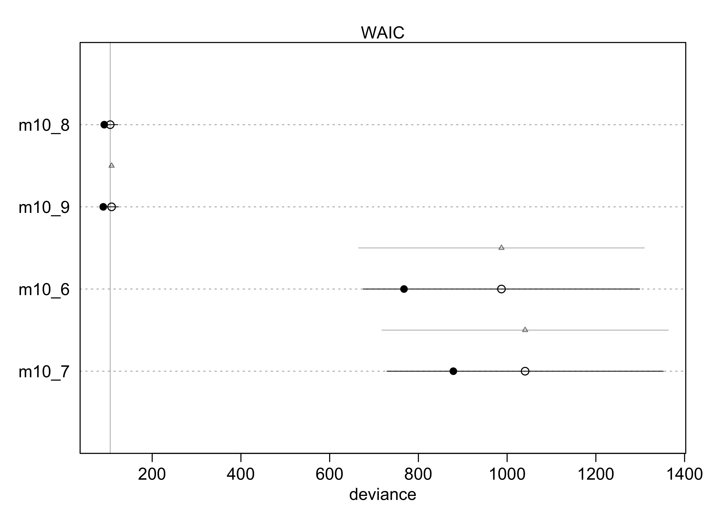
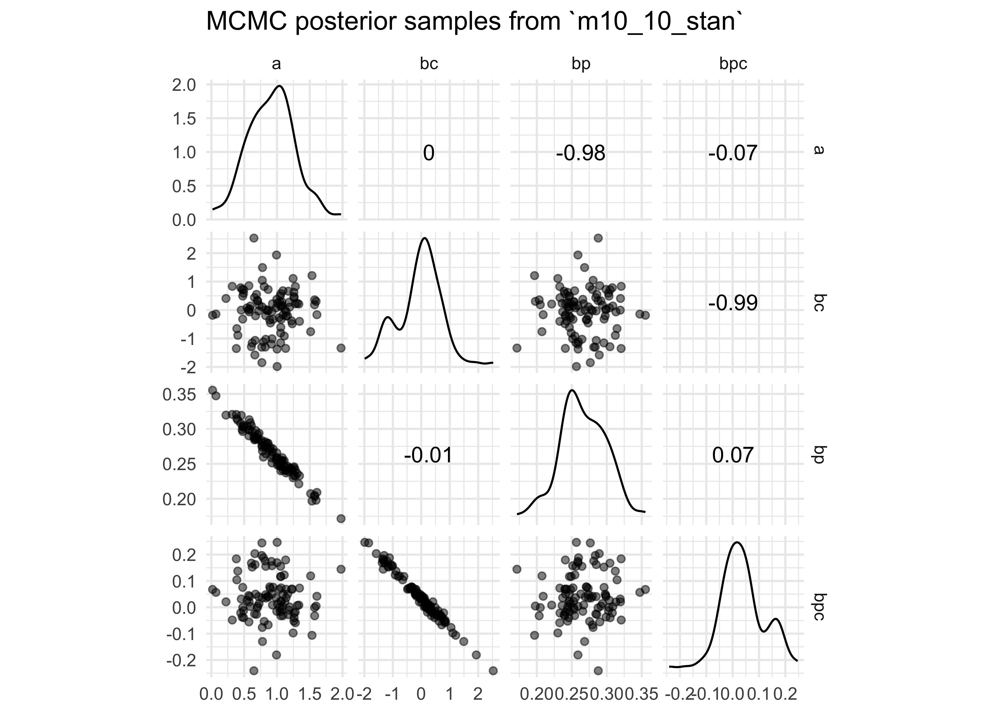
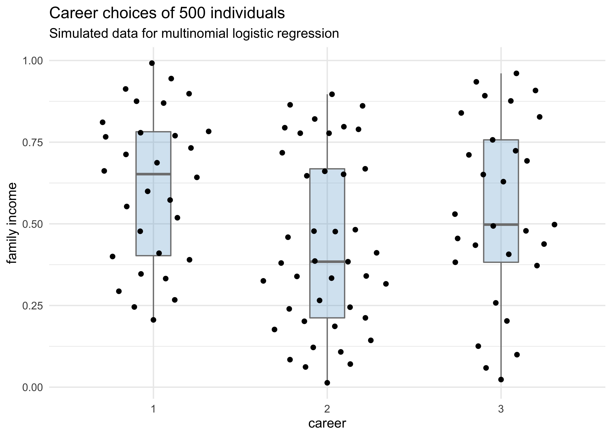
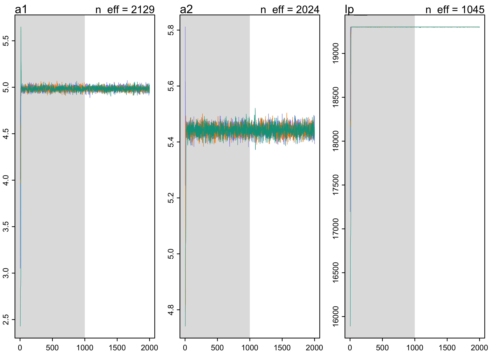
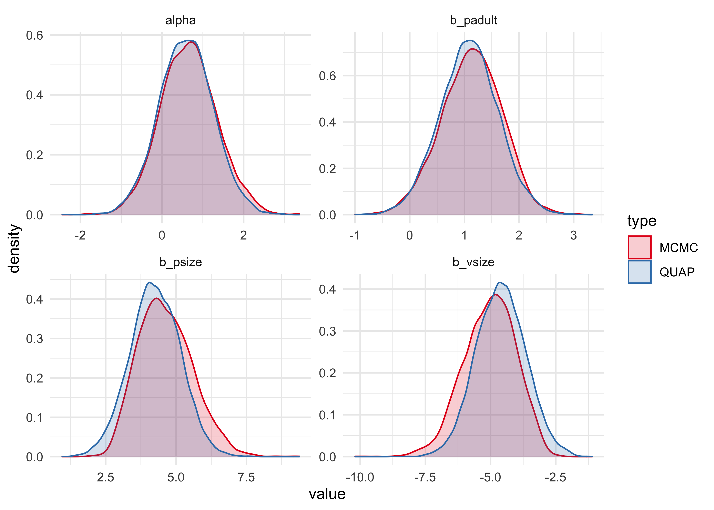
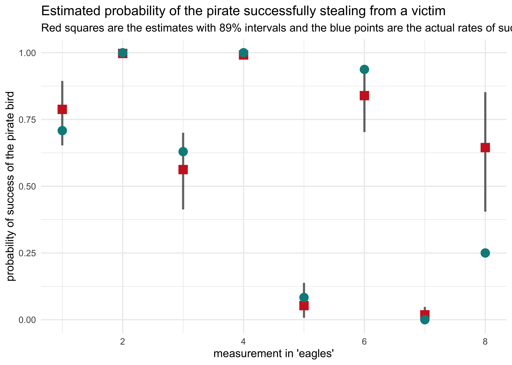
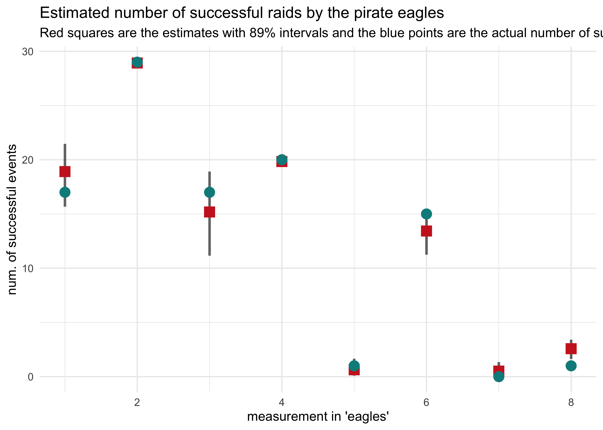

Chapter 10. Counting and Classification
================

  - information if often thrown away by using ratios of counts instead
    of the counts themselves
      - 10/20 and 1/2 are the same ratio, but the first has more
        information
  - there is friction in using the count data instead of the proportions
      - interpretation is less intuitive
  - this chapter covers the two most popular count distributions:
    1.  *binomial regression*: model a binary classification
          - dead/alive, accept/reject 2 *Poisson regression*: models
            outcome without a known maximum
          - a binomial models with a very large maximum and small
            probability per trial
          - number of elephants in Kenya, number of people who apply to
            graduate school

## 10.1 Binomial regression

  - the following formula where \(y\) is a count, \(p\) is the
    probability of success in a trial, \(n\) is the number of trials \[
    y \sim \text{Binomial}(n, p)
    \]

  - the two most common GLMs that use binomial likelihood functions:
    
    1.  *logistic regression*: data are in single-trial cases and the
        outcome is only 0 or 1
    2.  *aggregated binomial regression*: when individual trials with
        the same covariate values are aggregated together
          - the outcome can take a value of 0 or any positive integer up
            to \(n\) number of trials

  - both GLMs use the same logit link function
    
      - so both are sometimes called logistic regression and they can be
        converted between each other

## 10.1.1 Logistic regression: Prosocial chimpanzees

  - example experimental data
      - measure the prosocial behavior of chimps
      - a focal chimp has the option to pull two levers where the first
        only gives the focal chimp food and the other gives the focal
        chimp food, but not the other chimp
      - therefore, the focal chimp always gets food and decides if the
        other chimp gets food
      - the control condition is to not have another chimp and the
        partner condition is to have the second chimp
      - the two choices are swapped from the left and right hand sides
        to detect any handedness of the focal chimps

<!-- end list -->

``` r
data("chimpanzees")
d <- as_tibble(chimpanzees) %>% janitor::clean_names()
d
```

    #> # A tibble: 504 x 8
    #>    actor recipient condition block trial prosoc_left chose_prosoc pulled_left
    #>    <int>     <int>     <int> <int> <int>       <int>        <int>       <int>
    #>  1     1        NA         0     1     2           0            1           0
    #>  2     1        NA         0     1     4           0            0           1
    #>  3     1        NA         0     1     6           1            0           0
    #>  4     1        NA         0     1     8           0            1           0
    #>  5     1        NA         0     1    10           1            1           1
    #>  6     1        NA         0     1    12           1            1           1
    #>  7     1        NA         0     2    14           1            0           0
    #>  8     1        NA         0     2    16           1            0           0
    #>  9     1        NA         0     2    18           0            1           0
    #> 10     1        NA         0     2    20           0            1           0
    #> # … with 494 more rows

  - we will focus on the columns:
      - `pulled_left`: the outcome to predict
      - `prosoc_left`: a predictor for if the left-hand lever was the
        prosocial option
      - `condition`: contains a 1 for when there was a second partner
        chimp
  - the model we will fit:
      - \(L\): indicates if the left-hand lever was pulled
      - \(P\): indicates if the left-hand option was pro-social
      - \(C\): indicates whether or not the condition was with the
        partner

\[
L_i \sim \text{Binomial}(1, p_i) \\
\text{logit}(p_i) = \alpha + (\beta_P + \beta_{PC} C_i)P_i \\
\alpha \sim \text{Normal}(0, 10) \\
\beta_P \sim \text{Normal}(0, 10) \\
\beta_PC \sim \text{Normal}(0, 10)
\]

  - this model includes an interaction term for the left-hand option
    being pro-social and whether or not there is a second chimp
      - also there is no main effect of the `condition` \(C_i\) because
        we do not expect the presence of a second chimp on its own to
        predict whether the focal chimp pulls the left lever
  - the priors are gently regularizing
  - as comparative measures of overfitting, fit two other models with
    fewer parameters
      - one with just an intercept
      - one without only the `prosoc_left` predictor (no predictor for
        `condition` whether there is a second chimp)

\[
L_i \sim \text{Binomial}(1, p_i) \\
\text{logit}(p_i) = \alpha \\
\alpha \sim \text{Normal}(0, 10)
\]

\[
L_i \sim \text{Binomial}(1, p_i) \\
\text{logit}(p_i) = \alpha + \beta_P P_i \\
\alpha \sim \text{Normal}(0, 10) \\
\beta_P \sim \text{Normal}(0, 10)
\]

  - first we will inspect the simplest model, the one with only an
    intercept

<!-- end list -->

``` r
m10_1 <- quap(
    alist(
        pulled_left ~ dbinom(1, p),
        logit(p) <- a,
        a ~ dnorm(0, 10)
    ),
    data = d
)

precis(m10_1)
```

    #>        mean         sd     5.5%    94.5%
    #> a 0.3201415 0.09022718 0.175941 0.464342

  - \(\alpha\) is on the scale of log-odds
      - to get it to probability scale, must use the inverse link
        function, the logistic
      - the ‘rethinking’ package offers the function `logisitic()` to do
        this, but below I just show the calculation for education
        reasons

<!-- end list -->

``` r
# MAP
1 / (1 + exp(-0.32))
```

    #> [1] 0.5793243

``` r
# 89% interval
c(1 / (1 + exp(-0.18)), 1 / (1 + exp(-0.46)))
```

    #> [1] 0.5448789 0.6130142

``` r
logistic
```

    #> function (x) 
    #> {
    #>     p <- 1/(1 + exp(-x))
    #>     p <- ifelse(x == Inf, 1, p)
    #>     p
    #> }
    #> <bytecode: 0x7f92807be410>
    #> <environment: namespace:rethinking>

  - \(\text{logistic}(0.32) \approx 0.58\) means that the probability of
    pulling the left-hand lever was 0.58 with an 89% interval of 0.54 to
    0.61
      - the chimps had a tendency to favor the left without any other
        information
  - the following two code chunks fit the other two models proposed
    above

<!-- end list -->

``` r
m10_2 <- quap(
    alist(
        pulled_left ~ dbinom(1, p),
        logit(p) <- a + bp*prosoc_left,
        a ~ dnorm(0, 10),
        bp ~ dnorm(0, 10)
    ),
    data = d
)

precis(m10_2)
```

    #>         mean        sd       5.5%     94.5%
    #> a  0.0477090 0.1260040 -0.1536697 0.2490877
    #> bp 0.5573081 0.1823154  0.2659328 0.8486833

``` r
m10_3 <- quap(
    alist(
        pulled_left ~ dbinom(1, p),
        logit(p) <- a + (bp + bpc*condition)*prosoc_left,
        a ~ dnorm(0, 10),
        bp ~ dnorm(0, 10),
        bpc ~ dnorm(0, 10)
    ),
    data = d
)

precis(m10_3)
```

    #>            mean        sd       5.5%     94.5%
    #> a    0.04771766 0.1260040 -0.1536611 0.2490964
    #> bp   0.60967089 0.2261462  0.2482456 0.9710962
    #> bpc -0.10396684 0.2635904 -0.5252352 0.3173015

``` r
compare(m10_1, m10_2, m10_3)
```

    #>           WAIC       SE    dWAIC       dSE     pWAIC    weight
    #> m10_2 680.4648 9.165323 0.000000        NA 1.9807109 0.7106338
    #> m10_3 682.3826 9.403175 1.917804 0.8137132 3.0213904 0.2723955
    #> m10_1 687.9341 7.070955 7.469337 6.0718121 0.9966656 0.0169707

``` r
plot(compare(m10_1, m10_2, m10_3))
```

<!-- -->

  - from the WAIC, we can see that `m10_3` likely overfits a bit because
    its WAIC is greater than `m10_2`
      - though the difference in WAIC is small, the difference standard
        error `dSE` is very small and suggests it is a real difference
  - but `m10_3` should not just be rejected, it still reflects the
    structure of the experiment
      - we do want to see why `m10_3` performs worse than `m10_2`
  - the estimates for `m10_3` show a negative interaction term with a
    large 89% interval
      - suggests the chimps don’t care too much about the presence of
        another chimp
      - they do prefer to pull the prosocial option, though, because
        that estimate is 0.61 with an 89% interval well above 0
  - to understand the impact of the estimate 0.61 for `bp`, must
    distinguish between the *absolute effect* and the *relative effect*
      - *absolute effect*: the change in the probability of the outcome,
        depending on all of the parameters
          - tells us the practical impact of a change in a predictor
      - *relative effect*: the proportional changes induced by a change
        in the predictor
          - the author claims that this effect can be misleading because
            they ignore the other parameters
  - the relative effect:
      - consider the relative effect size of `prosoc_left` and its
        parameter `bp`
      - the customary measure of relative effect for logistic model is
        the *proportional change in odds*
          - just the exponent of the parameter estimate
          - it is \(\exp(0.61) \approx 1.84\) for `bp`
          - odds are the ratio of the probability an even happens to the
            probability that it does not
      - for `bp`, the log-odds of pulling the left-hand level (the
        outcome variable) is increased by 0.61
          - alternatively, the odds are multiplied by 1.84
      - the difficulty with proportional odds is that the actual change
        in probability depends on the intercept and the other predictor
        variables
          - for example, consider that the intercept \(\alpha = 4\),
            then the probability of pulling the left-lever, ignoring all
            else, is \(\text{logistic}(4) = 0.98\)
          - then the increase from `bp` would be
            \(\text{logistic}(4 + 0.61) = 0.99\)
          - the difference from `bp` is really not very much on the
            absolute scale
  - the absolute effect:
      - consider the model-average posterior predictive check to get a
        sense of the absolute effect of each treatment on the
        probability of pulling the left-hand lever
          - use the `ensemble()` function to take a weighted average (by
            WAIC) over the three models
          - in the following plot, this is compared to the proportion of
            times the left-hand lever was pull by each chimp in all four
            conditions
      - interpreting the plot
          - the chimps, on average, tended to pull the prosocial option
            on the left (“1,0” and “1,1”)
          - the partner condition did not seem to matter because the
            heights of the lines did not tend to move when the condition
            was changed and hand of the lever was held constant

<!-- end list -->

``` r
d_pred <- tibble(
    prosoc_left = c(0, 1, 0, 1),
    condition = c(0, 0, 1, 1)
)

# Build an ensemble from all three models weighted by WAIC.
chimp_ensemble <- ensemble(m10_1, m10_2, m10_3, data = d_pred)

# Summarize the predictions.
pred_p <- apply(chimp_ensemble$link, 2, mean)
pred_p_pi <- apply(chimp_ensemble$link, 2, PI)

pred_tibble <- d_pred %>%
    mutate(pred_p = pred_p) %>%
    bind_cols(pi_to_df(pred_p_pi)) %>%
    mutate(group = paste(prosoc_left, condition, sep = ","),
           group = factor(group))
```

``` r
chimp_data <- d %>%
    group_by(prosoc_left, condition, actor) %>%
    summarise(p = mean(pulled_left)) %>%
    ungroup() %>%
    mutate(group = paste(prosoc_left, condition, sep = ","),
           group = factor(group))

chimp_data %>%
    ggplot() +
    geom_line(aes(x = group, y = p, group = actor),
              color = "skyblue2") +
    geom_line(data = pred_tibble,
              aes(x = group,  y = pred_p, group = "1"),
              color = "black") +
    geom_ribbon(data = pred_tibble,
              aes(x = group, group = "1",
                  ymin = x5_percent, ymax = x94_percent),
              alpha = 0.2) +
    labs(x = "prosoc_left, condition",
         y = "proportion pulled left",
         title = "",
         subtitle = "Each blue line is a separate chimp in each combination of 'prosoc_left' and 'condition'.")
```

<!-- -->

  - the predictions are quite poor because they are averages across all
    chimps
      - a lot of variation among individuals could mask the association
        of interest
      - we can model this variation between individuals
  - the chimps showed signs of handedness - some preferred pulling the
    left lever and others preferred pulling the right lever
      - estimate handedness as a distinct intercept for each chimp
  - below is the model to fit
      - the intercept \(\alpha\) has a subscript, one for each chimp
      - \(alpha\) is a vector of parameters

\[
L_i \sim \text{Binomial}(1, p_i) \\
\text{logit}(p_i) = \alpha_{\text{ACTOR}[i]} + (\beta_P + \beta_{PC} C_i) P_i \\
\alpha_text{ACTOR} \sim \text{Normal}(0, 10) \\
\beta_P \sim \text{Normal}(0, 10) \\
\beta_PC \sim \text{Normal}(0, 10)
\]

  - this model is coded and fit using MCMC below

<!-- end list -->

``` r
# Clean up data frame for use with `map2stan()`.
d2 <- d %>% select(pulled_left, actor, condition, prosoc_left)

stash("m10_4", depends_on = "d2", {
    m10_4 <- map2stan(
        alist(
            pulled_left ~ dbinom(1, p),
            logit(p) <- a[actor] + (bp + bpc*condition)*prosoc_left,
            a[actor] ~ dnorm(0, 10),
            bp ~ dnorm(0, 10),
            bpc ~ dnorm(0, 10)
        ),
        data = d2, chains = 2, iter = 2500, warmup = 500
    )
})
```

    #> Loading stashed object.

``` r
precis(m10_4, depth = 2)
```

    #>            mean        sd       5.5%      94.5%    n_eff     Rhat4
    #> a[1] -0.7366683 0.2712491 -1.1710162 -0.3075729 3649.712 0.9996477
    #> a[2] 10.8842654 5.3959957  4.4191227 20.9936577 1263.201 1.0021457
    #> a[3] -1.0519842 0.2796649 -1.4932984 -0.6025021 3778.823 1.0000896
    #> a[4] -1.0486000 0.2852542 -1.5153380 -0.6104066 3715.073 0.9997516
    #> a[5] -0.7400692 0.2758792 -1.1794915 -0.2941442 3548.078 1.0004204
    #> a[6]  0.2251357 0.2670588 -0.2007725  0.6625168 3733.206 0.9999222
    #> a[7]  1.8192916 0.3816515  1.2359523  2.4514860 4009.508 1.0001734
    #> bp    0.8330853 0.2650125  0.4210950  1.2630915 2200.519 1.0000930
    #> bpc  -0.1350464 0.2970094 -0.6115411  0.3353930 3317.273 0.9999492

``` r
plot(m10_4)
```

<!-- -->

  - the posterior is not Gaussian
      - e.g. the distribution for `a[2]`
          - the values are all positive, indicating a left-hand bias

<!-- end list -->

``` r
post <- extract.samples(m10_4)

tibble(a_2 = post$a[, 2]) %>%
    ggplot(aes(x = a_2)) +
    geom_density(fill = "grey50", alpha = 0.1) +
    labs(x = "alpha[actor == 2]", y = "probability density",
         title = "Posterior distribution for alpha when actor is 2")
```

<!-- -->

  - plotting the posterior predictive plots for each of the chimps shows
    how the intercept changes for each

<!-- end list -->

``` r
chimp <- 1

d_pred <- tibble(
    pulled_left = rep(0, 4), 
    prosoc_left = c(0, 1, 0, 1), 
    condition = c(0, 0, 1, 1)
)

d_pred_all <- tibble(
    actor = 1:7,
    data = rep(list(d_pred), 7)
) %>%
    unnest(data)

link_m10_4 <- link(m10_4, data = d_pred_all) %>% 
    as.data.frame() %>%
    as_tibble()
```

    #> [ 100 / 1000 ][ 200 / 1000 ][ 300 / 1000 ][ 400 / 1000 ][ 500 / 1000 ][ 600 / 1000 ][ 700 / 1000 ][ 800 / 1000 ][ 900 / 1000 ][ 1000 / 1000 ]

``` r
link_names <- c("0/0", "1/0", "0/1", "1/1")
link_names <- map(1:7, ~ paste0("chimp", .x, "_", link_names)) %>%
    unlist()
colnames(link_m10_4) <- link_names

link_m10_4 %>%
    mutate(sample_idx = row_number()) %>%
    pivot_longer(-sample_idx, names_to = "name", values_to = "value") %>%
    group_by(name) %>%
    summarise(avg = mean(value),
              pi = list(PI(value) %>% pi_to_df())) %>%
    ungroup() %>%
    unnest(pi) %>%
    mutate(actor = str_extract(name, "(?<=chimp)[:digit:]"),
           actor = as.numeric(actor),
           name = str_remove_all(name, "chimp[:digit:]_"),
           name = factor(name)) %>%
    ggplot() +
    facet_wrap(~ actor) +
    geom_line(aes(x = name, y = avg, group = "1"),
              size = 0.8, color = "black") +
    geom_ribbon(aes(x = as.numeric(name), 
                    ymin = x5_percent, ymax = x94_percent),
                alpha = 0.2, fill = "black") +
    scale_y_continuous(limits = c(0, 1.1)) +
    labs(x = "presoc_left/condition",
         y = "proportion pulled left",
         title = "A model with a different intercept for each chimp",
         subtitle = "Each subplot shows the proportion of times the left lever was pulled for a single chimp.")
```

<!-- -->

### 10.1.2. Aggregated binomial: Chimpanzees again, condensed

  - above, we looked at the proportion of times the chimp pulled the
    left-hand lever for each set of predictors
      - could also just count the number of pulls, as long as we don’t
        care about the sequence

<!-- end list -->

``` r
d <- as_tibble(chimpanzees)
d_aggregated <- d %>%
    group_by(prosoc_left, condition, actor) %>%
    summarise(x = sum(pulled_left)) %>%
    ungroup()
d_aggregated
```

    #> # A tibble: 28 x 4
    #>    prosoc_left condition actor     x
    #>          <int>     <int> <int> <int>
    #>  1           0         0     1     6
    #>  2           0         0     2    18
    #>  3           0         0     3     5
    #>  4           0         0     4     6
    #>  5           0         0     5     6
    #>  6           0         0     6    14
    #>  7           0         0     7    14
    #>  8           0         1     1     5
    #>  9           0         1     2    18
    #> 10           0         1     3     3
    #> # … with 18 more rows

  - can define the model using these counts
      - there were 18 trials for each animal

<!-- end list -->

``` r
m10_5 <- quap(
    alist(
        x ~ dbinom(18, p),
        logit(p) <- a + (bp + bpc*condition)*prosoc_left,
        a ~ dnorm(0, 10),
        bp ~ dnorm(0, 10),
        bpc ~ dnorm(0, 10)
    ),
    data = d_aggregated
)

precis(m10_5)
```

    #>           mean        sd       5.5%     94.5%
    #> a    0.0477173 0.1260040 -0.1536615 0.2490961
    #> bp   0.6096713 0.2261462  0.2482460 0.9710966
    #> bpc -0.1039677 0.2635904 -0.5252361 0.3173006

### 10.1.3 Aggregated binomial: Graduate school admissions

  - often, the number of trials per condition is not constant
      - in these cases, must use another variable for the first
        parameter in `dbinom()`
  - use UC Berkeley admission data as an example
      - only 12 rows with information about admissions to 6 departments,
        separated by male and female applicants

<!-- end list -->

``` r
data("UCBadmit")
d <- as_tibble(UCBadmit) %>% janitor::clean_names()
d
```

    #> # A tibble: 12 x 5
    #>    dept  applicant_gender admit reject applications
    #>    <fct> <fct>            <int>  <int>        <int>
    #>  1 A     male               512    313          825
    #>  2 A     female              89     19          108
    #>  3 B     male               353    207          560
    #>  4 B     female              17      8           25
    #>  5 C     male               120    205          325
    #>  6 C     female             202    391          593
    #>  7 D     male               138    279          417
    #>  8 D     female             131    244          375
    #>  9 E     male                53    138          191
    #> 10 E     female              94    299          393
    #> 11 F     male                22    351          373
    #> 12 F     female              24    317          341

  - goal: to estimate if there is gender bias in the admissions
  - fit two models:
      - a binomial regression that models `admit` as a function of each
        applicant’s gender
          - estimates the association between gender and probability of
            admission
      - a binomial regression that models `admit` as a constant,
        ignoring gender
          - this provides a sense of any overfitting in the first model
  - below is the formula for the first model
      - \(n_{\text{admit},i}\): the applications indexed by row number
      - \(m_i\): a dummy variable for male (1) vs. female (0)

\[
n_{\text{admit},i} \sim \text{Binomial}(n_i, p_i) \\
\text{logit}(p_i) = \alpha + \beta_m m_i \\
\alpha \sim \text{Normal}(0, 10) \\
\beta_m \sim \text{Normal}(0, 10)
\]

``` r
d$male <- as.numeric(d$applicant_gender == "male")

m10_6 <- quap(
    alist(
        admit ~ dbinom(applications, p),
        logit(p) <- a + bm*male,
        a ~ dnorm(0, 10),
        bm ~ dnorm(0, 10)
    ),
    data = d
)

m10_7 <- quap(
    alist(
        admit ~ dbinom(applications, p),
        logit(p) <- a,
        a ~ dnorm(0, 10)
    ),
    data = d
)

precis(m10_6)
```

    #>          mean         sd       5.5%      94.5%
    #> a  -0.8304493 0.05077041 -0.9115902 -0.7493084
    #> bm  0.6103062 0.06389095  0.5081961  0.7124163

``` r
precis(m10_7)
```

    #>         mean         sd       5.5%      94.5%
    #> a -0.4567351 0.03050691 -0.5054911 -0.4079792

``` r
compare(m10_6, m10_7)
```

    #>           WAIC       SE    dWAIC      dSE     pWAIC       weight
    #> m10_6 1011.195 320.4589  0.00000       NA 121.89377 9.999999e-01
    #> m10_7 1044.399 312.7998 33.20435 167.2944  85.95276 6.162652e-08

``` r
plot(compare(m10_6, m10_7))
```

<!-- -->

  - interpretation of the models:
      - the WAIC indicates that including the gender created a better
        model
      - this indicates that the gender matters a lot
          - being a male is an advantage: \(exp(0.61) \approx 1.84\)
          - the male applicant’s odds were 184% that of a female’s
      - the difference on the absolute scale is shown below

<!-- end list -->

``` r
post <- extract.samples(m10_6)
p_admit_male <- logistic(post$a + post$bm)
p_admit_female <- logistic(post$a)

diff_admit <- p_admit_male - p_admit_female
quantile(diff_admit, c(0.025, 0.50, 0.975))
```

    #>      2.5%       50%     97.5% 
    #> 0.1134044 0.1415553 0.1698697

  - plot posterior predictions for the model
      - can use the function `postcheck()`, though I also made a plot of
        the same data

<!-- end list -->

``` r
postcheck(m10_6, n = 1e4)
```

<!-- -->

``` r
pred <- link(m10_6)

pred_tib <- tibble(avg = apply(pred, 2, mean)) %>%
    bind_cols(apply(pred, 2, PI) %>% pi_to_df())

d %>%
    mutate(case = factor(row_number()),
           prop_admit = admit / applications) %>%
    bind_cols(pred_tib) %>%
    ggplot(aes(x = case)) +
    facet_wrap(~ dept, scales = "free_x", nrow = 1) +
    geom_line(aes(y = prop_admit, group = dept)) +
    geom_point(aes(y = prop_admit, color = applicant_gender)) +
    geom_linerange(aes(ymin = x5_percent, ymax = x94_percent), alpha = 0.5) +
    geom_point(aes(y = avg), shape = 1) +
    scale_color_brewer(palette = "Set2") +
    labs(x = "case", y = "proportion admitted",
         title = "Admission proportions per department",
         subtitle = "Admission data are separated by gender of applicant.")
```

<!-- -->

  - from this plot we can see that there were only 2 departments with
    over admission for females, yet the model says females should have a
    14% lower chance of admission
      - the problem is that the departments that take the most students
        had fewer applications from females
  - change our question:
      - previous question: “What are the average probabilities of
        admission for females and males *across all departments*?”
      - new question: “What is the average *difference* in probability
        of admission between females and males *within departments*?”
          - fit each department with its own intercept

\[
n_{\text{admit},i} \sim \text{Binomial}(n_i, p_i) \\
\text{logit}(p_i) = \alpha_{\text{DEPT}[i]} + \beta_m m_i \\
\alpha_{\text{DEPT}} \sim \text{Normal}(0, 10) \\
\beta_m \sim \text{Normal}(0, 10)
\] - this model and one without accounting for gender (to check for
overfitting) are fit below

``` r
d$dept_id <- as.numeric(factor(d$dept))

m10_8 <- quap(
    alist(
        admit ~ dbinom(applications, p),
        logit(p) <- a[dept_id],
        a[dept_id] ~ dnorm(0, 10)
    ),
    data = d
)

m10_9 <- quap(
    alist(
        admit ~ dbinom(applications, p),
        logit(p) <- a[dept_id] + bm*male,
        a[dept_id] ~ dnorm(0, 10),
        bm ~ dnorm(0, 10)
    ),
    data = d
)

precis(m10_8, depth = 2)
```

    #>            mean         sd       5.5%      94.5%
    #> a[1]  0.5934323 0.06837899  0.4841495  0.7027152
    #> a[2]  0.5428251 0.08575108  0.4057783  0.6798719
    #> a[3] -0.6156596 0.06916048 -0.7261914 -0.5051278
    #> a[4] -0.6648327 0.07502756 -0.7847412 -0.5449241
    #> a[5] -1.0894018 0.09534033 -1.2417740 -0.9370295
    #> a[6] -2.6750259 0.15237512 -2.9185508 -2.4315011

``` r
precis(m10_9, depth = 2)
```

    #>             mean         sd       5.5%       94.5%
    #> a[1]  0.68193893 0.09910200  0.5235548  0.84032307
    #> a[2]  0.63852992 0.11556510  0.4538346  0.82322527
    #> a[3] -0.58062952 0.07465092 -0.6999361 -0.46132293
    #> a[4] -0.61262169 0.08596001 -0.7500024 -0.47524099
    #> a[5] -1.05727062 0.09872297 -1.2150490 -0.89949225
    #> a[6] -2.62392147 0.15766772 -2.8759049 -2.37193801
    #> bm   -0.09992565 0.08083548 -0.2291164  0.02926506

``` r
compare(m10_6, m10_7, m10_8, m10_9)
```

    #>            WAIC        SE      dWAIC        dSE      pWAIC        weight
    #> m10_8  104.3851  17.06132   0.000000         NA   6.054943  8.753281e-01
    #> m10_9  108.2829  15.54875   3.897827   3.717065   9.364827  1.246719e-01
    #> m10_6  995.0506 315.18992 890.665509 326.542424 112.848200 3.440432e-194
    #> m10_7 1037.7274 310.18375 933.342325 321.810828  83.343856 1.859774e-203

``` r
plot(compare(m10_6, m10_7, m10_8, m10_9))
```

<!-- -->

  - now the best model is the one with a different intercept for each
    department and no male predictor
      - still, the one with the different intercepts and male has some
        of the weight
      - now the odds are in favor of female admission with males have
        about 90% the odds of admission as a female in the same
        department

<!-- end list -->

``` r
exp(m10_9@coef[["bm"]])
```

    #> [1] 0.9049047

``` r
postcheck(m10_9)
```

<!-- -->

``` r
pred <- link(m10_9)

pred_tib <- tibble(avg = apply(pred, 2, mean)) %>%
    bind_cols(apply(pred, 2, PI) %>% pi_to_df())

d %>%
    mutate(case = factor(row_number()),
           prop_admit = admit / applications) %>%
    bind_cols(pred_tib) %>%
    ggplot(aes(x = case)) +
    facet_wrap(~ dept, scales = "free_x", nrow = 1) +
    geom_line(aes(y = prop_admit, group = dept)) +
    geom_point(aes(y = prop_admit, color = applicant_gender)) +
    geom_linerange(aes(ymin = x5_percent, ymax = x94_percent), alpha = 0.5) +
    geom_point(aes(y = avg), shape = 1) +
    scale_color_brewer(palette = "Set2") +
    labs(x = "case", y = "proportion admitted",
         title = "Admission proportions per department",
         subtitle = "Admission data are separated by gender of applicant.")
```

<!-- -->

### 10.1.4 Fitting binomial regressions with `glm()`

``` r
m10_9glm <- glm(cbind(admit, reject) ~ male + dept, 
                data = d, 
                family = binomial)

summary(m10_9glm)
```

    #> 
    #> Call:
    #> glm(formula = cbind(admit, reject) ~ male + dept, family = binomial, 
    #>     data = d)
    #> 
    #> Deviance Residuals: 
    #>       1        2        3        4        5        6        7        8  
    #> -1.2487   3.7189  -0.0560   0.2706   1.2533  -0.9243   0.0826  -0.0858  
    #>       9       10       11       12  
    #>  1.2205  -0.8509  -0.2076   0.2052  
    #> 
    #> Coefficients:
    #>             Estimate Std. Error z value Pr(>|z|)    
    #> (Intercept)  0.68192    0.09911   6.880 5.97e-12 ***
    #> male        -0.09987    0.08085  -1.235    0.217    
    #> deptB       -0.04340    0.10984  -0.395    0.693    
    #> deptC       -1.26260    0.10663 -11.841  < 2e-16 ***
    #> deptD       -1.29461    0.10582 -12.234  < 2e-16 ***
    #> deptE       -1.73931    0.12611 -13.792  < 2e-16 ***
    #> deptF       -3.30648    0.16998 -19.452  < 2e-16 ***
    #> ---
    #> Signif. codes:  0 '***' 0.001 '**' 0.01 '*' 0.05 '.' 0.1 ' ' 1
    #> 
    #> (Dispersion parameter for binomial family taken to be 1)
    #> 
    #>     Null deviance: 877.056  on 11  degrees of freedom
    #> Residual deviance:  20.204  on  5  degrees of freedom
    #> AIC: 103.14
    #> 
    #> Number of Fisher Scoring iterations: 4

## 10.2 Poisson regression

  - when a binomial has a small probability of an event \(p\) and a
    large number of trials \(n\)
      - a binomial has an expected value of \(np\) and a variance
        \(np(1-p)\)
      - when \(n\) is large and \(p\) small, these become about the same
  - example:
      - employ 1000 monks in a monastery to copy manuscripts (before the
        printing press)
      - on average, one monk finishes a manuscript per day
      - but each monk is working independently and the manuscripts vary
        in length
      - so some days 3 manuscripts finish, but many days it is none
      - variance: \(np(1-p) = 1000(0.001)(1-0.001) \approx 1\)
      - this is simulated with \(1 \time 10^6\) monks below

<!-- end list -->

``` r
set.seed(0)
y <- rbinom(1e6, 1000, 1/1000)
c(mean(y), var(y))
```

    #> [1] 0.9995910 0.9979418

  - this special binomial is a *Poisson distribution*
      - useful for modeling binomial events with an unknown or very
        large number of trials \(n\)
  - the model form for a Poisson is even simpler than for a binomial or
    Gaussian
      - because there is only one parameter

\[
y \sim \text{Poisson}(\lambda_i)
\]

  - for the GLM, the link function is the log link
      - the log link makes \(\lambda_i\) always positive
      - also implies an exponential relationship between predictors and
        the expected value

\[
y \sim \text{Poisson}(\lambda_i) \\
\log(\lambda_i) = \alpha + \beta x_i
\]

  - \(\lambda_i\) is the expected value and commonly thought of as a
    *rate*
      - allows to make models for the *exposure* varies across cases
  - example:
      - one monastery is counting books completed per week, and another
        is counting per day
      - can analyze both in the same models even though the counts are
        aggregated over different amounts of time
      - treat \(\lambda_i\) as the number of events \(\mu\) per unit
        time (or distance) \(\tau\); \(\lambda_i = \mu / \tau\)
      - the \(\tau_i\) values are the different exposures
          - when \(\tau_i = 1\) (of some unit) then \(\log \tau_i = 0\)
            and the formula is identical to the first
          - when there are different values for the exposure (i.e. per
            day vs per week), this value corrects for that

\[
y_i \sim \text{Poisson}(\lambda_i) \\
\log \lambda_i = \log(\frac{\mu_i}{\tau_i}) = \alpha + \beta x_i \\
\log \lambda_i = \log \mu_i - \log \tau_i = \alpha + \beta x_i \\
\log \mu_i = \log \tau_i + \alpha + \beta x_i \\
\]

### 10.2.1 Example: Oceanic tool complexity

  - setup:
      - the old island societies of Oceania provide an example of
        technological evolution
          - they made fish hooks, axes, boats, hand plows, etc.
      - theorize that larger populations develop and sustain more
        complex tool kits
      - contact rates among populations increases population size, too
  - the data and models:
      - `total_tools` is the outcome predictor
      - model the number of tools as the log of the `population`
      - the number of tools increases with `contact` rate
      - the impact of `population` counts is increased by high `contact`
        using a interaction term

<!-- end list -->

``` r
data("Kline")
d <- as_tibble(Kline) %>% 
    janitor::clean_names() %>%
    mutate(log_pop = log(population),
           contact_high = as.numeric(contact == "high"))
d
```

    #> # A tibble: 10 x 7
    #>    culture    population contact total_tools mean_tu log_pop contact_high
    #>    <fct>           <int> <fct>         <int>   <dbl>   <dbl>        <dbl>
    #>  1 Malekula         1100 low              13     3.2    7.00            0
    #>  2 Tikopia          1500 low              22     4.7    7.31            0
    #>  3 Santa Cruz       3600 low              24     4      8.19            0
    #>  4 Yap              4791 high             43     5      8.47            1
    #>  5 Lau Fiji         7400 high             33     5      8.91            1
    #>  6 Trobriand        8000 high             19     4      8.99            1
    #>  7 Chuuk            9200 high             40     3.8    9.13            1
    #>  8 Manus           13000 low              28     6.6    9.47            0
    #>  9 Tonga           17500 high             55     5.4    9.77            1
    #> 10 Hawaii         275000 low              71     6.6   12.5             0

  - the model formula:
      - \(P\) is `population`, \(C\) is `contact_high`
      - the priors are strongly regularizing due to the small amount of
        data

\[
T_i \sim \text{Poisson}(\lambda_i) \\
\log \lambda_i = \alpha + \beta+P \log P_i + \beta_C C_i + \beta_{PC} C_i \log P_i \\
\alpha \sim \text{Normal}(0, 100) \\
\beta_P \sim \text{Normal}(0, 1) \\
\beta_C \sim \text{Normal}(0, 1) \\
\beta_{PC} \sim \text{Normal}(0, 1)
\]

  - fit the model with the quadratic approximation

<!-- end list -->

``` r
m10_10 <- quap(
    alist(
        total_tools ~ dpois(lambda),
        log(lambda) <- a + bp*log_pop + bc*contact_high + bpc*contact_high*log_pop,
        a ~ dnorm(0, 100),
        c(bp, bc, bpc) ~ dnorm(0, 1)
    ),
    data = d
)

precis(m10_10, corr = TRUE)
```

    #>            mean         sd       5.5%     94.5%
    #> a    0.94356226 0.36009898  0.3680545 1.5190700
    #> bp   0.26408201 0.03466757  0.2086765 0.3194875
    #> bc  -0.09091811 0.84140385 -1.4356440 1.2538077
    #> bpc  0.04264538 0.09227125 -0.1048219 0.1901127

``` r
plot(precis(m10_10))
```

<!-- -->

  - interpretation:
      - the main effect of log-population `bp` is positive and both `bc`
        and `bpc` overlap zero substantially
      - could think that log-population is reliably associated with
        total tools, but that would be incorrect
          - easy to be mislead by tables of estimates, especially with
            interaction terms
  - analyze the model by plotting counterfactual predictions
      - consider two islands with log-population of 8, but one is high
        contact and the other is low contact
      - calculate \(\lambda\), the expected tool count, for each
          - sample from the posterior, convert with the linear model,
            take the exponential to reverse the logarithm
      - can plot the difference in the number of tools and find the
        percent of samples where the high contact group had more tools
        than the low contact group

<!-- end list -->

``` r
post <- extract.samples(m10_10)
lambda_high <- exp(post$a + post$bc + (post$bp + post$bpc)*8)
lambda_low <- exp(post$a + post$bp*8)

tibble(diff_vals = lambda_high - lambda_low) %>%
    ggplot(aes(x = diff_vals)) +
    geom_density(color = "skyblue4") +
    geom_vline(xintercept = 0, lty = 2, size = 0.8, color = "grey50") +
    labs(x = "lambda_high - lambda_low",
         y = "density")
```

<!-- -->

``` r
sum(lambda_high - lambda_low > 0) / length(lambda_high)
```

    #> [1] 0.9586

  - there is a 95% plausibility that the high-contact island has more
    tools than the low-contact island, holding population constant
      - suggests that contact is important even though the model
        estimates are not informative
      - this is because the uncertainty is `bc` and `bpc` are negatively
        correlated
          - when one is high, the other is low

<!-- end list -->

``` r
as_tibble(post) %>%
    ggplot(aes(x = bc, y = bpc)) +
    geom_point(alpha = 0.5, size = 0.3, color = "skyblue3")
```

<!-- -->

  - a better way to tell if a predictor is expected to improve
    prediction is to use model comparison

<!-- end list -->

``` r
# Without interaction
m10_11 <- quap(
    alist(
        total_tools ~ dpois(lambda),
        log(lambda) <- a + bp*log_pop + bc*contact_high,
        a ~ dnorm(0, 100),
        c(bp, bc) ~ dnorm(0, 1)
    ),
    data = d
)
# With only log-population.
m10_12 <- quap(
    alist(
        total_tools ~ dpois(lambda),
        log(lambda) <- a + bp*log_pop,
        a ~ dnorm(0, 100),
        bp ~ dnorm(0, 1)
    ),
    data = d
)
# With only contact rate.
m10_13 <- quap(
    alist(
        total_tools ~ dpois(lambda),
        log(lambda) <- a + bc*contact_high,
        a ~ dnorm(0, 100),
        bc ~ dnorm(0, 1)
    ),
    data = d
)
# Intercept only.
m10_14 <- quap(
    alist(
        total_tools ~ dpois(lambda),
        log(lambda) <- a,
        a ~ dnorm(0, 100)
    ),
    data = d
)
(islands_compare <- compare(m10_10, m10_11, m10_12, m10_13, m10_14))
```

    #>             WAIC        SE      dWAIC        dSE     pWAIC       weight
    #> m10_11  78.96686 10.928225  0.0000000         NA  4.153861 5.660464e-01
    #> m10_10  79.64939 11.047835  0.6825349  0.9855065  4.583836 4.023847e-01
    #> m10_12  84.73987  8.853414  5.7730089  8.0937951  3.882621 3.156887e-02
    #> m10_14 142.03343 31.717655 63.0665718 34.4458805  8.695272 1.143194e-14
    #> m10_13 148.54902 43.401936 69.5821609 45.3132300 15.657562 4.398229e-16

``` r
plot(islands_compare)
```

<!-- -->

  - interpretation:
      - the top models include both predictors, but the weight is split
        50:50 between the model without the interaction and the one with
        the interaction
          - indicates both predictors are informative
          - suggests the interaction is probably not important
  - plot counterfactual predictions using the ensemble of the top 3
    models
      - the input data is the log-population over the natural range with
        `contact_high` set to both 0 and 1
      - both trends curve up as log-pop increases
      - the impact of contact rate can be seen by the distance between
        the curves a little overlap of the 89% intervals

<!-- end list -->

``` r
log_pop_seq <- seq(6, 13, length.out = 30)
d_pred <- bind_rows(
    tibble(log_pop = log_pop_seq,
           contact_high = 1),
    tibble(log_pop = log_pop_seq,
           contact_high = 0)
)
lambda_pred <- ensemble(m10_10, m10_11, m10_12, data = d_pred)
lambda_med <- apply(lambda_pred$link, 2, median)
lambda_pi <- apply(lambda_pred$link, 2, PI) %>% pi_to_df()

d_pred %>%
    mutate(lambda_med,
           contact_high = factor(contact_high)) %>%
    bind_cols(lambda_pi) %>%
    ggplot(aes(x = log_pop)) +
    geom_ribbon(aes(ymin = x5_percent, ymax = x94_percent, 
                    fill = contact_high), 
                alpha = 0.2) +
    geom_line(aes(y = lambda_med, group = contact_high,
                  color = contact_high)) +
    geom_point(data = d, aes(y = total_tools, shape = factor(contact_high))) +
    scale_fill_brewer(palette = "Set1") +
    scale_color_brewer(palette = "Set1") +
    labs(x = "log-population", y = "total tools",
         color = "contact high", shape = "contact high",
         title = "Ensemble posterior predictions for the islands model set")
```

<!-- -->

### 10.2.2 MCM islands

  - verify that the MAP estimates made above accurately describe the
    shape of the posterior by fitting with MCMC

<!-- end list -->

``` r
stash("m10_10_stan", {
    m10_10_stan <- map2stan(m10_10, iter=3e3, warmup = 1e3, chains = 4)
})
```

    #> Loading stashed object.

``` r
precis(m10_10_stan)
```

    #>            mean         sd       5.5%     94.5%    n_eff    Rhat4
    #> a    0.93343837 0.35388776  0.3587592 1.4814245 3285.362 1.001707
    #> bp   0.26448526 0.03403057  0.2112632 0.3198451 3302.021 1.001876
    #> bc  -0.08465070 0.82696216 -1.4025301 1.2376410 3150.089 1.000979
    #> bpc  0.04216315 0.09063509 -0.1031858 0.1880385 3117.835 1.000841

``` r
plot(m10_10_stan)
```

<!-- -->

  - the MAP estimates are the same as before, so the posterior is
    approximately Gaussian
  - look at pairs plots of the posterior distributions from the MCMC
      - samples of the intercept and coefficient for contact rate are
        high correlated
      - MCMC can help overcome problems from correlated coefficients,
        though it is still best to try to avoid them
      - try centering log-population and re-fitting `m10_10_stan`
      - this removes the correlation between the intercept and
        coefficient for `contact_high`
          - the chains were also more efficient (more *effective
            samples*; larger `n_eff`)

<!-- end list -->

``` r
extract.samples(m10_10_stan) %>%
    as_tibble() %>%
    sample_n(100) %>%
    GGally::ggscatmat(alpha = 0.5) +
    labs(title = "MCMC posterior samples from `m10_10_stan`")
```

    #> Registered S3 method overwritten by 'GGally':
    #>   method from   
    #>   +.gg   ggplot2

<!-- -->

``` r
d$log_pop_c <- d$log_pop - mean(d$log_pop)

stash("m10_10_stan_c", depends_on = "d", {
    m10_10_stan_c <- map2stan(
        alist(
            total_tools ~ dpois(lambda),
            log(lambda) <- a + bp*log_pop_c + bc*contact_high + bcp*log_pop_c*contact_high,
            a ~ dnorm(0, 10),
            bp ~ dnorm(0, 1),
            bc ~ dnorm(0, 1),
            bcp ~ dnorm(0, 1)
        ),
        data = d,
        iter = 3e3,
        warmup = 1e3,
        chains = 4
    )
})
```

    #> Loading stashed object.

``` r
precis(m10_10_stan_c)
```

    #>           mean         sd        5.5%     94.5%    n_eff     Rhat4
    #> a   3.30958348 0.08969397  3.16619500 3.4485627 3704.475 1.0000835
    #> bp  0.26279100 0.03494568  0.20658046 0.3176263 4748.530 1.0001081
    #> bc  0.28633303 0.11742884  0.09794991 0.4754851 3863.480 1.0002169
    #> bcp 0.06699003 0.16995322 -0.20517522 0.3342323 5237.044 0.9999841

``` r
plot(m10_10_stan_c)

extract.samples(m10_10_stan_c) %>%
    as_tibble() %>%
    sample_n(100) %>%
    GGally::ggscatmat(alpha = 0.5) +
    labs(title = "MCMC posterior samples from `m10_10_stan_c`")
```

<!-- -->

### 10.2.3 Example: Exposure and the offset

  - use an example where the exposure varies across observations
      - e.g. length of observation, area of sampling, intensity of
        sampling
      - Poisson assumes the rate of events is constant in time or space
      - *offset*: add the logarithm of exposure to the linear model as
        another term
  - simulated data:
      - own a monastery where the monks copy books by hand
      - we know the rate at which manuscripts are completed each day
      - suppose the true rate is \(\lambda=1.5\) manuscripts per day

<!-- end list -->

``` r
set.seed(0)
num_days <- 30
y <- rpois(num_days, 1.5)
table(y)
```

    #> y
    #> 0 1 2 3 4 5 
    #> 7 8 8 4 2 1

  - are thinking of purchasing another monastery, but want to know the
    productivity of the new monastery
      - but only have data for the other monastery on a per week basis
      - suppose the daily rate of the new monastery is actually
        \(\lambda=0.5\) manuscripts per day
          - thus, the real per week rate if
            \(\lambda = 0.5 \times 7 = 3.5\)

<!-- end list -->

``` r
set.seed(0)
num_weeks <- 4
y_new <- rpois(num_weeks, 0.5*7)
table(y_new)
```

    #> y_new
    #> 2 3 4 6 
    #> 1 1 1 1

  - build a data frame with data from both monasteries

<!-- end list -->

``` r
y_all <- c(y, y_new)
exposure <- c(rep(1, length(y)), rep(7, length(y_new)))
monastery <- c(rep(0, length(y)), rep(1, length(y_new)))
d <- tibble(y = y_all, days = exposure, monastery)
d
```

    #> # A tibble: 34 x 3
    #>        y  days monastery
    #>    <int> <dbl>     <dbl>
    #>  1     3     1         0
    #>  2     1     1         0
    #>  3     1     1         0
    #>  4     2     1         0
    #>  5     3     1         0
    #>  6     0     1         0
    #>  7     3     1         0
    #>  8     4     1         0
    #>  9     2     1         0
    #> 10     2     1         0
    #> # … with 24 more rows

  - fit the model to estimate the rate of manuscript production at each
    monastery
      - include log of exposure as a variable in the linear model

<!-- end list -->

``` r
d$log_days <- log(d$days)
m10_15 <- quap(
    alist(
        y ~ dpois(lambda),
        log(lambda) ~ log_days + a + b*monastery,
        a ~ dnorm(0, 100),
        b ~ dnorm(0, 1)
    ),
    data = d
)

precis(m10_15)
```

    #>         mean        sd       5.5%      94.5%
    #> a  0.4694331 0.1429827  0.2409192  0.6979470
    #> b -1.0273421 0.2772045 -1.4703683 -0.5843158

  - compute the posterior distribution of \(\lambda\) in each monastery
      - sample from the posterior and use the linear model *without* the
        offset
      - don’t use the offset again because the parameters are already on
        the daily scale

<!-- end list -->

``` r
post <- extract.samples(m10_15)
lambda_old <- exp(post$a + post$b * 0)
lambda_new <- exp(post$a + post$b * 1)
precis(tibble(lambda_old, lambda_new))
```

    #>                 mean        sd      5.5%     94.5%     histogram
    #> lambda_old 1.6149928 0.2325102 1.2754919 2.0144941     ▁▁▃▇▇▃▁▁▁
    #> lambda_new 0.5907316 0.1443564 0.3898033 0.8423707 ▁▂▅▇▅▃▁▁▁▁▁▁▁

``` r
tibble(`old monastery` = lambda_old,
       `new monastery` = lambda_new) %>%
    pivot_longer(c("old monastery", "new monastery")) %>%
    ggplot(aes(x = value, color = name, fill = name)) +
    geom_density(alpha = 0.2) +
    scale_color_brewer(palette = "Set2") +
    scale_fill_brewer(palette = "Set2") +
    scale_y_continuous(expand = expansion(mult = c(0, 0.02))) +
    theme(legend.title = element_blank(),
          legend.position = c(0.8, 0.8)) +
    labs(x = "posterior samples of manuscripts per day (lambda)",
         y = "probability density",
         title = "Model the production rates of two monasteries")
```

<!-- -->

  - interpretation
      - the MAP of the two posteriors are pretty close to the known
        rates of manuscript production per day
      - the new monastery is predicted to produce 0.6 manuscripts per
        day while the old monastery produces 1.6 per day
      - the 89% intervals are well above 0 and not overlapping

## 10.3 Other count regressions

  - binomial works when there are only 2 outcomes, but there are
    situations where we are counting more than two outcomes
  - *multinomial distribution*: when more than two types of unordered
    events are possible and the probability of each type of event is
    constant across trials
      - the binomial is actually just a special case of this
        distribution
      - also called *categorical regression* or *maximum entropy
        classifier* (in ML)

\[
\Pr(y_1, ..., y_k | n, p_1, ..., p_K) = \frac{n!}{\Pi_i y_i !} \Pi_{i=1}^{K} p_i^{y_i}
\]

  - two approaches to modeling the multinomial:
    1.  *explicit approach*: directly uses the multinomial likelihood,
        and uses a generalization of the logit link function
    2.  transform the multinomial likelihood into a series of Poisson
        likelihoods

#### 10.3.1.1 Explicit multinomial models

  - use the multinomial logit as the link function
      - takes a vector of “scores”, one for each of \(K\) event types
      - computes the probability of a particular type of event \(k\) as
      - available using the `softmax()` function from the ‘rethinking’
        package

\[
\Pr(k | s_1, ..., s_K) = \frac{exp(s_k)}{\sum_{i=1}^{K} exp(s_i)}
\]

  - use the multinomial logit to create a *multinomial logistic
    regression*
      - actually build \(K-1\) linear models
      - each can use different predictors
  - two types of cases when building a *multinomial logistic
    regression*:
    1.  the predictors have different value for different types of
        events
          - useful when each type of event has its own traits
          - want to estimate the association of those traits with the
            probability of each type of event
    2.  parameters are distinct for each type of event
          - useful when interesting in features of some entity that
            produces each event
  - example of case 1: modeling choice of career for many people
      - a relevant predictor is expected income
          - \(\beta_{\text{INCOME}}\) will be in each model
          - a different income value multiplies the parameter in each
            linear model
      - simulated data of 500 people with 3 career choices
          - each career has a different expected income

<!-- end list -->

``` r
N <- 500               # number of individuals
income <- 1:3          # expected income for each career
score <- 0.5 * income  # scores for each career based on income

# convert scores to probabilities
p <- softmax(score[1], score[2], score[3])

# Sample chosen careers for each person
set.seed(0)
career <- map_dbl(1:N, ~ sample(1:3, size = 1, prob = p))

tibble(career) %>%
    ggplot(aes(x = factor(career))) +
    geom_bar(fill = "skyblue3") +
    labs(x = "career", y = "count", 
         title = "Career choices of 500 individuals",
         subtitle = "Simulated data for multinomial logistic regression")
```

<!-- -->

  - fit the model with `dcategorical()` likelihood
      - the multinomial logistic regression distribution
      - works when each value of the outcome variable (`career`)
        contains individual event types on each row
  - convert all the scores to probabilities using `softmax()`
      - this is the multinomial logit link
  - one of the event types will be used as the reference type
      - this is why there are \(K-1\) linear models (where \(K\) is the
        number of event types)
      - instead of getting a linear model, this event type is assigned a
        constant
      - the other linear models contain parameters relative to the
        reference type

<!-- end list -->

``` r
m10_16 <- quap(
    alist(
        career ~ dcategorical(softmax(0, s2, s3)),
        s2 <- b*2,
        s3 <- b*3,
        b ~ dnorm(0, 5)
    ),
    data = list(career = career)
)

precis(m10_16)
```

    #>      mean         sd      5.5%     94.5%
    #> b 0.38192 0.04258927 0.3138541 0.4499859

  - parameter estimates are difficult to interpret
      - must instead convert them to a vector of probabilities to make
        sense of them
      - the estimate’s value depends upon which event type is assigned
        as the reference

<!-- end list -->

``` r
b_income <- m10_16@coef["b"]
tibble(
    career = 1:3,
    real = p,
    estimate = softmax(1*0, 2*b_income, 3*b_income)
)
```

    #> # A tibble: 3 x 3
    #>   career  real estimate
    #>    <int> <dbl>    <dbl>
    #> 1      1 0.186    0.159
    #> 2      2 0.307    0.341
    #> 3      3 0.506    0.500

  - example of case 2:
      - still modeling career choice
      - now want to estimate the association between each person’s
        family income and the career choice
      - the predictor variable will have the same value in each linear
        model, for each row of data
      - instead, there is a unique parameter multiplying it in each
        model
          - is the estimate of the impact of family income on the choice
            of career

<!-- end list -->

``` r
set.seed(0)

N <- 100                   # number of people
family_income <- runif(N)  # family income for each person
b <- seq(1, -1)            # real coefficient values

# Sample the career for each person
career <- map_dbl(1:N, function(i) {
    score <- 0.5 * 1:3 + b*family_income[i]
    p <- softmax(score[1], score[2], score[3])
    return(sample(1:3, size = 1, prob = p))
})

tibble(career) %>%
    ggplot(aes(x = factor(career), y = family_income)) +
    geom_boxplot(color = "grey50", fill = "skyblue3",
                 alpha = 0.3, width = 0.2) +
    ggbeeswarm::geom_quasirandom() +
    labs(x = "career", y = "family income", 
         title = "Career choices of 500 individuals",
         subtitle = "Simulated data for multinomial logistic regression")
```

<!-- -->

``` r
career_data <- tibble(career, family_income)

m10_17 <- quap(
    alist(
        career ~ dcategorical(softmax(0, s2, s3)),
        s2 <- a2 + b2*family_income,
        s3 <- a3 + b3*family_income,
        c(a2, a3, b2, b3) ~ dnorm(0, 5)
    ),
    data = career_data
)
```

    #> Warning in if (class(prob) == "matrix") {: the condition has length > 1 and only
    #> the first element will be used

``` r
precis(m10_17)
```

    #>          mean        sd       5.5%      94.5%
    #> a2  1.5917877 0.5617334  0.6940293  2.4895461
    #> a3  0.5383479 0.6201641 -0.4527942  1.5294900
    #> b2 -2.4413279 0.9357371 -3.9368164 -0.9458393
    #> b3 -1.0002994 0.9801092 -2.5667032  0.5661044

  - again, the estimates are difficult to interpret without computing
    implied predictions

<!-- end list -->

``` r
pred_data <- tibble(
    career = rep(1:3, each = 10),
    family_income = rep(seq(0, 1, length.out = 10), 3)
)

pred <- sim(m10_17, pred_data)

pred_data %>%
    mutate(estimate = apply(pred, 2, mean)) %>%
    group_by(family_income) %>%
    mutate(estimate = softmax(estimate)) %>%
    ungroup() %>%
    arrange(family_income, career) %>%
    ggplot(aes(x = factor(career), y = family_income)) +
    geom_point(aes(size = estimate, color = estimate)) +
    scale_color_viridis_c() +
    labs(x = "career",
         y = "family income",
         title = "Probability of career choice given family income",
         subtitle = "Probabilities were estimated using a multinomial logistic regression.",
         color = "estimate", size = "estimate")
```

<!-- -->

#### 10.3.1.2 Multinomial in disguise as Poisson

  - another way to fit a multinomial likelihood is to refactor it into a
    series of Poisson likelihoods
      - is mathematically sound and computationally efficient
  - example: UC Berkeley admissions data
      - this is binomial, but that is just a special case of the
        multinomial
      - build both the binomial and Poisson models to compare them

<!-- end list -->

``` r
d <- as_tibble(UCBadmit) %>% 
    janitor::clean_names() %>%
    rename(rej = "reject")

# Binomial model of overall admission probability.
m_binom <- quap(
    alist(
        admit ~ dbinom(applications, p),
        logit(p) <- a,
        a ~ dnorm(0, 10)
    ),
    data = d
)

# Poisson model of overall admission rate and rejection rate
stash("m_pois", depends_on = "d", {
    m_pois <- map2stan(
        alist(
            admit ~ dpois(lambda1),
            rej ~ dpois(lambda2),
            log(lambda1) <- a1,
            log(lambda2) <- a2,
            c(a1, a2) ~ dnorm(0, 10)
        ),
        data = d,
        chains = 3, 
        cores = 3
    )
})
```

    #> Loading stashed object.

``` r
plot(m_pois)
```

<!-- -->

  - for simplicity, only inspect the posterior means
  - the inferred binomial probability of admission over the entire data
    set:

<!-- end list -->

``` r
logistic(coef(m_binom))
```

    #>         a 
    #> 0.3877606

  - calculate the implied probability of admission for the Poisson model

\[
p_\text{ADMIT} = \frac{\lambda_1}{\lambda_1 + \lambda_2} = \frac{\exp(a_1)}{\exp(a_1) + \exp(a_2)}
\]

``` r
k <- as.numeric(coef(m_pois))
exp(k[1]) / (exp(k[1]) + exp(k[2]))
```

    #> [1] 0.3874979

  - the inferences are the same

### 10.3.2 Geometric

  - have a count variable of the number of events until something
    happened
      - a.k.a. *event history analysis* or *survival analysis*
      - *geometric distribution*: likelihood function for when the
        probability of the terminating event is constant through time
        (or space) and the units of time (or distance) are discrete
          - \(y\): number of time steps (Events) until the terminating
            event
          - \(p\): the probability of the event at each time point

\[
\Pr(y | p) = p(1-p)^{y-1}
\]

  - simulation example

<!-- end list -->

``` r
set.seed(0)
N <- 1e2
x <- runif(N)            # a predictor variable
p <- logistic(-1 + 2*x)  # probability of failure given a value `x`
y <- rgeom(N, prob = p)  # the number of steps until failure

d <- tibble(x, y)

m10_18 <- quap(
    alist(
        y ~ dgeom(p),
        logit(p) <- a + b*x,
        a ~ dnorm(0, 10),
        b ~ dnorm(0, 1)
    ),
    data = d
)

precis(m10_18)
```

    #>         mean        sd       5.5%      94.5%
    #> a -0.6846385 0.2684581 -1.1136864 -0.2555906
    #> b  1.7184947 0.5062962  0.9093355  2.5276538

``` r
post_p <- link(m10_18)
post_p_avg <- apply(post_p, 2, mean)
post_p_pi <- apply(post_p, 2, PI) %>% pi_to_df()

tibble(x, post_p_avg) %>%
    bind_cols(post_p_pi) %>%
    ggplot(aes(x = x, y = post_p_avg)) +
    geom_ribbon(aes(ymin = x5_percent, ymax = x94_percent),
                alpha = 0.2) +
    geom_point() +
    labs(x = "predictor 'x'",
         y = "probability of failure",
         title = "Probability of failure as a function of predictor 'x'")
```

<!-- -->

``` r
num_events <- seq(0, max(y))
expand.grid(num_events, post_p_avg) %>%
    as_tibble() %>%
    set_names(c("num_events", "p")) %>%
    mutate(density = map2_dbl(num_events, p, ~ dgeom(.x, .y))) %>%
    group_by(num_events) %>% 
    summarise(
        avg_density = mean(density),
        density_pi = list(pi_to_df(PI(density)))
    ) %>% 
    ungroup() %>%
    unnest(density_pi) %>%
    ggplot(aes(x = num_events, y = avg_density)) +
    geom_pointrange(aes(ymin = x5_percent, ymax = x94_percent)) +
    geom_line() +
    labs(x = "number of events",
         y = "likelihood of failure",
         title = "Geometric distribution")
```

<!-- -->

### 10.3.3 Negative-binomial and beta-binomial

  - example:
      - we have several bags of marbles, each containing some number of
        blue and white marbles
      - we sample from one bag at a time, counting the number of blue
        marbles
      - because we are using different sets of marbles, the counts of
        blues will vary more than if we only used one bag
  - this is an example of a *mixture*
      - multiple different maximum entropy distributions
      - we will explore these more in the next chapter
      - the most common generalizations of count GLMs for mixtures are
        *beta-binomial* and *negative-binomial*
          - used then the counts are thought to be *over-dispersed*: the
            variation exceeds the expected from just a binomial or
            Poisson

## 10.5 Practice

### Easy

**10E1. If an event has probability 0.35, what are the log-odds of this
event?**

\(\log\frac{0.35}{1 - 0.35} \approx -0.619\)

**10E2. If an event has log-odds 3.2, what is the probability of this
event?**

\[
y = \log \frac{p}{1-p} \\
p = \frac{1}{1 + \exp(-x)} \\
\text{logit} 3.2 \approx 0.961
\]

**10E3. Suppose that a coefficient in a logistic regression has value
1.7. What does this imply about the proportional change in odds of the
outcome?**

Taking the exponent of the coefficient returns the *proportional change
in odds*, a relative effect size for the predictor.

\(\exp(1.7) \approx 5.47\)

This implies that for each unit increase in the predictor, there is an
increase in the odds of the event happening by 5.47.

**10E4. Why do Poisson regressions sometimes require the use of an
offset? Provide an example.**

The offset is required when there are two different types of rates being
used in the model for a single predictor. It effectively normalizes the
values to use the same unit of rate.

### Medium

**10M1. As explained in the chapter, binomial data can be organized in
aggregated and disaggregated forms, without any impact on inference. But
the likelihood of the data does change when the data are converted
between the two formats. Can you explain why?**

Because we are moving from binomial events (i.e. 1 or 0) to a
counts-based metric that is still discrete but not restricted to outcome
of 0 and 1, we use a Poisson likelihood function instead of a binomial
likelihood function.

**10M2. If a coefficient in a Poisson regression has value 1.7, what
does this imply about the change in the outcome?**

An unit increase in the predictor is expected to have a
\(\exp(1.7) = 5.47\) increase in the positive probability of the
predicted event happening.

**10M3. Explain why the logit link is appropriate for a binomial
generalized linear model.**

It resales a linear function to one that is bound between 0 and 1 so it
will be a possible value of a probability.

**10M4. Explain why the log link is appropriate for a Poisson
generalized linear model.**

It ensures that the parameter being estimated is restricted to positive
values as expected for a value of a rate.

**10M5. What would it imply to use a logit link for the mean of a
Poisson generalized linear model? Can you think of a real research
problem for which this would make sense?**

It would constrain the value for the rate to be between 0 and 1.

**10M6. State the constraints for which the binomial and Poisson
distributions have maximum entropy. Are the constraints different at all
for binomial and Poisson? Why or why not?**

Both are only used when there are two possible outcomes. The probability
of the outcome happening is constant.

The constraints are not different because a Poisson is a generalization
of the binomial GLM.

### Hard

**10H1. Use map to construct a quadratic approximate posterior
distribution for the chimpanzee model that includes a unique intercept
for each actor, m10.4 (page 299). Compare the quadratic approximation to
the posterior distribution produced instead from MCMC. Can you explain
both the differences and the similarities between the approximate and
the MCMC distributions?**

``` r
d <- chimpanzees %>% 
    as_tibble() %>% 
    janitor::clean_names()

m10h_1 <- quap(
    alist(
        pulled_left ~ dbinom(1, p),
        logit(p) <- alpha[actor] + bp*prosoc_left + bpc*prosoc_left*condition,
        alpha[actor] ~ dnorm(0, 10),
        c(bp, bpc) ~ dnorm(0, 10)
    ),
    data = d
)

stash("m10h_2", depends_on = "d", {
    m10h_2 <- map2stan(
        alist(
            pulled_left ~ dbinom(1, p),
            logit(p) <- alpha[actor] + bp*prosoc_left + bpc*prosoc_left*condition,
            alpha[actor] ~ dnorm(0, 10),
            c(bp, bpc) ~ dnorm(0, 10)
        ),
        data = d,
        chains = 3, iter = 2e3, warmup = 500, cores = 3
    )
})
```

    #> Loading stashed object.

``` r
precis(m10h_1)
```

    #> 7 vector or matrix parameters hidden. Use depth=2 to show them.

    #>           mean        sd       5.5%     94.5%
    #> bp   0.8221311 0.2610079  0.4049901 1.2392721
    #> bpc -0.1318304 0.2969351 -0.6063901 0.3427292

``` r
precis(m10h_2)
```

    #> 7 vector or matrix parameters hidden. Use depth=2 to show them.

    #>           mean        sd       5.5%     94.5%    n_eff     Rhat4
    #> bp   0.8403843 0.2572503  0.4320854 1.2593873 2474.788 1.0013597
    #> bpc -0.1390248 0.3022528 -0.6228900 0.3453836 3655.271 0.9995638

``` r
m10h_1_link <- extract.samples(m10h_1, clean = FALSE) %>%
    as.data.frame() %>%
    as_tibble() %>%
    janitor::clean_names() %>%
    pivot_longer(tidyselect::everything()) %>%
    add_column(type = "QUAP")

m10h_2_link <- extract.samples(m10h_2, clean = FALSE) %>%
    as.data.frame() %>%
    as_tibble() %>%
    janitor::clean_names() %>%
    add_column(type = "MCMC") %>%
    pivot_longer(-type, names_to = "name", values_to = "value")

bind_rows(m10h_1_link, m10h_2_link) %>%
    ggplot(aes(x = value, fill = type, color = type)) +
    facet_wrap(~ name, scales = "free") +
    geom_density(alpha = 0.2) +
    scale_color_brewer(palette = "Set1") +
    scale_fill_brewer(palette = "Set1")
```

<!-- -->

The only obvious distinction between the samples from the quadratic
approximation and the MCMC are for the intercept for actor number 2. The
MCMC samples suggest that the distribution is not Gaussian, but instead
highly skewed. This means we should not rely on the quadratic
approximation for this analysis.

**10H2. Use WAIC to compare the chimpanzee model that includes a unique
intercept for each actor, `m10.4` (page 299), to the simpler models fit
in the same section.**

``` r
stash("m10h_3", depends_on = "d", {
    m10h_3 <- map2stan(
        m10_1,
        data = d,
        chains = 3, iter = 2e3, warmup = 500, cores = 3
    )
})
```

    #> Loading stashed object.

``` r
stash("m10h_4", depends_on = "d", {
    m10h_4 <- map2stan(
        m10_2,
        data = d,
        chains = 3, iter = 2e3, warmup = 500, cores = 3
    )
})
```

    #> Loading stashed object.

``` r
stash("m10h_5", depends_on = "d", {
    m10h_5 <- map2stan(
        m10_3,
        data = d,
        chains = 3, iter = 2e3, warmup = 500, cores = 3
    )
})
```

    #> Loading stashed object.

``` r
compare(m10h_2, m10h_3, m10h_4, m10h_5)
```

    #>            WAIC        SE    dWAIC      dSE     pWAIC       weight
    #> m10h_2 529.8900 19.969422   0.0000       NA 8.3479741 1.000000e+00
    #> m10h_4 680.5999  9.344300 150.7099 19.24396 2.0520918 1.878275e-33
    #> m10h_5 682.3688  9.480240 152.4788 19.19259 3.0144773 7.756330e-34
    #> m10h_3 687.9294  7.176113 158.0393 19.96052 0.9943216 4.810575e-35

**10H3. The data contained in `library(MASS);data(eagles)` are records
of salmon pirating attempts by Bald Eagles in Washington State. See
`?eagles` for details. While one eagle feeds, sometimes another will
swoop in and try to steal the salmon from it. Call the feeding eagle the
“victim” and the thief the “pirate.” Use the available data to build a
binomial GLM of successful pirating attempts.**

**(a) Consider the following model:**

\[
y_i ~ \text{Binomial}(n_i, p_i) \\
\log \frac{p_i}{1 - p_i} = \alpha + \beta_P P_i + \beta_V V_i + \beta_A A_i \\
\alpha ~ \text{Normal}(0, 10) \\
\beta_P ~ \text{Normal}(0, 5) \\
\beta_V ~ \text{Normal}(0, 5) \\
\beta_A ~ \text{Normal}(0, 5)
\]

``` r
data("eagles")
d <- as_tibble(eagles) %>% 
    mutate(large_pirate = as.numeric(P == "L"),
           adult_pirate = as.numeric(A == "A"),
           large_victim = as.numeric(V == "L"))


m10h3_1 <- quap(
    alist(
        y ~ dbinom(n, p),
        logit(p) <- alpha + b_psize*large_pirate + b_vsize*large_victim + b_padult*adult_pirate,
        alpha ~ dnorm(0, 10),
        c(b_psize, b_vsize, b_padult) ~ dnorm(0, 5)
    ),
    data = d
)

stash("m10h3_1_stan", depends_on = "d", {
    m10h3_1_stan <- map2stan(
        alist(
            y ~ dbinom(n, p),
            logit(p) <- alpha + b_psize*large_pirate + b_vsize*large_victim + b_padult*adult_pirate,
            alpha ~ dnorm(0, 10),
            c(b_psize, b_vsize, b_padult) ~ dnorm(0, 5)
        ), 
        data = d,
        chains = 2, iter = 2e3, warmup = 500, cores = 2
    )
})
```

    #> Loading stashed object.

``` r
precis(m10h3_1)
```

    #>                mean        sd       5.5%     94.5%
    #> alpha     0.5915989 0.6622744 -0.4668436  1.650041
    #> b_psize   4.2417198 0.8959878  2.8097583  5.673681
    #> b_vsize  -4.5925533 0.9613695 -6.1290074 -3.056099
    #> b_padult  1.0813713 0.5339177  0.2280677  1.934675

``` r
precis(m10h3_1_stan)
```

    #>                mean        sd       5.5%     94.5%    n_eff     Rhat4
    #> alpha     0.6558778 0.6894632 -0.4258674  1.766055 1404.090 0.9998688
    #> b_psize   4.6313846 0.9646882  3.2190820  6.275450 1388.673 0.9997662
    #> b_vsize  -5.0396598 1.0048863 -6.6805765 -3.508317 1454.409 0.9993940
    #> b_padult  1.1314736 0.5531476  0.2192818  1.970850 1529.977 1.0005094

``` r
m10h3_1_samples <- extract.samples(m10h3_1, 
                                   clean = FALSE) %>%
    as.data.frame() %>%
    as_tibble() %>%
    janitor::clean_names() %>%
    pivot_longer(tidyselect::everything()) %>%
    add_column(type = "QUAP")

m10h3_1_stan_samples <- extract.samples(m10h3_1_stan, 
                                        clean = FALSE) %>%
    as.data.frame() %>%
    as_tibble() %>%
    janitor::clean_names() %>%
    add_column(type = "MCMC") %>%
    pivot_longer(-type, names_to = "name", values_to = "value")

bind_rows(m10h3_1_samples, m10h3_1_stan_samples) %>%
    ggplot(aes(x = value, fill = type, color = type)) +
    facet_wrap(~ name, scales = "free") +
    geom_density(alpha = 0.2) +
    scale_color_brewer(palette = "Set1") +
    scale_fill_brewer(palette = "Set1")
```

<!-- -->

The quadratic approximation seems to undestimate the coefficient for the
size of the pirate, and overestimate the coefficient for the size of the
victim. Therefore, I will move forward using the `map2stan` results.

**(b) Now interpret the estimates. If the quadratic approximation turned
out okay, then it’s okay to use the map estimates. Otherwise stick to
map2stan estimates. Then plot the posterior predictions. Compute and
display both (1) the predicted probability of success and its 89%
interval for each row (i) in the data, as well as (2) the predicted
success count and its 89% interval. What different information does each
type of posterior prediction provide?**

``` r
post <- link(m10h3_1_stan)
```

    #> [ 100 / 1000 ][ 200 / 1000 ][ 300 / 1000 ][ 400 / 1000 ][ 500 / 1000 ][ 600 / 1000 ][ 700 / 1000 ][ 800 / 1000 ][ 900 / 1000 ][ 1000 / 1000 ]

``` r
pred_prob <- apply(post, 2, mean)
pred_pi <- apply(post, 2, PI) %>% pi_to_df()

d %>%
    mutate(frac_success = y / n,
           row_idx = row_number(),
           prob_success = pred_prob) %>%
    bind_cols(pred_pi) %>%
    ggplot(aes(x = row_idx)) +
    geom_linerange(aes(ymin = x5_percent, ymax = x94_percent),
                alpha = 0.6, size = 1) +
    geom_point(aes(y = prob_success), 
               shape = 15, color = "firebrick3", size = 4) +
    geom_point(aes(y = frac_success), 
               shape = 16, color = "cyan4", size = 4) +
    labs(x = "measurement in 'eagles'",
         y = "probability of success of the pirate bird",
         title = "Estimated probability of the pirate successfully stealing from a victim",
         subtitle = "Red squares are the estimates with 89% intervals and the blue points are the actual rates of success.")
```

<!-- -->

``` r
d %>%
    mutate(row_idx = row_number(),
           prob_success = pred_prob,
           pred_num_success = pred_prob * n) %>%
    bind_cols(pred_pi) %>%
    mutate(x5_percent = x5_percent * n,
           x94_percent = x94_percent * n) %>%
    ggplot(aes(x = row_idx)) +
    geom_linerange(aes(ymin = x5_percent, ymax = x94_percent),
                alpha = 0.6, size = 1) +
    geom_point(aes(y = pred_num_success), 
               shape = 15, color = "firebrick3", size = 4) +
    geom_point(aes(y = y), 
               shape = 16, color = "cyan4", size = 4) +
    labs(x = "measurement in 'eagles'",
         y = "num. of successful events",
         title = "Estimated number of successful raids by the pirate eagles",
         subtitle = "Red squares are the estimates with 89% intervals and the blue points are the actual number of successful events.")
```

<!-- -->

The most striking difference between the two plots is for the last
column where the probability of success was outside of the 89% interval
estimated by the model, but the actual number of successful events was
quite accurate.
