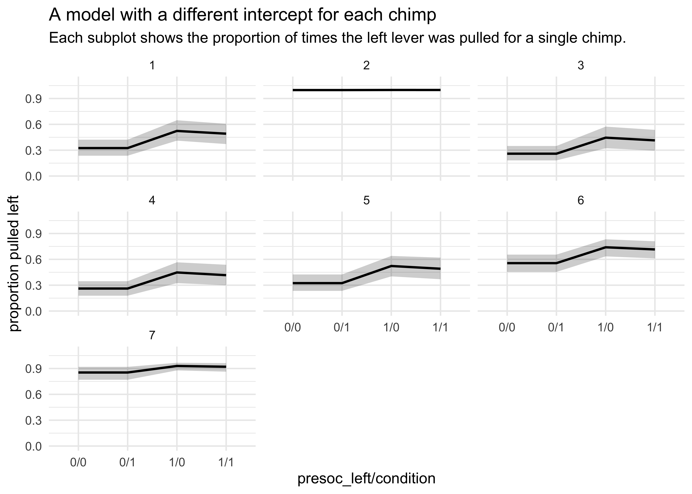
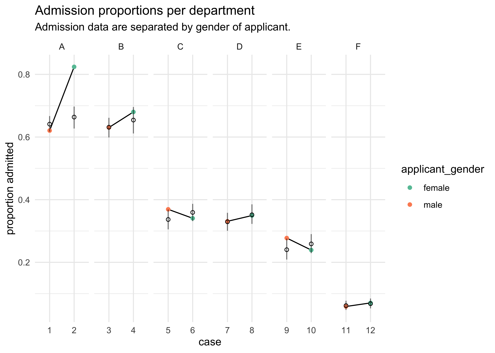

Chapter 10. Counting and Classification
================

  - information if often thrown away by using ratios of counts instead
    of the counts themselves
      - 10/20 and 1/2 are the same ratio, but the first has more
        information
  - there is friction in using the count data instead of the proportions
      - interpretation is less intuitive
  - this chapter covers the two most popular count distributions:
    1.  *binomial regression*: model a binary classification
          - dead/alive, accept/reject 2 *poisson regression*: models
            outcome without a known maximum
          - a binomial models with a very large maximum and samll
            probability per trial
          - number of elephants in Kenya, number of people who apply to
            graduate school

## 10.1 Binomial regression

  - the following formula where \(y\) is a count, \(p\) is the
    probability of success in a trial, \(n\) is the number of trials \[
    y \sim \text{Binomial}(n, p)
    \]

  - the two most common GLMs that use binomial likelihood functions:
    
    1.  *logistic regression*: data are in single-trial cases and the
        outcome is only 0 or 1
    2.  *aggregated binomial regression*: when individual trials with
        the same covariate values are aggregated together
          - the outcome can take a value of 0 or any positive integer up
            to \(n\) number of trials

  - both GLMs use the same logit link function
    
      - so both are sometimes called logistic regression and they can be
        converted between each other

## 10.1.1 Logisitc regression: Prosocial chimpanzees

  - example experimental data
      - measure the prosocial behaviour of chimps
      - a focal chimp has the option to pull two levers where the first
        only gives the focal chimp food and the other gives the focal
        chimp food, but not the other chimp
      - therefore, the focal chimp always gets food and decides if the
        other chimp gets food
      - the control condition is to not have another chimp and the
        partner condition is to have the second chimp
      - the two choices are swapped from the left and right hand sides
        to detect any handedness of the focal chimps

<!-- end list -->

``` r
data("chimpanzees")
d <- as_tibble(chimpanzees) %>% janitor::clean_names()
d
```

    ## # A tibble: 504 x 8
    ##    actor recipient condition block trial prosoc_left chose_prosoc pulled_left
    ##    <int>     <int>     <int> <int> <int>       <int>        <int>       <int>
    ##  1     1        NA         0     1     2           0            1           0
    ##  2     1        NA         0     1     4           0            0           1
    ##  3     1        NA         0     1     6           1            0           0
    ##  4     1        NA         0     1     8           0            1           0
    ##  5     1        NA         0     1    10           1            1           1
    ##  6     1        NA         0     1    12           1            1           1
    ##  7     1        NA         0     2    14           1            0           0
    ##  8     1        NA         0     2    16           1            0           0
    ##  9     1        NA         0     2    18           0            1           0
    ## 10     1        NA         0     2    20           0            1           0
    ## # … with 494 more rows

  - we will focus on the columns:
      - `pulled_left`: the outcome to predict
      - `prosoc_left`: a predictor for if the left-hand lever was the
        prosocial option
      - `condition`: contains a 1 for when there was a second partner
        chimp
  - the model we will fit:
      - \(L\): indicates if the left-hand lever was pulled
      - \(P\): indicates if the left-hand option was pro-social
      - \(C\): indicates whether or not the condition was with the
        partner

\[
L_i \sim \text{Binomial}(1, p_i) \\
\text{logit}(p_i) = \alpha + (\beta_P + \beta_{PC} C_i)P_i \\
\alpha \sim \text{Normal}(0, 10) \\
\beta_P \sim \text{Normal}(0, 10) \\
\beta_PC \sim \text{Normal}(0, 10)
\]

  - this model includes an interaction term for the left-hand option
    being pro-social and whether or not there is a second chimp
      - also there is no main effect of the `condition` \(C_i\) because
        we do not expect the precense of a second chimp on its own to
        predict whether the focal chimp pulls the left lever
  - the priors are gently regularizing
  - as comparitive measures of overfitting, fit two other models with
    fewer parameters
      - one with just an intercept
      - one without only th `prosoc_left` predictor (no predictor for
        `condition` whether there is a second chimp)

\[
L_i \sim \text{Binomial}(1, p_i) \\
\text{logit}(p_i) = \alpha \\
\alpha \sim \text{Normal}(0, 10)
\]

\[
L_i \sim \text{Binomial}(1, p_i) \\
\text{logit}(p_i) = \alpha + \beta_P P_i \\
\alpha \sim \text{Normal}(0, 10) \\
\beta_P \sim \text{Normal}(0, 10)
\]

  - first we will inspect the simplest model, the one with only an
    intercept

<!-- end list -->

``` r
m10_1 <- quap(
    alist(
        pulled_left ~ dbinom(1, p),
        logit(p) <- a,
        a ~ dnorm(0, 10)
    ),
    data = d
)

precis(m10_1)
```

    ##        mean         sd     5.5%    94.5%
    ## a 0.3201415 0.09022718 0.175941 0.464342

  - \(\alpha\) is on the scale of log-odds
      - to get it to probability scale, must use the inverse link
        function, the logistic
      - the ‘rethinking’ package offers the function `logisitic()` to do
        this, but below I just show the calculation for education
        reasons

<!-- end list -->

``` r
# MAP
1 / (1 + exp(-0.32))
```

    ## [1] 0.5793243

``` r
# 89% interval
c(1 / (1 + exp(-0.18)), 1 / (1 + exp(-0.46)))
```

    ## [1] 0.5448789 0.6130142

``` r
logistic
```

    ## function (x) 
    ## {
    ##     p <- 1/(1 + exp(-x))
    ##     p <- ifelse(x == Inf, 1, p)
    ##     p
    ## }
    ## <bytecode: 0x7fbc2bf13cf8>
    ## <environment: namespace:rethinking>

  - \(\text{logistic}(0.32) \approx 0.58\) means that the probability of
    pulling the left-hand lever was 0.58 with an 89% interval of 0.54 to
    0.61
      - the chimps had a tendency to favor the left without any other
        information
  - the following two code chunks fit the other two models proposed
    above

<!-- end list -->

``` r
m10_2 <- quap(
    alist(
        pulled_left ~ dbinom(1, p),
        logit(p) <- a + bp*prosoc_left,
        a ~ dnorm(0, 10),
        bp ~ dnorm(0, 10)
    ),
    data = d
)

precis(m10_2)
```

    ##         mean        sd       5.5%     94.5%
    ## a  0.0477090 0.1260040 -0.1536697 0.2490877
    ## bp 0.5573081 0.1823154  0.2659328 0.8486833

``` r
m10_3 <- quap(
    alist(
        pulled_left ~ dbinom(1, p),
        logit(p) <- a + (bp + bpc*condition)*prosoc_left,
        a ~ dnorm(0, 10),
        bp ~ dnorm(0, 10),
        bpc ~ dnorm(0, 10)
    ),
    data = d
)

precis(m10_3)
```

    ##            mean        sd       5.5%     94.5%
    ## a    0.04771766 0.1260040 -0.1536611 0.2490964
    ## bp   0.60967089 0.2261462  0.2482456 0.9710962
    ## bpc -0.10396684 0.2635904 -0.5252352 0.3173015

``` r
compare(m10_1, m10_2, m10_3)
```

    ##           WAIC       SE    dWAIC       dSE     pWAIC    weight
    ## m10_2 680.4648 9.165323 0.000000        NA 1.9807109 0.7106338
    ## m10_3 682.3826 9.403175 1.917804 0.8137132 3.0213904 0.2723955
    ## m10_1 687.9341 7.070955 7.469337 6.0718121 0.9966656 0.0169707

``` r
plot(compare(m10_1, m10_2, m10_3))
```

<!-- -->

  - from the WAIC, we can see that `m10_3` likely overfits a bit because
    its WAIC is greater than `m10_2`
      - though the difference in WAIC is samll, the difference standard
        error `dSE` is very small and suggests it is a real difference
  - but `m10_3` should not just be rejected, it still reflects the
    structure of the experiment
      - we do want to see why `m10_3` performs worse than `m10_2`
  - the estimates for `m10_3` show a negative interaction term with a
    large 89% interval
      - suggests the chimps don’t care too much about the presence of
        another chimp
      - they do prefer to pull the prosocial option, though, because
        that estimate is 0.61 with an 89% interval well above 0
  - to understand the impact of the estimate 0.61 for `bp`, must
    distinguish between the *absolute effect* and the *relative effect*
      - *absolute effect*: the change in the probability of the outcome,
        depending on all of the parameters
          - tells us the practical impact of a change in a predictor
      - *relative effect*: the proportional changes induced by a change
        in the predictor
          - the author claims that this effect can be misleading because
            they ignore the other parameters
  - the relative effect:
      - consider the relative effect size of `prosoc_left` and its
        parameter `bp`
      - the customary measure of relativ effect for logisitic model is
        the *proportional change in odds*
          - just the exponent of the parameter estimate
          - it is \(\exp(0.61) \approx 1.84\) for `bp`
          - odds are the ratio of the probability an even happens to the
            probability that it does not
      - for `bp`, the logodds of pulling the left-hand level (the
        outcome variable) is increased by 0.61
          - alternatively, the odds are multiplied by 1.84
      - the difficulty with proportional odds is that the actual change
        in probability depends on the intercept and the other predictor
        variables
          - for example, consider that the intercept \(\alpha = 4\),
            then the probability of pulling the left-lever, ignoring all
            else, is \(\text{logistic}(4) = 0.98\)
          - then the increase from `bp` would be
            \(\text{logistic}(4 + 0.61) = 0.99\)
          - the difference from `bp` is really not very much on the
            absolute scale
  - the absolute effect:
      - consider the model-average posterior predictive check to get a
        sense of the absolute effect of each treatment on the
        probability of pulling the left-hand lever
          - use th `ensemble()` function to take a weighted average (by
            WAIC) over the three models
          - in the following plot, this is compared to the proportion of
            times the left-hand lever was pull by each chimp in all four
            conditions
      - interpreting the plot
          - the chimps, on average, tended to pull the prosocial option
            on the left (“1,0” and “1,1”)
          - the partner condition did not seem to matter because the
            heights of the lines did not tend to move when the condition
            was changed and hand of the lever was held constant

<!-- end list -->

``` r
d_pred <- tibble(
    prosoc_left = c(0, 1, 0, 1),
    condition = c(0, 0, 1, 1)
)

# Build an ensemble from all three models weighted by WAIC.
chimp_ensemble <- ensemble(m10_1, m10_2, m10_3, data = d_pred)

# Summarize the predictions.
pred_p <- apply(chimp_ensemble$link, 2, mean)
pred_p_pi <- apply(chimp_ensemble$link, 2, PI)

pred_tibble <- d_pred %>%
    mutate(pred_p = pred_p) %>%
    bind_cols(pi_to_df(pred_p_pi)) %>%
    mutate(group = paste(prosoc_left, condition, sep = ","),
           group = factor(group))
```

``` r
chimp_data <- d %>%
    group_by(prosoc_left, condition, actor) %>%
    summarise(p = mean(pulled_left)) %>%
    ungroup() %>%
    mutate(group = paste(prosoc_left, condition, sep = ","),
           group = factor(group))

chimp_data %>%
    ggplot() +
    geom_line(aes(x = group, y = p, group = actor),
              color = "skyblue2") +
    geom_line(data = pred_tibble,
              aes(x = group,  y = pred_p, group = "1"),
              color = "black") +
    geom_ribbon(data = pred_tibble,
              aes(x = group, group = "1",
                  ymin = x5_percent, ymax = x94_percent),
              alpha = 0.2) +
    labs(x = "prosoc_left, condition",
         y = "proportion pulled left",
         title = "",
         subtitle = "Each blue line is a separate chimp in each combination of 'prosoc_left' and 'condition'.")
```

<!-- -->

  - the predictions are quite poor because they are averages across all
    chimps
      - a lot of variation among individuals could mask the association
        of interest
      - we can model this variation between individuals
  - the chimps showed signs of handedness - some preferred pulling the
    left lever and others perferred pulling the right lever
      - estimate handedness as a distinct intercept for each chimp
  - below is the model to fit
      - the intercept \(\alpha\) has a subscript, one for each chimp
      - \(alpha\) is a vector of parameters

\[
L_i \sim \text{Binomial}(1, p_i) \\
\text{logit}(p_i) = \alpha_{\text{ACTOR}[i]} + (\beta_P + \beta_{PC} C_i) P_i \\
\alpha_text{ACTOR} \sim \text{Normal}(0, 10) \\
\beta_P \sim \text{Normal}(0, 10) \\
\beta_PC \sim \text{Normal}(0, 10)
\]

  - this model is coded and fit using MCMC below

<!-- end list -->

``` r
# Clean up data frame for use with `map2stan()`.
d2 <- d %>% select(pulled_left, actor, condition, prosoc_left)

m10_4 <- map2stan(
    alist(
        pulled_left ~ dbinom(1, p),
        logit(p) <- a[actor] + (bp + bpc*condition)*prosoc_left,
        a[actor] ~ dnorm(0, 10),
        bp ~ dnorm(0, 10),
        bpc ~ dnorm(0, 10)
    ),
    data = d2, chains = 2, iter = 2500, warmup = 500
)
```

    ## Trying to compile a simple C file

    ## Running /Library/Frameworks/R.framework/Resources/bin/R CMD SHLIB foo.c
    ## clang -I"/Library/Frameworks/R.framework/Resources/include" -DNDEBUG   -I"/Library/Frameworks/R.framework/Versions/3.6/Resources/library/Rcpp/include/"  -I"/Library/Frameworks/R.framework/Versions/3.6/Resources/library/RcppEigen/include/"  -I"/Library/Frameworks/R.framework/Versions/3.6/Resources/library/RcppEigen/include/unsupported"  -I"/Library/Frameworks/R.framework/Versions/3.6/Resources/library/BH/include" -I"/Library/Frameworks/R.framework/Versions/3.6/Resources/library/StanHeaders/include/src/"  -I"/Library/Frameworks/R.framework/Versions/3.6/Resources/library/StanHeaders/include/"  -I"/Library/Frameworks/R.framework/Versions/3.6/Resources/library/rstan/include" -DEIGEN_NO_DEBUG  -D_REENTRANT  -DBOOST_DISABLE_ASSERTS -DBOOST_PENDING_INTEGER_LOG2_HPP -include stan/math/prim/mat/fun/Eigen.hpp   -isysroot /Library/Developer/CommandLineTools/SDKs/MacOSX.sdk -I/usr/local/include  -fPIC  -isysroot /Library/Developer/CommandLineTools/SDKs/MacOSX.sdk -c foo.c -o foo.o
    ## In file included from <built-in>:1:
    ## In file included from /Library/Frameworks/R.framework/Versions/3.6/Resources/library/StanHeaders/include/stan/math/prim/mat/fun/Eigen.hpp:13:
    ## In file included from /Library/Frameworks/R.framework/Versions/3.6/Resources/library/RcppEigen/include/Eigen/Dense:1:
    ## In file included from /Library/Frameworks/R.framework/Versions/3.6/Resources/library/RcppEigen/include/Eigen/Core:88:
    ## /Library/Frameworks/R.framework/Versions/3.6/Resources/library/RcppEigen/include/Eigen/src/Core/util/Macros.h:613:1: error: unknown type name 'namespace'
    ## namespace Eigen {
    ## ^
    ## /Library/Frameworks/R.framework/Versions/3.6/Resources/library/RcppEigen/include/Eigen/src/Core/util/Macros.h:613:16: error: expected ';' after top level declarator
    ## namespace Eigen {
    ##                ^
    ##                ;
    ## In file included from <built-in>:1:
    ## In file included from /Library/Frameworks/R.framework/Versions/3.6/Resources/library/StanHeaders/include/stan/math/prim/mat/fun/Eigen.hpp:13:
    ## In file included from /Library/Frameworks/R.framework/Versions/3.6/Resources/library/RcppEigen/include/Eigen/Dense:1:
    ## /Library/Frameworks/R.framework/Versions/3.6/Resources/library/RcppEigen/include/Eigen/Core:96:10: fatal error: 'complex' file not found
    ## #include <complex>
    ##          ^~~~~~~~~
    ## 3 errors generated.
    ## make: *** [foo.o] Error 1
    ## 
    ## SAMPLING FOR MODEL 'c361b87dbce26a93a1953cd717be5cfd' NOW (CHAIN 1).
    ## Chain 1: 
    ## Chain 1: Gradient evaluation took 0.000139 seconds
    ## Chain 1: 1000 transitions using 10 leapfrog steps per transition would take 1.39 seconds.
    ## Chain 1: Adjust your expectations accordingly!
    ## Chain 1: 
    ## Chain 1: 
    ## Chain 1: Iteration:    1 / 2500 [  0%]  (Warmup)
    ## Chain 1: Iteration:  250 / 2500 [ 10%]  (Warmup)
    ## Chain 1: Iteration:  500 / 2500 [ 20%]  (Warmup)
    ## Chain 1: Iteration:  501 / 2500 [ 20%]  (Sampling)
    ## Chain 1: Iteration:  750 / 2500 [ 30%]  (Sampling)
    ## Chain 1: Iteration: 1000 / 2500 [ 40%]  (Sampling)
    ## Chain 1: Iteration: 1250 / 2500 [ 50%]  (Sampling)
    ## Chain 1: Iteration: 1500 / 2500 [ 60%]  (Sampling)
    ## Chain 1: Iteration: 1750 / 2500 [ 70%]  (Sampling)
    ## Chain 1: Iteration: 2000 / 2500 [ 80%]  (Sampling)
    ## Chain 1: Iteration: 2250 / 2500 [ 90%]  (Sampling)
    ## Chain 1: Iteration: 2500 / 2500 [100%]  (Sampling)
    ## Chain 1: 
    ## Chain 1:  Elapsed Time: 1.40574 seconds (Warm-up)
    ## Chain 1:                2.94159 seconds (Sampling)
    ## Chain 1:                4.34733 seconds (Total)
    ## Chain 1: 
    ## 
    ## SAMPLING FOR MODEL 'c361b87dbce26a93a1953cd717be5cfd' NOW (CHAIN 2).
    ## Chain 2: 
    ## Chain 2: Gradient evaluation took 9.3e-05 seconds
    ## Chain 2: 1000 transitions using 10 leapfrog steps per transition would take 0.93 seconds.
    ## Chain 2: Adjust your expectations accordingly!
    ## Chain 2: 
    ## Chain 2: 
    ## Chain 2: Iteration:    1 / 2500 [  0%]  (Warmup)
    ## Chain 2: Iteration:  250 / 2500 [ 10%]  (Warmup)
    ## Chain 2: Iteration:  500 / 2500 [ 20%]  (Warmup)
    ## Chain 2: Iteration:  501 / 2500 [ 20%]  (Sampling)
    ## Chain 2: Iteration:  750 / 2500 [ 30%]  (Sampling)
    ## Chain 2: Iteration: 1000 / 2500 [ 40%]  (Sampling)
    ## Chain 2: Iteration: 1250 / 2500 [ 50%]  (Sampling)
    ## Chain 2: Iteration: 1500 / 2500 [ 60%]  (Sampling)
    ## Chain 2: Iteration: 1750 / 2500 [ 70%]  (Sampling)
    ## Chain 2: Iteration: 2000 / 2500 [ 80%]  (Sampling)
    ## Chain 2: Iteration: 2250 / 2500 [ 90%]  (Sampling)
    ## Chain 2: Iteration: 2500 / 2500 [100%]  (Sampling)
    ## Chain 2: 
    ## Chain 2:  Elapsed Time: 1.1757 seconds (Warm-up)
    ## Chain 2:                5.31638 seconds (Sampling)
    ## Chain 2:                6.49207 seconds (Total)
    ## Chain 2:

    ## Computing WAIC

``` r
precis(m10_4, depth = 2)
```

    ##            mean        sd       5.5%      94.5%    n_eff     Rhat4
    ## a[1] -0.7403970 0.2697560 -1.1781237 -0.3114903 4004.673 0.9996487
    ## a[2] 11.0686316 5.3658495  4.6188930 21.0303959 1456.332 1.0010439
    ## a[3] -1.0543496 0.2827338 -1.5206078 -0.6116062 3836.378 0.9997755
    ## a[4] -1.0543866 0.2849159 -1.5125557 -0.6046764 4068.610 1.0000999
    ## a[5] -0.7381053 0.2765060 -1.1847997 -0.2971693 4148.511 0.9996860
    ## a[6]  0.2162808 0.2695097 -0.2102277  0.6459626 3976.974 0.9998150
    ## a[7]  1.8079037 0.3933077  1.2017656  2.4602113 4610.516 0.9996526
    ## bp    0.8361716 0.2671018  0.4087367  1.2634672 2937.053 0.9999706
    ## bpc  -0.1244372 0.3064914 -0.6096928  0.3681643 3952.925 0.9998774

``` r
plot(m10_4)
```

<!-- -->

  - the posterior is not Guassian
      - e.g. the distribution for `a[2]`
          - the values are all positive, indicating a left-hand bias

<!-- end list -->

``` r
post <- extract.samples(m10_4)

tibble(a_2 = post$a[, 2]) %>%
    ggplot(aes(x = a_2)) +
    geom_density(fill = "grey50", alpha = 0.1) +
    labs(x = "alpha[actor == 2]", y = "probability density",
         title = "Posterior distribution for alpha when actor is 2")
```

<!-- -->

  - plotting the posterior predictive plots for each of the chimps shows
    how the intercept changes for each

<!-- end list -->

``` r
chimp <- 1

d_pred <- tibble(
    pulled_left = rep(0, 4), 
    prosoc_left = c(0, 1, 0, 1), 
    condition = c(0, 0, 1, 1)
)

d_pred_all <- tibble(
    actor = 1:7,
    data = rep(list(d_pred), 7)
) %>%
    unnest(data)

link_m10_4 <- link(m10_4, data = d_pred_all) %>% 
    as.data.frame() %>%
    as_tibble()
```

    ## [ 100 / 1000 ][ 200 / 1000 ][ 300 / 1000 ][ 400 / 1000 ][ 500 / 1000 ][ 600 / 1000 ][ 700 / 1000 ][ 800 / 1000 ][ 900 / 1000 ][ 1000 / 1000 ]

``` r
link_names <- c("0/0", "1/0", "0/1", "1/1")
link_names <- map(1:7, ~ paste0("chimp", .x, "_", link_names)) %>%
    unlist()
colnames(link_m10_4) <- link_names

link_m10_4 %>%
    mutate(sample_idx = row_number()) %>%
    pivot_longer(-sample_idx, names_to = "name", values_to = "value") %>%
    group_by(name) %>%
    summarise(avg = mean(value),
              pi = list(PI(value) %>% pi_to_df())) %>%
    ungroup() %>%
    unnest(pi) %>%
    mutate(actor = str_extract(name, "(?<=chimp)[:digit:]"),
           actor = as.numeric(actor),
           name = str_remove_all(name, "chimp[:digit:]_"),
           name = factor(name)) %>%
    ggplot() +
    facet_wrap(~ actor) +
    geom_line(aes(x = name, y = avg, group = "1"),
              size = 0.8, color = "black") +
    geom_ribbon(aes(x = as.numeric(name), 
                    ymin = x5_percent, ymax = x94_percent),
                alpha = 0.2, fill = "black") +
    scale_y_continuous(limits = c(0, 1.1)) +
    labs(x = "presoc_left/condition",
         y = "proportion pulled left",
         title = "A model with a different intercept for each chimp",
         subtitle = "Each subplot shows the proportion of times the left lever was pulled for a single chimp.")
```

<!-- -->

### 10.1.2. Aggregated binomial: Chimpanzees again, condensed

  - above, we looked at the proportion of times the chimp pulled the
    left-hand lever for each set of predictors
      - could also just count the number of pulls, as long as we don’t
        care about the sequence

<!-- end list -->

``` r
d <- as_tibble(chimpanzees)
d_aggregated <- d %>%
    group_by(prosoc_left, condition, actor) %>%
    summarise(x = sum(pulled_left)) %>%
    ungroup()
d_aggregated
```

    ## # A tibble: 28 x 4
    ##    prosoc_left condition actor     x
    ##          <int>     <int> <int> <int>
    ##  1           0         0     1     6
    ##  2           0         0     2    18
    ##  3           0         0     3     5
    ##  4           0         0     4     6
    ##  5           0         0     5     6
    ##  6           0         0     6    14
    ##  7           0         0     7    14
    ##  8           0         1     1     5
    ##  9           0         1     2    18
    ## 10           0         1     3     3
    ## # … with 18 more rows

  - can define the model using these counts
      - there were 18 trials for each animal

<!-- end list -->

``` r
m10_5 <- quap(
    alist(
        x ~ dbinom(18, p),
        logit(p) <- a + (bp + bpc*condition)*prosoc_left,
        a ~ dnorm(0, 10),
        bp ~ dnorm(0, 10),
        bpc ~ dnorm(0, 10)
    ),
    data = d_aggregated
)

precis(m10_5)
```

    ##            mean        sd       5.5%     94.5%
    ## a    0.04771729 0.1260040 -0.1536615 0.2490961
    ## bp   0.60967130 0.2261462  0.2482460 0.9710966
    ## bpc -0.10396774 0.2635904 -0.5252361 0.3173006

### 10.1.3 Aggregated binomial: Graduate school admissions

  - often, the number of trials per condition is not constant
      - in these cases, must use another variable for the first
        parameter in `dbinom()`
  - use UC Berkeley admission data as an example
      - only 12 rows with information about admissions to 6 departments,
        separated by male and female applicants

<!-- end list -->

``` r
data("UCBadmit")
d <- as_tibble(UCBadmit) %>% janitor::clean_names()
d
```

    ## # A tibble: 12 x 5
    ##    dept  applicant_gender admit reject applications
    ##    <fct> <fct>            <int>  <int>        <int>
    ##  1 A     male               512    313          825
    ##  2 A     female              89     19          108
    ##  3 B     male               353    207          560
    ##  4 B     female              17      8           25
    ##  5 C     male               120    205          325
    ##  6 C     female             202    391          593
    ##  7 D     male               138    279          417
    ##  8 D     female             131    244          375
    ##  9 E     male                53    138          191
    ## 10 E     female              94    299          393
    ## 11 F     male                22    351          373
    ## 12 F     female              24    317          341

  - goal: to estimate if there is gender bias in the admissions
  - fit two models:
      - a binomial regression that models `admit` as a function of each
        applicant’s gender
          - estimates the association between gender and probability of
            admission
      - a binomial regression that models `admit` as a constant,
        ignoring gender
          - this provides a sense of any overfitting in the first model
  - below is the formula for the first model
      - \(n_{\text{admit},i}\): the applications indexed by row number
      - \(m_i\): a dummy variable for male (1) vs. female (0)

\[
n_{\text{admit},i} \sim \text{Binomial}(n_i, p_i) \\
\text{logit}(p_i) = \alpha + \beta_m m_i \\
\alpha \sim \text{Normal}(0, 10) \\
\beta_m \sim \text{Normal}(0, 10)
\]

``` r
d$male <- as.numeric(d$applicant_gender == "male")

m10_6 <- quap(
    alist(
        admit ~ dbinom(applications, p),
        logit(p) <- a + bm*male,
        a ~ dnorm(0, 10),
        bm ~ dnorm(0, 10)
    ),
    data = d
)

m10_7 <- quap(
    alist(
        admit ~ dbinom(applications, p),
        logit(p) <- a,
        a ~ dnorm(0, 10)
    ),
    data = d
)

precis(m10_6)
```

    ##          mean         sd       5.5%      94.5%
    ## a  -0.8304493 0.05077041 -0.9115902 -0.7493084
    ## bm  0.6103061 0.06389095  0.5081960  0.7124162

``` r
precis(m10_7)
```

    ##         mean         sd       5.5%      94.5%
    ## a -0.4567352 0.03050691 -0.5054911 -0.4079792

``` r
compare(m10_6, m10_7)
```

    ##            WAIC       SE    dWAIC      dSE     pWAIC       weight
    ## m10_6  993.1292 316.4766  0.00000       NA 114.82319 1.000000e+00
    ## m10_7 1045.7502 313.4376 52.62097 168.7304  82.87369 3.745434e-12

``` r
plot(compare(m10_6, m10_7))
```

<!-- -->

  - interpretation of the models:
      - the WAIC indicates that including the gender created a better
        model
      - this indicates that the gender matters a lot
          - being a male is an advantage: \(exp(0.61) \approx 1.84\)
          - the male applicant’s odds were 184% that of a female’s
      - the difference on the absolute scale is shown below

<!-- end list -->

``` r
post <- extract.samples(m10_6)
p_admit_male <- logistic(post$a + post$bm)
p_admit_female <- logistic(post$a)

diff_admit <- p_admit_male - p_admit_female
quantile(diff_admit, c(0.025, 0.50, 0.975))
```

    ##      2.5%       50%     97.5% 
    ## 0.1132111 0.1416335 0.1698377

  - plot posterior predictions for the model
      - can use the function `postcheck()`, though I also made a plot of
        the same data

<!-- end list -->

``` r
postcheck(m10_6, n = 1e4)
```

<!-- -->

``` r
pred <- link(m10_6)

pred_tib <- tibble(avg = apply(pred, 2, mean)) %>%
    bind_cols(apply(pred, 2, PI) %>% pi_to_df())

d %>%
    mutate(case = factor(row_number()),
           prop_admit = admit / applications) %>%
    bind_cols(pred_tib) %>%
    ggplot(aes(x = case)) +
    facet_wrap(~ dept, scales = "free_x", nrow = 1) +
    geom_line(aes(y = prop_admit, group = dept)) +
    geom_point(aes(y = prop_admit, color = applicant_gender)) +
    geom_linerange(aes(ymin = x5_percent, ymax = x94_percent), alpha = 0.5) +
    geom_point(aes(y = avg), shape = 1) +
    scale_color_brewer(palette = "Set2") +
    labs(x = "case", y = "proportion admitted",
         title = "Admission proportions per department",
         subtitle = "Admission data are separated by gender of applicant.")
```

<!-- -->

  - from this plot we can see that there were only 2 deptartments with
    ower admission for females, yet the model says females should have a
    14% lower chance of admission
      - the problem is that the departments that take the most students
        had fewer applications from females
  - change our question:
      - previous question: “What are the average probabilties of
        admission for females and males *across all departments*?”
      - new question: “What is the average *difference* in probability
        of admission between females and males *within departments*?”
          - fit each department with its own intercept

\[
n_{\text{admit},i} \sim \text{Binomial}(n_i, p_i) \\
\text{logit}(p_i) = \alpha_{\text{DEPT}[i]} + \beta_m m_i \\
\alpha_{\text{DEPT}} \sim \text{Normal}(0, 10) \\
\beta_m \sim \text{Normal}(0, 10)
\] - this model and one without accounting for gender (to check for
overfitting) are fit below

``` r
d$dept_id <- as.numeric(factor(d$dept))

m10_8 <- quap(
    alist(
        admit ~ dbinom(applications, p),
        logit(p) <- a[dept_id],
        a[dept_id] ~ dnorm(0, 10)
    ),
    data = d
)

m10_9 <- quap(
    alist(
        admit ~ dbinom(applications, p),
        logit(p) <- a[dept_id] + bm*male,
        a[dept_id] ~ dnorm(0, 10),
        bm ~ dnorm(0, 10)
    ),
    data = d
)

precis(m10_8, depth = 2)
```

    ##            mean         sd       5.5%      94.5%
    ## a[1]  0.5934318 0.06837899  0.4841490  0.7027146
    ## a[2]  0.5428257 0.08575109  0.4057789  0.6798725
    ## a[3] -0.6156597 0.06916048 -0.7261916 -0.5051279
    ## a[4] -0.6648324 0.07502755 -0.7847409 -0.5449239
    ## a[5] -1.0894021 0.09534034 -1.2417744 -0.9370298
    ## a[6] -2.6750254 0.15237508 -2.9185503 -2.4315006

``` r
precis(m10_9, depth = 2)
```

    ##             mean         sd       5.5%       94.5%
    ## a[1]  0.68193883 0.09910200  0.5235547  0.84032296
    ## a[2]  0.63852955 0.11556510  0.4538342  0.82322490
    ## a[3] -0.58062958 0.07465092 -0.6999362 -0.46132299
    ## a[4] -0.61262191 0.08596001 -0.7500026 -0.47524121
    ## a[5] -1.05727046 0.09872297 -1.2150488 -0.89949209
    ## a[6] -2.62392097 0.15766768 -2.8759044 -2.37193757
    ## bm   -0.09992549 0.08083548 -0.2291162  0.02926521

``` r
compare(m10_6, m10_7, m10_8, m10_9)
```

    ##            WAIC        SE      dWAIC        dSE      pWAIC        weight
    ## m10_8  106.0196  17.48822   0.000000         NA   6.958918  8.203223e-01
    ## m10_9  109.0567  15.46693   3.037065   4.346089   9.556102  1.796777e-01
    ## m10_6  997.5737 315.88694 891.554064 326.811184 116.820221 2.067661e-194
    ## m10_7 1032.1294 308.43062 926.109820 319.745124  78.505708 6.483244e-202

``` r
plot(compare(m10_6, m10_7, m10_8, m10_9))
```

<!-- -->

  - now the best model is the one with a different intercept for each
    department and no male predictor
      - still, the one with the different intercepts and male has some
        of the weight
      - now the odds are in favor of female admission with males have
        about 90% the odds of admission as a female in the same
        department

<!-- end list -->

``` r
exp(m10_9@coef[["bm"]])
```

    ## [1] 0.9049048

``` r
postcheck(m10_9)
```

<!-- -->

``` r
pred <- link(m10_9)

pred_tib <- tibble(avg = apply(pred, 2, mean)) %>%
    bind_cols(apply(pred, 2, PI) %>% pi_to_df())

d %>%
    mutate(case = factor(row_number()),
           prop_admit = admit / applications) %>%
    bind_cols(pred_tib) %>%
    ggplot(aes(x = case)) +
    facet_wrap(~ dept, scales = "free_x", nrow = 1) +
    geom_line(aes(y = prop_admit, group = dept)) +
    geom_point(aes(y = prop_admit, color = applicant_gender)) +
    geom_linerange(aes(ymin = x5_percent, ymax = x94_percent), alpha = 0.5) +
    geom_point(aes(y = avg), shape = 1) +
    scale_color_brewer(palette = "Set2") +
    labs(x = "case", y = "proportion admitted",
         title = "Admission proportions per department",
         subtitle = "Admission data are separated by gender of applicant.")
```

<!-- -->

### 10.1.4 Fitting binomial regressions with `glm()`

``` r
m10_9glm <- glm(cbind(admit, reject) ~ male + dept, 
                data = d, 
                family = binomial)

summary(m10_9glm)
```

    ## 
    ## Call:
    ## glm(formula = cbind(admit, reject) ~ male + dept, family = binomial, 
    ##     data = d)
    ## 
    ## Deviance Residuals: 
    ##       1        2        3        4        5        6        7        8  
    ## -1.2487   3.7189  -0.0560   0.2706   1.2533  -0.9243   0.0826  -0.0858  
    ##       9       10       11       12  
    ##  1.2205  -0.8509  -0.2076   0.2052  
    ## 
    ## Coefficients:
    ##             Estimate Std. Error z value Pr(>|z|)    
    ## (Intercept)  0.68192    0.09911   6.880 5.97e-12 ***
    ## male        -0.09987    0.08085  -1.235    0.217    
    ## deptB       -0.04340    0.10984  -0.395    0.693    
    ## deptC       -1.26260    0.10663 -11.841  < 2e-16 ***
    ## deptD       -1.29461    0.10582 -12.234  < 2e-16 ***
    ## deptE       -1.73931    0.12611 -13.792  < 2e-16 ***
    ## deptF       -3.30648    0.16998 -19.452  < 2e-16 ***
    ## ---
    ## Signif. codes:  0 '***' 0.001 '**' 0.01 '*' 0.05 '.' 0.1 ' ' 1
    ## 
    ## (Dispersion parameter for binomial family taken to be 1)
    ## 
    ##     Null deviance: 877.056  on 11  degrees of freedom
    ## Residual deviance:  20.204  on  5  degrees of freedom
    ## AIC: 103.14
    ## 
    ## Number of Fisher Scoring iterations: 4

## 10.2 Poisson regression

  - when a binomial has a small probability of an event \(p\) and a
    large number of trials \(n\)
      - a binomial has an expected value of \(np\) and a variance
        \(np(1-p)\)
      - when \(n\) is large and \(p\) small, these become about the same
  - example:
      - employ 1000 monks in a monastery to copy manuscripts (before the
        printing press)
      - on average, one monk finishes a manuscript per day
      - but each monk is working independently and the manuscripts vary
        in length
      - so some days 3 manuscripts finish, but many days it is none
      - variance: \(np(1-p) = 1000(0.001)(1-0.001) \approx 1\)
      - this is simulated with \(1 \time 10^6\) monks below

<!-- end list -->

``` r
set.seed(0)
y <- rbinom(1e6, 1000, 1/1000)
c(mean(y), var(y))
```

    ## [1] 0.9995910 0.9979418

  - this special binomial is a *Poisson distribution*
      - useful for modeling binomial events with an unknown or very
        large number of trials \(n\)
  - the model form for a Poisson is even simpler than for a binomial or
    Gaussian
      - because there is only one parameter

\[
y \sim \text{Poisson}(\lambda_i)
\]

  - for the GLM, the link function is the log link
      - the log link makes \(\lambda_i\) always positive
      - also implies an exponential relationship between predictors and
        the expected value

\[
y \sim \text{Poisson}(\lambda_i) \\
\log(\lambda_i) = \alpha + \beta x_i
\]

  - \(\lambda_i\) is the expected value and commonly thought of as a
    *rate*
      - allows to make models for the *exposure* varies across cases
  - example:
      - one monastary is counting books completed per week, and another
        is counting per day
      - can analyze both in the same models even though the counts are
        aggregated over different amounts of time
      - treat \(\lambda_i\) as the number of events \(\mu\) per unit
        time (or distance) \(\tau\); \(\lambda_i = \mu / \tau\)
      - the \(\tau_i\) values are the different exposures
          - when \(\tau_i = 1\) (of some unit) then \(\log \tau_i = 0\)
            and the formula is identical to the first
          - when there are different values for the exposure (i.e. per
            day vs per week), this value currects for that

\[
y_i \sim \text{Poisson}(\lambda_i) \\
\log \lambda_i = \log(\frac{\mu_i}{\tau_i}) = \alpha + \beta x_i \\
\log \lambda_i = \log \mu_i - \log \tau_i = \alpha + \beta x_i \\
\log \mu_i = \log \tau_i + \alpha + \beta x_i \\
\]

### 10.2.1 Example: Oceanic tool complexity

  - setup:
      - the old island societies of Oceania provide an example of
        technological evolution
          - they made fish hooks, axes, boats, hand plows, etc.
      - theorize that larger populations develop and sustain more
        complex tool kits
      - contact rates among populations increases population size, too
  - the data and models:
      - `total_tools` is the outcome predictor
      - model the number of tools as the log of the `population`
      - the number of tools increases with `contact` rate
      - the impact of `population` counts is increased by high `contact`
        using a interaction term

<!-- end list -->

``` r
data("Kline")
d <- as_tibble(Kline) %>% 
    janitor::clean_names() %>%
    mutate(log_pop = log(population),
           contact_high = as.numeric(contact == "high"))
d
```

    ## # A tibble: 10 x 7
    ##    culture    population contact total_tools mean_tu log_pop contact_high
    ##    <fct>           <int> <fct>         <int>   <dbl>   <dbl>        <dbl>
    ##  1 Malekula         1100 low              13     3.2    7.00            0
    ##  2 Tikopia          1500 low              22     4.7    7.31            0
    ##  3 Santa Cruz       3600 low              24     4      8.19            0
    ##  4 Yap              4791 high             43     5      8.47            1
    ##  5 Lau Fiji         7400 high             33     5      8.91            1
    ##  6 Trobriand        8000 high             19     4      8.99            1
    ##  7 Chuuk            9200 high             40     3.8    9.13            1
    ##  8 Manus           13000 low              28     6.6    9.47            0
    ##  9 Tonga           17500 high             55     5.4    9.77            1
    ## 10 Hawaii         275000 low              71     6.6   12.5             0

  - the model formula:
      - \(P\) is `population`, \(C\) is `contact_high`
      - the priors are strongly regularizing due to the small amount of
        data

\[
T_i \sim \text{Poisson}(\lambda_i) \\
\log \lambda_i = \alpha + \beta+P \log P_i + \beta_C C_i + \beta_{PC} C_i \log P_i \\
\alpha \sim \text{Normal}(0, 100) \\
\beta_P \sim \text{Normal}(0, 1) \\
\beta_C \sim \text{Normal}(0, 1) \\
\beta_{PC} \sim \text{Normal}(0, 1)
\]

  - fit the model with the quadratic approximation

<!-- end list -->

``` r
m10_10 <- quap(
    alist(
        total_tools ~ dpois(lambda),
        log(lambda) <- a + bp*log_pop + bc*contact_high + bpc*contact_high*log_pop,
        a ~ dnorm(0, 100),
        c(bp, bc, bpc) ~ dnorm(0, 1)
    ),
    data = d
)

precis(m10_10, corr = TRUE)
```

    ##            mean         sd       5.5%     94.5%
    ## a    0.94356226 0.36009898  0.3680545 1.5190700
    ## bp   0.26408201 0.03466757  0.2086765 0.3194875
    ## bc  -0.09091811 0.84140385 -1.4356440 1.2538077
    ## bpc  0.04264538 0.09227125 -0.1048219 0.1901127

``` r
plot(precis(m10_10))
```

<!-- -->

  - interpretation:
      - the main effect of log-population `bp` is positive and both `bc`
        and `bpc` overlap zero substantially
      - could think that log-population is reliably associated with
        total tools, but that would be incorrect
          - easy to be mislead by tables of estimates, especially with
            interaction terms
  - analyze the model by plotting counterfactual predictions
      - consider two islands with log-population of 8, but one is high
        contact and the other is low contact
      - calculate \(\lambda\), the expected tool count, for each
          - sample from the posterior, convert with the linear model,
            take the exponential to reverse the logarithm
      - can plot the difference in the number of tools and find the
        percent of samples where the high contact group had more tools
        than the low contact group

<!-- end list -->

``` r
post <- extract.samples(m10_10)
lambda_high <- exp(post$a + post$bc + (post$bp + post$bpc)*8)
lambda_low <- exp(post$a + post$bp*8)

tibble(diff_vals = lambda_high - lambda_low) %>%
    ggplot(aes(x = diff_vals)) +
    geom_density(color = "skyblue4") +
    geom_vline(xintercept = 0, lty = 2, size = 0.8, color = "grey50") +
    labs(x = "lambda_high - lambda_low",
         y = "density")
```

<!-- -->

``` r
sum(lambda_high - lambda_low > 0) / length(lambda_high)
```

    ## [1] 0.9586

  - there is a 95% plausibilty that the high-contact island has more
    tools than the low-contact island, holding population constant
      - suggests that contact is important even though the model
        estimates are not informative
      - this is because the uncertainty is `bc` and `bpc` are negatively
        correlated
          - when one is high, the other is low

<!-- end list -->

``` r
as_tibble(post) %>%
    ggplot(aes(x = bc, y = bpc)) +
    geom_point(alpha = 0.5, size = 0.3, color = "skyblue3")
```

<!-- -->

  - a better way to tell if a predictor is expected to improve
    prediction is to use model comparison

<!-- end list -->

``` r
# TODO: fit all of the models and compare
```
