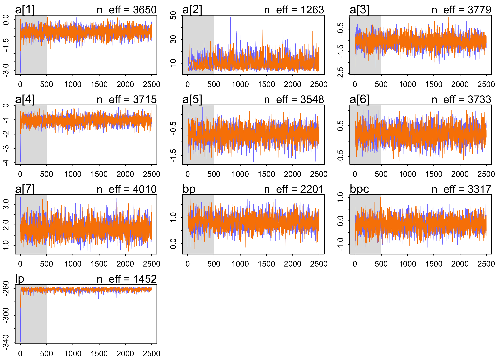

Chapter 10. Counting and Classification
================

  - information if often thrown away by using ratios of counts instead
    of the counts themselves
      - 10/20 and 1/2 are the same ratio, but the first has more
        information
  - there is friction in using the count data instead of the proportions
      - interpretation is less intuitive
  - this chapter covers the two most popular count distributions:
    1.  *binomial regression*: model a binary classification
          - dead/alive, accept/reject 2 *poisson regression*: models
            outcome without a known maximum
          - a binomial models with a very large maximum and samll
            probability per trial
          - number of elephants in Kenya, number of people who apply to
            graduate school

## 10.1 Binomial regression

  - the following formula where \(y\) is a count, \(p\) is the
    probability of success in a trial, \(n\) is the number of trials \[
    y \sim \text{Binomial}(n, p)
    \]

  - the two most common GLMs that use binomial likelihood functions:
    
    1.  *logistic regression*: data are in single-trial cases and the
        outcome is only 0 or 1
    2.  *aggregated binomial regression*: when individual trials with
        the same covariate values are aggregated together
          - the outcome can take a value of 0 or any positive integer up
            to \(n\) number of trials

  - both GLMs use the same logit link function
    
      - so both are sometimes called logistic regression and they can be
        converted between each other

## 10.1.1 Logisitc regression: Prosocial chimpanzees

  - example experimental data
      - measure the prosocial behaviour of chimps
      - a focal chimp has the option to pull two levers where the first
        only gives the focal chimp food and the other gives the focal
        chimp food, but not the other chimp
      - therefore, the focal chimp always gets food and decides if the
        other chimp gets food
      - the control condition is to not have another chimp and the
        partner condition is to have the second chimp
      - the two choices are swapped from the left and right hand sides
        to detect any handedness of the focal chimps

<!-- end list -->

``` r
data("chimpanzees")
d <- as_tibble(chimpanzees) %>% janitor::clean_names()
d
```

    ## # A tibble: 504 x 8
    ##    actor recipient condition block trial prosoc_left chose_prosoc pulled_left
    ##    <int>     <int>     <int> <int> <int>       <int>        <int>       <int>
    ##  1     1        NA         0     1     2           0            1           0
    ##  2     1        NA         0     1     4           0            0           1
    ##  3     1        NA         0     1     6           1            0           0
    ##  4     1        NA         0     1     8           0            1           0
    ##  5     1        NA         0     1    10           1            1           1
    ##  6     1        NA         0     1    12           1            1           1
    ##  7     1        NA         0     2    14           1            0           0
    ##  8     1        NA         0     2    16           1            0           0
    ##  9     1        NA         0     2    18           0            1           0
    ## 10     1        NA         0     2    20           0            1           0
    ## # … with 494 more rows

  - we will focus on the columns:
      - `pulled_left`: the outcome to predict
      - `prosoc_left`: a predictor for if the left-hand lever was the
        prosocial option
      - `condition`: contains a 1 for when there was a second partner
        chimp
  - the model we will fit:
      - \(L\): indicates if the left-hand lever was pulled
      - \(P\): indicates if the left-hand option was pro-social
      - \(C\): indicates whether or not the condition was with the
        partner

\[
L_i \sim \text{Binomial}(1, p_i) \\
\text{logit}(p_i) = \alpha + (\beta_P + \beta_{PC} C_i)P_i \\
\alpha \sim \text{Normal}(0, 10) \\
\beta_P \sim \text{Normal}(0, 10) \\
\beta_PC \sim \text{Normal}(0, 10)
\]

  - this model includes an interaction term for the left-hand option
    being pro-social and whether or not there is a second chimp
      - also there is no main effect of the `condition` \(C_i\) because
        we do not expect the precense of a second chimp on its own to
        predict whether the focal chimp pulls the left lever
  - the priors are gently regularizing
  - as comparitive measures of overfitting, fit two other models with
    fewer parameters
      - one with just an intercept
      - one without only th `prosoc_left` predictor (no predictor for
        `condition` whether there is a second chimp)

\[
L_i \sim \text{Binomial}(1, p_i) \\
\text{logit}(p_i) = \alpha \\
\alpha \sim \text{Normal}(0, 10)
\]

\[
L_i \sim \text{Binomial}(1, p_i) \\
\text{logit}(p_i) = \alpha + \beta_P P_i \\
\alpha \sim \text{Normal}(0, 10) \\
\beta_P \sim \text{Normal}(0, 10)
\]

  - first we will inspect the simplest model, the one with only an
    intercept

<!-- end list -->

``` r
m10_1 <- quap(
    alist(
        pulled_left ~ dbinom(1, p),
        logit(p) <- a,
        a ~ dnorm(0, 10)
    ),
    data = d
)

precis(m10_1)
```

    ##        mean         sd     5.5%    94.5%
    ## a 0.3201415 0.09022718 0.175941 0.464342

  - \(\alpha\) is on the scale of log-odds
      - to get it to probability scale, must use the inverse link
        function, the logistic
      - the ‘rethinking’ package offers the function `logisitic()` to do
        this, but below I just show the calculation for education
        reasons

<!-- end list -->

``` r
# MAP
1 / (1 + exp(-0.32))
```

    ## [1] 0.5793243

``` r
# 89% interval
c(1 / (1 + exp(-0.18)), 1 / (1 + exp(-0.46)))
```

    ## [1] 0.5448789 0.6130142

``` r
logistic
```

    ## function (x) 
    ## {
    ##     p <- 1/(1 + exp(-x))
    ##     p <- ifelse(x == Inf, 1, p)
    ##     p
    ## }
    ## <bytecode: 0x7ffb9d958048>
    ## <environment: namespace:rethinking>

  - \(\text{logistic}(0.32) \approx 0.58\) means that the probability of
    pulling the left-hand lever was 0.58 with an 89% interval of 0.54 to
    0.61
      - the chimps had a tendency to favor the left without any other
        information
  - the following two code chunks fit the other two models proposed
    above

<!-- end list -->

``` r
m10_2 <- quap(
    alist(
        pulled_left ~ dbinom(1, p),
        logit(p) <- a + bp*prosoc_left,
        a ~ dnorm(0, 10),
        bp ~ dnorm(0, 10)
    ),
    data = d
)

precis(m10_2)
```

    ##         mean        sd       5.5%     94.5%
    ## a  0.0477090 0.1260040 -0.1536697 0.2490877
    ## bp 0.5573081 0.1823154  0.2659328 0.8486833

``` r
m10_3 <- quap(
    alist(
        pulled_left ~ dbinom(1, p),
        logit(p) <- a + (bp + bpc*condition)*prosoc_left,
        a ~ dnorm(0, 10),
        bp ~ dnorm(0, 10),
        bpc ~ dnorm(0, 10)
    ),
    data = d
)

precis(m10_3)
```

    ##            mean        sd       5.5%     94.5%
    ## a    0.04771766 0.1260040 -0.1536611 0.2490964
    ## bp   0.60967089 0.2261462  0.2482456 0.9710962
    ## bpc -0.10396684 0.2635904 -0.5252352 0.3173015

``` r
compare(m10_1, m10_2, m10_3)
```

    ##           WAIC       SE    dWAIC       dSE     pWAIC    weight
    ## m10_2 680.4648 9.165323 0.000000        NA 1.9807109 0.7106338
    ## m10_3 682.3826 9.403175 1.917804 0.8137132 3.0213904 0.2723955
    ## m10_1 687.9341 7.070955 7.469337 6.0718121 0.9966656 0.0169707

``` r
plot(compare(m10_1, m10_2, m10_3))
```

<!-- -->

  - from the WAIC, we can see that `m10_3` likely overfits a bit because
    its WAIC is greater than `m10_2`
      - though the difference in WAIC is samll, the difference standard
        error `dSE` is very small and suggests it is a real difference
  - but `m10_3` should not just be rejected, it still reflects the
    structure of the experiment
      - we do want to see why `m10_3` performs worse than `m10_2`
  - the estimates for `m10_3` show a negative interaction term with a
    large 89% interval
      - suggests the chimps don’t care too much about the presence of
        another chimp
      - they do prefer to pull the prosocial option, though, because
        that estimate is 0.61 with an 89% interval well above 0
  - to understand the impact of the estimate 0.61 for `bp`, must
    distinguish between the *absolute effect* and the *relative effect*
      - *absolute effect*: the change in the probability of the outcome,
        depending on all of the parameters
          - tells us the practical impact of a change in a predictor
      - *relative effect*: the proportional changes induced by a change
        in the predictor
          - the author claims that this effect can be misleading because
            they ignore the other parameters
  - the relative effect:
      - consider the relative effect size of `prosoc_left` and its
        parameter `bp`
      - the customary measure of relativ effect for logisitic model is
        the *proportional change in odds*
          - just the exponent of the parameter estimate
          - it is \(\exp(0.61) \approx 1.84\) for `bp`
          - odds are the ratio of the probability an even happens to the
            probability that it does not
      - for `bp`, the logodds of pulling the left-hand level (the
        outcome variable) is increased by 0.61
          - alternatively, the odds are multiplied by 1.84
      - the difficulty with proportional odds is that the actual change
        in probability depends on the intercept and the other predictor
        variables
          - for example, consider that the intercept \(\alpha = 4\),
            then the probability of pulling the left-lever, ignoring all
            else, is \(\text{logistic}(4) = 0.98\)
          - then the increase from `bp` would be
            \(\text{logistic}(4 + 0.61) = 0.99\)
          - the difference from `bp` is really not very much on the
            absolute scale
  - the absolute effect:
      - consider the model-average posterior predictive check to get a
        sense of the absolute effect of each treatment on the
        probability of pulling the left-hand lever
          - use th `ensemble()` function to take a weighted average (by
            WAIC) over the three models
          - in the following plot, this is compared to the proportion of
            times the left-hand lever was pull by each chimp in all four
            conditions
      - interpreting the plot
          - the chimps, on average, tended to pull the prosocial option
            on the left (“1,0” and “1,1”)
          - the partner condition did not seem to matter because the
            heights of the lines did not tend to move when the condition
            was changed and hand of the lever was held constant

<!-- end list -->

``` r
d_pred <- tibble(
    prosoc_left = c(0, 1, 0, 1),
    condition = c(0, 0, 1, 1)
)

# Build an ensemble from all three models weighted by WAIC.
chimp_ensemble <- ensemble(m10_1, m10_2, m10_3, data = d_pred)

# Summarize the predictions.
pred_p <- apply(chimp_ensemble$link, 2, mean)
pred_p_pi <- apply(chimp_ensemble$link, 2, PI)

pred_tibble <- d_pred %>%
    mutate(pred_p = pred_p) %>%
    bind_cols(pi_to_df(pred_p_pi)) %>%
    mutate(group = paste(prosoc_left, condition, sep = ","),
           group = factor(group))
```

``` r
chimp_data <- d %>%
    group_by(prosoc_left, condition, actor) %>%
    summarise(p = mean(pulled_left)) %>%
    ungroup() %>%
    mutate(group = paste(prosoc_left, condition, sep = ","),
           group = factor(group))

chimp_data %>%
    ggplot() +
    geom_line(aes(x = group, y = p, group = actor),
              color = "skyblue2") +
    geom_line(data = pred_tibble,
              aes(x = group,  y = pred_p, group = "1"),
              color = "black") +
    geom_ribbon(data = pred_tibble,
              aes(x = group, group = "1",
                  ymin = x5_percent, ymax = x94_percent),
              alpha = 0.2) +
    labs(x = "prosoc_left, condition",
         y = "proportion pulled left",
         title = "",
         subtitle = "Each blue line is a separate chimp in each combination of 'prosoc_left' and 'condition'.")
```

<!-- -->

  - the predictions are quite poor because they are averages across all
    chimps
      - a lot of variation among individuals could mask the association
        of interest
      - we can model this variation between individuals
  - the chimps showed signs of handedness - some preferred pulling the
    left lever and others perferred pulling the right lever
      - estimate handedness as a distinct intercept for each chimp
  - below is the model to fit
      - the intercept \(\alpha\) has a subscript, one for each chimp
      - \(alpha\) is a vector of parameters

\[
L_i \sim \text{Binomial}(1, p_i) \\
\text{logit}(p_i) = \alpha_{\text{ACTOR}[i]} + (\beta_P + \beta_{PC} C_i) P_i \\
\alpha_text{ACTOR} \sim \text{Normal}(0, 10) \\
\beta_P \sim \text{Normal}(0, 10) \\
\beta_PC \sim \text{Normal}(0, 10)
\]

  - this model is coded and fit using MCMC below

<!-- end list -->

``` r
# Clean up data frame for use with `map2stan()`.
d2 <- d %>% select(pulled_left, actor, condition, prosoc_left)

m10_4 <- map2stan(
    alist(
        pulled_left ~ dbinom(1, p),
        logit(p) <- a[actor] + (bp + bpc*condition)*prosoc_left,
        a[actor] ~ dnorm(0, 10),
        bp ~ dnorm(0, 10),
        bpc ~ dnorm(0, 10)
    ),
    data = d2, chains = 2, iter = 2500, warmup = 500
)
```

    ## Trying to compile a simple C file

    ## Running /Library/Frameworks/R.framework/Resources/bin/R CMD SHLIB foo.c
    ## clang -I"/Library/Frameworks/R.framework/Resources/include" -DNDEBUG   -I"/Library/Frameworks/R.framework/Versions/3.6/Resources/library/Rcpp/include/"  -I"/Library/Frameworks/R.framework/Versions/3.6/Resources/library/RcppEigen/include/"  -I"/Library/Frameworks/R.framework/Versions/3.6/Resources/library/RcppEigen/include/unsupported"  -I"/Library/Frameworks/R.framework/Versions/3.6/Resources/library/BH/include" -I"/Library/Frameworks/R.framework/Versions/3.6/Resources/library/StanHeaders/include/src/"  -I"/Library/Frameworks/R.framework/Versions/3.6/Resources/library/StanHeaders/include/"  -I"/Library/Frameworks/R.framework/Versions/3.6/Resources/library/rstan/include" -DEIGEN_NO_DEBUG  -D_REENTRANT  -DBOOST_DISABLE_ASSERTS -DBOOST_PENDING_INTEGER_LOG2_HPP -include stan/math/prim/mat/fun/Eigen.hpp   -isysroot /Library/Developer/CommandLineTools/SDKs/MacOSX.sdk -I/usr/local/include  -fPIC  -isysroot /Library/Developer/CommandLineTools/SDKs/MacOSX.sdk -c foo.c -o foo.o
    ## In file included from <built-in>:1:
    ## In file included from /Library/Frameworks/R.framework/Versions/3.6/Resources/library/StanHeaders/include/stan/math/prim/mat/fun/Eigen.hpp:13:
    ## In file included from /Library/Frameworks/R.framework/Versions/3.6/Resources/library/RcppEigen/include/Eigen/Dense:1:
    ## In file included from /Library/Frameworks/R.framework/Versions/3.6/Resources/library/RcppEigen/include/Eigen/Core:88:
    ## /Library/Frameworks/R.framework/Versions/3.6/Resources/library/RcppEigen/include/Eigen/src/Core/util/Macros.h:613:1: error: unknown type name 'namespace'
    ## namespace Eigen {
    ## ^
    ## /Library/Frameworks/R.framework/Versions/3.6/Resources/library/RcppEigen/include/Eigen/src/Core/util/Macros.h:613:16: error: expected ';' after top level declarator
    ## namespace Eigen {
    ##                ^
    ##                ;
    ## In file included from <built-in>:1:
    ## In file included from /Library/Frameworks/R.framework/Versions/3.6/Resources/library/StanHeaders/include/stan/math/prim/mat/fun/Eigen.hpp:13:
    ## In file included from /Library/Frameworks/R.framework/Versions/3.6/Resources/library/RcppEigen/include/Eigen/Dense:1:
    ## /Library/Frameworks/R.framework/Versions/3.6/Resources/library/RcppEigen/include/Eigen/Core:96:10: fatal error: 'complex' file not found
    ## #include <complex>
    ##          ^~~~~~~~~
    ## 3 errors generated.
    ## make: *** [foo.o] Error 1
    ## 
    ## SAMPLING FOR MODEL '44c7fa10e9005d16ff70926afdea4099' NOW (CHAIN 1).
    ## Chain 1: 
    ## Chain 1: Gradient evaluation took 0.000167 seconds
    ## Chain 1: 1000 transitions using 10 leapfrog steps per transition would take 1.67 seconds.
    ## Chain 1: Adjust your expectations accordingly!
    ## Chain 1: 
    ## Chain 1: 
    ## Chain 1: Iteration:    1 / 2500 [  0%]  (Warmup)
    ## Chain 1: Iteration:  250 / 2500 [ 10%]  (Warmup)
    ## Chain 1: Iteration:  500 / 2500 [ 20%]  (Warmup)
    ## Chain 1: Iteration:  501 / 2500 [ 20%]  (Sampling)
    ## Chain 1: Iteration:  750 / 2500 [ 30%]  (Sampling)
    ## Chain 1: Iteration: 1000 / 2500 [ 40%]  (Sampling)
    ## Chain 1: Iteration: 1250 / 2500 [ 50%]  (Sampling)
    ## Chain 1: Iteration: 1500 / 2500 [ 60%]  (Sampling)
    ## Chain 1: Iteration: 1750 / 2500 [ 70%]  (Sampling)
    ## Chain 1: Iteration: 2000 / 2500 [ 80%]  (Sampling)
    ## Chain 1: Iteration: 2250 / 2500 [ 90%]  (Sampling)
    ## Chain 1: Iteration: 2500 / 2500 [100%]  (Sampling)
    ## Chain 1: 
    ## Chain 1:  Elapsed Time: 1.29917 seconds (Warm-up)
    ## Chain 1:                2.81414 seconds (Sampling)
    ## Chain 1:                4.11331 seconds (Total)
    ## Chain 1: 
    ## 
    ## SAMPLING FOR MODEL '44c7fa10e9005d16ff70926afdea4099' NOW (CHAIN 2).
    ## Chain 2: 
    ## Chain 2: Gradient evaluation took 7.8e-05 seconds
    ## Chain 2: 1000 transitions using 10 leapfrog steps per transition would take 0.78 seconds.
    ## Chain 2: Adjust your expectations accordingly!
    ## Chain 2: 
    ## Chain 2: 
    ## Chain 2: Iteration:    1 / 2500 [  0%]  (Warmup)
    ## Chain 2: Iteration:  250 / 2500 [ 10%]  (Warmup)
    ## Chain 2: Iteration:  500 / 2500 [ 20%]  (Warmup)
    ## Chain 2: Iteration:  501 / 2500 [ 20%]  (Sampling)
    ## Chain 2: Iteration:  750 / 2500 [ 30%]  (Sampling)
    ## Chain 2: Iteration: 1000 / 2500 [ 40%]  (Sampling)
    ## Chain 2: Iteration: 1250 / 2500 [ 50%]  (Sampling)
    ## Chain 2: Iteration: 1500 / 2500 [ 60%]  (Sampling)
    ## Chain 2: Iteration: 1750 / 2500 [ 70%]  (Sampling)
    ## Chain 2: Iteration: 2000 / 2500 [ 80%]  (Sampling)
    ## Chain 2: Iteration: 2250 / 2500 [ 90%]  (Sampling)
    ## Chain 2: Iteration: 2500 / 2500 [100%]  (Sampling)
    ## Chain 2: 
    ## Chain 2:  Elapsed Time: 1.11507 seconds (Warm-up)
    ## Chain 2:                4.96331 seconds (Sampling)
    ## Chain 2:                6.07838 seconds (Total)
    ## Chain 2:

    ## Computing WAIC

``` r
precis(m10_4)
```

    ## 7 vector or matrix parameters hidden. Use depth=2 to show them.

    ##           mean        sd       5.5%     94.5%    n_eff     Rhat4
    ## bp   0.8361716 0.2671018  0.4087367 1.2634672 2937.053 0.9999706
    ## bpc -0.1244372 0.3064914 -0.6096928 0.3681643 3952.925 0.9998774

``` r
plot(m10_4)
```

<!-- -->
