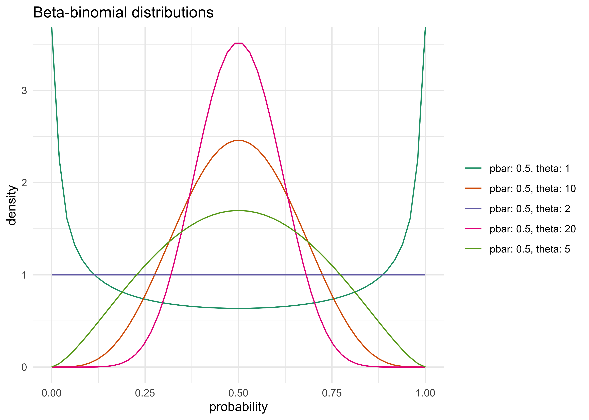
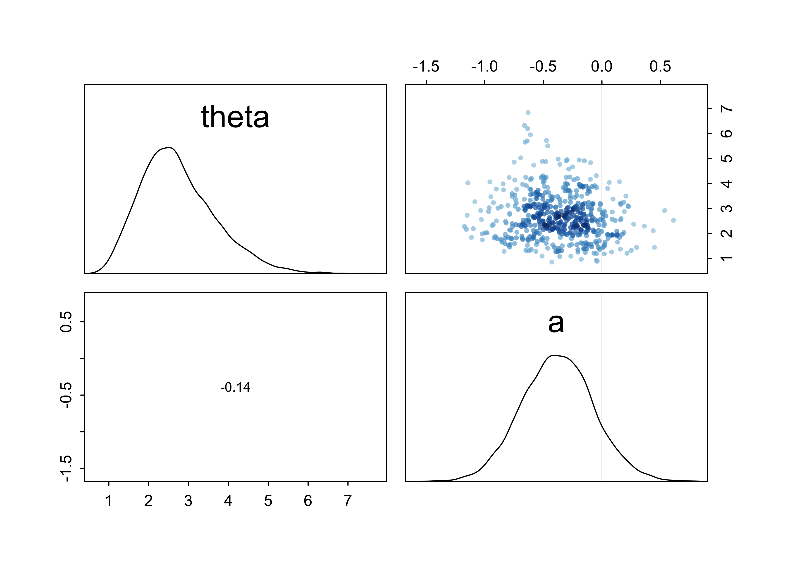
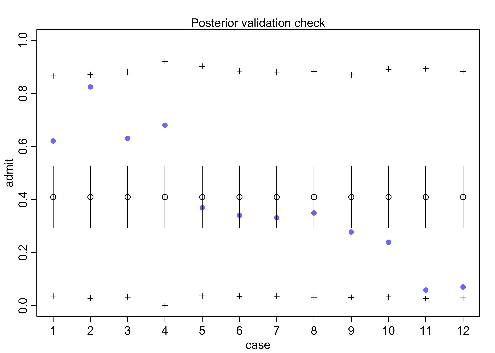

Chapter 11. Monsters and Mixtures
================

  - build more types of models by piecing together types we have already
    learned about
      - will discuss *ordered categorical* models and
        *zero-inflated*/*zero-augmented* models
  - mixtures are powerful, but interpretation is difficult

## 11.1 Ordered categorical outcomes

  - the outcome is discrete and has different *levels* along a dimension
    but the differences between each level are not necessarily equal
      - is a multinomial prediction problem with a constraint on the
        order of the categories
      - want an estimate of the effect of a change in a predictor on the
        change along the categories
  - use a *cumulative link function*
      - the cumulative probability of a value is *the probability of
        that value or any smaller value*
      - this guarantees the ordering of the outcomes

### 11.1.1 Example: Moral intuition

  - example data come from a survey of people with different versions of
    the classic “Trolley problem”
      - 3 versions that invoke different moral principles: “action
        principle,” “intention principle,” and “contact principle”
      - the goal is how people just the different choices from the
        different principles
      - `response`: from an integer 1-7, how morally permissible is the
        action

<!-- end list -->

``` r
data("Trolley")
d <- as_tibble(Trolley) %>%
    rename(q_case = case)
```

### 11.1.2 Describing an ordered distribution with intercepts

  - some plots of the data
      - a histogram of the response values
      - cumulative proportion of responses
      - log-cumulative-odds of responses

<!-- end list -->

``` r
p1 <- d %>%
    ggplot(aes(x = response)) +
    geom_histogram(bins = 30) +
    labs("Distribution of response")

p2 <- d %>% 
    count(response) %>%
    mutate(prop = n / sum(n),
           cum_prop = cumsum(prop)) %>%
    ggplot(aes(x = response, y = cum_prop)) +
    geom_line() +
    geom_point() +
    labs(y = "cumulative proportion")

p3 <- d %>% 
    count(response) %>%
    mutate(prop = n / sum(n),
           cum_prop = cumsum(prop),
           cum_odds = cum_prop / (1 - cum_prop),
           log_cum_odds= log(cum_odds)) %>%
    filter(is.finite(log_cum_odds)) %>%
    ggplot(aes(x = response, y = log_cum_odds)) +
    geom_line() +
    geom_point() +
    labs(y = "log-cumulative-odds")

p1 | p2 | p3
```

<!-- -->

  - why use the log-cumulative-odds of each response:
      - it is the cumulative analog of the logit link used previously
      - the logit is the log-odds; the cumulative logit is the
        log-cumulative-odds
      - constrains the probabilities to between 0 and 1
      - this link function takes care of converting the parameter
        estimates to the probability scale
  - to use Bayes’ theorom to compute the posterior distribution of these
    intercepts, need to compute the likelihood of each possible response
    value
      - need to use the cumulative probabilities \(\Pr(y_i \ge k)\) to
        compute the likelihood \(\Pr(y_i = k)\)
      - use the inverse link to translate the log-cumulative-odds back
        to cumulative probability
      - therefore, when we observe \(k\) and need its likelihoood, just
        use subtraction:
          - the values are shown as blue lines in the next plot

\[
p_k = \Pr(y_i = k) = \Pr(y_i \le k) - \Pr(y_i \le k - 1)
\]

``` r
offset_subtraction <- function(x) {
    y <- x
    for (i in seq(1, length(x))) {
        if (i == 1) { 
            y[[i]] <- x[[i]]
        } else {
            y[[i]] <- x[[i]] - x[[i - 1]]
        }
    }
    return(y)
}

d %>% 
    count(response) %>%
    mutate(prop = n / sum(n),
           cum_prop = cumsum(prop),
           likelihood = offset_subtraction(cum_prop),
           ymin = cum_prop - likelihood) %>%
    ggplot(aes(x = response)) +
    geom_linerange(aes(ymin = 0, ymax = cum_prop), color = "grey50") +
    geom_line(aes(y = cum_prop)) +
    geom_point(aes(y = cum_prop)) +
    geom_linerange(aes(ymin = ymin, ymax = cum_prop), color = "blue",
                   position = position_nudge(x = 0.05), size = 1) +
    labs(y = "log-cumulative-odds",
         title = "Cumulative probability and ordered likelihood",
         subtitle = "Blue lines indicate the likelihood for each response.")
```

<!-- -->

  - below is the matematical form of the model using an ordered logit
    likelihood
      - notation for these models can vary by author
      - the *Ordered* distribution is just a categorical distribution
        that takes a vector
        \(\text{p} = \{p_1, p_2, p_3, p_4, p_5, p_6\}\)
          - only 6 because the 7th level has the value 1 automatically
      - each response value \(k\) gets an intercept parameter
        \(\alpha_k\)

\[
R_i \sim \text{Ordered}(p) \\
logit(P_k) = \alpha_k \\
\alpha_k \sim \text{Normal}(0, 10)
\]

  - the first model does not include any predictor vairables
      - the link function is embedded in the likelihood function,
        already
          - simpler to type and makes the calculations more efficient,
            too
      - `phi` is a placeholder for now but will be used to add in
        predictor variables
      - the start values are included to start the intercepts in the
        right order
          - their exact values don’t really matter, just the order

<!-- end list -->

``` r
m11_1 <- quap(
    alist(
        response ~ dordlogit(phi, c(a1, a2, a3, a4, a5, a6)),
        phi <- 0,
        c(a1, a2, a3, a4, a5, a6) ~ dnorm(0, 10)
    ),
    data = d,
    start = list(a1 = -2, a2 = -1, a3 = 0, a4 = 1, a5 = 2, a6 = 2.5)
)

precis(m11_1)
```

    ##          mean         sd       5.5%      94.5%
    ## a1 -1.9160695 0.03000701 -1.9640265 -1.8681125
    ## a2 -1.2666001 0.02423126 -1.3053263 -1.2278739
    ## a3 -0.7186296 0.02137978 -0.7527986 -0.6844606
    ## a4  0.2477844 0.02022442  0.2154619  0.2801070
    ## a5  0.8898583 0.02208975  0.8545546  0.9251620
    ## a6  1.7693642 0.02845011  1.7238954  1.8148329

  - transform from log-cumulative-odds to cumulative probabilities

<!-- end list -->

``` r
logistic(coef(m11_1))
```

    ##        a1        a2        a3        a4        a5        a6 
    ## 0.1283005 0.2198398 0.3276948 0.5616311 0.7088609 0.8543786

``` r
m11_1_link <- extract.samples(m11_1)
m11_1_link %>%
    as.data.frame() %>%
    as_tibble() %>%
    pivot_longer(tidyselect::everything()) %>%
    ggplot(aes(x = value, y = name, color = name, fill = name)) +
    ggridges::geom_density_ridges(size = 1, alpha = 0.4, ) +
    scale_color_brewer(palette = "Set1") +
    scale_fill_brewer(palette = "Set1") +
    theme(legend.position = "none") +
    labs(x = "posterior samples",
         y = "density",
         title = "Posterior probability distributions of intercept from categorical model")
```

    ## Picking joint bandwidth of 0.00348

<!-- -->

### 11.1.3 Adding predictor variables

  - to include predictor variables:
      - *define the log-cumulative-odds of each response \(k\) as a sum
        of its intercept \(\alpha_k\) and a typical linear model*
      - for example: add a predictor \(x\) to the model
          - define the linear model \(\phi_i = \beta x_i\)
          - the cumulative logit becomes:

\[
\log \frac{\Pr(y_i \ge k)}{1 - \Pr(y_i \ge k)} = \alpha - \phi_i = \alpha - \beta x_i
\]

  - this form keeps the correct ordering of the outcome values while
    still morphing the likelihood of each individual value as the
    predictor \(x_i\) changes value
  - the linear model \(\phi\) is subtracted from the intercept:
      - because decreasing the log-cumulative-odds of every outcome
        value \(k\) below the maximum shifts probability mass upwards
        towards higher outcome values
      - a positive \(\beta\) value indicates than an increase in the
        predictor variable \(x\) results in an increase in the average
        response
  - for the Trolly data, we can icnlude predictor variables for the
    different types of questions: “action,” “intention,” and “contact”
      - the formulation of the log-cumulative-odds of each response
        \(k\) is shown below
      - defines the log-odds of each possible response to be an additive
        model of the features of the story corresponding to each
        response

\[
\log \frac{\Pr(y_i \ge k)}{1 - \Pr(y_i \ge k)} = \alpha - \phi_i \\
\phi_i = \beta_A A_i + \beta_I I_i + \beta_C C_i
\]

``` r
m11_2 <- quap(
    alist(
        response ~ dordlogit(phi, c(a1, a2, a3, a4, a5, a6)),
        phi <- bA*action + bI*intention + bC*contact,
        c(a1, a2, a3, a4, a5, a6) ~ dnorm(0, 10),
        c(bA, bI, bC) ~ dnorm(0, 10)
    ),
    data = d,
    start = list(a1 = -2, a2 = -1, a3 = 0, a4 = 1, a5 = 2, a6 = 2.5)
)
```

  - fit another model with interactions between action and intention and
    between contact and intention
      - these two make sense in terms of the scenario we are modeling
        while an interaction between contact and action does not
          - contact is a type of action

<!-- end list -->

``` r
m11_3 <- quap(
    alist(
        response ~ dordlogit(phi, c(a1, a2, a3, a4, a5, a6)),
        phi <- bA*action + bI*intention + bC*contact + bAI*action*intention + bCI*contact*intention,
        c(a1, a2, a3, a4, a5, a6) ~ dnorm(0, 10),
        c(bA, bI, bC, bAI, bCI) ~ dnorm(0, 10)
    ),
    data = d,
    start = list(a1 = -2, a2 = -1, a3 = 0, a4 = 1, a5 = 2, a6 = 2.5)
)

coeftab(m11_1, m11_2, m11_3)
```

    ##      m11_1   m11_2   m11_3  
    ## a1     -1.92   -2.84   -2.63
    ## a2     -1.27   -2.15   -1.94
    ## a3     -0.72   -1.57   -1.34
    ## a4      0.25   -0.55   -0.31
    ## a5      0.89    0.12    0.36
    ## a6      1.77    1.02    1.27
    ## bA        NA   -0.71   -0.47
    ## bI        NA   -0.72   -0.28
    ## bC        NA   -0.96   -0.33
    ## bAI       NA      NA   -0.45
    ## bCI       NA      NA   -1.27
    ## nobs    9930    9930    9930

  - interpretation:
      - the intercepts are difficult to interpret on their own, but act
        like regular intercepts in simpler models
          - they are the relative frequencies of the outcomes when all
            predictors are set to 0
      - there are 5 slope parameters: 3 main effects and 2 iinteractions
          - they are all far from 0 (can check with `precis(m)`)
          - they are all negative: each factor/interaction *reduces* the
            average response
          - these values are difficult to interpret as is, so they are
            investigated more below
  - compare the models by WAIC
      - the model with interaction terms is sufficiently better than the
        other two, so we can safely proceed with just analyzing it and
        ignoring the other two

<!-- end list -->

``` r
compare(m11_1, m11_2, m11_3)
```

    ##           WAIC       SE    dWAIC      dSE     pWAIC        weight
    ## m11_3 36929.15 81.16718   0.0000       NA 11.004379  1.000000e+00
    ## m11_2 37090.36 76.34564 161.2159 25.78738  9.253143  9.826897e-36
    ## m11_1 37854.49 57.63045 925.3444 62.65109  6.020406 1.158826e-201

  - plot implied predictions to understand what model `m11_3` implies
      - difficult to plot the predictions of log-cumulative-odds because
        each prediction is a vector of probabilities, one for each
        possible outcome
      - as a predictor variable changes value, the entire vector changes
  - one common plot is to use the horiztonal axis for the predictor
    variable and the vertical axis for the cumulative probability
      - plot a curve for each response value

<!-- end list -->

``` r
post <- extract.samples(m11_3)

get_m11_3_predictions <- function(kA, kC, kI) {
    res <- tibble()
    for (s in 1:100) {
        p <- post[s, ]
        ak <- as.numeric(p[1:6])
        phi <- p$bA * kA + p$bI*kI + p$bC*kC + p$bAI*kA*kI + p$bCI*kC*kI
        pk <- pordlogit(1:6, a = ak, phi = phi)
        res <- bind_rows(
            res,
            tibble(lvl = 1:6, val = pk)
        )
    }
    return(res)
}


implied_predictions <- expand.grid(kA = 0:1, kC = 0:1, kI = 0:1) %>%
    as_tibble() %>%
    filter(!(kA == 1 & kC == 1)) %>% 
    group_by(kA, kC, kI) %>%
    mutate(preds = list(get_m11_3_predictions(kA, kC, kI))) %>%
    unnest(preds) %>%
    ungroup()

implied_predictions %>%
    mutate(facet = paste0("action: ", kA, ", ", "contact: ", kC)) %>%
    group_by(kA, kC, kI) %>%
    mutate(row_idx = row_number()) %>%
    ungroup() %>%
    mutate(line_group = paste(lvl, row_idx)) %>%
    ggplot(aes(x = kI, y = val, group = line_group)) +
    facet_wrap(~ facet, nrow = 1) +
    geom_hline(yintercept = 0:1, lty = 2, color = "grey70", size = 1) +
    geom_line(aes(color = factor(lvl)), alpha = 0.1) +
    scale_color_brewer(palette = "Dark2") +
    labs(x = "intention", 
         y = "probability",
         color = "level",
         title = "Implied predictions of model with interactions.")
```

<!-- -->

  - interpretation:
      - each horizontal line is the bounday between levels
      - the thickness of the boundary represents the variation in
        prediction
      - the change in height from intention changing from 0 to 1
        indicates the predicted impact of changing a trolley story from
        non-intention to intention
          - the left-hand plot shows that there is not much change from
            switching intention when action and contact are both 0
          - the other two plots show the interaction between intention
            and the other variable that is set to 1
          - the middle plot shows that there is a large interaction
            between contact and intention

## 11.2 Zero-inflated outcomes

  - *mixture model*: measurements arise from multiple proceesses;
    different causes for the same observation
      - uses more than one probability distribution
  - common to need to use a mixture model for count variables
      - a count of 0 can often arise in more than one way
      - a 0 could occurr because nothing happens, because the rate of
        the event is very low, or because the event-generating process
        never began
      - said to be *zero-inflated*

### 11.2.1 Example: Zero-inflated Poisson

  - previously, we use the monastery example to study the Poisson
    distribution
      - now imagine that the monks take breaks on some days and no
        manuscripts are made
      - want to estimate how often breaks are taken
  - mixture model:
      - a zero can arise from two processes:
        1.  the monks took a break
        2.  the monks workked but did not complete a manuscript
      - let \(p\) be the probability the monks took a break on a day
      - let \(\lambda\) be the mean number of manuscripts completed when
        the monks work
  - need a likelihood function that mixes these two processes:
      - the following equation says this: “The probability of observing
        a zero is the probability that the monks took a break OR (\(+\))
        the probability the monks worked AND (\(\times\)) failed to
        finish.”

\[
\Pr(0 | p, \lambda) = \Pr(\text{break} | p) + \Pr(\text{work} | p) \times \Pr(0 | \lambda) \\
\Pr(0 | p, \lambda) = p + (1-p) e^{-\lambda}
\]

  - the likelihood of a non-zero value \(y\) is below
      - the the probability that the monks work multiplied by the
        probability that the working monks produce a manuscript

\[
\Pr(y | p, \lambda) = \Pr(\text{break} | p)(0) + \Pr(\text{work} | p) \Pr(y | \lambda) \\
\Pr(y | p, \lambda) = (1 - p) \frac{\lambda^y e^{-\lambda}}{y!}
\]

  - can define `ZIPoisson` as the distribution above with parameters
    \(p\) (probability of 0) and \(\lambda\) (mean of Poisson) to
    describe the shape
      - two linear models and two link functions, one for each process

\[
y_i \sim \text{ZIPoisson}(p_i, \lambda_i) \\
\text{logit}(p_i) = \alpha_p + \beta_p x_i \\
\log(\lambda_i) = \alpha_\lambda + \beta_\lambda x_i
\]

  - need to simulate data for the monks taking breaks

<!-- end list -->

``` r
# They take a break on 20% of the days
prob_break <- 0.2 

# Average of 1 manuscript per working day.
rate_work <- 1

# Sample one year of production.
N <- 365

# Simulate which days the monks take breaks.
break_days <- rbinom(N, 1, prob = prob_break)

# Simulate the manuscripts completed.
y <- (1-break_days) * rpois(N, rate_work)
```

``` r
tibble(y, break_days) %>%
    count(y, break_days) %>%
    mutate(break_days = ifelse(break_days == 0, "work", "break"),
           break_days = factor(break_days, levels = c("break", "work"))) %>%
    ggplot(aes(x = y, y = n)) +
    geom_col(aes(fill = break_days)) +
    scale_fill_manual(
        values = c("skyblue3", "grey50"),
        guide = guide_legend(title.position = "left",
                             title.hjust = 0.5,
                             label.position = "top",
                             ncol = 2)
    ) +
    theme(
        legend.position = c(0.7, 0.7)
    ) +
    labs(x = "number of manuscripts completed on a day",
         y = "count",
         fill = "Did the monks take a break?",
         title = "The number of manuscripts completed per day when monks can take breaks")
```

<!-- -->

  - now we can fit a model

<!-- end list -->

``` r
m11_4 <- quap(
    alist(
        y ~ dzipois(p, lambda),
        logit(p) <- ap,
        log(lambda) <- al,
        ap ~ dnorm(0, 1),
        al ~ dnorm(0, 10)
    ),
    data = tibble(y)
)

precis(m11_4)
```

    ##           mean         sd        5.5%      94.5%
    ## ap -1.08474003 0.27298308 -1.52101972 -0.6484603
    ## al  0.04329227 0.08613731 -0.09437178  0.1809563

``` r
logistic(m11_4@coef[["ap"]])
```

    ## [1] 0.2526101

``` r
exp(m11_4@coef[["al"]])
```

    ## [1] 1.044243

  - can get a very accurate prediction for the proportion of days taken
    off by the monks and the rate of manuscript production per working
    day
      - though, cannot determine whether the monks took any particular
        day off

## 11.3 Over-dispersed outcomes

  - *over-dispersion*: the variance of a variable exceededs the expected
    amount for a model
      - e.g.: for a binomial, the expected value is \(np\) and its
        variance \(np(1-p)\)
      - for a count model, this suggests that a necessary variable has
        been omitted
  - ideally, would just include the missing variable to remove
    over-dispersion, but not always the case/possible
  - two strategies for mitigating the effects of over-dispersion
      - use a *continuous mixture* model: a linear model is attached to
        a distribution of observations
          - common models: *beta-binomial* and *gamma-Poisson*
            (negative-binomial)
          - these are demonstrated in the following sections
      - employ a multilevel model (GLMM) and estimate the residuals of
        each observation and the distribution of those residuals
          - easier to fit than beta-binmial and gamma-Poisson GLMs
          - more flexible
          - handle over-dispersion and other kinds of heterogineity
            simulatneously
          - *GLMMs are covered in the next chapter*

### 11.3.1 Beta-binomial

  - beta-binomial models assumes that each binomial count observation
    has its own probability of a success
      - estimates the distribution of probabilities of success across
        cases
          - instead of a single probability of success
      - predictor variables change the shape of this distribution
        instead of directly determining the probability of each success
  - example: UCB admissions data
      - if we ignore the department, the data is very over-dispersed
          - because the departments vary a lot in baseline admission
            rates
      - therefore, ignoring the inter-department variation results in an
        incorrect inference about applicant gender
      - can fit a beta-binomial model, ignoring department
  - a beta-binomial model will assume that each row of the data has a
    unique, unobserved probability of admission
      - these probabilities of admission have a common distribution
        described by the *beta distribution*
          - use the beta distribution because it can be used to
            calculate the likelihood function that averages over the
            unknown probabilities for each observation
      - beta-distribution has 2 parameters:
        1.  \(\bar{\textbf{p}}\): average probability
        2.  \(\theta\): shape parameter
      - shape parameter describes the spread of the distribution

<!-- end list -->

``` r
pbar <- 0.5
thetas <- c(1, 2, 5, 10, 20)
x_vals <- seq(0, 1, length.out = 50)
beta_dist_res <- tibble()
for (theta in thetas) {
    beta_dist_res <- bind_rows(
        beta_dist_res,
        tibble(theta = theta, 
               pbar = pbar, 
               x = x_vals,
               d = dbeta2(x_vals, pbar, theta))
    )
}

beta_dist_res %>%
    mutate(params = paste0("pbar: ", pbar, ", theta: ", theta)) %>%
    ggplot(aes(x = x, y = d)) +
    geom_line(aes(group = params, color = params)) +
    scale_color_brewer(palette = "Dark2") +
    labs(x = "probability", y = "density", color = NULL,
         title = "Beta-binomial distributions")
```

<!-- -->

  - we will build a linear model to \(\bar{\textbf{p}}\) so that changes
    in predictor variables change the central tendency of the
    distribution
      - \(A\) is the number of admissions (`admit` column)
      - \(n\) is the number of applications (`applications` column)
      - any predictor variables could be included in the linear model
        for \(\bar{p}\)

\[
A_i \sim \text{BetaBinomial}(n_i, \bar{p}_i, \theta) \\
\text{logit}(\bar{p}_i) = \alpha \\
\alpha \sim \text{Normal}(0, 10) \\
\theta \sim \text{HalfCauchy}(0, 1)
\]

``` r
data("UCBadmit")
d <- as_tibble(UCBadmit) %>%
    janitor::clean_names()

m11_5 <- map2stan(
    alist(
        admit ~ dbetabinom(applications, pbar, theta),
        logit(pbar) <- a,
        a ~ dnorm(0, 2),
        theta ~ dexp(1)
    ),
    data = d,
    constraints = list(theta = "lower=0"),
    start = list(theta = 3),
    iter = 4e3, 
    warmup = 1e3, 
    chains = 2, 
    cores = 1
)
```

    ## Trying to compile a simple C file

    ## Running /Library/Frameworks/R.framework/Resources/bin/R CMD SHLIB foo.c
    ## clang -mmacosx-version-min=10.13 -I"/Library/Frameworks/R.framework/Resources/include" -DNDEBUG   -I"/Library/Frameworks/R.framework/Versions/4.0/Resources/library/Rcpp/include/"  -I"/Library/Frameworks/R.framework/Versions/4.0/Resources/library/RcppEigen/include/"  -I"/Library/Frameworks/R.framework/Versions/4.0/Resources/library/RcppEigen/include/unsupported"  -I"/Library/Frameworks/R.framework/Versions/4.0/Resources/library/BH/include" -I"/Library/Frameworks/R.framework/Versions/4.0/Resources/library/StanHeaders/include/src/"  -I"/Library/Frameworks/R.framework/Versions/4.0/Resources/library/StanHeaders/include/"  -I"/Library/Frameworks/R.framework/Versions/4.0/Resources/library/rstan/include" -DEIGEN_NO_DEBUG  -D_REENTRANT  -DBOOST_DISABLE_ASSERTS -DBOOST_PENDING_INTEGER_LOG2_HPP -include stan/math/prim/mat/fun/Eigen.hpp   -I/usr/local/include   -fPIC  -Wall -g -O2  -c foo.c -o foo.o
    ## In file included from <built-in>:1:
    ## In file included from /Library/Frameworks/R.framework/Versions/4.0/Resources/library/StanHeaders/include/stan/math/prim/mat/fun/Eigen.hpp:4:
    ## In file included from /Library/Frameworks/R.framework/Versions/4.0/Resources/library/RcppEigen/include/Eigen/Dense:1:
    ## In file included from /Library/Frameworks/R.framework/Versions/4.0/Resources/library/RcppEigen/include/Eigen/Core:88:
    ## /Library/Frameworks/R.framework/Versions/4.0/Resources/library/RcppEigen/include/Eigen/src/Core/util/Macros.h:613:1: error: unknown type name 'namespace'
    ## namespace Eigen {
    ## ^
    ## /Library/Frameworks/R.framework/Versions/4.0/Resources/library/RcppEigen/include/Eigen/src/Core/util/Macros.h:613:16: error: expected ';' after top level declarator
    ## namespace Eigen {
    ##                ^
    ##                ;
    ## In file included from <built-in>:1:
    ## In file included from /Library/Frameworks/R.framework/Versions/4.0/Resources/library/StanHeaders/include/stan/math/prim/mat/fun/Eigen.hpp:4:
    ## In file included from /Library/Frameworks/R.framework/Versions/4.0/Resources/library/RcppEigen/include/Eigen/Dense:1:
    ## /Library/Frameworks/R.framework/Versions/4.0/Resources/library/RcppEigen/include/Eigen/Core:96:10: fatal error: 'complex' file not found
    ## #include <complex>
    ##          ^~~~~~~~~
    ## 3 errors generated.
    ## make: *** [foo.o] Error 1
    ## 
    ## SAMPLING FOR MODEL 'c669d85dc0a14c2d86390e076d692f11' NOW (CHAIN 1).
    ## Chain 1: 
    ## Chain 1: Gradient evaluation took 0.000135 seconds
    ## Chain 1: 1000 transitions using 10 leapfrog steps per transition would take 1.35 seconds.
    ## Chain 1: Adjust your expectations accordingly!
    ## Chain 1: 
    ## Chain 1: 
    ## Chain 1: Iteration:    1 / 4000 [  0%]  (Warmup)
    ## Chain 1: Iteration:  400 / 4000 [ 10%]  (Warmup)
    ## Chain 1: Iteration:  800 / 4000 [ 20%]  (Warmup)
    ## Chain 1: Iteration: 1001 / 4000 [ 25%]  (Sampling)
    ## Chain 1: Iteration: 1400 / 4000 [ 35%]  (Sampling)
    ## Chain 1: Iteration: 1800 / 4000 [ 45%]  (Sampling)
    ## Chain 1: Iteration: 2200 / 4000 [ 55%]  (Sampling)
    ## Chain 1: Iteration: 2600 / 4000 [ 65%]  (Sampling)
    ## Chain 1: Iteration: 3000 / 4000 [ 75%]  (Sampling)
    ## Chain 1: Iteration: 3400 / 4000 [ 85%]  (Sampling)
    ## Chain 1: Iteration: 3800 / 4000 [ 95%]  (Sampling)
    ## Chain 1: Iteration: 4000 / 4000 [100%]  (Sampling)
    ## Chain 1: 
    ## Chain 1:  Elapsed Time: 0.097638 seconds (Warm-up)
    ## Chain 1:                0.227966 seconds (Sampling)
    ## Chain 1:                0.325604 seconds (Total)
    ## Chain 1: 
    ## 
    ## SAMPLING FOR MODEL 'c669d85dc0a14c2d86390e076d692f11' NOW (CHAIN 2).
    ## Chain 2: 
    ## Chain 2: Gradient evaluation took 3.9e-05 seconds
    ## Chain 2: 1000 transitions using 10 leapfrog steps per transition would take 0.39 seconds.
    ## Chain 2: Adjust your expectations accordingly!
    ## Chain 2: 
    ## Chain 2: 
    ## Chain 2: Iteration:    1 / 4000 [  0%]  (Warmup)
    ## Chain 2: Iteration:  400 / 4000 [ 10%]  (Warmup)
    ## Chain 2: Iteration:  800 / 4000 [ 20%]  (Warmup)
    ## Chain 2: Iteration: 1001 / 4000 [ 25%]  (Sampling)
    ## Chain 2: Iteration: 1400 / 4000 [ 35%]  (Sampling)
    ## Chain 2: Iteration: 1800 / 4000 [ 45%]  (Sampling)
    ## Chain 2: Iteration: 2200 / 4000 [ 55%]  (Sampling)
    ## Chain 2: Iteration: 2600 / 4000 [ 65%]  (Sampling)
    ## Chain 2: Iteration: 3000 / 4000 [ 75%]  (Sampling)
    ## Chain 2: Iteration: 3400 / 4000 [ 85%]  (Sampling)
    ## Chain 2: Iteration: 3800 / 4000 [ 95%]  (Sampling)
    ## Chain 2: Iteration: 4000 / 4000 [100%]  (Sampling)
    ## Chain 2: 
    ## Chain 2:  Elapsed Time: 0.088638 seconds (Warm-up)
    ## Chain 2:                0.212247 seconds (Sampling)
    ## Chain 2:                0.300885 seconds (Total)
    ## Chain 2:

    ## Computing WAIC

``` r
plot(m11_5)
```

<!-- -->

``` r
pairs(m11_5)
```

<!-- -->

``` r
precis(m11_5)
```

    ##             mean       sd       5.5%     94.5%    n_eff     Rhat4
    ## theta  2.7399242 0.946932  1.4355572 4.4392494 3913.286 0.9997085
    ## a     -0.3775653 0.307988 -0.8717805 0.1203542 3450.286 1.0000152

  - interpretation:
      - `a` is on the log-odds scale and defines \(\bar{\textbf{p}}\) of
        the beta distribution of probabilities for each row of the data
      - therefore, the average probability of admission across
        departments is about 0.4, but the percentile is quite wide

<!-- end list -->

``` r
post <- extract.samples(m11_5)
quantile(logistic(post$a), c(0.025, 0.5, 0.975))
```

    ##      2.5%       50%     97.5% 
    ## 0.2749293 0.4066962 0.5588299

  - to see what the model says of the data, need to account for
    correlation between \(\bar{\textbf{p}}\) and \(\theta\)
      - these parameters define a distribution of distributions
      - 100 combinations of \(\bar{\textbf{p}}\) and \(\theta\) are
        shown in the following plot

<!-- end list -->

``` r
dist_of_dist <- map(1:300, function(i) {
    p <- logistic(post$a[i])
    theta <- post$theta[i]
    x <- seq(0, 1, length.out = 100)
    probs <- dbeta2(x, p, theta)
    return(tibble(i, p, theta, x, prob = probs))
}) %>%
    bind_rows()

dist_of_dist %>%
    ggplot(aes(x, prob)) +
    geom_line(aes(group = factor(i)), size = 0.1, alpha = 0.2) +
    scale_y_continuous(limits = c(0, 3), 
                       expand = expansion(mult = c(0, 0.02))) +
    labs(x = "probability admit", 
         y = "density",
         title = "Posterior distribution of beta distributions")
```

<!-- -->

  - use posterior check to see how the beta distribution of
    probabilities of admissions influences predicted counts of
    applications admitted
      - the y-axis shows the predicted number of admits per row of the
        data frame on the x-axis
      - the purple dots are the actual values
      - open circles are the estimates from the model with 89% intervals
      - the `+` are the 89% interval of predicted counts of admission
          - shows there is a lot of dispersion
          - this is from the different departments, but the model
            doesn’t know about them
          - the beta distribution accounts for this heterogeneity

<!-- end list -->

``` r
postcheck(m11_5)
```

    ## [ 100 / 1000 ][ 200 / 1000 ][ 300 / 1000 ][ 400 / 1000 ][ 500 / 1000 ][ 600 / 1000 ][ 700 / 1000 ][ 800 / 1000 ][ 900 / 1000 ][ 1000 / 1000 ]
    ## [ 100 / 1000 ][ 200 / 1000 ][ 300 / 1000 ][ 400 / 1000 ][ 500 / 1000 ][ 600 / 1000 ][ 700 / 1000 ][ 800 / 1000 ][ 900 / 1000 ][ 1000 / 1000 ]

<!-- -->

### 11.3.2 Negative-binomial or gamma-Poisson

  - *negative-binomial* (or *gamma-Poisson*): assumes that each Poisson
    count observation has its own rate
      - assumes the shape of the gamma distribution to describe the
        Poisson rates
      - predictor variables adjust the shape of this distribution, not
        the expected value of each observation
      - use the gamma distribution because it makes the math easier
  - fitting a gamma-Poisson uses the `dgampois()` function
      - distribution is defined by a mean \(\mu\) and scale \(\theta\)
      - as \(\theta\) increases, the gamma distribution becomes for
        dispersed around the mean
  - below are some examples of gamma distributions
      - as \(\theta\) approaches 0, the gamma approaches a Gaussian

<!-- end list -->

``` r
mu <- 3
thetas <- c(1, 2, 5, 10, 20)
x_vals <- seq(0, 10, length.out = 50)
gamma_dist_res <- tibble()
for (theta in thetas) {
    gamma_dist_res <- bind_rows(
        gamma_dist_res,
        tibble(theta, 
               mu,
               x = x_vals,
               d = dgamma2(x_vals, mu, theta))
    )
}

gamma_dist_res %>%
    mutate(params = paste0("mu: ", mu, ", theta: ", theta)) %>%
    ggplot(aes(x = x, y = d)) +
    geom_line(aes(group = params, color = params)) +
    scale_color_brewer(palette = "Dark2") +
    theme(
        legend.position = c(0.7, 0.7)
    ) +
    labs(x = "probability", y = "density", color = NULL,
         title = "Gamma distributions")
```

<!-- -->

  - for fitting:
      - a linear model can be attached to the definition of \(\mu\)
        using the log link function
      - there are examples in `?dgampois` and practice problems at the
        end of the chapter

### 11.3.3 Over-dispersion, entropy, and information criteria

  - should use DIC instead of WAIC
      - see text for an explination of why
