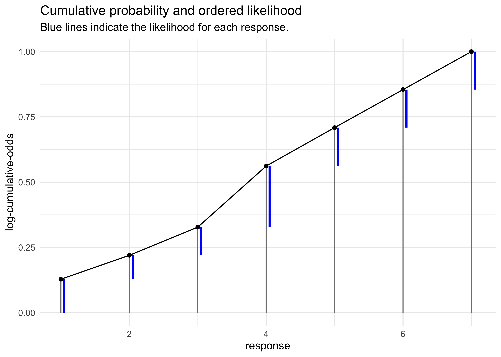

Chapter 11. Monsters and Mixtures
================

  - build more types of models by piecing together types we have already
    learned about
      - will discuss *ordered categorical* models and
        *zero-inflated*/*zero-augmented* models
  - mixtures are powerful, but interpretation is difficult

## 11.1 Ordered categorical outcomes

  - the outcome is discrete and has different *levels* along a dimension
    but the differences between each level are not necessarily equal
      - is a multinomial prediction problem with a constraint on the
        order of the categories
      - want an estimate of the effect of a change in a predictor on the
        change along the categories
  - use a *cumulative link function*
      - the cumulative probability of a value is *the probability of
        that value or any smaller value*
      - this guarantees the ordering of the outcomes

### 11.1.1 Example: Moral intuition

  - example data come from a survey of people with different versions of
    the classic “Trolley problem”
      - 3 versions that invoke different moral principles: “action
        principle,” “intention principle,” and “contact principle”
      - the goal is how people just the different choices from the
        different principles
      - `response`: from an integer 1-7, how morally permissible is the
        action

<!-- end list -->

``` r
data("Trolley")
d <- as_tibble(Trolley) %>%
    rename(q_case = case)
```

### 11.1.2 Describing an ordered distribution with intercepts

  - some plots of the data
      - a histogram of the response values
      - cumulative proportion of responses
      - log-cumulative-odds of responses

<!-- end list -->

``` r
p1 <- d %>%
    ggplot(aes(x = response)) +
    geom_histogram(bins = 30) +
    labs("Distribution of response")

p2 <- d %>% 
    count(response) %>%
    mutate(prop = n / sum(n),
           cum_prop = cumsum(prop)) %>%
    ggplot(aes(x = response, y = cum_prop)) +
    geom_line() +
    geom_point() +
    labs(y = "cumulative proportion")

p3 <- d %>% 
    count(response) %>%
    mutate(prop = n / sum(n),
           cum_prop = cumsum(prop),
           cum_odds = cum_prop / (1 - cum_prop),
           log_cum_odds= log(cum_odds)) %>%
    filter(is.finite(log_cum_odds)) %>%
    ggplot(aes(x = response, y = log_cum_odds)) +
    geom_line() +
    geom_point() +
    labs(y = "log-cumulative-odds")

p1 | p2 | p3
```

<!-- -->

  - why use the log-cumulative-odds of each response:
      - it is the cumulative analog of the logit link used previously
      - the logit is the log-odds; the cumulative logit is the
        log-cumulative-odds
      - constrains the probabilities to between 0 and 1
      - this link function takes care of converting the parameter
        estimates to the probability scale
  - to use Bayes’ theorom to compute the posterior distribution of these
    intercepts, need to compute the likelihood of each possible response
    value
      - need to use the cumulative probabilities \(\Pr(y_i \ge k)\) to
        compute the likelihood \(\Pr(y_i = k)\)
      - use the inverse link to translate the log-cumulative-odds back
        to cumulative probability
      - therefore, when we observe \(k\) and need its likelihoood, just
        use subtraction:
          - the values are shown as blue lines in the next plot

\[
p_k = \Pr(y_i = k) = \Pr(y_i \le k) - \Pr(y_i \le k - 1)
\]

``` r
offset_subtraction <- function(x) {
    y <- x
    for (i in seq(1, length(x))) {
        if (i == 1) { 
            y[[i]] <- x[[i]]
        } else {
            y[[i]] <- x[[i]] - x[[i - 1]]
        }
    }
    return(y)
}

d %>% 
    count(response) %>%
    mutate(prop = n / sum(n),
           cum_prop = cumsum(prop),
           likelihood = offset_subtraction(cum_prop),
           ymin = cum_prop - likelihood) %>%
    ggplot(aes(x = response)) +
    geom_linerange(aes(ymin = 0, ymax = cum_prop), color = "grey50") +
    geom_line(aes(y = cum_prop)) +
    geom_point(aes(y = cum_prop)) +
    geom_linerange(aes(ymin = ymin, ymax = cum_prop), color = "blue",
                   position = position_nudge(x = 0.05), size = 1) +
    labs(y = "log-cumulative-odds",
         title = "Cumulative probability and ordered likelihood",
         subtitle = "Blue lines indicate the likelihood for each response.")
```

<!-- -->

  - below is the matematical form of the model using an ordered logit
    likelihood
      - notation for these models can vary by author
      - the *Ordered* distribution is just a categorical distribution
        that takes a vector
        \(\text{p} = \{p_1, p_2, p_3, p_4, p_5, p_6\}\)
          - only 6 because the 7th level has the value 1 automatically
      - each response value \(k\) gets an intercept parameter
        \(\alpha_k\)

\[
R_i \sim \text{Ordered}(p) \\
logit(P_k) = \alpha_k \\
\alpha_k \sim \text{Normal}(0, 10)
\]

  - the first model does not include any predictor vairables
      - the link function is embedded in the likelihood function,
        already
          - simpler to type and makes the calculations more efficient,
            too
      - `phi` is a placeholder for now but will be used to add in
        predictor variables
      - the start values are included to start the intercepts in the
        right order
          - their exact values don’t really matter, just the order

<!-- end list -->

``` r
m11_1 <- quap(
    alist(
        response ~ dordlogit(phi, c(a1, a2, a3, a4, a5, a6)),
        phi <- 0,
        c(a1, a2, a3, a4, a5, a6) ~ dnorm(0, 10)
    ),
    data = d,
    start = list(a1 = -2, a2 = -1, a3 = 0, a4 = 1, a5 = 2, a6 = 2.5)
)

precis(m11_1)
```

    ##          mean         sd       5.5%      94.5%
    ## a1 -1.9160695 0.03000701 -1.9640265 -1.8681125
    ## a2 -1.2666001 0.02423126 -1.3053263 -1.2278739
    ## a3 -0.7186296 0.02137978 -0.7527986 -0.6844606
    ## a4  0.2477844 0.02022442  0.2154619  0.2801070
    ## a5  0.8898583 0.02208975  0.8545546  0.9251620
    ## a6  1.7693642 0.02845011  1.7238954  1.8148329

  - transform from log-cumulative-odds to cumulative probabilities

<!-- end list -->

``` r
logistic(coef(m11_1))
```

    ##        a1        a2        a3        a4        a5        a6 
    ## 0.1283005 0.2198398 0.3276948 0.5616311 0.7088609 0.8543786

``` r
m11_1_link <- extract.samples(m11_1)
m11_1_link %>%
    as.data.frame() %>%
    as_tibble() %>%
    pivot_longer(tidyselect::everything()) %>%
    ggplot(aes(x = value, y = name, color = name, fill = name)) +
    ggridges::geom_density_ridges(size = 1, alpha = 0.4, ) +
    scale_color_brewer(palette = "Set1") +
    scale_fill_brewer(palette = "Set1") +
    theme(legend.position = "none") +
    labs(x = "posterior samples",
         y = "density",
         title = "Posterior probability distributions of intercept from categorical model")
```

    ## Picking joint bandwidth of 0.00348

<!-- -->

### 11.1.3 Adding predictor variables

  - to include predictor variables:
      - *define the log-cumulative-odds of each response \(k\) as a sum
        of its intercept \(\alpha_k\) and a typical linear model*
      - for example: add a predictor \(x\) to the model
          - define the linear model \(\phi_i = \beta x_i\)
          - the cumulative logit becomes:

\[
\log \frac{\Pr(y_i \ge k)}{1 - \Pr(y_i \ge k)} = \alpha - \phi_i = \alpha - \beta x_i
\]

  - this form keeps the correct ordering of the outcome values while
    still morphing the likelihood of each individual value as the
    predictor \(x_i\) changes value
  - the linear model \(\phi\) is subtracted from the intercept:
      - because decreasing the log-cumulative-odds of every outcome
        value \(k\) below the maximum shifts probability mass upwards
        towards higher outcome values
      - a positive \(\beta\) value indicates than an increase in the
        predictor variable \(x\) results in an increase in the average
        response
  - for the Trolly data, we can icnlude predictor variables for the
    different types of questions: “action,” “intention,” and “contact”
      - the formulation of the log-cumulative-odds of each response
        \(k\) is shown below
      - defines the log-odds of each possible response to be an additive
        model of the features of the story corresponding to each
        response

\[
\log \frac{\Pr(y_i \ge k)}{1 - \Pr(y_i \ge k)} = \alpha - \phi_i \\
\phi_i = \beta_A A_i + \beta_I I_i + \beta_C C_i
\]

``` r
m11_2 <- quap(
    alist(
        response ~ dordlogit(phi, c(a1, a2, a3, a4, a5, a6)),
        phi <- bA*action + bI*intention + bC*contact,
        c(a1, a2, a3, a4, a5, a6) ~ dnorm(0, 10),
        c(bA, bI, bC) ~ dnorm(0, 10)
    ),
    data = d,
    start = list(a1 = -2, a2 = -1, a3 = 0, a4 = 1, a5 = 2, a6 = 2.5)
)
```

  - fit another model with interactions between action and intention and
    between contact and intention
      - these two make sense in terms of the scenario we are modeling
        while an interaction between contact and action does not
          - contact is a type of action

<!-- end list -->

``` r
m11_3 <- quap(
    alist(
        response ~ dordlogit(phi, c(a1, a2, a3, a4, a5, a6)),
        phi <- bA*action + bI*intention + bC*contact + bAI*action*intention + bCI*contact*intention,
        c(a1, a2, a3, a4, a5, a6) ~ dnorm(0, 10),
        c(bA, bI, bC, bAI, bCI) ~ dnorm(0, 10)
    ),
    data = d,
    start = list(a1 = -2, a2 = -1, a3 = 0, a4 = 1, a5 = 2, a6 = 2.5)
)

coeftab(m11_1, m11_2, m11_3)
```

    ##      m11_1   m11_2   m11_3  
    ## a1     -1.92   -2.84   -2.63
    ## a2     -1.27   -2.15   -1.94
    ## a3     -0.72   -1.57   -1.34
    ## a4      0.25   -0.55   -0.31
    ## a5      0.89    0.12    0.36
    ## a6      1.77    1.02    1.27
    ## bA        NA   -0.71   -0.47
    ## bI        NA   -0.72   -0.28
    ## bC        NA   -0.96   -0.33
    ## bAI       NA      NA   -0.45
    ## bCI       NA      NA   -1.27
    ## nobs    9930    9930    9930

  - interpretation:
      - the intercepts are difficult to interpret on their own, but act
        like regular intercepts in simpler models
          - they are the relative frequencies of the outcomes when all
            predictors are set to 0
      - there are 5 slope parameters: 3 main effects and 2 iinteractions
          - they are all far from 0 (can check with `precis(m)`)
          - they are all negative: each factor/interaction *reduces* the
            average response
          - these values are difficult to interpret as is, so they are
            investigated more below
  - compare the models by WAIC

<!-- end list -->

``` r
compare(m11_1, m11_2, m11_3)
```

    ##           WAIC       SE    dWAIC      dSE     pWAIC        weight
    ## m11_3 36929.15 81.16718   0.0000       NA 11.004379  1.000000e+00
    ## m11_2 37090.36 76.34564 161.2159 25.78738  9.253143  9.826897e-36
    ## m11_1 37854.49 57.63045 925.3444 62.65109  6.020406 1.158826e-201
