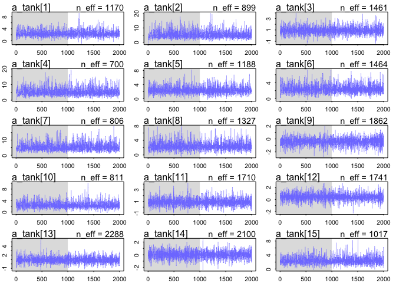
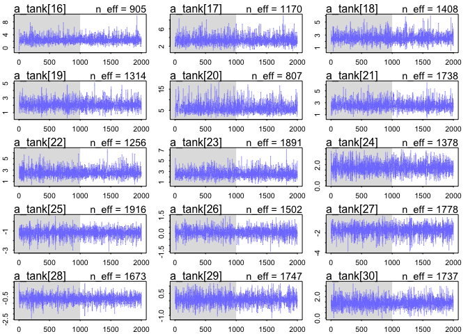
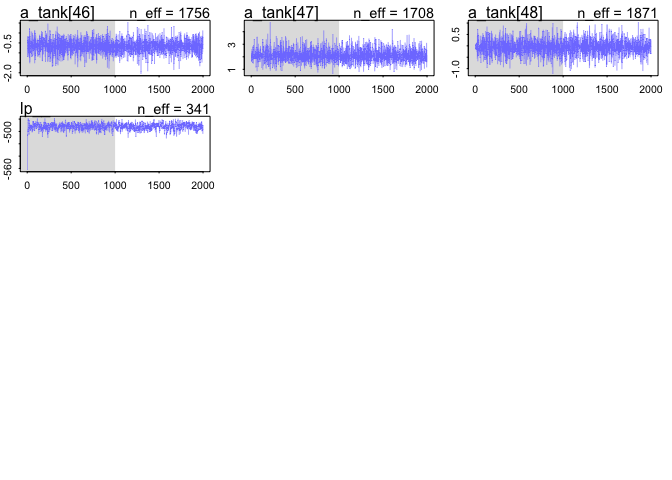
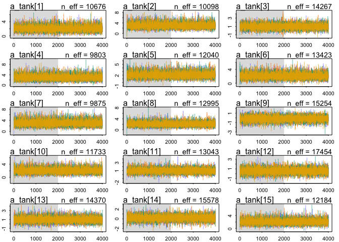
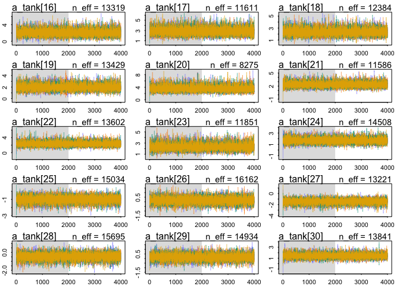
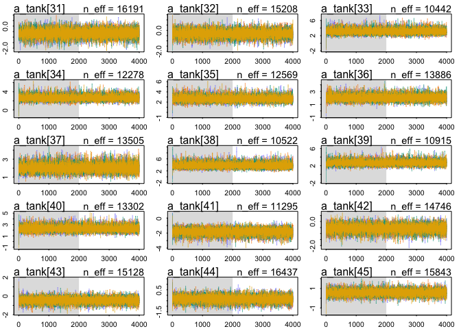
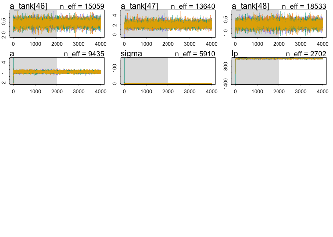

Chapter 12. Multilevel Models
================

  - multi-level models remember features of each cluster in the data as
    they learn about all of the clusters
      - depending on the variation across clusters, the model pools
        information across clusters
      - *the pooling improves estimates about each cluster*
  - benefits of the multilevel approach:
    1.  improved estimates for repeat sampling
    2.  improved estimates for imbalance in sampling
    3.  estimates of variation
    4.  avoid averaging and retain variation
  - multilevel regression should be the default approach
  - this chapter starts with the foundations and the following two are
    more advanced types of multilevel models

## 12.1 Example: Multilivel tadpoles

  - example: Reed frog tadpole mortality
      - `surv`: number or survivors
      - `count`: initial number

<!-- end list -->

``` r
data("reedfrogs")
d <- as_tibble(reedfrogs)
skimr::skim(d)
```

|                                                  |      |
| :----------------------------------------------- | :--- |
| Name                                             | d    |
| Number of rows                                   | 48   |
| Number of columns                                | 5    |
| \_\_\_\_\_\_\_\_\_\_\_\_\_\_\_\_\_\_\_\_\_\_\_   |      |
| Column type frequency:                           |      |
| factor                                           | 2    |
| numeric                                          | 3    |
| \_\_\_\_\_\_\_\_\_\_\_\_\_\_\_\_\_\_\_\_\_\_\_\_ |      |
| Group variables                                  | None |

Data summary

**Variable type: factor**

| skim\_variable | n\_missing | complete\_rate | ordered | n\_unique | top\_counts      |
| :------------- | ---------: | -------------: | :------ | --------: | :--------------- |
| pred           |          0 |              1 | FALSE   |         2 | no: 24, pre: 24  |
| size           |          0 |              1 | FALSE   |         2 | big: 24, sma: 24 |

**Variable type: numeric**

| skim\_variable | n\_missing | complete\_rate |  mean |    sd |    p0 |  p25 |   p50 |   p75 | p100 | hist  |
| :------------- | ---------: | -------------: | ----: | ----: | ----: | ---: | ----: | ----: | ---: | :---- |
| density        |          0 |              1 | 23.33 | 10.38 | 10.00 | 10.0 | 25.00 | 35.00 |   35 | ▇▁▇▁▇ |
| surv           |          0 |              1 | 16.31 |  9.88 |  4.00 |  9.0 | 12.50 | 23.00 |   35 | ▇▂▂▂▃ |
| propsurv       |          0 |              1 |  0.72 |  0.27 |  0.11 |  0.5 |  0.89 |  0.92 |    1 | ▁▂▂▁▇ |

  - there is a lot of variation in the data
      - some from experimental treatment, other sources do exist
      - each row is a fish tank that is the experimental environment
      - each tank is a cluster variable and there are repeated measures
        from each
      - each tank may have a different baseline level of survival, but
        don’t want to treat them as completely unrelated
          - a dummy variable for each tank would be the wrong solution
  - *varying intercepts model*: a multilevel model that estimates an
    intercept for each tank and the variation among tanks
      - for each cluster in the data, use a unique intercept parameter,
        adaptively learning the prior common to all of the intercepts
      - what is learned about each cluster informs all the other
        clusters
  - model for predicting tadpole mortality in each tank (nothing new)

\[
s_i \sim \text{Binomial}(n_i, p_i) \\
\text{logit}(p_i) = \alpha_{\text{tank}[i]} \\
\alpha_{\text{tank}} \sim \text{Normal}(0, 5) \\
\]

``` r
d$tank <- 1:nrow(d)

m12_1 <- map2stan(
    alist(
        surv ~ dbinom(density, p),
        logit(p) <- a_tank[tank],
        a_tank[tank] ~ dnorm(0, 5)
    ),
    data = d
)
```

    ## Trying to compile a simple C file

    ## Running /Library/Frameworks/R.framework/Resources/bin/R CMD SHLIB foo.c
    ## clang -mmacosx-version-min=10.13 -I"/Library/Frameworks/R.framework/Resources/include" -DNDEBUG   -I"/Library/Frameworks/R.framework/Versions/4.0/Resources/library/Rcpp/include/"  -I"/Library/Frameworks/R.framework/Versions/4.0/Resources/library/RcppEigen/include/"  -I"/Library/Frameworks/R.framework/Versions/4.0/Resources/library/RcppEigen/include/unsupported"  -I"/Library/Frameworks/R.framework/Versions/4.0/Resources/library/BH/include" -I"/Library/Frameworks/R.framework/Versions/4.0/Resources/library/StanHeaders/include/src/"  -I"/Library/Frameworks/R.framework/Versions/4.0/Resources/library/StanHeaders/include/"  -I"/Library/Frameworks/R.framework/Versions/4.0/Resources/library/rstan/include" -DEIGEN_NO_DEBUG  -D_REENTRANT  -DBOOST_DISABLE_ASSERTS -DBOOST_PENDING_INTEGER_LOG2_HPP -include stan/math/prim/mat/fun/Eigen.hpp   -I/usr/local/include   -fPIC  -Wall -g -O2  -c foo.c -o foo.o
    ## In file included from <built-in>:1:
    ## In file included from /Library/Frameworks/R.framework/Versions/4.0/Resources/library/StanHeaders/include/stan/math/prim/mat/fun/Eigen.hpp:4:
    ## In file included from /Library/Frameworks/R.framework/Versions/4.0/Resources/library/RcppEigen/include/Eigen/Dense:1:
    ## In file included from /Library/Frameworks/R.framework/Versions/4.0/Resources/library/RcppEigen/include/Eigen/Core:88:
    ## /Library/Frameworks/R.framework/Versions/4.0/Resources/library/RcppEigen/include/Eigen/src/Core/util/Macros.h:613:1: error: unknown type name 'namespace'
    ## namespace Eigen {
    ## ^
    ## /Library/Frameworks/R.framework/Versions/4.0/Resources/library/RcppEigen/include/Eigen/src/Core/util/Macros.h:613:16: error: expected ';' after top level declarator
    ## namespace Eigen {
    ##                ^
    ##                ;
    ## In file included from <built-in>:1:
    ## In file included from /Library/Frameworks/R.framework/Versions/4.0/Resources/library/StanHeaders/include/stan/math/prim/mat/fun/Eigen.hpp:4:
    ## In file included from /Library/Frameworks/R.framework/Versions/4.0/Resources/library/RcppEigen/include/Eigen/Dense:1:
    ## /Library/Frameworks/R.framework/Versions/4.0/Resources/library/RcppEigen/include/Eigen/Core:96:10: fatal error: 'complex' file not found
    ## #include <complex>
    ##          ^~~~~~~~~
    ## 3 errors generated.
    ## make: *** [foo.o] Error 1
    ## 
    ## SAMPLING FOR MODEL '9d0c3b8600959f7dbaef88d0eb0c1565' NOW (CHAIN 1).
    ## Chain 1: 
    ## Chain 1: Gradient evaluation took 2.9e-05 seconds
    ## Chain 1: 1000 transitions using 10 leapfrog steps per transition would take 0.29 seconds.
    ## Chain 1: Adjust your expectations accordingly!
    ## Chain 1: 
    ## Chain 1: 
    ## Chain 1: Iteration:    1 / 2000 [  0%]  (Warmup)
    ## Chain 1: Iteration:  200 / 2000 [ 10%]  (Warmup)
    ## Chain 1: Iteration:  400 / 2000 [ 20%]  (Warmup)
    ## Chain 1: Iteration:  600 / 2000 [ 30%]  (Warmup)
    ## Chain 1: Iteration:  800 / 2000 [ 40%]  (Warmup)
    ## Chain 1: Iteration: 1000 / 2000 [ 50%]  (Warmup)
    ## Chain 1: Iteration: 1001 / 2000 [ 50%]  (Sampling)
    ## Chain 1: Iteration: 1200 / 2000 [ 60%]  (Sampling)
    ## Chain 1: Iteration: 1400 / 2000 [ 70%]  (Sampling)
    ## Chain 1: Iteration: 1600 / 2000 [ 80%]  (Sampling)
    ## Chain 1: Iteration: 1800 / 2000 [ 90%]  (Sampling)
    ## Chain 1: Iteration: 2000 / 2000 [100%]  (Sampling)
    ## Chain 1: 
    ## Chain 1:  Elapsed Time: 0.289755 seconds (Warm-up)
    ## Chain 1:                0.222685 seconds (Sampling)
    ## Chain 1:                0.51244 seconds (Total)
    ## Chain 1:

    ## Computing WAIC

``` r
plot(m12_1)
```

    ## Waiting to draw page 2 of 4

<!-- -->

    ## Waiting to draw page 3 of 4

<!-- -->

    ## Waiting to draw page 4 of 4

<!-- -->

``` r
precis(m12_1, depth = 2)
```

    ##                    mean        sd        5.5%       94.5%     n_eff     Rhat4
    ## a_tank[1]   2.507409171 1.1524623  0.93101925  4.37936340 1169.7322 1.0026114
    ## a_tank[2]   5.612838269 2.7132323  2.19554740 10.54893764  899.3637 1.0008726
    ## a_tank[3]   0.955606971 0.7242290 -0.14017849  2.17759271 1460.8578 0.9990305
    ## a_tank[4]   5.679923948 2.8455974  2.15987436 10.97137311  699.5095 1.0000048
    ## a_tank[5]   2.499838112 1.1727475  0.76994045  4.58635038 1188.1499 1.0000598
    ## a_tank[6]   2.517113412 1.1294493  0.92491083  4.46585736 1464.1416 0.9992449
    ## a_tank[7]   5.901717876 2.8211771  2.14857770 10.99128478  806.4153 1.0008287
    ## a_tank[8]   2.524943494 1.1865708  0.90160654  4.61786220 1326.8743 0.9992859
    ## a_tank[9]  -0.434933639 0.6992316 -1.60374245  0.67361265 1861.5726 0.9990238
    ## a_tank[10]  2.553526682 1.2725275  0.95808481  4.73993666  811.3452 1.0006649
    ## a_tank[11]  0.928007321 0.7012304 -0.11637281  2.00120557 1709.8194 0.9990331
    ## a_tank[12]  0.429178891 0.6465231 -0.57350934  1.46511159 1741.1834 0.9991630
    ## a_tank[13]  0.920048116 0.7780154 -0.24566164  2.26740427 2287.5157 0.9989996
    ## a_tank[14] -0.004138478 0.6422798 -1.03140387  0.99544864 2099.6606 0.9996044
    ## a_tank[15]  2.534309631 1.1870475  0.94535196  4.65363403 1017.3940 0.9990010
    ## a_tank[16]  2.562492002 1.1979390  0.93832063  4.61508223  904.8553 0.9993926
    ## a_tank[17]  3.482758869 1.0958091  2.04437266  5.42345625 1169.5619 0.9991805
    ## a_tank[18]  2.600973188 0.7733600  1.50182706  3.84110085 1408.0256 0.9992849
    ## a_tank[19]  2.092811937 0.6625600  1.11974357  3.19785372 1314.4619 0.9992588
    ## a_tank[20]  6.384557994 2.5248693  3.06325559 10.77296354  806.6867 0.9991746
    ## a_tank[21]  2.603154000 0.8220062  1.46412686  4.03485926 1737.5125 0.9989999
    ## a_tank[22]  2.607190416 0.8210206  1.46198535  3.98703885 1255.6414 0.9994705
    ## a_tank[23]  2.642921858 0.8450012  1.45712864  4.12740437 1890.5051 0.9992576
    ## a_tank[24]  1.767043468 0.5768471  0.90131031  2.72391891 1378.1002 0.9990206
    ## a_tank[25] -1.199052933 0.4808654 -2.02854659 -0.48615548 1915.5349 0.9993517
    ## a_tank[26]  0.073867651 0.4033379 -0.58592471  0.70168058 1502.1574 0.9990712
    ## a_tank[27] -1.728261971 0.5990486 -2.75282906 -0.85857256 1778.1066 0.9990908
    ## a_tank[28] -0.583195318 0.4068612 -1.24150665  0.04795821 1673.1617 0.9999810
    ## a_tank[29]  0.088578780 0.3719024 -0.49340453  0.70328935 1747.1601 1.0006433
    ## a_tank[30]  1.444977742 0.4986175  0.71138107  2.23895422 1736.9334 1.0009826
    ## a_tank[31] -0.773314146 0.4585884 -1.52956150 -0.07904713 3000.0000 0.9989999
    ## a_tank[32] -0.426102595 0.4346237 -1.13411885  0.23346923 2241.3897 0.9991342
    ## a_tank[33]  3.882402429 1.1621012  2.34117237  5.99965749  979.3484 1.0005470
    ## a_tank[34]  2.975268939 0.7928279  1.82785040  4.37827490 1227.5837 0.9990576
    ## a_tank[35]  2.982821962 0.7873739  1.91162565  4.28476387 1244.2835 1.0001640
    ## a_tank[36]  2.121553100 0.5458666  1.32624049  3.04790562 1287.2849 0.9998285
    ## a_tank[37]  2.137663250 0.5514193  1.30839289  3.04187941 1927.7414 0.9990029
    ## a_tank[38]  6.624137117 2.6369140  3.42901273 11.60758660  893.2845 1.0009293
    ## a_tank[39]  2.988236226 0.7465053  1.91868143  4.29230598 1050.6759 0.9992627
    ## a_tank[40]  2.470609850 0.6170318  1.55170516  3.53965792 1769.9371 1.0005928
    ## a_tank[41] -2.105878273 0.5052832 -2.95253503 -1.34346434 2123.9626 0.9990402
    ## a_tank[42] -0.657283191 0.3617925 -1.27168169 -0.07343184 1753.1871 0.9990011
    ## a_tank[43] -0.536404426 0.3457784 -1.10624031 -0.01031267 1461.3338 1.0046253
    ## a_tank[44] -0.415124455 0.3566651 -1.00372980  0.14669864 1654.7097 0.9998603
    ## a_tank[45]  0.534408094 0.3428320  0.01571398  1.09866956 1675.6866 1.0023466
    ## a_tank[46] -0.675958197 0.3648753 -1.24105136 -0.12461938 1756.3501 0.9990210
    ## a_tank[47]  2.111823796 0.5407572  1.28961743  3.03239512 1708.4571 0.9995017
    ## a_tank[48] -0.044250386 0.3534230 -0.60960518  0.50181927 1871.3159 0.9989996

<!-- -->

  - can get expected mortality for each tank by taking the logistic of
    the coefficients

<!-- end list -->

``` r
logistic(coef(m12_1)) %>%
    enframe() %>%
    mutate(name = str_remove_all(name, "a_tank\\[|\\]"),
           name = as.numeric(name)) %>%
    ggplot(aes(x = name, y = value)) +
    geom_col() +
    scale_x_continuous(expand = c(0, 0)) +
    scale_y_continuous(expand = expansion(mult = c(0, 0.02))) +
    labs(x = "tank",
         y = "estimated probability survival",
         title = "Single-level categorical model estimates of tadpole survival")
```

<!-- -->

  - fit a multilevel model by adding a prior for the `a_tank` parameters
    as a function of its own parameters
      - now the priors have prior distributions, creating two *levels*
        of priors

\[
s_i \sim \text{Binomial}(n_i, p_i) \\
\text{logit}(p_i) = \alpha_{\text{tank}[i]} \\
\alpha_{\text{tank}} \sim \text{Normal}(\alpha, \sigma) \\
\alpha \sim \text{Normal}(0, 1) \\
\sigma \sim \text{HalfCauchy}(0, 1)
\]

``` r
m12_2 <- map2stan(
    alist(
        surv ~ dbinom(density, p),
        logit(p) <- a_tank[tank],
        a_tank[tank] ~ dnorm(a, sigma),
        a ~ dnorm(0, 1),
        sigma ~ dcauchy(0, 1)
    ),
    data = d,
    iter = 4000,
    chains = 4,
    cores = 1
)
```

    ## Trying to compile a simple C file

    ## Running /Library/Frameworks/R.framework/Resources/bin/R CMD SHLIB foo.c
    ## clang -mmacosx-version-min=10.13 -I"/Library/Frameworks/R.framework/Resources/include" -DNDEBUG   -I"/Library/Frameworks/R.framework/Versions/4.0/Resources/library/Rcpp/include/"  -I"/Library/Frameworks/R.framework/Versions/4.0/Resources/library/RcppEigen/include/"  -I"/Library/Frameworks/R.framework/Versions/4.0/Resources/library/RcppEigen/include/unsupported"  -I"/Library/Frameworks/R.framework/Versions/4.0/Resources/library/BH/include" -I"/Library/Frameworks/R.framework/Versions/4.0/Resources/library/StanHeaders/include/src/"  -I"/Library/Frameworks/R.framework/Versions/4.0/Resources/library/StanHeaders/include/"  -I"/Library/Frameworks/R.framework/Versions/4.0/Resources/library/rstan/include" -DEIGEN_NO_DEBUG  -D_REENTRANT  -DBOOST_DISABLE_ASSERTS -DBOOST_PENDING_INTEGER_LOG2_HPP -include stan/math/prim/mat/fun/Eigen.hpp   -I/usr/local/include   -fPIC  -Wall -g -O2  -c foo.c -o foo.o
    ## In file included from <built-in>:1:
    ## In file included from /Library/Frameworks/R.framework/Versions/4.0/Resources/library/StanHeaders/include/stan/math/prim/mat/fun/Eigen.hpp:4:
    ## In file included from /Library/Frameworks/R.framework/Versions/4.0/Resources/library/RcppEigen/include/Eigen/Dense:1:
    ## In file included from /Library/Frameworks/R.framework/Versions/4.0/Resources/library/RcppEigen/include/Eigen/Core:88:
    ## /Library/Frameworks/R.framework/Versions/4.0/Resources/library/RcppEigen/include/Eigen/src/Core/util/Macros.h:613:1: error: unknown type name 'namespace'
    ## namespace Eigen {
    ## ^
    ## /Library/Frameworks/R.framework/Versions/4.0/Resources/library/RcppEigen/include/Eigen/src/Core/util/Macros.h:613:16: error: expected ';' after top level declarator
    ## namespace Eigen {
    ##                ^
    ##                ;
    ## In file included from <built-in>:1:
    ## In file included from /Library/Frameworks/R.framework/Versions/4.0/Resources/library/StanHeaders/include/stan/math/prim/mat/fun/Eigen.hpp:4:
    ## In file included from /Library/Frameworks/R.framework/Versions/4.0/Resources/library/RcppEigen/include/Eigen/Dense:1:
    ## /Library/Frameworks/R.framework/Versions/4.0/Resources/library/RcppEigen/include/Eigen/Core:96:10: fatal error: 'complex' file not found
    ## #include <complex>
    ##          ^~~~~~~~~
    ## 3 errors generated.
    ## make: *** [foo.o] Error 1
    ## 
    ## SAMPLING FOR MODEL '473dd6cd0fe52d15933e582ccbfb3f52' NOW (CHAIN 1).
    ## Chain 1: 
    ## Chain 1: Gradient evaluation took 3.3e-05 seconds
    ## Chain 1: 1000 transitions using 10 leapfrog steps per transition would take 0.33 seconds.
    ## Chain 1: Adjust your expectations accordingly!
    ## Chain 1: 
    ## Chain 1: 
    ## Chain 1: Iteration:    1 / 4000 [  0%]  (Warmup)
    ## Chain 1: Iteration:  400 / 4000 [ 10%]  (Warmup)
    ## Chain 1: Iteration:  800 / 4000 [ 20%]  (Warmup)
    ## Chain 1: Iteration: 1200 / 4000 [ 30%]  (Warmup)
    ## Chain 1: Iteration: 1600 / 4000 [ 40%]  (Warmup)
    ## Chain 1: Iteration: 2000 / 4000 [ 50%]  (Warmup)
    ## Chain 1: Iteration: 2001 / 4000 [ 50%]  (Sampling)
    ## Chain 1: Iteration: 2400 / 4000 [ 60%]  (Sampling)
    ## Chain 1: Iteration: 2800 / 4000 [ 70%]  (Sampling)
    ## Chain 1: Iteration: 3200 / 4000 [ 80%]  (Sampling)
    ## Chain 1: Iteration: 3600 / 4000 [ 90%]  (Sampling)
    ## Chain 1: Iteration: 4000 / 4000 [100%]  (Sampling)
    ## Chain 1: 
    ## Chain 1:  Elapsed Time: 0.676503 seconds (Warm-up)
    ## Chain 1:                0.514229 seconds (Sampling)
    ## Chain 1:                1.19073 seconds (Total)
    ## Chain 1: 
    ## 
    ## SAMPLING FOR MODEL '473dd6cd0fe52d15933e582ccbfb3f52' NOW (CHAIN 2).
    ## Chain 2: 
    ## Chain 2: Gradient evaluation took 4e-05 seconds
    ## Chain 2: 1000 transitions using 10 leapfrog steps per transition would take 0.4 seconds.
    ## Chain 2: Adjust your expectations accordingly!
    ## Chain 2: 
    ## Chain 2: 
    ## Chain 2: Iteration:    1 / 4000 [  0%]  (Warmup)
    ## Chain 2: Iteration:  400 / 4000 [ 10%]  (Warmup)
    ## Chain 2: Iteration:  800 / 4000 [ 20%]  (Warmup)
    ## Chain 2: Iteration: 1200 / 4000 [ 30%]  (Warmup)
    ## Chain 2: Iteration: 1600 / 4000 [ 40%]  (Warmup)
    ## Chain 2: Iteration: 2000 / 4000 [ 50%]  (Warmup)
    ## Chain 2: Iteration: 2001 / 4000 [ 50%]  (Sampling)
    ## Chain 2: Iteration: 2400 / 4000 [ 60%]  (Sampling)
    ## Chain 2: Iteration: 2800 / 4000 [ 70%]  (Sampling)
    ## Chain 2: Iteration: 3200 / 4000 [ 80%]  (Sampling)
    ## Chain 2: Iteration: 3600 / 4000 [ 90%]  (Sampling)
    ## Chain 2: Iteration: 4000 / 4000 [100%]  (Sampling)
    ## Chain 2: 
    ## Chain 2:  Elapsed Time: 0.58854 seconds (Warm-up)
    ## Chain 2:                0.465065 seconds (Sampling)
    ## Chain 2:                1.0536 seconds (Total)
    ## Chain 2: 
    ## 
    ## SAMPLING FOR MODEL '473dd6cd0fe52d15933e582ccbfb3f52' NOW (CHAIN 3).
    ## Chain 3: 
    ## Chain 3: Gradient evaluation took 2.6e-05 seconds
    ## Chain 3: 1000 transitions using 10 leapfrog steps per transition would take 0.26 seconds.
    ## Chain 3: Adjust your expectations accordingly!
    ## Chain 3: 
    ## Chain 3: 
    ## Chain 3: Iteration:    1 / 4000 [  0%]  (Warmup)
    ## Chain 3: Iteration:  400 / 4000 [ 10%]  (Warmup)
    ## Chain 3: Iteration:  800 / 4000 [ 20%]  (Warmup)
    ## Chain 3: Iteration: 1200 / 4000 [ 30%]  (Warmup)
    ## Chain 3: Iteration: 1600 / 4000 [ 40%]  (Warmup)
    ## Chain 3: Iteration: 2000 / 4000 [ 50%]  (Warmup)
    ## Chain 3: Iteration: 2001 / 4000 [ 50%]  (Sampling)
    ## Chain 3: Iteration: 2400 / 4000 [ 60%]  (Sampling)
    ## Chain 3: Iteration: 2800 / 4000 [ 70%]  (Sampling)
    ## Chain 3: Iteration: 3200 / 4000 [ 80%]  (Sampling)
    ## Chain 3: Iteration: 3600 / 4000 [ 90%]  (Sampling)
    ## Chain 3: Iteration: 4000 / 4000 [100%]  (Sampling)
    ## Chain 3: 
    ## Chain 3:  Elapsed Time: 0.643791 seconds (Warm-up)
    ## Chain 3:                0.500119 seconds (Sampling)
    ## Chain 3:                1.14391 seconds (Total)
    ## Chain 3: 
    ## 
    ## SAMPLING FOR MODEL '473dd6cd0fe52d15933e582ccbfb3f52' NOW (CHAIN 4).
    ## Chain 4: 
    ## Chain 4: Gradient evaluation took 1.6e-05 seconds
    ## Chain 4: 1000 transitions using 10 leapfrog steps per transition would take 0.16 seconds.
    ## Chain 4: Adjust your expectations accordingly!
    ## Chain 4: 
    ## Chain 4: 
    ## Chain 4: Iteration:    1 / 4000 [  0%]  (Warmup)
    ## Chain 4: Iteration:  400 / 4000 [ 10%]  (Warmup)
    ## Chain 4: Iteration:  800 / 4000 [ 20%]  (Warmup)
    ## Chain 4: Iteration: 1200 / 4000 [ 30%]  (Warmup)
    ## Chain 4: Iteration: 1600 / 4000 [ 40%]  (Warmup)
    ## Chain 4: Iteration: 2000 / 4000 [ 50%]  (Warmup)
    ## Chain 4: Iteration: 2001 / 4000 [ 50%]  (Sampling)
    ## Chain 4: Iteration: 2400 / 4000 [ 60%]  (Sampling)
    ## Chain 4: Iteration: 2800 / 4000 [ 70%]  (Sampling)
    ## Chain 4: Iteration: 3200 / 4000 [ 80%]  (Sampling)
    ## Chain 4: Iteration: 3600 / 4000 [ 90%]  (Sampling)
    ## Chain 4: Iteration: 4000 / 4000 [100%]  (Sampling)
    ## Chain 4: 
    ## Chain 4:  Elapsed Time: 0.538784 seconds (Warm-up)
    ## Chain 4:                0.511995 seconds (Sampling)
    ## Chain 4:                1.05078 seconds (Total)
    ## Chain 4:

    ## Computing WAIC

``` r
plot(m12_2)
```

    ## Waiting to draw page 2 of 4

<!-- -->

    ## Waiting to draw page 3 of 4

<!-- -->

    ## Waiting to draw page 4 of 4

<!-- -->

``` r
print(m12_2)
```

    ## map2stan model
    ## 8000 samples from 4 chains
    ## 
    ## Sampling durations (seconds):
    ##         warmup sample total
    ## chain:1   0.68   0.51  1.19
    ## chain:2   0.59   0.47  1.05
    ## chain:3   0.64   0.50  1.14
    ## chain:4   0.54   0.51  1.05
    ## 
    ## Formula:
    ## surv ~ dbinom(density, p)
    ## logit(p) <- a_tank[tank]
    ## a_tank[tank] ~ dnorm(a, sigma)
    ## a ~ dnorm(0, 1)
    ## sigma ~ dcauchy(0, 1)
    ## 
    ## WAIC (SE): 1010 (38)
    ## pWAIC: 37.75

``` r
precis(m12_2, depth = 2)
```

    ##                    mean        sd        5.5%        94.5%     n_eff     Rhat4
    ## a_tank[1]   2.134144972 0.8709029  0.85482406  3.609491509 10676.151 0.9999920
    ## a_tank[2]   3.051605826 1.0921789  1.49594552  4.892587501 10098.248 0.9997675
    ## a_tank[3]   0.998618796 0.6650059 -0.01779203  2.123667847 14266.942 0.9996303
    ## a_tank[4]   3.055184422 1.0997043  1.46692953  4.926160112  9802.978 0.9998700
    ## a_tank[5]   2.126306576 0.8653686  0.86023079  3.606177745 12040.084 0.9997286
    ## a_tank[6]   2.140337613 0.8943564  0.82915956  3.666082745 13423.384 0.9998230
    ## a_tank[7]   3.064852886 1.0896043  1.49313561  4.972594345  9874.949 0.9999786
    ## a_tank[8]   2.130196402 0.8843109  0.84460056  3.655415490 12994.701 0.9998468
    ## a_tank[9]  -0.172985029 0.6004654 -1.14255424  0.777641121 15253.666 0.9997913
    ## a_tank[10]  2.123029310 0.8687031  0.83926350  3.618733123 11732.963 1.0000264
    ## a_tank[11]  0.991095454 0.6751966 -0.03926026  2.116091672 13042.572 1.0000211
    ## a_tank[12]  0.579929441 0.6205448 -0.39042979  1.586823746 17453.967 0.9996706
    ## a_tank[13]  1.001297087 0.6588476 -0.02513914  2.091680336 14370.487 0.9999141
    ## a_tank[14]  0.199225612 0.6107794 -0.76477080  1.159581978 15577.698 0.9998016
    ## a_tank[15]  2.120101402 0.8715305  0.83522256  3.606664450 12184.087 0.9997332
    ## a_tank[16]  2.124326395 0.8810013  0.80722021  3.615492999 13319.477 0.9997337
    ## a_tank[17]  2.895285598 0.7880475  1.72989598  4.219510301 11611.080 0.9997976
    ## a_tank[18]  2.385431726 0.6490309  1.42613150  3.467726868 12383.599 0.9999097
    ## a_tank[19]  2.014916226 0.5852079  1.14096877  3.006271510 13428.749 0.9999448
    ## a_tank[20]  3.654989838 1.0240820  2.22991755  5.429506622  8274.648 0.9996691
    ## a_tank[21]  2.393644010 0.6687327  1.39945331  3.516915793 11586.390 0.9996041
    ## a_tank[22]  2.385875963 0.6623125  1.41031243  3.522346777 13601.760 0.9996969
    ## a_tank[23]  2.391636395 0.6555515  1.42115670  3.526937362 11850.562 0.9998844
    ## a_tank[24]  1.699099289 0.5287154  0.89003200  2.570757271 14507.543 0.9996921
    ## a_tank[25] -1.007093825 0.4452098 -1.74645868 -0.317556247 15034.356 0.9998541
    ## a_tank[26]  0.157982107 0.4045220 -0.48269391  0.800414000 16161.965 0.9996386
    ## a_tank[27] -1.431941194 0.4974208 -2.25071182 -0.671054023 13220.790 0.9996276
    ## a_tank[28] -0.473395760 0.4090657 -1.12514996  0.158742905 15694.947 0.9997091
    ## a_tank[29]  0.153529633 0.3941367 -0.47311586  0.781398704 14933.563 0.9996457
    ## a_tank[30]  1.445284426 0.4914853  0.70056814  2.250009508 13840.567 0.9997252
    ## a_tank[31] -0.633224102 0.4057116 -1.28013932  0.004391369 16191.250 0.9998610
    ## a_tank[32] -0.306574703 0.3958911 -0.93617036  0.323907073 15208.221 0.9996941
    ## a_tank[33]  3.185354079 0.7707225  2.06477428  4.504273874 10441.639 0.9997937
    ## a_tank[34]  2.703880671 0.6490955  1.75210628  3.831403872 12277.820 0.9997508
    ## a_tank[35]  2.703858272 0.6290704  1.79485622  3.763585334 12568.750 0.9996111
    ## a_tank[36]  2.060055133 0.5013107  1.30916936  2.899258592 13886.065 0.9998468
    ## a_tank[37]  2.054008041 0.5096378  1.29213115  2.907205483 13505.254 0.9998320
    ## a_tank[38]  3.887260667 0.9818798  2.47725427  5.594743853 10521.706 0.9996911
    ## a_tank[39]  2.706112024 0.6456162  1.76652790  3.789962146 10914.982 1.0001804
    ## a_tank[40]  2.348063971 0.5665367  1.51708711  3.299607196 13301.702 0.9998011
    ## a_tank[41] -1.818477969 0.4785050 -2.62679759 -1.094182202 11294.682 0.9996502
    ## a_tank[42] -0.576845207 0.3502419 -1.15406511 -0.032218084 14746.225 0.9996240
    ## a_tank[43] -0.453737023 0.3509767 -1.02063563  0.096113855 15128.067 0.9997213
    ## a_tank[44] -0.339424137 0.3388941 -0.88365359  0.196334257 16436.514 0.9997282
    ## a_tank[45]  0.574143034 0.3462430  0.02765532  1.131739424 15843.331 0.9996722
    ## a_tank[46] -0.571437040 0.3467804 -1.12514116 -0.032865914 15059.061 0.9997484
    ## a_tank[47]  2.053100777 0.5077106  1.29604493  2.911431793 13640.005 0.9996132
    ## a_tank[48]  0.006919919 0.3354635 -0.52625410  0.535351955 18533.113 0.9999687
    ## a           1.302198892 0.2464970  0.90099385  1.704277906  9434.669 1.0000386
    ## sigma       1.619105005 0.2161693  1.30694385  1.993457429  5910.242 1.0000055

<!-- -->
- interpretation: \* \(\alpha\): one overall sample intercept \*
\(\sigma\): variance among tanks \* 48 per-tank intercepts

``` r
compare(m12_1, m12_2)
```

    ##           WAIC       SE    dWAIC      dSE    pWAIC      weight
    ## m12_2 1009.668 37.97854  0.00000       NA 37.75478 0.998916493
    ## m12_1 1023.321 42.90494 13.65294 6.602832 49.38454 0.001083507

  - from the comparison, see that the multilevel model only has \~38
    effective parameters
      - 12 fewer than the single-level model because the prior assigned
        to each intercept shrinks them all towards the mean \(\alpha\)
          - *\(\alpha\) is acting like a regularizing prior, but it has
            been learnt from the data*
  - plot and compare the posterior medians from both models

<!-- end list -->

``` r
post <- extract.samples(m12_2)

d %>%
    mutate(propsurv_estimate = logistic(apply(post$a_tank, 2, median)),
           pop_size = case_when(
               density == 10 ~ "small tank",
               density == 25 ~ "medium tank",
               density == 35 ~ "large tank"
           ),
           pop_size = fct_reorder(pop_size, density)) %>%
    ggplot(aes(tank)) +
    facet_wrap(~ pop_size, nrow = 1, scales = "free_x") +
    geom_hline(yintercept = logistic(median(post$a)), 
               lty = 2, color = dark_grey) +
    geom_linerange(aes(x = tank, ymin = propsurv, ymax = propsurv_estimate), 
                   color = light_grey, size = 1) +
    geom_point(aes(y = propsurv), 
               color = grey, size = 1) +
    geom_point(aes(y = propsurv_estimate), 
               color = purple, size = 1) +
    labs(x = "tank",
         y = "proportion surivival",
         title = "Propotion of survival among tadpoles from different tanks.")
```

<!-- -->
