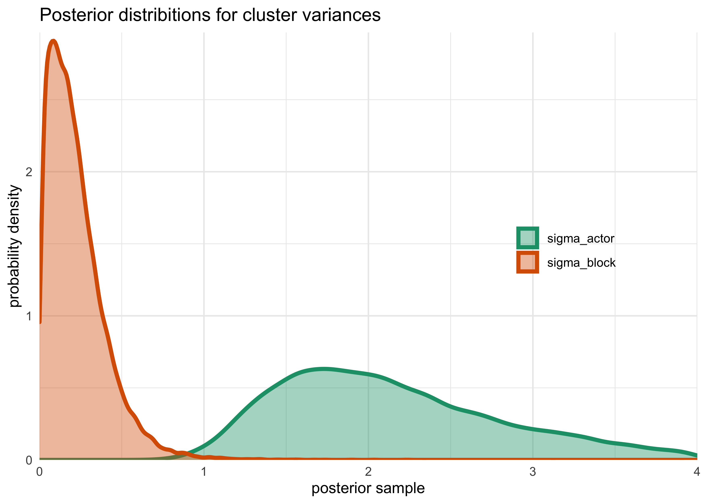

Chapter 12. Multilevel Models
================

  - multi-level models remember features of each cluster in the data as
    they learn about all of the clusters
      - depending on the variation across clusters, the model pools
        information across clusters
      - *the pooling improves estimates about each cluster*
  - benefits of the multilevel approach:
    1.  improved estimates for repeat sampling
    2.  improved estimates for imbalance in sampling
    3.  estimates of variation
    4.  avoid averaging and retain variation
  - multilevel regression should be the default approach
  - this chapter starts with the foundations and the following two are
    more advanced types of multilevel models

## 12.1 Example: Multilivel tadpoles

  - example: Reed frog tadpole mortality
      - `surv`: number or survivors
      - `count`: initial number

<!-- end list -->

``` r
data("reedfrogs")
d <- as_tibble(reedfrogs)
skimr::skim(d)
```

|                                                  |      |
| :----------------------------------------------- | :--- |
| Name                                             | d    |
| Number of rows                                   | 48   |
| Number of columns                                | 5    |
| \_\_\_\_\_\_\_\_\_\_\_\_\_\_\_\_\_\_\_\_\_\_\_   |      |
| Column type frequency:                           |      |
| factor                                           | 2    |
| numeric                                          | 3    |
| \_\_\_\_\_\_\_\_\_\_\_\_\_\_\_\_\_\_\_\_\_\_\_\_ |      |
| Group variables                                  | None |

Data summary

**Variable type: factor**

| skim\_variable | n\_missing | complete\_rate | ordered | n\_unique | top\_counts      |
| :------------- | ---------: | -------------: | :------ | --------: | :--------------- |
| pred           |          0 |              1 | FALSE   |         2 | no: 24, pre: 24  |
| size           |          0 |              1 | FALSE   |         2 | big: 24, sma: 24 |

**Variable type: numeric**

| skim\_variable | n\_missing | complete\_rate |  mean |    sd |    p0 |  p25 |   p50 |   p75 | p100 | hist  |
| :------------- | ---------: | -------------: | ----: | ----: | ----: | ---: | ----: | ----: | ---: | :---- |
| density        |          0 |              1 | 23.33 | 10.38 | 10.00 | 10.0 | 25.00 | 35.00 |   35 | ▇▁▇▁▇ |
| surv           |          0 |              1 | 16.31 |  9.88 |  4.00 |  9.0 | 12.50 | 23.00 |   35 | ▇▂▂▂▃ |
| propsurv       |          0 |              1 |  0.72 |  0.27 |  0.11 |  0.5 |  0.89 |  0.92 |    1 | ▁▂▂▁▇ |

  - there is a lot of variation in the data
      - some from experimental treatment, other sources do exist
      - each row is a fish tank that is the experimental environment
      - each tank is a cluster variable and there are repeated measures
        from each
      - each tank may have a different baseline level of survival, but
        don’t want to treat them as completely unrelated
          - a dummy variable for each tank would be the wrong solution
  - *varying intercepts model*: a multilevel model that estimates an
    intercept for each tank and the variation among tanks
      - for each cluster in the data, use a unique intercept parameter,
        adaptively learning the prior common to all of the intercepts
      - what is learned about each cluster informs all the other
        clusters
  - model for predicting tadpole mortality in each tank (nothing new)

\[
s_i \sim \text{Binomial}(n_i, p_i) \\
\text{logit}(p_i) = \alpha_{\text{tank}[i]} \\
\alpha_{\text{tank}} \sim \text{Normal}(0, 5) \\
\]

``` r
d$tank <- 1:nrow(d)

stash("m12_1", {
    m12_1 <- map2stan(
        alist(
            surv ~ dbinom(density, p),
            logit(p) <- a_tank[tank],
            a_tank[tank] ~ dnorm(0, 5)
        ),
        data = d
    )
})
```

    ## Loading stashed object.

``` r
print(m12_1)
```

    ## map2stan model
    ## 1000 samples from 1 chain
    ## 
    ## Sampling durations (seconds):
    ##         warmup sample total
    ## chain:1    0.4   0.35  0.75
    ## 
    ## Formula:
    ## surv ~ dbinom(density, p)
    ## logit(p) <- a_tank[tank]
    ## a_tank[tank] ~ dnorm(0, 5)
    ## 
    ## WAIC (SE): 1023 (42.9)
    ## pWAIC: 49.38

``` r
precis(m12_1, depth = 2)
```

    ##                    mean        sd        5.5%       94.5%     n_eff     Rhat4
    ## a_tank[1]   2.507409171 1.1524623  0.93101925  4.37936340 1169.7322 1.0026114
    ## a_tank[2]   5.612838269 2.7132323  2.19554740 10.54893764  899.3637 1.0008726
    ## a_tank[3]   0.955606971 0.7242290 -0.14017849  2.17759271 1460.8578 0.9990305
    ## a_tank[4]   5.679923948 2.8455974  2.15987436 10.97137311  699.5095 1.0000048
    ## a_tank[5]   2.499838112 1.1727475  0.76994045  4.58635038 1188.1499 1.0000598
    ## a_tank[6]   2.517113412 1.1294493  0.92491083  4.46585736 1464.1416 0.9992449
    ## a_tank[7]   5.901717876 2.8211771  2.14857770 10.99128478  806.4153 1.0008287
    ## a_tank[8]   2.524943494 1.1865708  0.90160654  4.61786220 1326.8743 0.9992859
    ## a_tank[9]  -0.434933639 0.6992316 -1.60374245  0.67361265 1861.5726 0.9990238
    ## a_tank[10]  2.553526682 1.2725275  0.95808481  4.73993666  811.3452 1.0006649
    ## a_tank[11]  0.928007321 0.7012304 -0.11637281  2.00120557 1709.8194 0.9990331
    ## a_tank[12]  0.429178891 0.6465231 -0.57350934  1.46511159 1741.1834 0.9991630
    ## a_tank[13]  0.920048116 0.7780154 -0.24566164  2.26740427 2287.5157 0.9989996
    ## a_tank[14] -0.004138478 0.6422798 -1.03140387  0.99544864 2099.6606 0.9996044
    ## a_tank[15]  2.534309631 1.1870475  0.94535196  4.65363403 1017.3940 0.9990010
    ## a_tank[16]  2.562492002 1.1979390  0.93832063  4.61508223  904.8553 0.9993926
    ## a_tank[17]  3.482758869 1.0958091  2.04437266  5.42345625 1169.5619 0.9991805
    ## a_tank[18]  2.600973188 0.7733600  1.50182706  3.84110085 1408.0256 0.9992849
    ## a_tank[19]  2.092811937 0.6625600  1.11974357  3.19785372 1314.4619 0.9992588
    ## a_tank[20]  6.384557994 2.5248693  3.06325559 10.77296354  806.6867 0.9991746
    ## a_tank[21]  2.603154000 0.8220062  1.46412686  4.03485926 1737.5125 0.9989999
    ## a_tank[22]  2.607190416 0.8210206  1.46198535  3.98703885 1255.6414 0.9994705
    ## a_tank[23]  2.642921858 0.8450012  1.45712864  4.12740437 1890.5051 0.9992576
    ## a_tank[24]  1.767043468 0.5768471  0.90131031  2.72391891 1378.1002 0.9990206
    ## a_tank[25] -1.199052933 0.4808654 -2.02854659 -0.48615548 1915.5349 0.9993517
    ## a_tank[26]  0.073867651 0.4033379 -0.58592471  0.70168058 1502.1574 0.9990712
    ## a_tank[27] -1.728261971 0.5990486 -2.75282906 -0.85857256 1778.1066 0.9990908
    ## a_tank[28] -0.583195318 0.4068612 -1.24150665  0.04795821 1673.1617 0.9999810
    ## a_tank[29]  0.088578780 0.3719024 -0.49340453  0.70328935 1747.1601 1.0006433
    ## a_tank[30]  1.444977742 0.4986175  0.71138107  2.23895422 1736.9334 1.0009826
    ## a_tank[31] -0.773314146 0.4585884 -1.52956150 -0.07904713 3000.0000 0.9989999
    ## a_tank[32] -0.426102595 0.4346237 -1.13411885  0.23346923 2241.3897 0.9991342
    ## a_tank[33]  3.882402429 1.1621012  2.34117237  5.99965749  979.3484 1.0005470
    ## a_tank[34]  2.975268939 0.7928279  1.82785040  4.37827490 1227.5837 0.9990576
    ## a_tank[35]  2.982821962 0.7873739  1.91162565  4.28476387 1244.2835 1.0001640
    ## a_tank[36]  2.121553100 0.5458666  1.32624049  3.04790562 1287.2849 0.9998285
    ## a_tank[37]  2.137663250 0.5514193  1.30839289  3.04187941 1927.7414 0.9990029
    ## a_tank[38]  6.624137117 2.6369140  3.42901273 11.60758660  893.2845 1.0009293
    ## a_tank[39]  2.988236226 0.7465053  1.91868143  4.29230598 1050.6759 0.9992627
    ## a_tank[40]  2.470609850 0.6170318  1.55170516  3.53965792 1769.9371 1.0005928
    ## a_tank[41] -2.105878273 0.5052832 -2.95253503 -1.34346434 2123.9626 0.9990402
    ## a_tank[42] -0.657283191 0.3617925 -1.27168169 -0.07343184 1753.1871 0.9990011
    ## a_tank[43] -0.536404426 0.3457784 -1.10624031 -0.01031267 1461.3338 1.0046253
    ## a_tank[44] -0.415124455 0.3566651 -1.00372980  0.14669864 1654.7097 0.9998603
    ## a_tank[45]  0.534408094 0.3428320  0.01571398  1.09866956 1675.6866 1.0023466
    ## a_tank[46] -0.675958197 0.3648753 -1.24105136 -0.12461938 1756.3501 0.9990210
    ## a_tank[47]  2.111823796 0.5407572  1.28961743  3.03239512 1708.4571 0.9995017
    ## a_tank[48] -0.044250386 0.3534230 -0.60960518  0.50181927 1871.3159 0.9989996

  - can get expected mortality for each tank by taking the logistic of
    the coefficients

<!-- end list -->

``` r
logistic(coef(m12_1)) %>%
    enframe() %>%
    mutate(name = str_remove_all(name, "a_tank\\[|\\]"),
           name = as.numeric(name)) %>%
    ggplot(aes(x = name, y = value)) +
    geom_col() +
    scale_x_continuous(expand = c(0, 0)) +
    scale_y_continuous(expand = expansion(mult = c(0, 0.02))) +
    labs(x = "tank",
         y = "estimated probability survival",
         title = "Single-level categorical model estimates of tadpole survival")
```

<!-- -->

  - fit a multilevel model by adding a prior for the `a_tank` parameters
    as a function of its own parameters
      - now the priors have prior distributions, creating two *levels*
        of priors

\[
s_i \sim \text{Binomial}(n_i, p_i) \\
\text{logit}(p_i) = \alpha_{\text{tank}[i]} \\
\alpha_{\text{tank}} \sim \text{Normal}(\alpha, \sigma) \\
\alpha \sim \text{Normal}(0, 1) \\
\sigma \sim \text{HalfCauchy}(0, 1)
\]

``` r
stash("m12_2", {
    m12_2 <- map2stan(
        alist(
            surv ~ dbinom(density, p),
            logit(p) <- a_tank[tank],
            a_tank[tank] ~ dnorm(a, sigma),
            a ~ dnorm(0, 1),
            sigma ~ dcauchy(0, 1)
        ),
        data = d,
        iter = 4000,
        chains = 4,
        cores = 1
    )
})
```

    ## Loading stashed object.

``` r
print(m12_2)
```

    ## map2stan model
    ## 8000 samples from 4 chains
    ## 
    ## Sampling durations (seconds):
    ##         warmup sample total
    ## chain:1   0.49   0.57  1.06
    ## chain:2   0.96   0.80  1.77
    ## chain:3   0.81   0.78  1.59
    ## chain:4   0.86   0.79  1.65
    ## 
    ## Formula:
    ## surv ~ dbinom(density, p)
    ## logit(p) <- a_tank[tank]
    ## a_tank[tank] ~ dnorm(a, sigma)
    ## a ~ dnorm(0, 1)
    ## sigma ~ dcauchy(0, 1)
    ## 
    ## WAIC (SE): 1010 (37.9)
    ## pWAIC: 37.83

``` r
precis(m12_2, depth = 2)
```

    ##                    mean        sd        5.5%        94.5%     n_eff     Rhat4
    ## a_tank[1]   2.115768174 0.8639729  0.85470075  3.596005775 12139.077 0.9998409
    ## a_tank[2]   3.066907984 1.1168484  1.47355820  4.986485791 10998.046 0.9995613
    ## a_tank[3]   0.991335138 0.6786515 -0.05967850  2.120906159 15763.416 0.9997261
    ## a_tank[4]   3.046137389 1.1196130  1.42470945  4.979264800 11298.692 0.9997267
    ## a_tank[5]   2.129606625 0.8687028  0.84447299  3.616993718 14282.135 0.9997553
    ## a_tank[6]   2.135680375 0.8839724  0.84089789  3.614010008 13062.731 0.9997334
    ## a_tank[7]   3.043271663 1.1007268  1.47339067  4.934995003 11197.911 0.9995695
    ## a_tank[8]   2.117457843 0.8736278  0.84567072  3.604371402 13690.493 0.9996902
    ## a_tank[9]  -0.180108134 0.6016949 -1.15426295  0.765119449 17013.374 0.9996434
    ## a_tank[10]  2.122275719 0.8745242  0.83836130  3.636907625 11731.999 0.9998723
    ## a_tank[11]  1.000585854 0.6720581 -0.04092572  2.094926242 16403.508 0.9999348
    ## a_tank[12]  0.573724250 0.6156076 -0.39848147  1.571411484 17386.068 1.0000767
    ## a_tank[13]  0.992563466 0.6643335 -0.03262575  2.095943964 14427.521 0.9996798
    ## a_tank[14]  0.193783446 0.6183100 -0.78266182  1.191649288 17018.952 0.9997141
    ## a_tank[15]  2.120525824 0.8764071  0.82664938  3.592400517 13884.025 0.9996914
    ## a_tank[16]  2.127841055 0.8625659  0.85117774  3.619835470 13911.587 0.9997513
    ## a_tank[17]  2.896847528 0.7831797  1.74819326  4.237335789 11850.324 0.9998337
    ## a_tank[18]  2.390629541 0.6509471  1.42400675  3.506170836 13681.636 0.9998351
    ## a_tank[19]  2.006112143 0.5795242  1.13889572  2.979786432 15782.578 0.9996374
    ## a_tank[20]  3.653310075 0.9999103  2.24665214  5.412832661 11287.279 0.9997551
    ## a_tank[21]  2.383790626 0.6556638  1.42909509  3.513890023 13280.443 0.9996742
    ## a_tank[22]  2.391971632 0.6627658  1.39883531  3.533110947 13378.661 0.9995721
    ## a_tank[23]  2.392331137 0.6623536  1.43368176  3.524390033 14298.219 0.9997237
    ## a_tank[24]  1.699396163 0.5254558  0.89642936  2.579858549 15264.920 0.9995907
    ## a_tank[25] -1.007203956 0.4486102 -1.75271662 -0.321432961 15519.004 0.9997532
    ## a_tank[26]  0.159456797 0.3955179 -0.46506869  0.782656300 17783.342 0.9997067
    ## a_tank[27] -1.431616606 0.4912293 -2.25223521 -0.691105223 13627.400 0.9999019
    ## a_tank[28] -0.472157617 0.4144485 -1.14126407  0.187305693 17307.297 0.9996007
    ## a_tank[29]  0.164347263 0.3963754 -0.46304038  0.793359208 17251.852 0.9999650
    ## a_tank[30]  1.448937599 0.5038348  0.68194673  2.295125715 17907.048 0.9996570
    ## a_tank[31] -0.641268103 0.4083504 -1.30609121 -0.006266322 17572.461 0.9997459
    ## a_tank[32] -0.307761308 0.4047996 -0.95114299  0.332485994 18647.428 0.9998070
    ## a_tank[33]  3.184922805 0.7625114  2.10052068  4.494432652 11283.057 1.0000604
    ## a_tank[34]  2.701044231 0.6399230  1.76658338  3.781393774 13093.378 0.9996890
    ## a_tank[35]  2.693513232 0.6465007  1.74463299  3.790975275 12730.711 0.9995884
    ## a_tank[36]  2.051788335 0.5192873  1.28653314  2.925621804 14623.017 0.9995881
    ## a_tank[37]  2.049103790 0.4963516  1.29835063  2.880251811 14033.169 0.9997272
    ## a_tank[38]  3.881145813 0.9751367  2.51125090  5.563089628  9665.101 0.9998466
    ## a_tank[39]  2.701902802 0.6404603  1.77755437  3.781695384 13461.470 0.9996664
    ## a_tank[40]  2.338972564 0.5613348  1.50716818  3.286148188 15285.259 0.9996502
    ## a_tank[41] -1.817301668 0.4880912 -2.62807114 -1.083474371 14977.708 0.9998947
    ## a_tank[42] -0.581468758 0.3564526 -1.15172056 -0.022165821 16505.631 0.9995638
    ## a_tank[43] -0.456393621 0.3411757 -1.01462812  0.086072663 16661.664 0.9996823
    ## a_tank[44] -0.334010088 0.3361919 -0.86568018  0.191411192 19600.617 0.9997769
    ## a_tank[45]  0.578657709 0.3519636  0.01700517  1.139647907 17180.265 0.9996344
    ## a_tank[46] -0.577554432 0.3483716 -1.14793157 -0.037867485 17035.221 0.9998045
    ## a_tank[47]  2.053564454 0.5108428  1.29719742  2.912454462 15160.697 0.9997639
    ## a_tank[48]  0.005243857 0.3279144 -0.52383511  0.532109776 18410.827 0.9996709
    ## a           1.298899623 0.2536385  0.89991855  1.711428171 10872.373 0.9998018
    ## sigma       1.619546712 0.2137975  1.30925006  1.985884411  7060.617 0.9998290

  - interpretation:
      - \(\alpha\): one overall sample intercept
      - \(\sigma\): variance among tanks
      - 48 per-tank intercepts

<!-- end list -->

``` r
compare(m12_1, m12_2)
```

    ##           WAIC       SE    dWAIC      dSE    pWAIC      weight
    ## m12_2 1009.668 37.97854  0.00000       NA 37.75478 0.998916493
    ## m12_1 1023.321 42.90494 13.65294 6.602832 49.38454 0.001083507

  - from the comparison, see that the multilevel model only has \~38
    effective parameters
      - 12 fewer than the single-level model because the prior assigned
        to each intercept shrinks them all towards the mean \(\alpha\)
          - *\(\alpha\) is acting like a regularizing prior, but it has
            been learned from the data*
  - plot and compare the posterior medians from both models

<!-- end list -->

``` r
post <- extract.samples(m12_2)

d %>%
    mutate(propsurv_estimate = logistic(apply(post$a_tank, 2, median)),
           pop_size = case_when(
               density == 10 ~ "small tank",
               density == 25 ~ "medium tank",
               density == 35 ~ "large tank"
           ),
           pop_size = fct_reorder(pop_size, density)) %>%
    ggplot(aes(tank)) +
    facet_wrap(~ pop_size, nrow = 1, scales = "free_x") +
    geom_hline(yintercept = logistic(median(post$a)), 
               lty = 2, color = dark_grey) +
    geom_linerange(aes(x = tank, ymin = propsurv, ymax = propsurv_estimate), 
                   color = light_grey, size = 1) +
    geom_point(aes(y = propsurv), 
               color = grey, size = 1) +
    geom_point(aes(y = propsurv_estimate), 
               color = purple, size = 1) +
    labs(x = "tank",
         y = "proportion surivival",
         title = "Propotion of survival among tadpoles from different tanks.")
```

<!-- -->

  - comments on above plot:
      - note that all of the purple points \(\alpha_\text{tank}\) are
        skewed towards to the dashed line \(\alpha\)
          - this is often called *shrinkage* and comes from
            regularization
      - note that the smaller tanks have shifted more than in the larger
        tanks
          - there are fewer starting tadpoles, so the shrinkage has a
            stronger effect
      - the shift of the purple points is large the further the
        empirical value (grey points) are from the dashed line
        \(\alpha\)
  - sample from the posterior distributions:
      - first plot 100 Gaussian distributions from samples of the
        posteriors for \(\alpha\) and \(\sigma\)
      - then sample 8000 new log-odds of survival for individual tanks

<!-- end list -->

``` r
x <- seq(-3, 5, length.out = 300)
log_odds_gaussian_samples <- map_dfr(1:100, function(i) {
    tibble(i, x, prob = dnorm(x, post$a[i], post$sigma[i]))
})

p1 <- log_odds_gaussian_samples %>%
    ggplot(aes(x, prob, group = factor(i))) +
    geom_line(alpha = 0.5, size = 0.1) +
    labs(x = "log-odds survival",
         y = "density",
         title = "Sampled probability density curves")

p2 <- tibble(sim_tanks = logistic(rnorm(8000, post$a, post$sigma))) %>%
    ggplot(aes(sim_tanks)) +
    geom_density(size = 1, fill = grey, alpha = 0.5) +
    scale_x_continuous(expand = c(0, 0)) +
    scale_y_continuous(expand = expansion(mult = c(0, 0.02))) +
    labs(x = "probability survive",
         y = "density",
         title = "Simulated survival proportions")

p1 | p2
```

<!-- -->

  - there is uncertainty about both the location \(\alpha\) and scale
    \(\sigma\) of the population distribution of log-odds of survival
      - this uncertainty is propagated into the simulated probabilities
        of survival

## 12.2 Varying effects and the underfitting/overfitting trade-off

  - *“Varying intercepts are just regularized estimates, but adaptivelyy
    regulraized by estimating how diverse the cluster are while
    estimating the features of each cluster.”*
      - varying effect estimates are more accurate estimates of the
        individual cluster intercepts
  - partial pooling helps prevent overfitting and underfitting
      - pooling all of the tanks into a single intercept would make an
        underfit model
      - having completely separate intercepts for each tank would
        overfit
  - demonstration: simulate tadpole data so we know the true per-pond
    survival probabilities
      - this is also a demonstration of the important skill of
        simulation and model validation

### 12.2.1 The model

  - we will use the same multilevel binomial model as before (using
    “ponds” instead of “tanks”)

\[
s_i \sim \text{Binomial}(n_i, p_i) \\
\text{logit}(p_i) = \alpha_{\text{pond[i]}} \\
\alpha_\text{pond} \sim \text{Normal}(\alpha, \sigma) \\
\alpha \sim \text{Normal}(0, 1) \\
\sigma \sim \text{HalfCauchy}(0, 1)
\] - need to assign values for: \* \(\alpha\): the average log-odds of
survival for all of the ponds \* \(\sigma\): the standard deviation of
the distribution of log-odds of survival among ponds \*
\(\alpha_\text{pond}\): the individual pond intercepts \* \(n_i\): the
number of tadpoles per pond

### 12.2.2 Assign values to the parameters

  - steps in code:
    1.  initialize \(\alpha\), \(\sigma\), number of ponds, number of
        tadpoles per ponds
    2.  use these parameters to generate \(\alpha_\text{pond}\)
    3.  put data into a data frame

<!-- end list -->

``` r
set.seed(0)

# 1. Initialize top level parameters.
a <- 1.4
sigma <- 1.5
nponds <- 60
ni <- as.integer(rep(c(5, 10, 25, 35), each = 15))

# 2. Sample second level parameters for each pond.
a_pond <- rnorm(nponds, mean = a, sd = sigma)

# 3. Organize into a data frame.
dsim <- tibble(pond = seq(1, nponds), 
               ni = ni,
               true_a = a_pond)
dsim
```

    ## # A tibble: 60 x 3
    ##     pond    ni   true_a
    ##    <int> <int>    <dbl>
    ##  1     1     5  3.29   
    ##  2     2     5  0.911  
    ##  3     3     5  3.39   
    ##  4     4     5  3.31   
    ##  5     5     5  2.02   
    ##  6     6     5 -0.910  
    ##  7     7     5  0.00715
    ##  8     8     5  0.958  
    ##  9     9     5  1.39   
    ## 10    10     5  5.01   
    ## # … with 50 more rows

### 12.2.3 Simulate survivors

  - simulate the binomial survival process
      - each pond \(i\) has \(n_i\) potential survivors with probability
        of survival \(p_i\)
      - from the model definition (using the logit link function),
        \(p_i\) is:

\[
p_i = \frac{\exp(\alpha_i)}{1 + \exp(\alpha_i)}
\]

``` r
dsim$si <- rbinom(nponds, 
                  prob = logistic(dsim$true_a), 
                  size = dsim$ni)
```

### 12.2.4 Compute the no-pooling estiamtes

  - the estimates from not pooling information across ponds is the same
    as calculating the proportion of survivors in each pond
      - would get same values if used a dummy variable for each pond and
        weak priors
  - calculate these value and keep on the probability scale

<!-- end list -->

``` r
dsim$p_nopool <- dsim$si / dsim$ni
```

### 12.2.5 Compute the partial-pooling estimates

  - now fit the multilevel model

<!-- end list -->

``` r
stash("m12_3", {
    m12_3 <- map2stan(
        alist(
            si ~ dbinom(ni, p),
            logit(p) <- a_pond[pond],
            a_pond[pond] ~ dnorm(a, sigma),
            a ~ dnorm(0, 1),
            sigma ~ dcauchy(0, 1)
        ),
        data = dsim,
        iter = 1e4,
        warmup = 1000
    )
})
```

    ## Loading stashed object.

``` r
precis(m12_3, depth = 2)
```

    ##                   mean        sd        5.5%      94.5%     n_eff     Rhat4
    ## a_pond[1]   2.50531512 1.1125019  0.88427134  4.4213093  9633.975 0.9999010
    ## a_pond[2]  -0.49773766 0.8163556 -1.84560790  0.7864969 13954.284 0.9999419
    ## a_pond[3]   2.49007526 1.0993925  0.86444806  4.3488823 11543.637 1.0000289
    ## a_pond[4]   2.50897976 1.1186088  0.88105984  4.4225452  8439.085 0.9999777
    ## a_pond[5]   2.50673536 1.1084190  0.89907964  4.4121802  8900.319 0.9999229
    ## a_pond[6]   0.13401530 0.7981828 -1.12910879  1.3944146 15656.275 1.0004159
    ## a_pond[7]   0.77285648 0.8203942 -0.50355633  2.1126640 13286.103 0.9998930
    ## a_pond[8]   1.52823025 0.9254883  0.14514018  3.0931019 11202.035 0.9998956
    ## a_pond[9]   2.50978659 1.1005938  0.89654820  4.3920475  8239.384 1.0000038
    ## a_pond[10]  2.48198897 1.1084175  0.85729854  4.3915817 12718.861 0.9999360
    ## a_pond[11]  2.47931371 1.0892989  0.88639510  4.2945049  9759.468 1.0000382
    ## a_pond[12]  0.77571117 0.8560909 -0.52767218  2.1640762 13023.329 0.9998889
    ## a_pond[13] -0.48806590 0.8266811 -1.85136178  0.8007399 13347.095 1.0002797
    ## a_pond[14]  2.49530839 1.0840919  0.89786283  4.3287307 10575.209 0.9998917
    ## a_pond[15]  0.76414938 0.8234787 -0.53614128  2.1129975 13176.483 0.9999043
    ## a_pond[16]  0.24859804 0.6022535 -0.71455388  1.2187904 17888.678 0.9999321
    ## a_pond[17]  1.49945668 0.7229411  0.40374332  2.6863694 14108.754 0.9999351
    ## a_pond[18]  0.26099963 0.5928267 -0.67097225  1.2071138 14913.452 0.9999199
    ## a_pond[19]  2.07050483 0.8317051  0.84332948  3.4863609 13229.802 0.9999111
    ## a_pond[20]  1.02082259 0.6483830  0.03177857  2.0794965 14750.396 0.9998890
    ## a_pond[21]  1.02448170 0.6583668  0.02480481  2.1244079 18847.874 0.9999000
    ## a_pond[22]  1.49187852 0.7139042  0.39594129  2.6696281 14368.095 0.9999656
    ## a_pond[23]  1.49170765 0.7118923  0.42534598  2.6705329 17924.386 0.9999608
    ## a_pond[24]  2.87645425 0.9965730  1.41749264  4.5733002  9275.472 0.9999218
    ## a_pond[25]  2.07038375 0.8219578  0.85644996  3.4437675 12617.480 0.9999997
    ## a_pond[26]  1.50737207 0.7220671  0.40715123  2.7177770 15472.486 0.9998911
    ## a_pond[27]  2.88195893 0.9964138  1.41101101  4.5915684  8947.237 0.9999864
    ## a_pond[28]  1.03292669 0.6522368  0.03980657  2.0758997 12342.905 0.9999722
    ## a_pond[29]  0.26094159 0.6097160 -0.70508134  1.2311050 21954.742 0.9999009
    ## a_pond[30]  2.87471237 1.0107351  1.40547321  4.6177065 10004.981 0.9999138
    ## a_pond[31]  0.66569102 0.3998085  0.04366349  1.3160844 17718.100 1.0000864
    ## a_pond[32]  0.50145751 0.4088511 -0.13994431  1.1557216 15864.200 0.9998939
    ## a_pond[33]  0.84478546 0.4189119  0.18522436  1.5314247 13984.331 1.0000137
    ## a_pond[34]  0.66814330 0.4050338  0.03121377  1.3320197 16300.275 0.9999896
    ## a_pond[35]  2.35623082 0.6581644  1.37680114  3.4653426 12101.543 1.0000189
    ## a_pond[36]  2.81353906 0.7559730  1.70955251  4.1224530  9131.116 1.0000961
    ## a_pond[37]  3.46588065 0.9322500  2.13255858  5.0515435  8777.583 0.9998918
    ## a_pond[38]  0.84762622 0.4277577  0.17633711  1.5364047 16117.425 0.9999208
    ## a_pond[39]  3.47036713 0.9387090  2.14273639  5.0848059  7740.366 0.9999361
    ## a_pond[40]  1.45178661 0.5025280  0.68671736  2.2907181 12781.669 0.9999438
    ## a_pond[41]  3.45206741 0.9191155  2.14555807  5.0041953  9348.430 0.9999532
    ## a_pond[42]  2.80869639 0.7422261  1.72846023  4.0698706  9483.336 1.0000368
    ## a_pond[43]  0.34545222 0.3988800 -0.28975223  0.9884205 16729.526 1.0000014
    ## a_pond[44]  0.34409614 0.4011278 -0.28958898  0.9833338 17020.472 0.9998976
    ## a_pond[45]  0.03875849 0.3887267 -0.59006185  0.6583842 19016.635 0.9998947
    ## a_pond[46]  0.25160666 0.3309580 -0.27583174  0.7829079 11582.883 0.9998889
    ## a_pond[47] -0.91002223 0.3709499 -1.51564160 -0.3377652 16222.816 1.0005667
    ## a_pond[48]  3.69243397 0.8946204  2.44093608  5.2344277  8521.752 0.9999107
    ## a_pond[49]  2.65972060 0.6289198  1.72553634  3.7127489 12286.087 0.9998908
    ## a_pond[50]  0.97782138 0.3730429  0.39384023  1.5891007 17334.052 0.9998889
    ## a_pond[51]  2.05235540 0.5044247  1.30352926  2.9000692 12772.263 0.9999020
    ## a_pond[52]  0.84456202 0.3672735  0.26449499  1.4439636 16589.668 0.9999115
    ## a_pond[53]  3.09267302 0.7166538  2.04337167  4.3168751 12182.155 0.9999091
    ## a_pond[54] -0.07811245 0.3340376 -0.61726642  0.4447925 18338.660 0.9998892
    ## a_pond[55]  1.43350630 0.4207856  0.79630721  2.1264712 16213.688 0.9999022
    ## a_pond[56]  2.03722181 0.4885622  1.30016916  2.8452958 14762.856 0.9999875
    ## a_pond[57]  1.81553938 0.4660937  1.11039630  2.5928816 16876.980 0.9998890
    ## a_pond[58]  1.12204154 0.3871509  0.51924857  1.7628557 18110.553 0.9999082
    ## a_pond[59] -1.35769202 0.4112889 -2.04050829 -0.7219958 15159.534 0.9999075
    ## a_pond[60] -0.31211669 0.3377277 -0.85431848  0.2215930 16785.477 0.9998948
    ## a           1.40177987 0.2131034  1.07233511  1.7497537  6260.222 0.9999944
    ## sigma       1.41809530 0.2083618  1.11711860  1.7762258  3348.761 1.0004423

  - compute the predicted survival proportions

<!-- end list -->

``` r
estimated_a_pond <- as.numeric(coef(m12_3)[1:nponds])
dsim$p_partpool <- logistic(estimated_a_pond)
```

  - compute known survival proportions from the real
    \(\alpha_\text{pond}\) values

<!-- end list -->

``` r
dsim$p_true <- logistic(dsim$true_a)
```

  - plot the results and compute error between the estimated and true
    varying effects

<!-- end list -->

``` r
dsim %>%
    transmute(nopool_error = abs(p_nopool - p_true),
              partpool_error = abs(p_partpool - p_true),
              pond, ni) %>%
    pivot_longer(-c(pond, ni),
                 names_to = "model_type", values_to = "absolute_error") %>%
    group_by(ni, model_type) %>%
    mutate(avg_error = mean(absolute_error)) %>%
    ungroup() %>%
    ggplot(aes(x = pond, y = absolute_error)) +
    facet_wrap(~ ni, scales = "free_x", nrow = 1) +
    geom_line(aes(y = avg_error, color = model_type, group = model_type), size = 1.5, alpha = 0.7) +
    geom_line(aes(group = factor(pond)), color = light_grey, size = 0.8) +
    geom_point(aes(color = model_type)) +
    scale_color_brewer(palette = "Dark2") +
    theme(legend.position = c(0.9, 0.7)) +
    labs(x = "pond number",
         y = "absolute error",
         color = "model type",
         title = "Comparing the error between estimates from amnesiac and multilevel models")
```

<!-- -->

  - interpretation:
      - both models perform better with larger ponds becasue more data
      - the partial pooling model performs better, on average, than the
        no pooling model

## 12.3 More than one type of cluster

  - often are multiple clusters of data in the same model
  - example: chimpanzee data
      - one block for each chimp
      - one block for each day of testing

### 12.3.1 Multilevel chimpanzees

  - similar model as before
      - add varying intercepts for actor
      - put both the \(\alpha\) and \(\alpha_\text{actor}\) in the
        linear model
          - it is to allow for adding other varying effects
          - instead of having \(\alpha\) as the mean for
            \(\alpha_\text{actor}\), the mean for
            \(\alpha_\text{actor} = 0\) and the mean \(\alpha\) is in
            the linear model instead

\[
L_i \sim \text{Binomial}(1, p_i) \\
\text{logit}(p_i) = \alpha + \alpha_{\text{actor}[i]} + (\beta_P + \beta_{PC} C_i) P_i \\
\alpha_\text{actor} \sim \text{Normal}(0, \sigma_\text{actor}) \\
\alpha \sim \text{Normal}(0, 10) \\
\beta_P \sim \text{Normal}(0, 10) \\
\beta_{PC} \sim \text{Normal}(0, 10) \\
\alpha_\text{actor} \sim \text{HalfCauchy}(0, 1) \\
\]

``` r
data("chimpanzees")
d <- as_tibble(chimpanzees) %>%
    select(-recipient)

stash("m12_4", {
    m12_4 <- map2stan(
        alist(
            pulled_left ~ dbinom(1, p),
            logit(p) <- a + a_actor[actor] + (bp + bpc*condition)*prosoc_left,
            a_actor[actor] ~ dnorm(0, sigma_actor),
            a ~ dnorm(0, 10),
            bp ~ dnorm(0, 10),
            bpc ~ dnorm(0, 10),
            sigma_actor ~ dcauchy(0, 1)
        ),
        data = d,
        warmup = 1e3,
        iter = 5e3,
        chains = 4
    )
})
```

    ## Loading stashed object.

``` r
print(m12_4)
```

    ## map2stan model
    ## 16000 samples from 4 chains
    ## 
    ## Sampling durations (seconds):
    ##         warmup sample total
    ## chain:1   7.29  21.96 29.25
    ## chain:2   7.15  23.66 30.81
    ## chain:3   5.73  24.91 30.64
    ## chain:4   6.07  20.77 26.85
    ## 
    ## Formula:
    ## pulled_left ~ dbinom(1, p)
    ## logit(p) <- a + a_actor[actor] + (bp + bpc * condition) * prosoc_left
    ## a_actor[actor] ~ dnorm(0, sigma_actor)
    ## a ~ dnorm(0, 10)
    ## bp ~ dnorm(0, 10)
    ## bpc ~ dnorm(0, 10)
    ## sigma_actor ~ dcauchy(0, 1)
    ## 
    ## WAIC (SE): 531 (19.5)
    ## pWAIC: 8.11

``` r
precis(m12_4, depth = 2)
```

    ##                   mean        sd       5.5%       94.5%    n_eff     Rhat4
    ## a_actor[1]  -1.1735896 1.0012019 -2.7300473  0.23364730 2101.429 1.0012547
    ## a_actor[2]   4.2071147 1.7506271  2.1320036  7.05788804 3273.263 1.0003060
    ## a_actor[3]  -1.4800454 1.0031659 -3.0516861 -0.05041580 2089.652 1.0013224
    ## a_actor[4]  -1.4757774 1.0020223 -3.0374286 -0.05192123 2099.656 1.0013993
    ## a_actor[5]  -1.1713944 1.0020717 -2.7413405  0.25875482 2094.726 1.0013656
    ## a_actor[6]  -0.2278687 0.9993039 -1.7950471  1.20604520 2102.027 1.0013138
    ## a_actor[7]   1.3076865 1.0255852 -0.2800768  2.81614317 2246.178 1.0011328
    ## a            0.4576892 0.9800871 -0.9178915  1.99125639 2025.506 1.0013659
    ## bp           0.8231619 0.2621824  0.4136777  1.25290336 6494.962 0.9999752
    ## bpc         -0.1311277 0.2989366 -0.6053379  0.34261909 6701.342 1.0000421
    ## sigma_actor  2.2768974 0.9825956  1.2487228  3.92728797 3201.064 1.0008673

  - note that the mean population of actors \(\alpha\) and the
    individual deviations from that mean \(\alpha_\text{actor}\) must be
    summed to calculate the entrie intercept:
    \(\alpha + \alpha_\text{actor}\)

<!-- end list -->

``` r
post <- extract.samples(m12_4)
total_a_actor <- map(1:7, ~ post$a + post$a_actor[, .x])
round(map_dbl(total_a_actor, mean), 2)
```

    ## [1] -0.72  4.66 -1.02 -1.02 -0.71  0.23  1.77

### 12.3.2 Two types of cluster

  - add a second cluster on `block`
      - replicate the structure for `actor`
      - keep only a single global mean parameter \(\alpha\) and have the
        varying intercepts with a mean of 0

\[
L_i \sim \text{Binomial}(1, p_i) \\
\text{logit}(p_i) = \alpha + \alpha_{\text{actor}[i]} + \alpha_{\text{block}[i]} + (\beta_P + \beta_{PC} C_i) P_i \\
\alpha_\text{actor} \sim \text{Normal}(0, \sigma_\text{actor}) \\
\alpha_\text{block} \sim \text{Normal}(0, \sigma_\text{block}) \\
\alpha \sim \text{Normal}(0, 10) \\
\beta_P \sim \text{Normal}(0, 10) \\
\beta_{PC} \sim \text{Normal}(0, 10) \\
\alpha_\text{actor} \sim \text{HalfCauchy}(0, 1) \\
\alpha_\text{block} \sim \text{HalfCauchy}(0, 1) \\
\]

``` r
d$block_id <- d$block  # 'block' is a reserved name in Stan.

stash("m12_5", {
    m12_5 <- map2stan(
        alist(
            pulled_left ~ dbinom(1, p),
            logit(p) <- a + a_actor[actor] + a_block[block_id] + (bp + bpc*condition)*prosoc_left,
            a_actor[actor] ~ dnorm(0, sigma_actor),
            a_block[block_id] ~ dnorm(0, sigma_block),
            a ~ dnorm(0, 10),
            bp ~ dnorm(0, 10),
            bpc ~ dnorm(0, 10),
            sigma_actor ~ dcauchy(0, 1),
            sigma_block ~ dcauchy(0, 1)
        ),
        data = d,
        warmup = 1e3,
        iter = 6e3,
        chains = 4
    )
})
```

    ## Loading stashed object.

``` r
print(m12_5)
```

    ## map2stan model
    ## 20000 samples from 4 chains
    ## 
    ## Sampling durations (seconds):
    ##         warmup sample total
    ## chain:1  10.72  35.09 45.81
    ## chain:2   7.90  29.20 37.10
    ## chain:3   7.56  21.69 29.25
    ## chain:4   5.48  26.69 32.18
    ## 
    ## Formula:
    ## pulled_left ~ dbinom(1, p)
    ## logit(p) <- a + a_actor[actor] + a_block[block_id] + (bp + bpc * 
    ##     condition) * prosoc_left
    ## a_actor[actor] ~ dnorm(0, sigma_actor)
    ## a_block[block_id] ~ dnorm(0, sigma_block)
    ## a ~ dnorm(0, 10)
    ## bp ~ dnorm(0, 10)
    ## bpc ~ dnorm(0, 10)
    ## sigma_actor ~ dcauchy(0, 1)
    ## sigma_block ~ dcauchy(0, 1)
    ## 
    ## WAIC (SE): 532 (19.7)
    ## pWAIC: 10.3

``` r
precis(m12_5, depth = 2)
```

    ##                     mean        sd        5.5%       94.5%     n_eff     Rhat4
    ## a_actor[1]  -1.175064397 0.9841238 -2.76062416  0.26572500  3127.582 1.0017434
    ## a_actor[2]   4.180714321 1.6729009  2.12512149  6.98239536  4813.958 1.0003135
    ## a_actor[3]  -1.480590647 0.9832722 -3.07912060 -0.04821499  3130.192 1.0019540
    ## a_actor[4]  -1.478783548 0.9836902 -3.07946148 -0.05543320  3190.286 1.0018033
    ## a_actor[5]  -1.174174061 0.9817486 -2.75692313  0.26783679  3081.939 1.0019227
    ## a_actor[6]  -0.226458711 0.9796456 -1.82422618  1.22181433  3165.682 1.0016978
    ## a_actor[7]   1.316572431 1.0070672 -0.29096124  2.82251597  3279.139 1.0016276
    ## a_block[1]  -0.183995506 0.2313540 -0.61972467  0.07417105  4061.437 1.0011753
    ## a_block[2]   0.037069316 0.1877480 -0.23917218  0.34372436 10717.249 1.0002318
    ## a_block[3]   0.052974160 0.1866553 -0.20975684  0.37125753  9201.858 1.0001379
    ## a_block[4]   0.004609523 0.1835454 -0.28687658  0.29340365 11224.762 1.0003635
    ## a_block[5]  -0.034560355 0.1870889 -0.35141436  0.23976596 10534.296 1.0004691
    ## a_block[6]   0.113814284 0.1999371 -0.13623235  0.48060435  6501.544 1.0003009
    ## a            0.456947755 0.9683053 -0.95531923  2.02343452  3019.549 1.0021039
    ## bp           0.831444842 0.2628057  0.41082471  1.25433671 11156.767 0.9998428
    ## bpc         -0.141912446 0.2989153 -0.62326439  0.33594039 11467.687 1.0000441
    ## sigma_actor  2.271127085 0.9363260  1.24099809  3.89727622  4636.037 1.0005785
    ## sigma_block  0.226227514 0.1780658  0.02822998  0.54677620  2466.201 1.0015731

  - there was a warning message, though it can be safely ignored:

> There were 11 divergent iterations during sampling. Check the chains
> (trace plots, n\_eff, Rhat) carefully to ensure they are valid.

  - interpretation:
      - normal to have variance of `n_eff` across parameters of these
        more complex models
      - \(\sigma_\text{block}\) is much smaller than
        \(\sigma_\text{actor}\) so there is more variation between
        actors
          - therefore, adding `block` hasnt added much overfitting risk

<!-- end list -->

``` r
post <- extract.samples(m12_5)
enframe(post) %>%
    filter(name %in% c("sigma_actor", "sigma_block")) %>%
    unnest(value) %>%
    ggplot(aes(value)) +
    geom_density(aes(color = name, fill = name), size = 1.4, alpha = 0.4) +
    scale_x_continuous(limits = c(0, 4),
                       expand = c(0, 0)) +
    scale_y_continuous(expand = expansion(mult = c(0, 0.02))) +
    scale_color_brewer(palette = "Dark2") +
    scale_fill_brewer(palette = "Dark2") +
    theme(legend.title = element_blank(),
          legend.position = c(0.8, 0.5)) +
    labs(x = "posterior sample",
         y = "probability density",
         title = "Posterior distribitions for cluster variances")    
```

    ## Warning: Removed 986 rows containing non-finite values (stat_density).

<!-- -->

``` r
compare(m12_4, m12_5)
```

    ##           WAIC       SE   dWAIC      dSE     pWAIC    weight
    ## m12_4 531.3511 19.50534 0.00000       NA  8.112905 0.6339337
    ## m12_5 532.4494 19.66977 1.09826 1.774829 10.297114 0.3660663

  - there are 7 more parameters in `m12_5` than `m12_4`, but the `pWAIC`
    (effective number of parameters) shows there are only about 2 more
    effective parameters
      - because the variance from `block` is so low
  - the models have very close WAIC values because they make very
    similar predictions
      - `block` had very little influence on the model
      - keeping and reporting on both models is important to demonstrate
        this fact

### 12.3.3 Even more clusters

  - MCMC can handle thousands of varying effects
  - need not be shy to include a varying effect if there is theoretical
    reason it would introduce variance
      - overfitting risk is low as \(\sigma\) for the parameters will
        shrink
      - indicates the importance of the cluster

## 12.4 Multilevel posterior predictions
