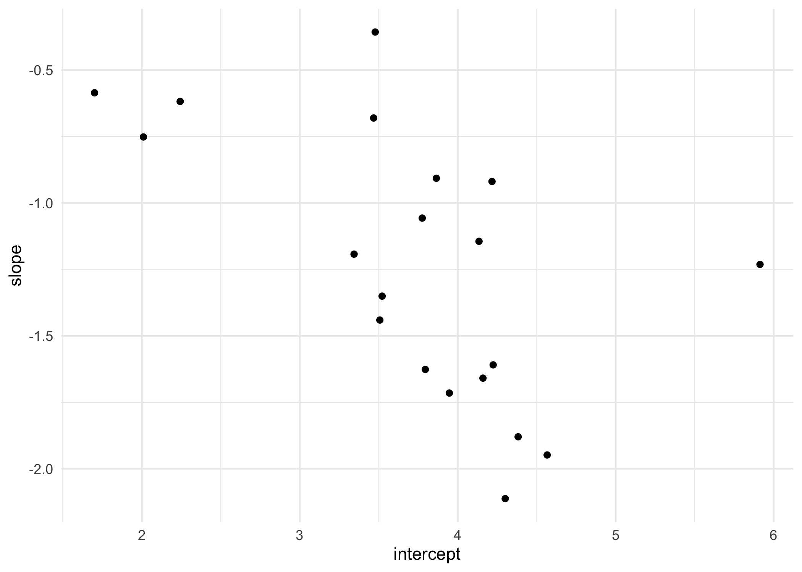
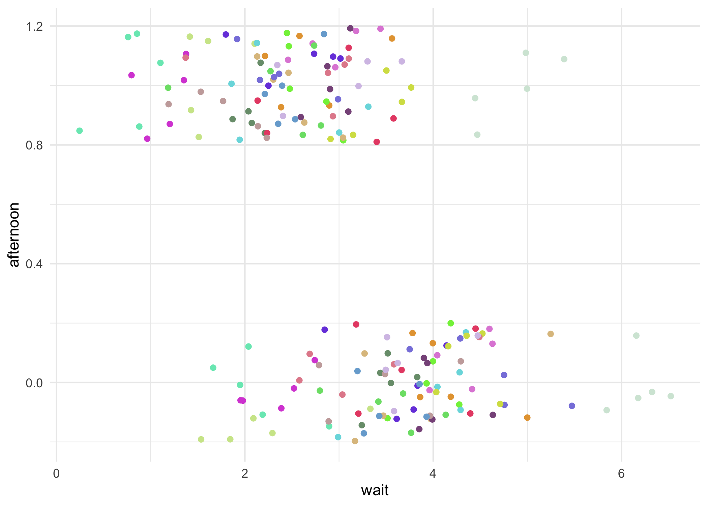
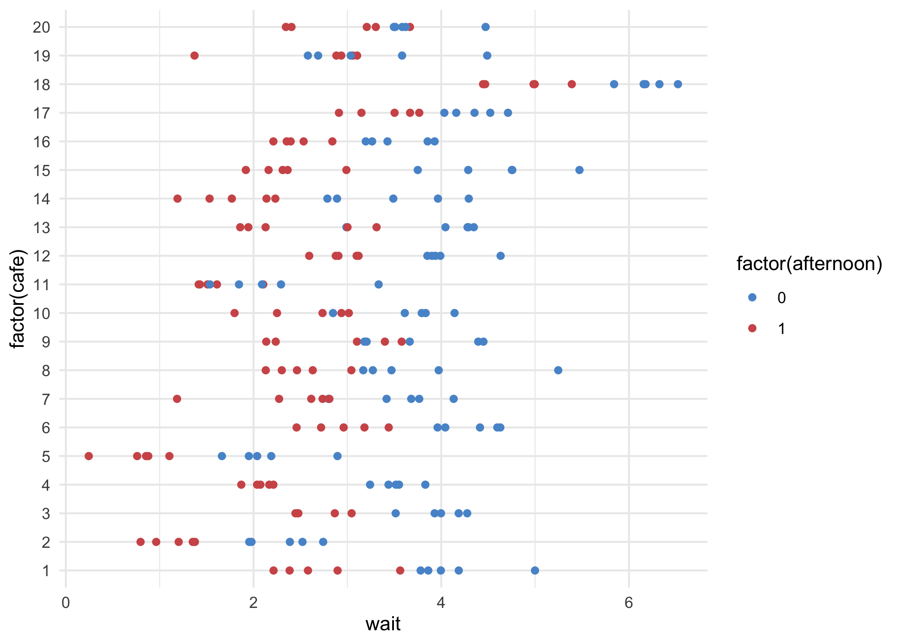
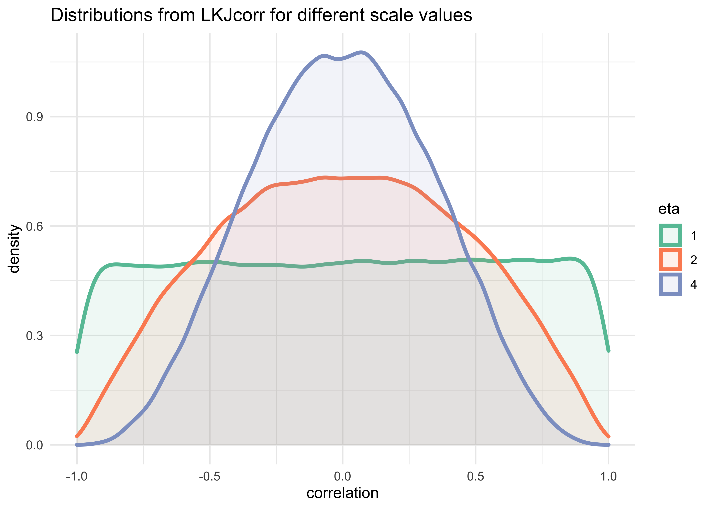
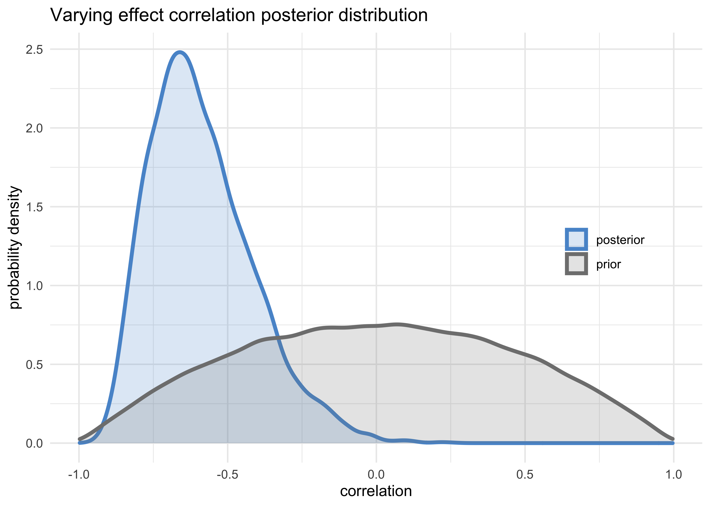
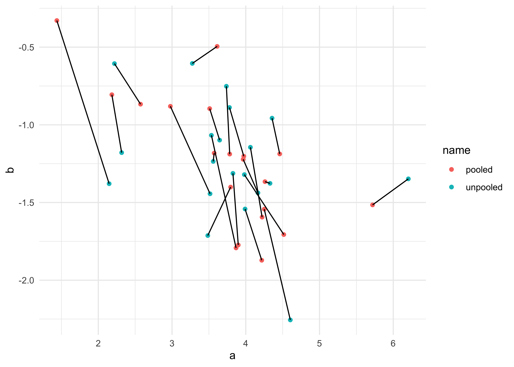
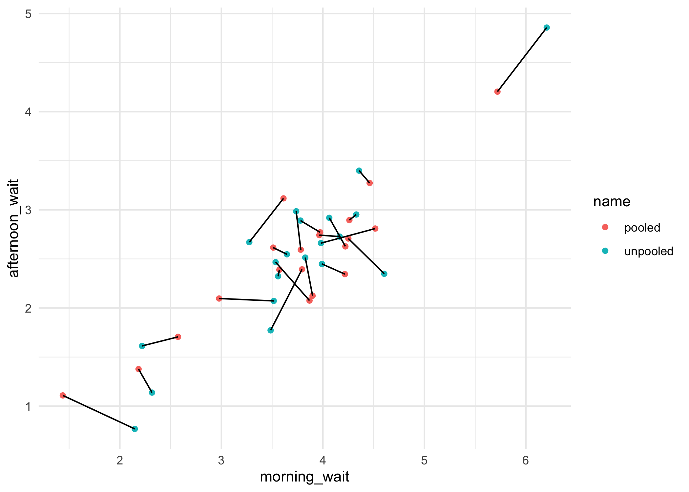

Chapter 13. Adventures in Covariance
================

  - this chapter will show how to specify *varying slopes* in
    combination with varying intercepts
      - enables pooling to improve estimates of how different units
        respond to or are influenced by predictor variables
      - also improves the estimates of intercepts by “borrowing
        information across parameter types”
      - “varying slope models are massive interaction machines”

## 13.1 Varying slopes by construction

  - pool information across intercepts and slopes by modeling the joint
    population of intercepts and slopes
      - modeling their covariance
      - assigning a 2D Gaussian distribution to both the intercepts
        (first dimension) and the slopes (second dimension)
  - the variance-covariance matrix for a fit model describes how each
    parameters posterior probability is associated with one another
      - varying intercepts have variation, varying slopes have
        variation, and intercepts and slopes covary
  - use example of visiting coffee shops:
      - visit different cafes, order a coffee, and record the wait time
          - previously, used varying intercepts, one for each cafe
      - also record the time of day
          - the average wait time is longer in the mornings than
            afternoons because they are busier in the mornings
      - different cafes vary in their average wait times and their
        differences between morning and afternoon
          - the differences in wait time by time of day are the slopes
      - cafes covary in their intercepts and slopes
          - because the popular cafes have much longer wait times in the
            morning leading to large differences between morning and
            afternoon

\[
\mu_i = \alpha_{\text{cafe}[i]} + \beta_{\text{cafe}[i]} A_i
\]

## 13.1.1 Simulate the population

  - define the population of cafes
      - define the average wait time in the morning and afternoon
      - define the correlation between them

<!-- end list -->

``` r
a <- 3.5        # average morning wait time
b <- -1         # average difference afternoon wait time
sigma_a <- 1    # standard deviation in intercepts
sigma_b <- 0.5  # standard deviation in slopes
rho <- -0.7     # correlation between intercepts and slopes
```

  - use these values to simulate a sample of cafes
      - define the multivariate Gaussian with a vecotr of means and a
        2x2 matrix of variances and covariances

<!-- end list -->

``` r
Mu <- c(a, b)  # vector of two means
```

  - the matrix of variances and covariances is arranged as follows

\[
\begin{pmatrix}
\sigma_\alpha^2 & \sigma_\alpha \sigma_\beta \rho \\
\sigma_\alpha \sigma_\beta \rho & \sigma_\beta^2
\end{pmatrix}
\]

  - can construct the matrix explicitly

<!-- end list -->

``` r
cov_ab <- sigma_a * sigma_b * rho
Sigma <- matrix(c(sigma_a^2, cov_ab, cov_ab, sigma_b^2), nrow = 2)
Sigma
```

    ##       [,1]  [,2]
    ## [1,]  1.00 -0.35
    ## [2,] -0.35  0.25

  - another way to build the variance-covariance matrix using matrix
    multiplication
      - this is likely a better approach with larger models

<!-- end list -->

``` r
sigmas <- c(sigma_a, sigma_b)
Rho <- matrix(c(1, rho, rho, 1), nrow = 2)
Sigma <- diag(sigmas) %*% Rho %*% diag(sigmas)
Sigma
```

    ##       [,1]  [,2]
    ## [1,]  1.00 -0.35
    ## [2,] -0.35  0.25

  - now can simulate 20 cafes, each with their own intercept and slope

<!-- end list -->

``` r
N_cafes <- 20
```

  - simulate from a multivariate Gaussian using `mvnorm()` from the
    ‘MASS’ package
      - returns a matrix of
        \(\text{cafe} \times (\text{intercept}, \text{slope})\)

<!-- end list -->

``` r
library(MASS)

set.seed(5)
vary_effects <- mvrnorm(n = N_cafes, mu = Mu, Sigma = Sigma)
head(vary_effects)
```

    ##          [,1]       [,2]
    ## [1,] 4.223962 -1.6093565
    ## [2,] 2.010498 -0.7517704
    ## [3,] 4.565811 -1.9482646
    ## [4,] 3.343635 -1.1926539
    ## [5,] 1.700971 -0.5855618
    ## [6,] 4.134373 -1.1444539

``` r
# Split into separate vectors for ease of use later.
a_cafe <- vary_effects[, 1]
b_cafe <- vary_effects[, 2]
cor(a_cafe, b_cafe)
```

    ## [1] -0.5721537

  - plot of the varying effects

<!-- end list -->

``` r
as.data.frame(vary_effects) %>%
    as_tibble() %>%
    set_names(c("intercept", "slope")) %>%
    ggplot(aes(x = intercept, y = slope)) +
    geom_point()
```

<!-- -->

### 13.1.2 Simulate observations

  - simulate the visits to each cafe
      - 10 visits to each cafe, 5 in the morning and 5 in the afternoon

<!-- end list -->

``` r
N_visits <- 10
afternoon <- rep(0:1, N_visits * N_cafes / 2)
cafe_id <- rep(1:N_cafes, each = N_visits)

# Get the average wait time for each cafe in the morning and afternoon.
mu <- a_cafe[cafe_id] + b_cafe[cafe_id] * afternoon

sigma <- 0.5  # Standard deviation within cafes

# Sample wait times with each cafes unique average wait time per time of day.
wait_times <- rnorm(N_visits*N_cafes, mu, sigma)

d <- tibble(cafe = cafe_id, afternoon, wait = wait_times)
d
```

    ## # A tibble: 200 x 3
    ##     cafe afternoon  wait
    ##    <int>     <int> <dbl>
    ##  1     1         0  5.00
    ##  2     1         1  2.21
    ##  3     1         0  4.19
    ##  4     1         1  3.56
    ##  5     1         0  4.00
    ##  6     1         1  2.90
    ##  7     1         0  3.78
    ##  8     1         1  2.38
    ##  9     1         0  3.86
    ## 10     1         1  2.58
    ## # … with 190 more rows

``` r
d %>%
    ggplot(aes(x = wait, y = afternoon, color = factor(cafe))) +
    geom_jitter(width = 0, height = 0.2) +
    scale_color_manual(values = randomcoloR::distinctColorPalette(N_cafes),
                       guide = FALSE)
```

<!-- -->

``` r
d %>%
    ggplot(aes(x = wait, y = factor(cafe), color = factor(afternoon))) +
    geom_point() +
    scale_color_manual(values = c(blue, red))
```

<!-- -->

### 13.1.3 The varying slopes model

  - model with varying intercepts and slopes (explination follows)

$$ W\_i (\_i, ) \\

*i = *{\[i\]} + \_{\[i\]} A\_i \\

(

,  ) \\

\=

\\

(0,10) \\ (0,10) \\ (0, 1) \\ *(0, 1) \\ *(0, 1) \\  (2) $$

  - the third like defines the population of varying intercepts and
    slopes
      - each cafe has an intercept and slope with a prior distribution
        defined by the 2D Gaussian distribution with means \(\alpha\)
        and \(\beta\) and covariance matrix \(\text{S}\)

\[
\begin{bmatrix}
    \alpha_\text{cafe} \\
    \beta_\text{cafe}
\end{bmatrix} \sim \text{MVNormal}(
    \begin{bmatrix} \alpha \\ \beta \end{bmatrix}, \textbf{S}
)
\]

  - the next line defines the variance-covariance matrix \(\textbf{S}\)
      - factoring it into simple standard deviations \(\sigma_\alpha\)
        and \(\sigma_\beta\) and a correlation matrix \(\textbf{R}\)
      - there are other ways to do this, but this formulation helps
        understand the inferred structure of the varying effects

\[
\textbf{S} = 
\begin{pmatrix} 
    \sigma_\alpha & 0 \\ 0 &\sigma_\beta
\end{pmatrix}
\textbf{R}
\begin{pmatrix} 
    \sigma_\alpha & 0 \\ 0 &\sigma_\beta
\end{pmatrix}
\]

  - the correlation matrix has a prior defined as
    \(\textbf{R} \sim \text{LKJcorr}(2)\)
      - the correlation matrix will have the structure:
        \(\begin{pmatrix} 1 & \rho \\ \rho & 1 \end{pmatrix}\) where
        \(\rho\) is the correlation between the intercepts and slopes
      - with additional varying slopes, there are more correlation
        parameters, but the \(\text{LKJcorr}\) prior will still work
      - the \(\text{LKJcorr}(2)\) prior defines a weakly informative
        prior on \(\rho\) that is skeptical of extreeme correlations
        near -1 and 1
      - it has a single parameter \(\eta\) that controls how “skeptical”
        the prior is of large corrleations
          - if \(\eta=1\), the prior is flat from -1 to 1
          - a large value of \(\eta\) the mass of the distribution moves
            towards 0

<!-- end list -->

``` r
tibble(eta = c(1, 2, 4)) %>%
    mutate(value = map(eta, ~ rlkjcorr(1e5, K = 2, eta = .x)[, 1, 2])) %>%
    unnest(value) %>%
    ggplot(aes(x = value)) +
    geom_density(aes(color = factor(eta), fill = factor(eta)), 
                 size = 1.3, alpha = 0.1) +
    scale_color_brewer(palette = "Set2") +
    scale_fill_brewer(palette = "Set2") +
    labs(x = "correlation",
         y = "density",
         title = "Distributions from LKJcorr for different scale values",
         color = "eta", fill = "eta")
```

<!-- -->

  - now can fit the model

<!-- end list -->

``` r
stash("m13_1", {
    m13_1 <- map2stan(
        alist(
            wait ~ dnorm(mu, sigma),
            mu <- a_cafe[cafe] + b_cafe[cafe]*afternoon,
            c(a_cafe, b_cafe)[cafe] ~ dmvnorm2(c(a, b), sigma_cafe, Rho),
            a ~ dnorm(0, 10),
            b ~ dnorm(0, 10),
            sigma_cafe ~ dcauchy(0, 2),
            sigma ~ dcauchy(0, 2),
            Rho ~ dlkjcorr(2)
        ),
        data = d,
        iter = 5e3, warmup = 2e3, chains = 2
    )
})
```

    ## Loading stashed object.

``` r
precis(m13_1, depth = 1)
```

    ## 46 vector or matrix parameters hidden. Use depth=2 to show them.

    ##             mean         sd      5.5%      94.5%    n_eff     Rhat4
    ## a      3.7411232 0.22805989  3.386143  4.1040327 6673.815 0.9998308
    ## b     -1.2443621 0.13662408 -1.458389 -1.0304374 5965.979 0.9999912
    ## sigma  0.4648216 0.02624559  0.424598  0.5085003 6410.601 0.9999077

  - inspection of the posteior distribution of varying effects
      - start with the posterior correlation between intercepts and
        slopes
          - the posterior distribution of the correlation between
            varying effects is decidedly negative

<!-- end list -->

``` r
post <- extract.samples(m13_1)

tribble(
    ~name, ~value,
    "posterior", post$Rho[, 1, 2],
    "prior", rlkjcorr(1e5, K = 2, eta = 2)[, 1, 2]
) %>%
    unnest(value) %>%
    ggplot(aes(x = value, color = name, fill = name)) +
    geom_density(size = 1.3, alpha = 0.2) +
    scale_color_manual(values = c(blue, grey)) +
    scale_fill_manual(values = c(blue, grey)) +
    theme(legend.title = element_blank(),
          legend.position = c(0.85, 0.5)) +
    labs(x = "correlation",
         y = "probability density",
         title = "Varying effect correlation posterior distribution")
```

<!-- -->

  - consider the shrinkage
      - the inferred correlation between varying effects pooled
        information across them
      - and the inferred variation within each varying effect was pooled
      - together the variances and correlation define a multivariate
        Gaussian prior for the varying effects
      - this prior regularizes the intercepts and slopes
  - plot the posterior mean varying effects
      - compare them to the raw, unpooled estimates
      - also plot the inferred prior for the population of intercepts
        and slopes

> There is something wrong with the following 2 plots, but I cannot
> figure out what went wrong.

``` r
# Raw, unpooled estimates for alpha and beta.
a1 <- map_dbl(1:N_cafes, function(i) {
    mean(d$wait[d$cafe == i & d$afternoon == 0])
})

b1 <- map_dbl(1:N_cafes, function(i) {
    mean(d$wait[d$cafe == i & d$afternoon == 1])
})
b1 <- b1 - a1

# Extract posterior means of partially pooled estimates.
post <- extract.samples(m13_1)
a2 <- apply(post$a_cafe, 2, mean)
b2 <- apply(post$b_cafe, 2, mean)

tribble(
    ~ name, ~ a, ~ b,
    "unpooled", a1, b1,
    "pooled", a2, b2
) %>%
    unnest(c(a, b)) %>%
    group_by(name) %>%
    mutate(cafe = row_number()) %>%
    ungroup() %>%
    ggplot(aes(x = a, y = b)) +
    geom_point(aes(color = name)) +
    geom_line(aes(group = cafe))
```

<!-- -->

  - can do the same for the estimated wait times for each cafe in the
    morning and afternoon

<!-- end list -->

``` r
tribble(
    ~ name, ~ morning_wait, ~ afternoon_wait,
    "unpooled", a1, a1 + b1,
    "pooled", a2, a2 + b2
) %>%
    unnest(c(morning_wait, afternoon_wait)) %>%
    group_by(name) %>%
    mutate(cafe = row_number()) %>%
    ungroup() %>%
    ggplot(aes(x = morning_wait, y = afternoon_wait)) +
    geom_point(aes(color = name)) +
    geom_line(aes(group = cafe))
```

<!-- -->

## 13.2 Example: Admission decisions and gender

  - return to the admissions data and use varying slopes
      - help appreciate how variation in slopes arises
      - and how correlation between intercepts and slopes can provide
        insight into the underlying process
  - from previous models of the `UCBadmit` data:
      - important to have varying means across department otherwise, get
        wrong inference about gender
      - did not account for variation in how departments treat male and
        female applications

<!-- end list -->

``` r
data("UCBadmit")
d <- as_tibble(UCBadmit) %>%
    janitor::clean_names() %>%
    mutate(male = as.numeric(applicant_gender == "male"),
           dept_id = coerce_index(dept))
```

### 13.2.1 Varying intercepts

  - first model with only the varying intercepts

\[
A_i \sim \text{Binomial}(n_i, p_i) \\
\text{logit}(p_i) = \alpha_{\text{dept}[i]} + \beta m_i \\
\alpha_\text{dept} \sim \text{Normal}(\alpha, \sigma) \\
\alpha \sim \text{Normal}(0, 10) \\
\beta \sim \text{Normal}(0, 1) \\
\sigma \sim \text{HalfCauchy}(0, 2) \\
\]

``` r
# m13_2 <- map2stan(
#     alist(
#         admit ~ dbinom(applications, p),
#         logit(p) <- a_dept[dept_id] + bm*bmale,
#         a_dept[dept_id] ~ dnorm(a, sigma_dept),
#         a ~ dnorm(0, 10),
#         bm ~ dnorm(0, 1),
#         sigma_dept ~ dca
#     )
# )
```
