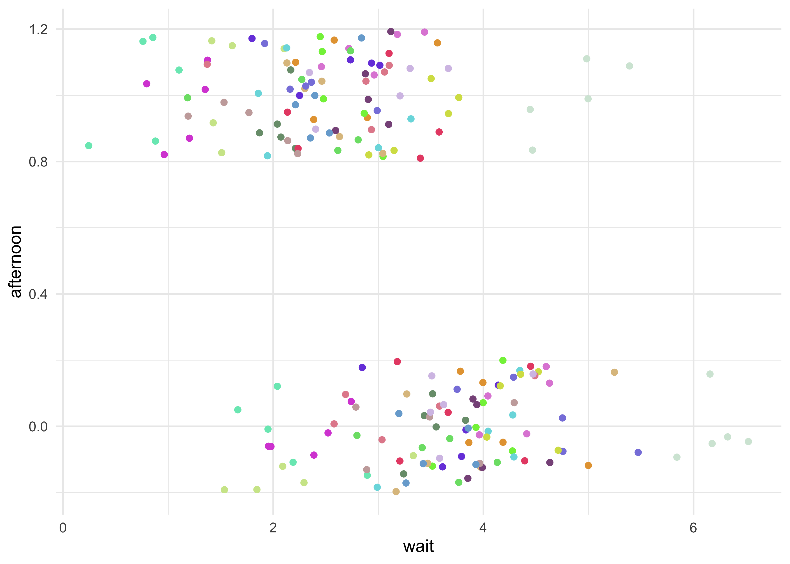
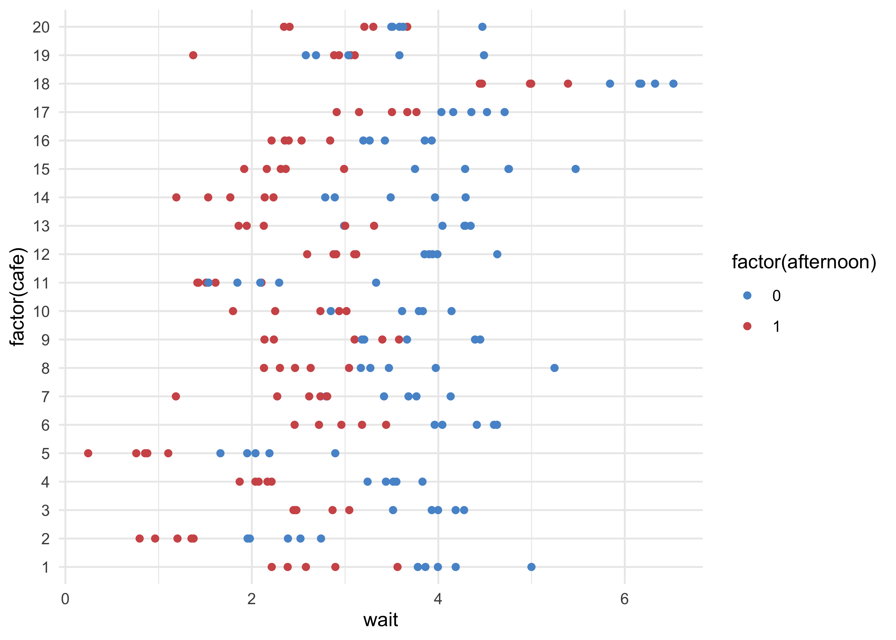
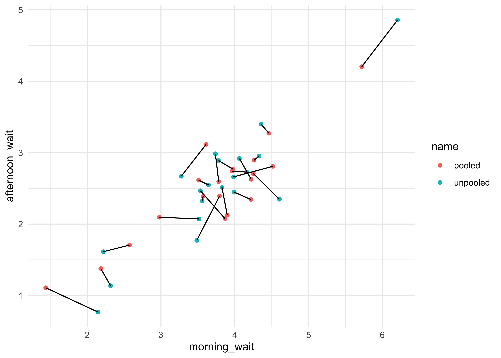
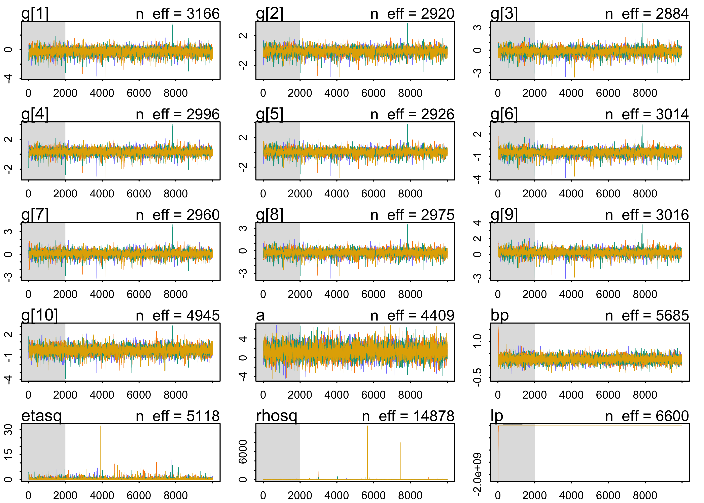

Chapter 13. Adventures in Covariance
================

  - this chapter will show how to specify *varying slopes* in
    combination with varying intercepts
      - enables pooling to improve estimates of how different units
        respond to or are influenced by predictor variables
      - also improves the estimates of intercepts by “borrowing
        information across parameter types”
      - “varying slope models are massive interaction machines”

## 13.1 Varying slopes by construction

  - pool information across intercepts and slopes by modeling the joint
    population of intercepts and slopes
      - modeling their covariance
      - assigning a 2D Gaussian distribution to both the intercepts
        (first dimension) and the slopes (second dimension)
  - the variance-covariance matrix for a fit model describes how each
    parameters posterior probability is associated with one another
      - varying intercepts have variation, varying slopes have
        variation, and intercepts and slopes covary
  - use example of visiting coffee shops:
      - visit different cafes, order a coffee, and record the wait time
          - previously, used varying intercepts, one for each cafe
      - also record the time of day
          - the average wait time is longer in the mornings than
            afternoons because they are busier in the mornings
      - different cafes vary in their average wait times and their
        differences between morning and afternoon
          - the differences in wait time by time of day are the slopes
      - cafes covary in their intercepts and slopes
          - because the popular cafes have much longer wait times in the
            morning leading to large differences between morning and
            afternoon

\[
\mu_i = \alpha_{\text{cafe}[i]} + \beta_{\text{cafe}[i]} A_i
\]

## 13.1.1 Simulate the population

  - define the population of cafes
      - define the average wait time in the morning and afternoon
      - define the correlation between them

<!-- end list -->

``` r
a <- 3.5        # average morning wait time
b <- -1         # average difference afternoon wait time
sigma_a <- 1    # standard deviation in intercepts
sigma_b <- 0.5  # standard deviation in slopes
rho <- -0.7     # correlation between intercepts and slopes
```

  - use these values to simulate a sample of cafes
      - define the multivariate Gaussian with a vector of means and a
        2x2 matrix of variances and covariances

<!-- end list -->

``` r
Mu <- c(a, b)  # vector of two means
```

  - the matrix of variances and covariances is arranged as follows

\[
\begin{pmatrix}
\sigma_\alpha^2 & \sigma_\alpha \sigma_\beta \rho \\
\sigma_\alpha \sigma_\beta \rho & \sigma_\beta^2
\end{pmatrix}
\]

  - can construct the matrix explicitly

<!-- end list -->

``` r
cov_ab <- sigma_a * sigma_b * rho
Sigma <- matrix(c(sigma_a^2, cov_ab, cov_ab, sigma_b^2), nrow = 2)
Sigma
```

    #>       [,1]  [,2]
    #> [1,]  1.00 -0.35
    #> [2,] -0.35  0.25

  - another way to build the variance-covariance matrix using matrix
    multiplication
      - this is likely a better approach with larger models

<!-- end list -->

``` r
sigmas <- c(sigma_a, sigma_b)
Rho <- matrix(c(1, rho, rho, 1), nrow = 2)
Sigma <- diag(sigmas) %*% Rho %*% diag(sigmas)
Sigma
```

    #>       [,1]  [,2]
    #> [1,]  1.00 -0.35
    #> [2,] -0.35  0.25

  - now can simulate 20 cafes, each with their own intercept and slope

<!-- end list -->

``` r
N_cafes <- 20
```

  - simulate from a multivariate Gaussian using `mvnorm()` from the
    ‘MASS’ package
      - returns a matrix of
        \(\text{cafe} \times (\text{intercept}, \text{slope})\)

<!-- end list -->

``` r
library(MASS)

set.seed(5)
vary_effects <- mvrnorm(n = N_cafes, mu = Mu, Sigma = Sigma)
head(vary_effects)
```

    #>          [,1]       [,2]
    #> [1,] 4.223962 -1.6093565
    #> [2,] 2.010498 -0.7517704
    #> [3,] 4.565811 -1.9482646
    #> [4,] 3.343635 -1.1926539
    #> [5,] 1.700971 -0.5855618
    #> [6,] 4.134373 -1.1444539

``` r
# Split into separate vectors for ease of use later.
a_cafe <- vary_effects[, 1]
b_cafe <- vary_effects[, 2]
cor(a_cafe, b_cafe)
```

    #> [1] -0.5721537

  - plot of the varying effects

<!-- end list -->

``` r
as.data.frame(vary_effects) %>%
    as_tibble() %>%
    set_names(c("intercept", "slope")) %>%
    ggplot(aes(x = intercept, y = slope)) +
    geom_point()
```

<!-- -->

### 13.1.2 Simulate observations

  - simulate the visits to each cafe
      - 10 visits to each cafe, 5 in the morning and 5 in the afternoon

<!-- end list -->

``` r
N_visits <- 10
afternoon <- rep(0:1, N_visits * N_cafes / 2)
cafe_id <- rep(1:N_cafes, each = N_visits)

# Get the average wait time for each cafe in the morning and afternoon.
mu <- a_cafe[cafe_id] + b_cafe[cafe_id] * afternoon

sigma <- 0.5  # Standard deviation within cafes

# Sample wait times with each cafes unique average wait time per time of day.
wait_times <- rnorm(N_visits*N_cafes, mu, sigma)

d <- tibble(cafe = cafe_id, afternoon, wait = wait_times)
d
```

    #> # A tibble: 200 x 3
    #>     cafe afternoon  wait
    #>    <int>     <int> <dbl>
    #>  1     1         0  5.00
    #>  2     1         1  2.21
    #>  3     1         0  4.19
    #>  4     1         1  3.56
    #>  5     1         0  4.00
    #>  6     1         1  2.90
    #>  7     1         0  3.78
    #>  8     1         1  2.38
    #>  9     1         0  3.86
    #> 10     1         1  2.58
    #> # … with 190 more rows

``` r
d %>%
    ggplot(aes(x = wait, y = afternoon, color = factor(cafe))) +
    geom_jitter(width = 0, height = 0.2) +
    scale_color_manual(values = randomcoloR::distinctColorPalette(N_cafes),
                       guide = FALSE)
```

<!-- -->

``` r
d %>%
    ggplot(aes(x = wait, y = factor(cafe), color = factor(afternoon))) +
    geom_point() +
    scale_color_manual(values = c(blue, red))
```

<!-- -->

### 13.1.3 The varying slopes model

  - model with varying intercepts and slopes (explanation follows)

$$ W\_i (\_i, ) \\

*i = *{\[i\]} + \_{\[i\]} A\_i \\

(

,  ) \\

\=

\\

(0,10) \\ (0,10) \\ (0, 1) \\ *(0, 1) \\ *(0, 1) \\  (2) $$

  - the third like defines the population of varying intercepts and
    slopes
      - each cafe has an intercept and slope with a prior distribution
        defined by the 2D Gaussian distribution with means \(\alpha\)
        and \(\beta\) and covariance matrix \(\text{S}\)

\[
\begin{bmatrix}
    \alpha_\text{cafe} \\
    \beta_\text{cafe}
\end{bmatrix} \sim \text{MVNormal}(
    \begin{bmatrix} \alpha \\ \beta \end{bmatrix}, \textbf{S}
)
\]

  - the next line defines the variance-covariance matrix \(\textbf{S}\)
      - factoring it into simple standard deviations \(\sigma_\alpha\)
        and \(\sigma_\beta\) and a correlation matrix \(\textbf{R}\)
      - there are other ways to do this, but this formulation helps
        understand the inferred structure of the varying effects

\[
\textbf{S} = 
\begin{pmatrix} 
    \sigma_\alpha & 0 \\ 0 &\sigma_\beta
\end{pmatrix}
\textbf{R}
\begin{pmatrix} 
    \sigma_\alpha & 0 \\ 0 &\sigma_\beta
\end{pmatrix}
\]

  - the correlation matrix has a prior defined as
    \(\textbf{R} \sim \text{LKJcorr}(2)\)
      - the correlation matrix will have the structure:
        \(\begin{pmatrix} 1 & \rho \\ \rho & 1 \end{pmatrix}\) where
        \(\rho\) is the correlation between the intercepts and slopes
      - with additional varying slopes, there are more correlation
        parameters, but the \(\text{LKJcorr}\) prior will still work
      - the \(\text{LKJcorr}(2)\) prior defines a weakly informative
        prior on \(\rho\) that is skeptical of extreme correlations near
        -1 and 1
      - it has a single parameter \(\eta\) that controls how “skeptical”
        the prior is of large correlations
          - if \(\eta=1\), the prior is flat from -1 to 1
          - a large value of \(\eta\) the mass of the distribution moves
            towards 0

<!-- end list -->

``` r
tibble(eta = c(1, 2, 4)) %>%
    mutate(value = map(eta, ~ rlkjcorr(1e5, K = 2, eta = .x)[, 1, 2])) %>%
    unnest(value) %>%
    ggplot(aes(x = value)) +
    geom_density(aes(color = factor(eta), fill = factor(eta)), 
                 size = 1.3, alpha = 0.1) +
    scale_color_brewer(palette = "Set2") +
    scale_fill_brewer(palette = "Set2") +
    labs(x = "correlation",
         y = "density",
         title = "Distributions from LKJcorr for different scale values",
         color = "eta", fill = "eta")
```

<!-- -->

  - now can fit the model

<!-- end list -->

``` r
stash("m13_1", {
    m13_1 <- map2stan(
        alist(
            wait ~ dnorm(mu, sigma),
            mu <- a_cafe[cafe] + b_cafe[cafe]*afternoon,
            c(a_cafe, b_cafe)[cafe] ~ dmvnorm2(c(a, b), sigma_cafe, Rho),
            a ~ dnorm(0, 10),
            b ~ dnorm(0, 10),
            sigma_cafe ~ dcauchy(0, 2),
            sigma ~ dcauchy(0, 2),
            Rho ~ dlkjcorr(2)
        ),
        data = d,
        iter = 5e3, warmup = 2e3, chains = 2
    )
})
```

    #> Loading stashed object.

``` r
precis(m13_1, depth = 1)
```

    #> 46 vector or matrix parameters hidden. Use depth=2 to show them.

    #>             mean         sd      5.5%      94.5%    n_eff     Rhat4
    #> a      3.7411232 0.22805989  3.386143  4.1040327 6673.815 0.9998308
    #> b     -1.2443621 0.13662408 -1.458389 -1.0304374 5965.979 0.9999912
    #> sigma  0.4648216 0.02624559  0.424598  0.5085003 6410.601 0.9999077

  - inspection of the posterior distribution of varying effects
      - start with the posterior correlation between intercepts and
        slopes
          - the posterior distribution of the correlation between
            varying effects is decidedly negative

<!-- end list -->

``` r
post <- extract.samples(m13_1)

tribble(
    ~name, ~value,
    "posterior", post$Rho[, 1, 2],
    "prior", rlkjcorr(1e5, K = 2, eta = 2)[, 1, 2]
) %>%
    unnest(value) %>%
    ggplot(aes(x = value, color = name, fill = name)) +
    geom_density(size = 1.3, alpha = 0.2) +
    scale_color_manual(values = c(blue, grey)) +
    scale_fill_manual(values = c(blue, grey)) +
    theme(legend.title = element_blank(),
          legend.position = c(0.85, 0.5)) +
    labs(x = "correlation",
         y = "probability density",
         title = "Varying effect correlation posterior distribution")
```

<!-- -->

  - consider the shrinkage
      - the inferred correlation between varying effects pooled
        information across them
      - and the inferred variation within each varying effect was pooled
      - together the variances and correlation define a multivariate
        Gaussian prior for the varying effects
      - this prior regularizes the intercepts and slopes
  - plot the posterior mean varying effects
      - compare them to the raw, unpooled estimates
      - also plot the inferred prior for the population of intercepts
        and slopes

> There is something wrong with the following 2 plots, but I cannot
> figure out what went wrong.

``` r
# Raw, unpooled estimates for alpha and beta.
a1 <- map_dbl(1:N_cafes, function(i) {
    mean(d$wait[d$cafe == i & d$afternoon == 0])
})

b1 <- map_dbl(1:N_cafes, function(i) {
    mean(d$wait[d$cafe == i & d$afternoon == 1])
})
b1 <- b1 - a1

# Extract posterior means of partially pooled estimates.
post <- extract.samples(m13_1)
a2 <- apply(post$a_cafe, 2, mean)
b2 <- apply(post$b_cafe, 2, mean)

tribble(
    ~ name, ~ a, ~ b,
    "unpooled", a1, b1,
    "pooled", a2, b2
) %>%
    unnest(c(a, b)) %>%
    group_by(name) %>%
    mutate(cafe = row_number()) %>%
    ungroup() %>%
    ggplot(aes(x = a, y = b)) +
    geom_point(aes(color = name)) +
    geom_line(aes(group = cafe))
```

<!-- -->

  - can do the same for the estimated wait times for each cafe in the
    morning and afternoon

<!-- end list -->

``` r
tribble(
    ~ name, ~ morning_wait, ~ afternoon_wait,
    "unpooled", a1, a1 + b1,
    "pooled", a2, a2 + b2
) %>%
    unnest(c(morning_wait, afternoon_wait)) %>%
    group_by(name) %>%
    mutate(cafe = row_number()) %>%
    ungroup() %>%
    ggplot(aes(x = morning_wait, y = afternoon_wait)) +
    geom_point(aes(color = name)) +
    geom_line(aes(group = cafe))
```

<!-- -->

## 13.2 Example: Admission decisions and gender

  - return to the admissions data and use varying slopes
      - help appreciate how variation in slopes arises
      - and how correlation between intercepts and slopes can provide
        insight into the underlying process
  - from previous models of the `UCBadmit` data:
      - important to have varying means across department otherwise, get
        wrong inference about gender
      - did not account for variation in how departments treat male and
        female applications

<!-- end list -->

``` r
data("UCBadmit")
d <- as_tibble(UCBadmit) %>%
    janitor::clean_names() %>%
    mutate(male = as.numeric(applicant_gender == "male"),
           dept_id = coerce_index(dept))
```

### 13.2.1 Varying intercepts

  - first model with only the varying intercepts

\[
A_i \sim \text{Binomial}(n_i, p_i) \\
\text{logit}(p_i) = \alpha_{\text{dept}[i]} + \beta m_i \\
\alpha_\text{dept} \sim \text{Normal}(\alpha, \sigma) \\
\alpha \sim \text{Normal}(0, 10) \\
\beta \sim \text{Normal}(0, 1) \\
\sigma \sim \text{HalfCauchy}(0, 2) \\
\]

``` r
stash("m13_2", {
    m13_2 <- map2stan(
        alist(
            admit ~ dbinom(applications, p),
            logit(p) <- a_dept[dept_id] + bm*male,
            a_dept[dept_id] ~ dnorm(a, sigma_dept),
            a ~ dnorm(0, 10),
            bm ~ dnorm(0, 1),
            sigma_dept ~ dcauchy(0, 2)
        ),
        data = d,
        warmup = 500, iter = 4500, chains = 3
    )
})
```

    #> Loading stashed object.

``` r
precis(m13_2, depth = 2)
```

    #>                   mean         sd       5.5%       94.5%     n_eff     Rhat4
    #> a_dept[1]   0.67633553 0.09912824  0.5172706  0.83647836  7434.742 0.9998820
    #> a_dept[2]   0.62865617 0.11487786  0.4462060  0.81244427  7451.327 0.9999420
    #> a_dept[3]  -0.58407578 0.07381761 -0.7037524 -0.46666875  9691.393 1.0000113
    #> a_dept[4]  -0.61607540 0.08473505 -0.7513828 -0.47998152  8592.307 0.9998870
    #> a_dept[5]  -1.05883405 0.09832475 -1.2173306 -0.90286742 12118.564 0.9999736
    #> a_dept[6]  -2.60914320 0.15654731 -2.8607355 -2.36390139 10442.752 1.0000161
    #> a          -0.61042302 0.67864636 -1.6337291  0.40209932  5772.182 1.0004375
    #> bm         -0.09471168 0.08101324 -0.2257535  0.03522607  5929.314 1.0000314
    #> sigma_dept  1.49095940 0.58217912  0.8576455  2.52329901  5681.029 1.0003271

  - interpretation
      - effect of male is similar that found in Chapter 10 (“Counting
        and Classification”)
          - the intercept is effectively uninteresting, if perhaps
            slightly negative
      - because we included the global mean \(\alpha\) in the prior for
        the varying intercepts, the `a_dept[i]` values are all
        deviations from `a`

### 13.2.2 Varying effects of being male

  - now we can consider the variation in gender bias among departments
      - use varying slopes
  - the data is *imbalanced*
      - the sample sizes vary a lot across departments
      - pooling will have a stronger effect for cases with fewer
        applicants

$$ A\_i (n\_i, p\_i) \\ (p\_i) = *{\[i\]} + *{\[i\]} m\_i \\

(

, ) \\

(0, 10) \\ (0, 1) \\

\=

\\

(*, *) (0, 2) \\  (2) $$

``` r
stash("m13_3", {
    m13_3 <- map2stan(
        alist(
            admit ~ dbinom(applications, p),
            logit(p) <- a_dept[dept_id] + bm_dept[dept_id]*male,
            c(a_dept, bm_dept)[dept_id] ~ dmvnorm2(c(a, bm), sigma_dept, Rho),
            a ~ dnorm(0, 10),
            bm ~ dnorm(0, 1),
            sigma_dept ~ dcauchy(0, 2),
            Rho ~ dlkjcorr(2)
        ),
        data = d,
        warmup = 1e3, iter = 5e3, chains = 4
    )
})
```

    #> Loading stashed object.

``` r
precis(m13_3, depth = 2)
```

    #> 4 matrix parameters hidden. Use depth=3 to show them.

    #>                      mean         sd       5.5%      94.5%     n_eff     Rhat4
    #> bm_dept[1]    -0.79410911 0.26621581 -1.2314113 -0.3769640  7777.776 1.0001133
    #> bm_dept[2]    -0.21452957 0.32827223 -0.7442305  0.2976597  7706.047 1.0002087
    #> bm_dept[3]     0.08210299 0.13916525 -0.1436567  0.3047949 14294.571 1.0001411
    #> bm_dept[4]    -0.09107295 0.14166835 -0.3189406  0.1369298 12245.517 1.0003159
    #> bm_dept[5]     0.12616695 0.18522579 -0.1659927  0.4251783 13979.943 0.9998708
    #> bm_dept[6]    -0.12371601 0.26875987 -0.5601516  0.3021377 11343.429 1.0000722
    #> a_dept[1]      1.30684485 0.25312427  0.9145892  1.7201724  7768.113 1.0000828
    #> a_dept[2]      0.74419573 0.32704100  0.2349881  1.2721056  7974.643 1.0001940
    #> a_dept[3]     -0.64703547 0.08559338 -0.7820730 -0.5101126 15352.790 1.0001005
    #> a_dept[4]     -0.61945023 0.10575932 -0.7888304 -0.4512668 12336.691 1.0001413
    #> a_dept[5]     -1.13473049 0.11377576 -1.3178663 -0.9556382 14357.673 0.9999653
    #> a_dept[6]     -2.60003282 0.19884720 -2.9234768 -2.2882146 13404.431 1.0000262
    #> a             -0.50152540 0.73756490 -1.6147961  0.6207689  8686.590 1.0001169
    #> bm            -0.16333123 0.23571418 -0.5286623  0.1998200  8991.565 1.0000629
    #> sigma_dept[1]  1.68379712 0.65077176  0.9809923  2.7911987  7190.902 1.0000942
    #> sigma_dept[2]  0.50115741 0.25052608  0.2116896  0.9321738  7771.766 1.0003994

  - focus on what the addition of varying slopes has revealed
      - plot below shows marginal posterior distributions for the
        varying effects
      - the intercepts are quite varied, but the slopes are all quite
        close to 0
          - suggests that the departments had different rates of
            admissions, but none discriminated between male and females
          - one standout is the slope for department 1 which suggests
            some bias against females
              - department 1 also has the largest intercept, so look
                into the correlation between slopes and intercepts next

<!-- end list -->

``` r
plot(precis(m13_3, pars = c("a_dept", "bm_dept"), depth = 2))
```

<!-- -->

### 13.2.3 Shrinkage

  - following plot shows the posterior distribution for the correlation
    between slope and intercept
      - negative correlation: the higher the admissions rate, the lower
        the slope

<!-- end list -->

``` r
post <- extract.samples(m13_3)
tibble(posterior_rho = post$Rho[, 1, 2]) %>%
    ggplot(aes(x = posterior_rho)) +
    geom_density(size = 1.3, color = dark_grey, fill = grey, alpha = 0.2) +
    scale_x_continuous(expand = expansion(mult = c(0, 0))) +
    scale_y_continuous(expand = expansion(mult = c(0, 0.02))) +
    labs(x = "correlation",
         y = "density",
         title = "Correlation of varying slopes and intercepts")
```

<!-- -->

13.2.4 Model comparison

  - also fit a model that ignores gender for purposes of comparison

<!-- end list -->

``` r
stash("m13_4", {
    m13_4 <- map2stan(
        alist(
            admit ~ dbinom(applications, p),
            logit(p) <- a_dept[dept_id],
            a_dept[dept_id] ~ dnorm(a, sigma_dept),
            a ~ dnorm(0, 10),
            sigma_dept ~ dcauchy(0, 2)
        ),
        data = d,
        warmup = 500, iter = 4500, chains = 3
    )
})
```

    #> Loading stashed object.

``` r
compare(m13_2, m13_3, m13_4)
```

    #>           WAIC       SE    dWAIC      dSE     pWAIC      weight
    #> m13_3 5190.940 57.26937  0.00000       NA 11.094350 0.987737123
    #> m13_4 5200.945 56.84874 10.00469 6.820917  5.939283 0.006639735
    #> m13_2 5201.277 56.93248 10.33705 6.516639  6.864329 0.005623142

  - interpretation:
      - the model with no slope for differences in gender `m13_4`
        performs the same out-of-sample performance as the model with a
        single slope for a constant effect of gender `m13_2`
      - the model with varying slopes suggests that even though the
        slope is near zero, it is worth modeling as a separate
        distribution

## 13.3 Example: Cross-classified chimpanzees with varying slopes

  - use chimpanzee data to model multiple varying intercepts and/or
    slopes
      - varying intercepts for `actor` and `block`
      - varying slopes for prosocial option and the interaction between
        prosocial and the presence of another chimpanzee
  - *non-centered parameterization* (see later for explanation and
    example)
      - there are always several ways to formulate a model that are
        mathematically equivalent
      - however, they can result in different sampling results, so the
        parameterization is part of the model
  - cross-classified varying slopes model
      - use multiple linear models to compartmentalize sub-models for
        the intercepts and each slope
      - \(\mathcal{A}_i\), \(\mathcal{B}_{P,i}\), and
        \(\mathcal{B}_{PC,i}\) are the sub-models

\[
L_i \sim \text{Binomial}(1, p_i) \\
\text{logit}(p_i) = \mathcal{A}_i + (\mathcal{B}_{p,i} + \mathcal{B}_{PC,i} C_i) P_i \\
\mathcal{A}_i = \alpha + \alpha_{\text{actor}[i]} + \alpha_{\text{block}[i]} \\
\mathcal{B}_{P,i} = \beta_P + \beta_{P,\text{actor}[i]} + \beta_{P,\text{block}[i]} \\
\mathcal{B}_{PC,i} = \beta_P + \beta_{PC,\text{actor}[i]} + \beta_{PC,\text{block}[i]} \\
\]

  - below is the formulation for the multivariate priors
      - one multivariate Gaussian per cluster of the data (`actor` and
        `block`)
      - for this model, each is 3D, one for each variable in the model
          - this can be adjusted to have different varying effects in
            different cluster types
      - these priors state that the actors and blocks come from
        different statistical populations
          - within each, three features for each actor or block are
            related through a covariance matrix for the population
            (\(\textbf{S}\))
          - the mean for each prior is 0 because there is an average
            value in the linear models already (\(\alpha\), \(\beta_P\),
            and \(\beta_{PC,i}\))

$$

\\

$$

``` r
data("chimpanzees")
d <- as_tibble(chimpanzees) %>%
    select(-recipient) %>%
    rename(block_id = block)

stash("m13_6", {
    m13_6 <- map2stan(
        alist(
            pulled_left ~ dbinom(1, p),
            logit(p) <- A + (BP + BPC*condition) * prosoc_left,
            A <- a + a_actor[actor] + a_block[block_id],
            BP <- bp + bp_actor[actor] + bp_block[block_id],
            BPC <- bpc + bpc_actor[actor] + bpc_block[block_id],
            
            c(a_actor, bp_actor, bpc_actor)[actor] ~ dmvnorm2(0, sigma_actor, Rho_actor),
            c(a_block, bp_block, bpc_block)[block_id] ~ dmvnorm2(0, sigma_block, Rho_block),
            
            c(a, bp, bpc) ~ dnorm(0, 1),
            sigma_actor ~ dcauchy(0, 2),
            sigma_block ~ dcauchy(0, 2),
            Rho_actor ~ dlkjcorr(4),
            Rho_block ~ dlkjcorr(4)
        ),
        data = d,
        iter = 5e3, warmup = 1e3, chains = 3
    )
})
```

    #> Loading stashed object.

``` r
precis(m13_6, depth = 1)
```

    #> 63 vector or matrix parameters hidden. Use depth=2 to show them.

    #>            mean        sd        5.5%     94.5%    n_eff    Rhat4
    #> a    0.23573453 0.6666099 -0.90821904 1.2611100  934.458 1.001440
    #> bp   0.70892674 0.4052890  0.05423901 1.3312395 3817.263 1.000350
    #> bpc -0.03931986 0.4317621 -0.68617116 0.6610651 2216.997 1.001548

  - there was an issue with the HMC sampling
      - can often just do more sampling to get over it, but other times
        the chains may not converge
      - this is where *non-centered parameterization* can help

> In map2stan(alist(pulled\_left \~ dbinom(1, p), logit(p) \<- A + (BP +
> : There were 559 divergent iterations during sampling. Check the
> chains (trace plots, n\_eff, Rhat) carefully to ensure they are valid.

  - use *non-centered parameterization* to help with potentially
    diverging chains
      - use an alternative parameterization of the model using
        `dmvnormNC()`
      - mathematically equivalent to the first

<!-- end list -->

``` r
stash("m13_6nc", {
    m13_6nc <- map2stan(
        alist(
            pulled_left ~ dbinom(1, p),
            logit(p) <- A + (BP + BPC*condition) * prosoc_left,
            A <- a + a_actor[actor] + a_block[block_id],
            BP <- bp + bp_actor[actor] + bp_block[block_id],
            BPC <- bpc + bpc_actor[actor] + bpc_block[block_id],
            
            c(a_actor, bp_actor, bpc_actor)[actor] ~ dmvnormNC(sigma_actor, Rho_actor),
            c(a_block, bp_block, bpc_block)[block_id] ~ dmvnormNC(sigma_block, Rho_block),
            
            c(a, bp, bpc) ~ dnorm(0, 1),
            sigma_actor ~ dcauchy(0, 2),
            sigma_block ~ dcauchy(0, 2),
            Rho_actor ~ dlkjcorr(4),
            Rho_block ~ dlkjcorr(4)
        ),
        data = d,
        iter = 5e3, warmup = 1e3, chains = 3
    )
})
```

    #> Loading stashed object.

``` r
precis(m13_6nc, depth = 1)
```

    #> 120 vector or matrix parameters hidden. Use depth=2 to show them.

    #>            mean        sd       5.5%     94.5%     n_eff     Rhat4
    #> a    0.25351038 0.6573804 -0.7999981 1.2938998  4714.341 1.0005064
    #> bp   0.71776740 0.4010091  0.0716376 1.3317852 10602.170 1.0003175
    #> bpc -0.02295208 0.4303382 -0.6776100 0.6685359 11206.151 0.9999246

  - the non-centered parameterization helped by sampling faster and more
    effectively

<!-- end list -->

``` r
get_neff <- function(mdl, depth) {
    x <- precis(mdl, depth = depth)
    neff_idx <- which(x@names == "n_eff")
    x@.Data[neff_idx]
}

tibble(m13_6 = get_neff(m13_6, depth = 2),
       m13_6nc = get_neff(m13_6nc, depth = 2)) %>%
    pivot_longer(tidyselect::everything()) %>%
    unnest(value) %>%
    ggplot(aes(name, value)) +
    geom_boxplot(outlier.shape = NA) +
    ggbeeswarm::geom_quasirandom(color = grey, size = 2, alpha = 0.8) +
    labs(x = "model",
         y = "effective samples")
```

    #> 18 matrix parameters hidden. Use depth=3 to show them.

    #> 75 matrix parameters hidden. Use depth=3 to show them.

<!-- -->

  - can see the number of effective parameters is much smaller than the
    real number

<!-- end list -->

``` r
WAIC(m13_6nc)
```

    #>       WAIC     lppd  penalty  std_err
    #> 1 534.7752 -249.032 18.35563 19.88306

  - the standard deviation parameters of the random effects provides a
    measure of how much regularization was applied
      - the first index for each sigma is the varying intercept standard
        deviation while the other two are the slopes
      - the values are pretty small suggesting there was a good amount
        of shrinkage

<!-- end list -->

``` r
precis(m13_6nc, depth = 2, pars = c("sigma_actor", "sigma_block"))
```

    #>                     mean        sd       5.5%    94.5%    n_eff    Rhat4
    #> sigma_actor[1] 2.3327748 0.9056939 1.31285970 3.952849 5816.898 1.000055
    #> sigma_actor[2] 0.4537137 0.3627789 0.04461175 1.098381 7510.460 1.000236
    #> sigma_actor[3] 0.5205115 0.4761865 0.03924063 1.385698 7414.251 1.000002
    #> sigma_block[1] 0.2295740 0.2077322 0.01855211 0.598803 7343.314 1.000648
    #> sigma_block[2] 0.5716266 0.4057379 0.07362251 1.274700 4560.184 1.000127
    #> sigma_block[3] 0.5032187 0.4180730 0.04109647 1.243568 7119.573 1.000062

  - compare the varying slopes model to the simpler varying intercepts
    model from the previous chapter
      - the results indicate that there isn’t too much difference
        between the two models
      - meaning there isn’t much difference in the slopes between
        `actor` nor `block`

<!-- end list -->

``` r
stash("m12_5", {
    m12_5 <- map2stan(
        alist(
            pulled_left ~ dbinom(1, p),
            logit(p) <- a + a_actor[actor] + a_block[block_id] + (bp + bpc*condition)*prosoc_left,
            a_actor[actor] ~ dnorm(0, sigma_actor),
            a_block[block_id] ~ dnorm(0, sigma_block),
            a ~ dnorm(0, 10),
            bp ~ dnorm(0, 10),
            bpc ~ dnorm(0, 10),
            sigma_actor ~ dcauchy(0, 1),
            sigma_block ~ dcauchy(0, 1)
        ),
        data = d,
        warmup = 1e3,
        iter = 6e3,
        chains = 4
    )
})
```

    #> Loading stashed object.

``` r
compare(m13_6nc, m12_5)
```

    #>             WAIC       SE  dWAIC      dSE    pWAIC    weight
    #> m12_5   532.4494 19.66977 0.0000       NA 10.29711 0.7618593
    #> m13_6nc 534.7752 19.88306 2.3258 4.070507 18.35563 0.2381407

## 13.4 Continuous categories and the Gaussian process

  - so far, all varying intercepts and slopes were defined over
    discrete, unordered categories
      - now learn how to use continuous dimensions of variation
          - e.g.: age, income, social standing
  - *Gaussian process regression*: method for applying a varying effect
    to continuous categories
      - estimates a unique intercept/slope for any value in the variable
        and applies shrinkage to these values
      - simple outline of the process:
          - calculate differences between all data points in the
            category
          - the model estimates a function for the covariance between
            pairs of cases at each distance
          - the coviariance function is the generalization of the
            varying effects approach to continuous categories

### 13.4.1 Example: Spatial autocorrelation in Oceanic tools

  - in previous modeling of the Oceanic societies data, used a binary
    contact predictor
      - want to make a model that keeps this as a continuous variable
      - many reasons why islands near each other would have similar
        tools
  - the process:
      - define a distance matrix among the societies
      - then estimate how similarity in tool counts depends on
        geographic distance

<!-- end list -->

``` r
data("islandsDistMatrix")
Dmat <- islandsDistMatrix
colnames(Dmat) <- c("Ml","Tiv","SC","Ya","Fi","Tr","Ch","Mn","To","Ha")
round(Dmat, 1)
```

    #>             Ml Tiv  SC  Ya  Fi  Tr  Ch  Mn  To  Ha
    #> Malekula   0.0 0.5 0.6 4.4 1.2 2.0 3.2 2.8 1.9 5.7
    #> Tikopia    0.5 0.0 0.3 4.2 1.2 2.0 2.9 2.7 2.0 5.3
    #> Santa Cruz 0.6 0.3 0.0 3.9 1.6 1.7 2.6 2.4 2.3 5.4
    #> Yap        4.4 4.2 3.9 0.0 5.4 2.5 1.6 1.6 6.1 7.2
    #> Lau Fiji   1.2 1.2 1.6 5.4 0.0 3.2 4.0 3.9 0.8 4.9
    #> Trobriand  2.0 2.0 1.7 2.5 3.2 0.0 1.8 0.8 3.9 6.7
    #> Chuuk      3.2 2.9 2.6 1.6 4.0 1.8 0.0 1.2 4.8 5.8
    #> Manus      2.8 2.7 2.4 1.6 3.9 0.8 1.2 0.0 4.6 6.7
    #> Tonga      1.9 2.0 2.3 6.1 0.8 3.9 4.8 4.6 0.0 5.0
    #> Hawaii     5.7 5.3 5.4 7.2 4.9 6.7 5.8 6.7 5.0 0.0

  - the likelihood and linear model for this model look the same as
    before:
      - Poisson likelihood with a varying intercept linear model with a
        log link function
      - the \(\gamma_{\text{society}}\) is the varying intercept
      - regular coefficient for log population
          - determine if accounting for spatial similarity will wash out
            the association between log population and total number of
            tools

\[
T_i \sim \text{Poisson}(\lambda_i) \\
\log \lambda_i = \alpha + \gamma_{\text{society}[i]} + \beta_P \log P_i
\]

  - add in a multivariate prior for the intercepts for the Gaussian
    process
      - first is the 10-dimensional Gaussian prior for the intercepts
      - \(\textbf{K}\) is the covariance matrix between any pairs of
        societies \(i\) and \(j\)
          - three new parameters: \(\eta\), \(\rho\), and \(\sigma\)
          - the Gaussian shape comes from \(\exp(-\rho^2 D_{ij}^2)\)
            where \(D_{ij}\) is the distance between societies \(i\) and
            \(j\)
              - says that the covariance between two societies declines
                exponentially with the squared distance
              - \(\rho\) determines the rate of decline (large =
                declines rapidly with distance)
              - the distance need not be squared, but usually is because
                it is often a more realistic model and fits more easily
          - \(\eta^2\) is the maximum covariance between two societies
            \(i\) and \(j\)
          - \(\delta_{ij}\sigma^2\) provides for extra covariance beyond
            \(\eta^2\) when \(i=j\)
              - the function \(\delta_{ij}\) is 1 when \(i=j\), else 0
              - this only matters if there is more than one data point
                per group (which there isn’t in the Oceanic example)
              - therefore, \(sigma\) describes how the observations for
                a single category covary

\[
\gamma \sim \text{MVNormal}([0, ..., 0], \textbf{K}) \\
\textbf{K}_{ij} = \eta^2 \exp(-\rho^2 D_{ij}^2) + \delta_{ij}\sigma^2
\]

  - the full model
      - create priors for \(\eta^2\) and \(\rho^2\) because is easier to
        fit
      - set \(\sigma\) as a small constant because it does not get used
        in this model (see above)

\[
T_i \sim \text{Poisson}(\lambda_i) \\
\log \lambda_i = \alpha + \gamma_{\text{society}[i]} + \beta_P \log P_i \\
\gamma \sim \text{MVNormal}([0, ..., 0], \textbf{K}) \\
\textbf{K}_{ij} = \eta^2 \exp(-\rho^2 D_{ij}^2) + \delta_{ij}(0.01) \\
\alpha \sim \text{Normal}(0, 10) \\
\beta_P \sim \text{Normal}(0, 1) \\
\eta^2 \sim \text{HalfCauchy}(0, 1) \\
\rho^2 \sim \text{HalfCauchy}(0, 1)
\]

  - fit using `map2stan()`
      - use `GPL2()` in order to use a squared distance Gaussian process
        prior

<!-- end list -->

``` r
data("Kline2")
d <- as_tibble(Kline2) %>%
    mutate(society = row_number())

stash("m13_7", {
    m13_7 <- map2stan(
        alist(
            total_tools ~ dpois(lambda),
            log(lambda) <- a + g[society] + bp*logpop,
            g[society] ~ GPL2(Dmat, etasq, rhosq, 0.01),
            a ~ dnorm(0, 10),
            bp ~ dnorm(0, 1),
            etasq ~ dcauchy(0, 1),
            rhosq ~ dcauchy(0, 1)
        ),
        data = list(total_tools = d$total_tools,
                    logpop = d$logpop,
                    society = d$society,
                    Dmat = islandsDistMatrix),
        warmup = 2e3, iter = 1e4, chains = 4
    )
})
```

    #> Loading stashed object.

``` r
plot(m13_7)
```

<!-- -->

``` r
precis(m13_7, depth=2)
```

    #>              mean         sd        5.5%      94.5%     n_eff    Rhat4
    #> g[1]  -0.27856102  0.4398912 -0.99830940 0.34423072  3166.290 1.000329
    #> g[2]  -0.13030314  0.4275290 -0.82517622 0.48309679  2920.299 1.000473
    #> g[3]  -0.17472739  0.4129535 -0.85615406 0.39565329  2883.929 1.000473
    #> g[4]   0.29041188  0.3673727 -0.27347655 0.81883438  2996.021 1.000574
    #> g[5]   0.01904426  0.3632424 -0.54846932 0.52312820  2925.635 1.000645
    #> g[6]  -0.46551126  0.3747591 -1.07984663 0.02455556  3013.954 1.000428
    #> g[7]   0.08850494  0.3588191 -0.47706011 0.58111284  2959.900 1.000635
    #> g[8]  -0.27052427  0.3616190 -0.84554239 0.21383134  2974.716 1.000614
    #> g[9]   0.22699085  0.3398043 -0.28673166 0.70034159  3015.712 1.000794
    #> g[10] -0.12811344  0.4518739 -0.83076660 0.55536172  4945.226 1.001099
    #> a      1.30857523  1.1568335 -0.49441544 3.17347739  4408.741 1.000326
    #> bp     0.24645057  0.1140199  0.06828176 0.42625222  5685.467 1.000516
    #> etasq  0.33740391  0.5130216  0.04065684 0.99697571  5117.732 1.000657
    #> rhosq  2.81525694 93.1286058  0.05231803 3.80800354 14877.678 1.000069

  - interpretation:
      - the coefficient for log population `bp` is the same as before
        adding in the Gaussian process for varying intercepts
          - the association between tool counts and population cannot be
            explained by spatial correlations
  - plot posterior of covariance functions using `rhosp` and `etasq`
    samples

<!-- end list -->

``` r
post <- extract.samples(m13_7)

median_covar_df <- tibble(etasq = median(post$etasq),
                          rhosq = median(post$rhosq),
                          distance = seq(1, 10, length.out = 100)) %>%
    mutate(density = etasq * exp(-rhosq * distance^2),
           color = "median",
           group = "median")

sample_covar_df <- tibble(etasq = post$etasq[1:100],
                          rhosq = post$rhosq[1:100]) %>%
    mutate(group = as.character(row_number()),
           distance = list(rep(seq(1, 10, length.out = 100), n()))) %>%
    unnest(distance) %>%
    mutate(density = etasq * exp(-rhosq * distance^2),
           color = "posterior samples")

bind_rows(median_covar_df, sample_covar_df) %>%
    ggplot(aes(distance, density)) +
    geom_line(aes(group = group, alpha = color, size = color, color = color)) +
    scale_alpha_manual(values = c(0.8, 0.2)) +
    scale_size_manual(values = c(2, 0.4)) +
    scale_color_manual(values = c(blue, "grey20")) +
    scale_y_continuous(limits = c(0, 1),
                       expand = c(0, 0)) +
    theme(legend.position = c(0.85, 0.7),
          legend.title = element_blank()) +
    labs(x = "distance (thousand km)",
         y = "covariance",
         title = "Posterior distribution of covariance functions")
```

    #> Warning: Removed 11100 row(s) containing missing values (geom_path).

<!-- -->

  - consider the covariations among societies that are implied by the
    posterior median
