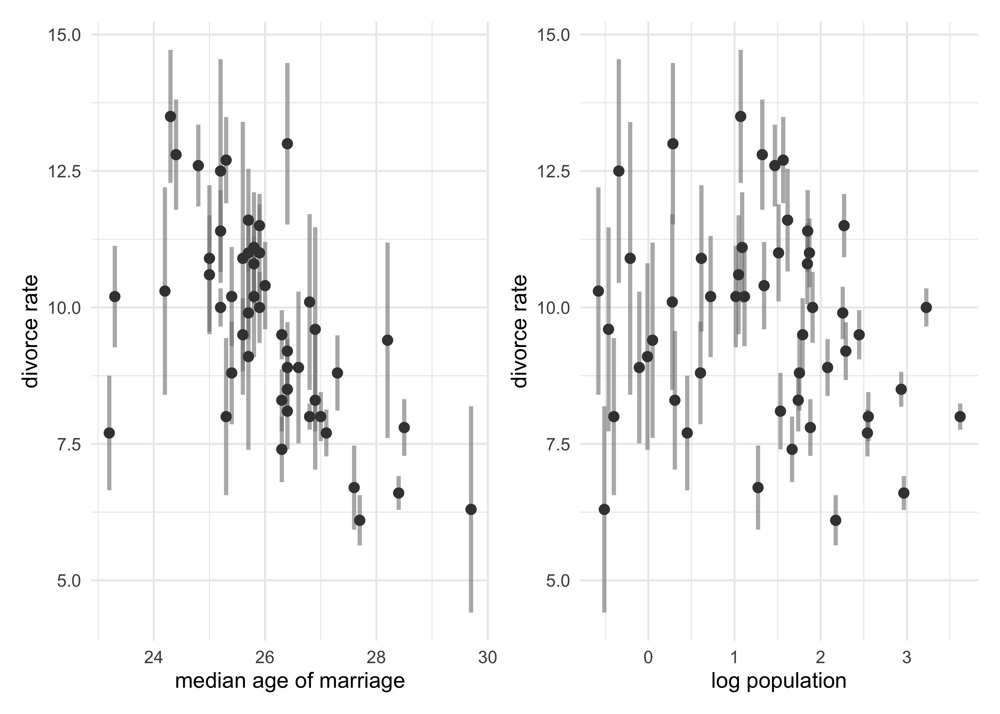
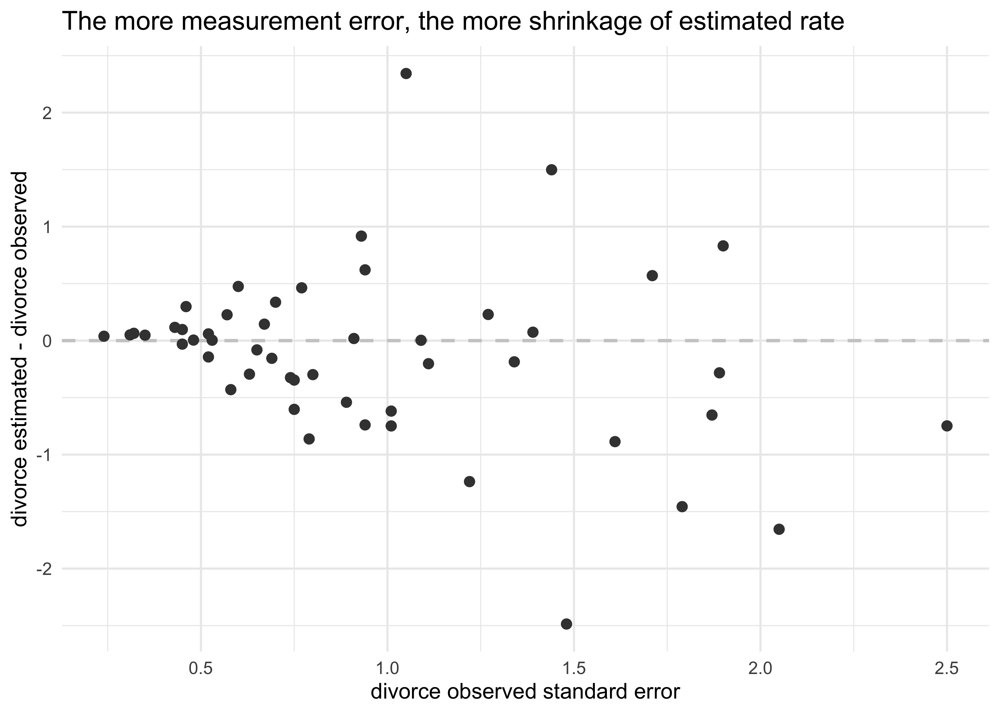
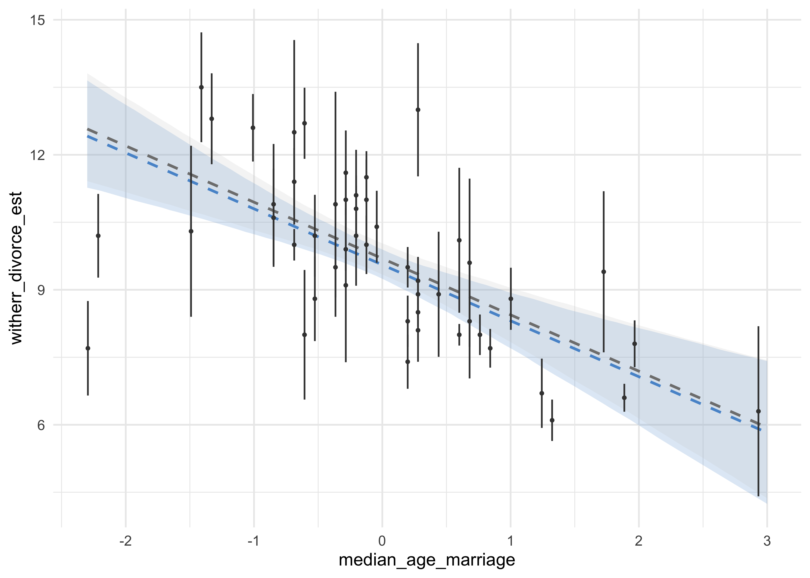
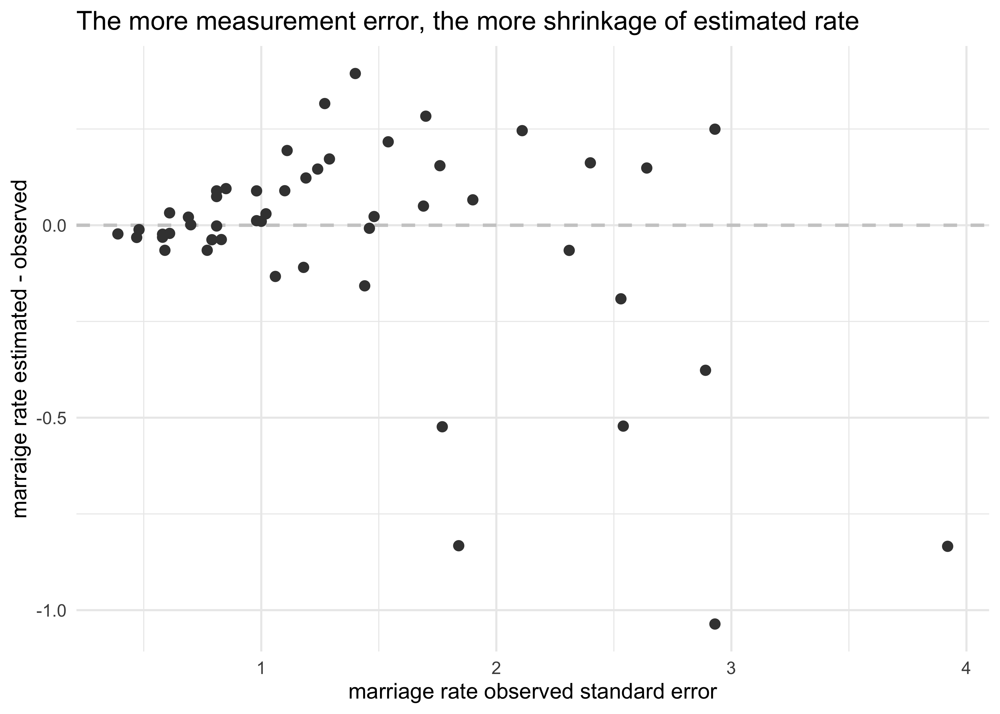
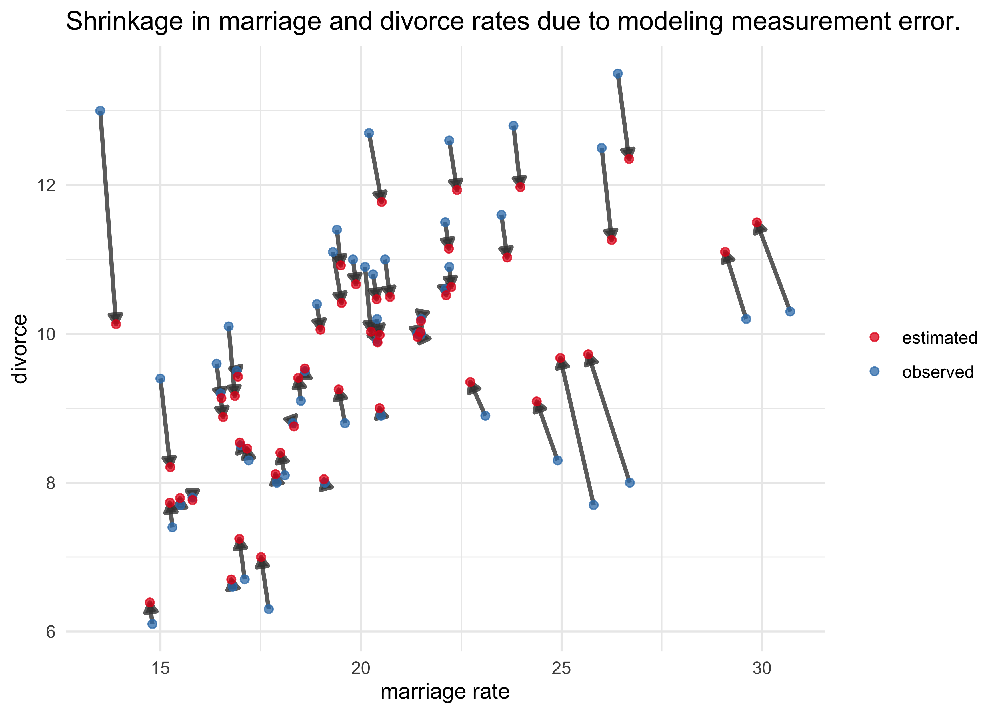
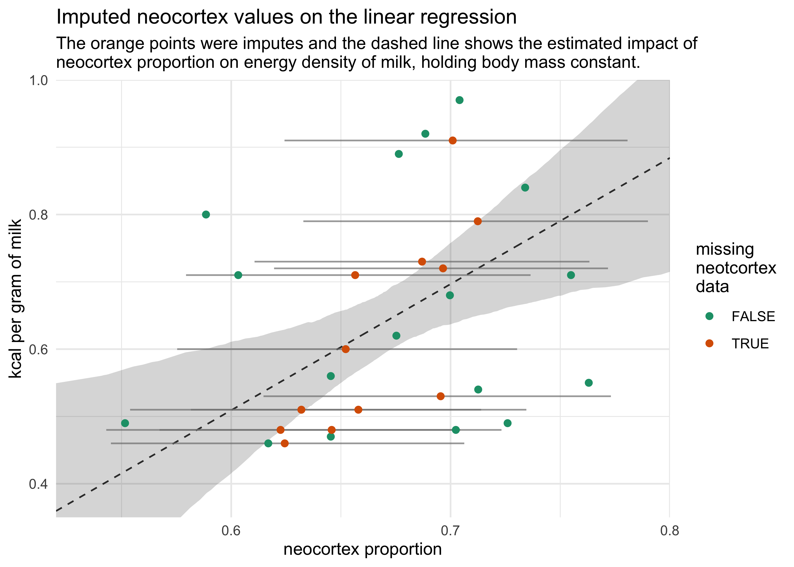

Chapter 14. Missing Data and Other Opportunities
================

  - cover two common applications of Bayesian statistics:
    1.  *measurement error*
    2.  *Bayesian imputation*

## 14.1 Measurement error

  - in the divorce and marriage data of states in the US, there was
    error in the measured variables (marriage and divorce rates)
      - this data can be incorporated into the model
      - the plot below shows the standard error in the measurement
        against median age of marriage and the population
      - seems like smaller states have more error (smaller sample size)

<!-- end list -->

``` r
# Load the data.
data("WaffleDivorce")
d <- as_tibble(WaffleDivorce) %>%
    janitor::clean_names()

p1 <- d %>%
    ggplot(aes(median_age_marriage, divorce)) +
    geom_linerange(aes(ymin = divorce - divorce_se, ymax = divorce + divorce_se),
                   size = 1, color = grey, alpha = 0.6) +
    geom_point(size = 2, color = dark_grey) +
    labs(x = "median age of marriage",
         y = "divorce rate")

p2 <- d %>%
    ggplot(aes(log(population), divorce)) +
    geom_linerange(aes(ymin = divorce - divorce_se, ymax = divorce + divorce_se),
                   size = 1, color = grey, alpha = 0.6) +
    geom_point(size = 2, color = dark_grey) +
    labs(x = "log population",
         y = "divorce rate")

p1 | p2
```

<!-- -->

  - makes sense to have the more certain estimates have more influence
    on the regression
      - many *ad hoc* methods for including this confidence as a weight
        in the analysis, but they leave out some data

### 14.1.1 Error on the outcome

> **Note:** In the book, McElreath does not standardize the input
> variables for the new model (accounting for measurement error), but
> does standardize the variables in the previous model (not accounting
> for measurement error). Here I have standardized the input variables
> in both models and the differences from accounting for measurement
> error are not as astounding as reported in the book. I believe that my
> decision was correct and it does not remove the overall point of the
> section.

  - to incorporate measurement error, *replace the observed data for
    divorce rate with a distribution*
  - example:
      - use a Gaussian distribution with a mean equal to the observed
        value and standard deviation equal to the measurement’s standard
        error
      - define the distribution for each divorce rate:
          - for each observed value \(D_{\text{obs}, i}\) there will be
            one parameter \(D_{\text{est}, i}\)
          - the measruement \(D_{\text{obs}, i}\) is specified as a
            Gaussian distribution with the center of the estimate and
            standard deviation of the measurement
      - can then estimate the plausible true values consistent with the
        observed data

\[
D_{\text{obs}, i} \sim \text{Normal}(D_{\text{est}, i}, D_{\text{SE}, i})
\]

  - the model for the divorce rate \(D\) as a linear function of age at
    marriage \(A\) and marriage rate \(R\)
      - the first line is the *likelihood for estimates*
      - the second line is the linear model
      - the third line is the *prior for estimates*
      - the main difference with this model compared to the normal ones
        we have used previously is that the outcome is a vector of
        parameters
          - each outcome parameter also gets a second role as the
            unknown mean of another distribution to predict the observed
            measurement
      - information will flow in both directions:
          - the uncertainty in the measurement influences the regression
            parameters in the linear model
          - the regression parameters in the linear model influence the
            uncertainty in the measurements

\[
D_{\text{est}, i} \sim \text{Normal}(\mu_i, \sigma) \\
\mu_i = \alpha + \beta_A A_i + \beta_R R_i \\
D_{\text{obs}, i} \sim \text{Normal}(D_{\text{est}, i}, D_{\text{SE}, i}) \\
\alpha \sim \text{Normal}(0, 10) \\
\beta_A \sim \text{Normal}(0, 10) \\
\beta_R \sim \text{Normal}(0, 10) \\
\sigma \sim \text{Cauchy}(0, 2.5) \\
\]

  - a few notes on the `map2stan()` implementation of the above formula
      - turned off WAIC calculation because it will incorrectly compute
        WAIC by integrating over the `div_est` values
      - gave the model a starting point for `div_est` as the observed
        values
          - this also tells it how many parameters it needs
      - set the *target acceptance rate* from default 0.8 to 0.95 which
        causes Stan to “work harder” during warmup to improve the later
        sampling

<!-- end list -->

``` r
dlist <- d %>% 
    transmute(div_obs = divorce,
              div_sd = divorce_se,
              R = scale_nums(marriage),
              A = scale_nums(median_age_marriage))

stash("m14_1", depends_on = "dlist", {
    m14_1 <- map2stan(
        alist(
            div_est ~ dnorm(mu, sigma),
            mu <- a + bA*A + bR*R,
            div_obs ~ dnorm(div_est, div_sd),
            a ~ dnorm(0, 10),
            bA ~ dnorm(0, 10),
            bR ~ dnorm(0, 10),
            sigma ~ dcauchy(0, 2.5)
        ),
        data = dlist,
        start = list(div_est = dlist$div_obs),
        WAIC = FALSE,
        iter = 5e3, warmup = 1e3, chains = 2, cores = 2,
        control = list(adapt_delta = 0.95)
    )
})
```

    #> Loading stashed object.

  - previously, the estimate for `bA` was about -1, now it is -0.5, but
    still comfortably negative
      - including measurement error reduced the estimated effect of
        another variable

<!-- end list -->

``` r
precis(m14_1, depth = 1)
```

    #> 50 vector or matrix parameters hidden. Use depth=2 to show them.

    #>               mean        sd       5.5%      94.5%    n_eff     Rhat4
    #> a      9.556418825 0.2044546  9.2376879  9.8812416 5002.159 1.0011619
    #> bA    -1.242940436 0.3208026 -1.7527063 -0.7371894 3742.422 0.9999276
    #> bR    -0.005569283 0.3420884 -0.5595417  0.5257439 3311.623 1.0000885
    #> sigma  1.078827705 0.1961819  0.7872871  1.4068432 2199.206 1.0006505

``` r
precis(m14_1, depth = 2)
```

    #>                  mean        sd      5.5%     94.5%    n_eff     Rhat4
    #> div_est[1]  11.837345 0.6647418 10.788708 12.896255 5898.515 1.0006582
    #> div_est[2]  10.845096 1.0216492  9.251640 12.494231 7078.216 0.9998781
    #> div_est[3]  10.475214 0.6233029  9.491899 11.495846 8184.472 0.9999431
    #> div_est[4]  12.263202 0.8633582 10.900480 13.669238 7962.861 1.0001279
    #> div_est[5]   8.038421 0.2341533  7.663551  8.406673 8446.959 0.9998663
    #> div_est[6]  10.860516 0.7293194  9.698849 12.019768 6845.499 1.0002496
    #> div_est[7]   7.163171 0.6414886  6.131500  8.175996 8157.261 0.9999701
    #> div_est[8]   8.973791 0.8960361  7.548050 10.432453 8011.903 0.9997761
    #> div_est[9]   6.017474 1.1305256  4.224373  7.841245 5747.723 1.0003524
    #> div_est[10]  8.564176 0.3057308  8.078995  9.048928 8983.011 0.9999920
    #> div_est[11] 11.069879 0.5229368 10.249401 11.925258 7799.606 1.0003111
    #> div_est[12]  8.529345 0.9040473  7.067700  9.967466 6047.213 1.0000865
    #> div_est[13] 10.043196 0.8956017  8.587265 11.452084 4712.640 1.0002555
    #> div_est[14]  8.097284 0.4177928  7.435401  8.748650 9969.859 1.0001777
    #> div_est[15] 10.705737 0.5345280  9.857985 11.558642 9068.945 0.9998466
    #> div_est[16] 10.218519 0.7074659  9.100099 11.336247 8647.523 0.9998100
    #>  [ reached 'max' / getOption("max.print") -- omitted 38 rows ]

  - the estimated effect of marriage age was reduced by including the
    measurement error of divorce
      - can see why because states with very high or low ages at
        marriage tended to have high uncertainty in divorce rates
      - in the model, the rates with greater uncertainty have been
        shrunk towards the mean that is more defined by the measurements
        with smaller measurement error  
          - this is *shrinkage*

<!-- end list -->

``` r
estimated_divorce_post <- extract.samples(m14_1)$div_est

d %>%
    mutate(estimated_divorce = apply(estimated_divorce_post, 2, mean)) %>%
    ggplot(aes(x = divorce_se, y = estimated_divorce - divorce)) +
    geom_hline(yintercept = 0, lty = 2, color = light_grey, size = 0.8) +
    geom_point(size = 2, color = dark_grey) +
    labs(x = "divorce observed standard error",
         y = "divorce estimated - divorce observed",
         title = "The more measurement error, the more shrinkage of estimated rate")
```

<!-- -->

  - below, the model without accounting for measurement error is created
    and the posterior estimates of median age are shown

<!-- end list -->

``` r
stash("m14_1_noerr", depends_on = "dlist", {
    m14_1_noerr <- map2stan(
        alist(
            div_obs ~ dnorm(mu, sigma),
            mu <- a + bA*A + bR*R,
            a ~ dnorm(0, 10),
            bA ~ dnorm(0, 10),
            bR ~ dnorm(0, 10),
            sigma ~ dcauchy(0, 10)
        ),
        data = dlist,
        WAIC = FALSE,
        iter = 5e3, warmup = 1e3, chains = 2, cores = 2,
        control = list(adapt_delta = 0.95)
    )
})
```

    #> Loading stashed object.

``` r
median_age_seq <- seq(-2.3, 3, length.out = 100)
avg_marriage <- mean(dlist$R)
pred_d <- tibble(A = median_age_seq, R = avg_marriage)
m14_1_post <- link(m14_1, data = pred_d)
```

    #> [ 100 / 1000 ][ 200 / 1000 ][ 300 / 1000 ][ 400 / 1000 ][ 500 / 1000 ][ 600 / 1000 ][ 700 / 1000 ][ 800 / 1000 ][ 900 / 1000 ][ 1000 / 1000 ]

``` r
m14_1_noerr_post <- link(m14_1_noerr, data = pred_d)
```

    #> [ 100 / 1000 ][ 200 / 1000 ][ 300 / 1000 ][ 400 / 1000 ][ 500 / 1000 ][ 600 / 1000 ][ 700 / 1000 ][ 800 / 1000 ][ 900 / 1000 ][ 1000 / 1000 ]

``` r
pred_d_post <- pred_d %>%
    rename(median_age_marriage = A, marriage = R) %>%
    mutate(witherr_divorce_est = apply(m14_1_post, 2, mean),
           noerr_divorce_est = apply(m14_1_noerr_post, 2, mean)) %>%
    bind_cols(
        apply(m14_1_post, 2, PI) %>% 
            pi_to_df() %>% 
            set_names(c("with_err_5", "with_err_94")),
        apply(m14_1_noerr_post, 2, PI) %>% 
            pi_to_df() %>% 
            set_names(c("no_err_5", "no_err_94"))
    )

d %>%
    mutate(median_age_marriage = scale_nums(median_age_marriage)) %>%
    ggplot(aes(x = median_age_marriage)) +
    geom_ribbon(aes(ymin = with_err_5, ymax = with_err_94),
                data = pred_d_post,
                alpha = 0.2, fill = blue) +
    geom_ribbon(aes(ymin = no_err_5, ymax = no_err_94),
                data = pred_d_post,
                alpha = 0.2, fill = light_grey) +
    geom_line(aes(y = witherr_divorce_est), 
              data = pred_d_post,
              color = blue, lty = 2, size = 0.8) +
    geom_line(aes(y = noerr_divorce_est), 
              data = pred_d_post,
              color = grey, lty = 2, size = 0.8) +
    geom_linerange(aes(ymin = divorce - divorce_se, ymax = divorce + divorce_se), 
                   size = 0.5, color = dark_grey) +
    geom_point(aes(y = divorce), size = 0.7, color = dark_grey)
```

<!-- -->

### 14.1.2 Error on both outcome and predictor

  - measurement error on predictors and outcome
      - think about the problem *generatively*:
          - each observed predictor value is a draw from a distribution
            with an unknown mean and standard deviation
          - we can define a vector of parameters, one per unknown, and
            make them the means of a Gaussian distributions
  - example in the divorce data with error on marriage rate

\[
D_{\text{est}, i} \sim \text{Normal}(\mu_i, \sigma) \\
\mu_i = \alpha + \beta_A A_i + \beta_R R_{\text{est}, i} \\
D_{\text{obs}, i} \sim \text{Normal}(D_{\text{est}, i}, D_{\text{SE}, i}) \\
R_{\text{obs}, i} \sim \text{Normal}(R_{\text{est}, i}, R_{\text{SE}, i}) \\
\alpha \sim \text{Normal}(0, 10) \\
\beta_A \sim \text{Normal}(0, 10) \\
\beta_R \sim \text{Normal}(0, 10) \\
\sigma \sim \text{Cauchy}(0, 2.5)
\]

``` r
dlist <- d %>%
    select(div_obs = divorce, div_sd = divorce_se,
           mar_obs = marriage, mar_sd = marriage_se,
           A = median_age_marriage)

stash("m14_2", depends_on = "dlist", {
    m14_2 <- map2stan(
        alist(
            div_est ~ dnorm(mu, sigma),
            mu <- a + bA*A + bR*mar_est[i],
            div_obs ~ dnorm(div_est, div_sd),
            mar_obs ~ dnorm(mar_est, mar_sd),
            a ~ dnorm(0, 10),
            bA ~ dnorm(0, 10),
            bR ~ dnorm(0, 10),
            sigma ~ dcauchy(0, 2.5)
        ),
        data = dlist,
        start = list(div_est = dlist$div_obs,
                     mar_est = dlist$mar_obs),
        WAIC = FALSE,
        iter = 5e3, warmup = 1e3, chains = 3, cores = 3,
        control = list(adapt_delta = 0.95)
    )
})
```

    #> Loading stashed object.

``` r
precis(m14_2)
```

    #> 100 vector or matrix parameters hidden. Use depth=2 to show them.

    #>             mean         sd         5.5%      94.5%    n_eff    Rhat4
    #> a     20.8720987 6.82182042  9.666433007 31.5786222 2891.271 1.000815
    #> bA    -0.5400344 0.21819074 -0.882554474 -0.1794355 3217.269 1.000645
    #> bR     0.1384014 0.08306949  0.009533411  0.2730756 2740.129 1.000991
    #> sigma  1.0975441 0.20658634  0.787150660  1.4454654 2899.495 1.000417

``` r
estimated_marriage_post <- extract.samples(m14_2)$mar_est

d %>%
    mutate(est_marriage = apply(estimated_marriage_post, 2, mean)) %>%
    ggplot(aes(x = marriage_se, y = est_marriage - marriage)) +
    geom_hline(yintercept = 0, lty = 2, color = light_grey, size = 0.8) +
    geom_point(size = 2, color = dark_grey) +
    labs(x = "marriage rate observed standard error",
         y = "marraige rate estimated - observed",
         title = "The more measurement error, the more shrinkage of estimated rate")
```

<!-- -->

``` r
m14_2_post_samples <- extract.samples(m14_2)

d_est <- tibble(loc = d$loc) %>%
    mutate(divorce = apply(m14_2_post_samples$div_est, 2, mean),
           marriage = apply(m14_2_post_samples$mar_est, 2, mean),
           obs_est = "estimated")

d %>% 
    select(loc, divorce, marriage) %>%
    add_column(obs_est = "observed") %>%
    bind_rows(d_est) %>%
    ggplot(aes(marriage, divorce)) +
    geom_path(aes(group = loc), alpha = 0.8, size = 1, color = dark_grey,
              arrow = arrow(length = unit(2, "mm"), ends = "last", type = "closed")) +
    geom_point(aes(color = obs_est), size = 1.7, alpha = 0.75) +
    scale_color_brewer(palette = "Set1") +
    labs(x = "marriage rate",
         y = "divorce",
         title = "Shrinkage in marriage and divorce rates due to modeling measurement error.",
         color = NULL)
```

<!-- -->

## 14.2 Missing data

### 14.2.1 Imputing neocortex

  - example using Bayesian imputation to impute the missing
    `neocortex.perc` values in the `milk` data
      - use information from other columns
      - the imputed values will have posterior distributions (better
        than a point estimate)
  - *Missing Completely At Random* (MCAR): an imputation model that
    assumes the points that are missing are missing due to random chance
  - simultaneously model the predictor variable that has missing value
    and the outcome variable
      - the present values will produce estimates that comprise a prior
        for each missing value
      - then use these priors for estimating the relationship between
        the predictor and outcome
  - think of the predictor with missing data as a mixture of data and
    parameters
  - below is the formula for the model
      - the \(N_i \sim \text{Normal}(v, \sigma_N)\) is the distribution
        for the neocortex percent values
          - if \(N_i\) is observed, then it is a likelihood
          - if \(N_i\) is missing, then it is a prior distribution

\[
k_i \sim \text{Normal}(\mu_i, \sigma) \\
\mu_i = \alpha + \beta_N N_i + \beta_M \log M_i \\
N_i \sim \text{Normal}(\nu, \sigma_N) \\
\alpha \sim \text{Normal}(0, 100) \\
\beta_N \sim \text{Normal}(0, 10) \\
\beta_M \sim \text{Normal}(0, 10) \\
\sigma \sim \text{Normal}(0, 1) \\
\nu \sim \text{Normal}(0.5, 1) \\
\sigma_N \sim \text{Cauchy}(0, 1)
\]

  - several ways to implement this model

<!-- end list -->

``` r
# Load the data.
data("milk")
d <- as_tibble(milk) %>% 
    janitor::clean_names() %>%
    mutate(neocortex_prop = neocortex_perc / 100,
           logmass = log(mass))

data_list <- d %>%
    select(kcal = kcal_per_g,
           neocortex = neocortex_prop,
           logmass)

stash("m14_3", depends_on = "data_list", {
    m14_3 <- map2stan(
        alist(
            kcal ~ dnorm(mu, sigma),
            mu <- a + bN*neocortex + bM*logmass,
            neocortex ~ dnorm(nu, sigma_N),
            a  ~ dnorm(0, 100),
            c(bN, bM) ~ dnorm(0, 10),
            nu ~ dnorm(0.5, 1),
            sigma_N ~ dcauchy(0, 1),
            sigma ~ dcauchy(0, 1)
        ),
        data = data_list, iter = 1e4, chains = 2, cores = 2
    )
})
```

    #> Loading stashed object.

``` r
precis(m14_3, depth = 2)
```

    #>                             mean         sd       5.5%       94.5%     n_eff
    #> neocortex_impute[1]   0.63198252 0.05026444  0.5539061  0.71393638  7375.298
    #> neocortex_impute[2]   0.62439457 0.05082310  0.5451610  0.70625252  7744.599
    #> neocortex_impute[3]   0.62249738 0.05117690  0.5430334  0.70445442  6915.737
    #> neocortex_impute[4]   0.65219955 0.04870903  0.5753615  0.73034213  9502.564
    #> neocortex_impute[5]   0.70097228 0.04849636  0.6242957  0.78068875  8857.497
    #> neocortex_impute[6]   0.65650853 0.05003216  0.5794043  0.73647672  8697.525
    #> neocortex_impute[7]   0.68701466 0.04796190  0.6106304  0.76329911 10188.181
    #> neocortex_impute[8]   0.69656253 0.04807550  0.6195392  0.77177427  8898.820
    #> neocortex_impute[9]   0.71240683 0.04935848  0.6328875  0.78997705  9123.654
    #> neocortex_impute[10]  0.64580225 0.04967418  0.5672966  0.72321254  8802.068
    #> neocortex_impute[11]  0.65796422 0.04869620  0.5816114  0.73455664  9168.917
    #> neocortex_impute[12]  0.69548363 0.04997620  0.6147117  0.77310037  8148.645
    #> a                    -0.53192286 0.47208501 -1.2685262  0.23265819  2414.370
    #> bN                    1.89757591 0.73606344  0.7053816  3.05058129  2343.718
    #> bM                   -0.06920106 0.02248688 -0.1051405 -0.03326359  2847.262
    #> nu                    0.67132733 0.01378503  0.6496262  0.69302024  7428.522
    #>                          Rhat4
    #> neocortex_impute[1]  0.9998108
    #> neocortex_impute[2]  1.0004621
    #> neocortex_impute[3]  0.9999360
    #> neocortex_impute[4]  0.9999356
    #> neocortex_impute[5]  0.9998307
    #> neocortex_impute[6]  0.9999942
    #> neocortex_impute[7]  1.0000914
    #> neocortex_impute[8]  1.0002591
    #> neocortex_impute[9]  0.9998138
    #> neocortex_impute[10] 0.9998282
    #> neocortex_impute[11] 0.9999832
    #> neocortex_impute[12] 0.9998682
    #> a                    1.0002426
    #> bN                   1.0003011
    #> bM                   1.0005604
    #> nu                   0.9998143
    #>  [ reached 'max' / getOption("max.print") -- omitted 2 rows ]

  - for comparison, also build a model with the missing data dropped

<!-- end list -->

``` r
dcc <- d[complete.cases(d$neocortex_prop), ]
data_list_cc <- dcc %>%
    select(kcal = kcal_per_g, neocortex = neocortex_prop, logmass)

stash("m14_3_cc", depends_on = "data_list_cc", {
    m14_3_cc <- map2stan(
        alist(
            kcal ~ dnorm(mu, sigma),
            mu <- a + bN*neocortex + bM*logmass,
            a ~ dnorm(0, 100),
            c(bN, bM) ~ dnorm(0, 10),
            sigma ~ dcauchy(0, 1)
        ),
        data = data_list_cc, iter = 1e4, chains = 2, cores = 2
    )
})
```

    #> Loading stashed object.

``` r
precis(m14_3_cc)
```

    #>             mean         sd       5.5%       94.5%    n_eff    Rhat4
    #> a     -1.0774335 0.57905288 -1.9994215 -0.17402779 2435.072 1.000556
    #> bN     2.7813725 0.90188209  1.3639509  4.22172504 2414.102 1.000478
    #> bM    -0.0962560 0.02811227 -0.1401678 -0.05196683 2992.969 1.000027
    #> sigma  0.1385882 0.02948439  0.1000234  0.19141166 3061.492 1.000285

  - including the incomplete cases moves the posterior mean for
    neocortext proportion from 2.8 to 1.9 and for body mass from -0.1 to
    -0.07
  - the following plot shows the imputed data comparing the neocortex
    proportion to the kcal per gram of milk

<!-- end list -->

``` r
m14_3_post <- extract.samples(m14_3)

neocortex_seq <- seq(0.45, 0.8, length.out = 500)
logmass_avg <- mean(d$logmass)
m14_3_pred_d <- tibble(neocortex = neocortex_seq, logmass = logmass_avg)
m14_3_pred <- link(m14_3, data = m14_3_pred_d)
```

    #> [ 100 / 1000 ][ 200 / 1000 ][ 300 / 1000 ][ 400 / 1000 ][ 500 / 1000 ][ 600 / 1000 ][ 700 / 1000 ][ 800 / 1000 ][ 900 / 1000 ][ 1000 / 1000 ]

``` r
m14_3_pred_d %<>%
    mutate(kcal_est = apply(m14_3_pred, 2, mean)) %>%
    bind_cols(apply(m14_3_pred, 2, PI) %>% pi_to_df()) %>%
    filter(neocortex > 0.52) %>%
    mutate(x5_percent = scales::squish(x5_percent, range = c(0.35, 1.0)),
           x94_percent = scales::squish(x94_percent, range = c(0.35, 1.0)))

imputed_neocortex_prop <- tibble(
    neocortex_prop_est = apply(m14_3_post$neocortex_impute, 2, mean)
) %>%
    bind_cols(apply(m14_3_post$neocortex_impute, 2, PI) %>% pi_to_df()) %>%
    mutate(miss_num_idx = row_number())

d %>%
    mutate(missing_neocortex = is.na(neocortex_prop)) %>%
    group_by(missing_neocortex) %>%
    mutate(miss_num_idx = row_number()) %>%
    ungroup() %>%
    mutate(miss_num_idx = ifelse(missing_neocortex, miss_num_idx, NA)) %>%
    left_join(imputed_neocortex_prop, by = "miss_num_idx") %>%
    mutate(neocortex_prop = ifelse(missing_neocortex, neocortex_prop_est, neocortex_prop)) %>%
    ggplot(aes(neocortex_prop)) +
    geom_ribbon(aes(x = neocortex, ymin = x5_percent, ymax = x94_percent),
                data = m14_3_pred_d, 
                alpha = 0.2) +
    geom_line(aes(x = neocortex, y = kcal_est),
              data = m14_3_pred_d, 
              alpha = 0.8, lty = 2) +
    geom_linerange(aes(y = kcal_per_g, xmin = x5_percent, xmax = x94_percent), 
                   alpha = 0.7, color = grey) +
    geom_point(aes(y = kcal_per_g, color = missing_neocortex), 
               size = 1.7) +
    scale_color_brewer(palette = "Dark2") +
    scale_x_continuous(expand = c(0, 0)) +
    scale_y_continuous(limits = c(0.35, 1.0), expand = c(0, 0)) +
    labs(x = "neocortex proportion",
         y = "kcal per gram of milk",
         title = "Imputed neocortex values on the linear regression",
         subtitle = "The orange points were imputes and the dashed line shows the estimated impact of\nneocortex proportion on energy density of milk, holding body mass constant.",
         color = "missing\nneotcortex\ndata")
```

    #> Warning: Removed 17 rows containing missing values (geom_segment).

<!-- -->

### 14.2.2 Improving the imputation model
