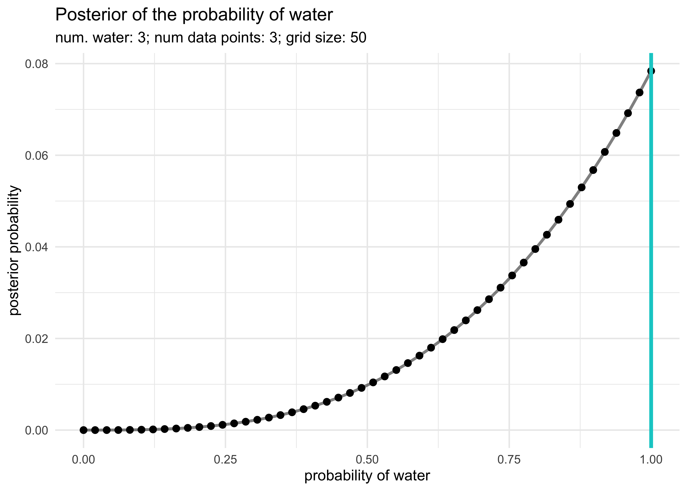
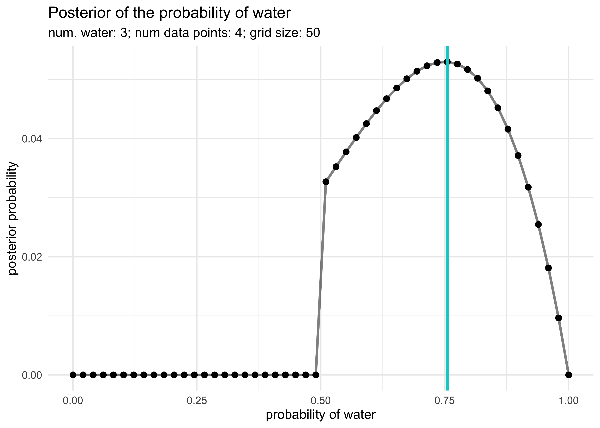

Chapter 2. Small Worlds and Large Worlds
================

  - all models contain a “small world” and a "large world
      - the small world is the self-contained logical world of the model
      - the large world is the broader context in which one deploys a
        model
  - Bayesian models learn from evidence that is optimal in the small
    world and must be demonstrated to perform well in the large world
  - this chapter focuses on the small world

## 2.1 The garden of forking data

  - this chapter is designed to build Bayesian inference from the group
    up
      - it’s really just counting and comparing possibilities
  - Bayesian inference works by considering everything that could have
    happened given the data

## 2.2. Building a model

  - Example:
      - we have a globe representing Earth
      - we are curious how much of the world is covered by water
      - we will solve this by tossing the globe in the air and catch it,
        recording whether our right index finger is on water or land
      - repeating this 9 times produces the following sequence (date):
        `W L W W W L W L W`
  - we can design a simple Bayesian model using the following process:
    1.  *data story*: motivate the model by describing how the data
        might arise
    2.  *update*: educate the model by feeding it data
    3.  *evaluate*: supervise the model and update when needed and
        repeating this process

### 2.2.1 A data story

  - the story for how the data was produced can be descriptive or causal
  - the story must be *complete*: they are sufficient for specifying an
    algorithm for generating new data
  - for this example:
      - the true proportion of water covering the globe is \(p\)
      - a single toss of the globe has a \(p\) probability of producing
        `W` and \(1-p\) of producing `L`
      - each toss of the globe is independent from the others

### 2.2.2 Bayesian updating

  - we now must the plausibility of each possible value of \(p\)
      - we can start with each value of \(p\) being equally likely (an
        “ignorant prior”)
      - with the first `W`, the possibility of \(p=0\) is 0 because we
        have found a `W`
      - with the next value of `L`, \(p=0.5\) is the most likely value
        for \(p\)
      - with each draw of `W`, the curve shifts right as the most likely
        value of \(p\) increases
      - notice that the maximum *height* of the curve increases with
        more data because fewer number of values of \(p\) can explain
        the data, limiting the pool to choose from


### 2.2.3 Evaluate

  - the Bayesian model learns in an optimal way
      - it guarantees perfect inference in the small world
      - however, the calculations can malfunction, so the results must
        always be checked

## 2.3 Components of the model

  - we must count the following:
      - the number of ways each conjecture could produce an observation
      - the accumulated number of ways each conjecture could produce the
        entire data
      - the initial plausibility of each conjectured cause of the data
        (the prior distribution)

### 2.3.1 Variables

  - variables include things we wish to infer
  - there were three in the globe tossing example:
      - \(p\), the target of the inference, the proportion of water on
        the globe
          - this is an *unobserved* variable and is called a *parameter*
      - the counts of water `W` and land `L` are variables
      - the number of data points total

### 2.3.2 Definitions

  - defining the variables creates a model that relates the variables to
    one another
  - the goal is to count the number of ways the data could arise given
    the assumptions

#### 2.3.2.1 Observed variables

  - for the count of water \(W\) and land \(L\) we can define how
    plausible any combination of \(W\) and \(L\) would be for a
    specified \(p\)
      - use a mathematical function that tells us the right plausibility
      - *likelihood*: a distribution function assigned to an observed
        variable
  - we can use a binomial distribution where the probability of
    observing \(W\) waters and \(L\) lands with a probability \(p\) of
    water on each toss is:

\[
\Pr(W,L|p) = \frac{(W + L)!}{W!L!} p^W (1-p)^L
\]

    * this can be modeled in R as follows, setting $p = 0.5$:

``` r
dbinom(6, size = 9, prob = 0.5)
```

    #> [1] 0.1640625

``` r
probs <- seq(0, 1, 0.01)
likelihoods <- map_dbl(probs, ~ dbinom(6, size = 9, prob = .x))
tibble(p = probs, y = likelihoods) %>%
    ggplot(aes(x = p, y = y)) +
    geom_point(size = 1.5) +
    labs(x = "p", 
         y = "likelihood", 
         title = "Likelihood for various values of 'p'")
```

<!-- -->

#### 2.3.2.2 Unobserved variables

  - each unobserved variable (i.e. *parameter*) must be given a prior
    distribution
      - the priors can be designed to help the machine learn
        (“engineering assumptions”) or to reflect previous knowledge
        of the phenomenon (“scientific prior”)
  - multiple priors should usually be tested
      - important to see how sensitive the model is to different priors

### 2.3.3 A model is born

  - the counts for the water and land variables can be written as the
    following equation where \(N = W+L\)
      - it is the assumption that the relative counts of ways to realize
        \(W\) in \(N\) trials with probability \(p\) on each trial comes
        from the binomial distribution

\[
W \sim \text{Binomial}(N,p)
\]

  - the unobserved parameter \(p\) is defined with the uniform
    (ignorant) distribution

\[
p \sim \text{Uniform}(0,1)
\]

## 2.4 Making the model go

  - once all of the variables have been chosen and defined, the priors
    can be updated to produce the *posterior* distribution for \(p\):
    \(\Pr(p|W,L)\)

### 2.4.1 Bayes’ theorem

  - below is an abbreviated derivation of Bayes’ theorem using the
    globe-tossing example
  - the join probability of the data \(W\) and \(L\) and any particular
    \(p\) is below
      - it just says that the probability of \(W\), \(L\), and \(p\) is
        the same as the probability of \(W\) and \(L\) given \(p\) times
        the probability of \(p\)

\[
\Pr(W,L,p) = \Pr(W,L | p) \Pr(p)
\]

  - a similar equation that just rearranges the order of the conditional
    is below

\[
\Pr(W,L,p) = \Pr(p | W,L) \Pr(W,L)
\]

  - these two equations have the same left-hand side, so they can be
    equated and rearranged to produce Bayes’ theorem

\[
\Pr(W,L | p) \Pr(p) = \Pr(p | W,L) \Pr(W,L) \\
\Pr(p | W,L) = \frac{\Pr(W,L | p) \Pr(p)}{\Pr(W,L)}
\]

``` r
tibble(p = probs, 
       prior = dunif(probs),
       likelihood = likelihoods) %>%
    mutate(posterior = prior * likelihoods) %>%
    pivot_longer(-p, names_to = "distribution", values_to = "value") %>%
    mutate(distribution = factor(
        distribution, levels = c("prior", "likelihood", "posterior"))
    ) %>%
    ggplot(aes(x = p, y = value, color = distribution)) +
    facet_wrap(~ distribution, nrow = 1, scales = "free_y") +
    geom_point(alpha = 0.5) +
    labs(x = "p", y = "likelihood", title = "Uniform prior distribution")
```

<!-- -->

``` r
prior2 <- ifelse(probs < 0.5, 0, 1)
prior2 <- prior2 / mean(prior2)

tibble(p = probs, 
       prior = prior2,
       likelihood = likelihoods) %>%
    mutate(posterior = prior * likelihoods) %>%
    pivot_longer(-p, names_to = "distribution", values_to = "value") %>%
    mutate(distribution = factor(
        distribution, levels = c("prior", "likelihood", "posterior"))
    ) %>%
    ggplot(aes(x = p, y = value, color = distribution)) +
    facet_wrap(~ distribution, nrow = 1, scales = "free_y") +
    geom_point(alpha = 0.5) +
    labs(x = "p", y = "likelihood", title = "Stepped prior distribution")
```

<!-- -->

``` r
prior2 <- map_dbl(probs, ~ dnorm(.x, mean = 0.5, sd = 0.2))
prior2 <- prior2 / mean(prior2)

tibble(p = probs, 
       prior = prior2,
       likelihood = likelihoods) %>%
    mutate(posterior = prior * likelihoods) %>%
    pivot_longer(-p, names_to = "distribution", values_to = "value") %>%
    mutate(distribution = factor(
        distribution, levels = c("prior", "likelihood", "posterior"))
    ) %>%
    ggplot(aes(x = p, y = value, color = distribution)) +
    facet_wrap(~ distribution, nrow = 1, scales = "free_y") +
    geom_point(alpha = 0.5) +
    labs(x = "p", y = "likelihood", title = "Normal prior distribution")
```

<!-- -->

### 2.4.2 Motors

  - many of the models we will use cannot be conditioned formally, as
    done in the above examples
      - it depends on the types of distributions used, but we don’t want
        to limit our choice of distributions to those we can do math
        with
  - there are other solves that we will use later in this course
      - grid approximation
      - quadratic approximation
      - Markov chain Monte Carlo (MCMC)
  - we should consider how the model is fit as part of the model

### 2.4.3 Grid approximation

  - even for continuous variables, it is often sufficient to just try
    many different values of each parameter and calculate the posterior
    probability
      - though, for most real uses, it is impractically inefficient
  - we can use grid approximation for the globe-tossing example, the
    steps are:
    1.  define the grid by deciding how many points to use in the
        estimate
    2.  compute the value of the prior for each parameter value
    3.  compute the likelihood at each parameter value
    4.  compute the unstandardized posterior at each grid value by
        multiplying the prior and the likelihood
    5.  standardize the posterior by dividing by the sum

<!-- end list -->

``` r
# 1. define the grid
p_grid <- seq(0, 1, length.out = 20)

# 2. compute the values from the prior
prior <- dunif(p_grid)

# 3. compute the likelihood at each parameter
likelihood <- dbinom(6, size = 9, prob = p_grid)

# 4. compute the posterior values
posterior <- likelihood * prior

# 5. standardize the posteriors
posterior <- posterior / sum(posterior)

# Plot the results
tibble(p = p_grid, posterior = posterior) %>%
    ggplot(aes(x = p_grid, y = posterior)) +
    geom_path(size = 1, alpha = 0.5) +
    geom_point(size = 2) +
    labs(x = "probability of water",
         y = "posterior probability",
         title = "Grid approximation (n = 20)")
```

<!-- -->

### 2.4.4 Quadratic approximation

  - generally, the region near the peak of a posterior distribution is
    nearly Gaussian and can be approximated as such
  - the Gaussian distribution can be described by two numbers: mean and
    variance
  - the Gaussian approximation is called the “quadratic approximation”
    because the logarithm of the Gaussian is a parabola
      - thus, this method approximates the log-posterior with a parabola
  - we will use this method for the first half of this course before
    graduating to MCMC quadratic approximation can be accomplished in R
    with two steps:
    1.  find the posterior mode using a gradient descent algorithm at
        the peak of posterior, estimate the local curvature to compute a
        quadratic approximation of the entire posterior distribution
  - the following code performs this using the `quap()` function from
    the ‘rethinking’ package

<!-- end list -->

``` r
library(rethinking)
```

    #> Loading required package: rstan

    #> Loading required package: StanHeaders

    #> rstan (Version 2.19.3, GitRev: 2e1f913d3ca3)

    #> For execution on a local, multicore CPU with excess RAM we recommend calling
    #> options(mc.cores = parallel::detectCores()).
    #> To avoid recompilation of unchanged Stan programs, we recommend calling
    #> rstan_options(auto_write = TRUE)

    #> 
    #> Attaching package: 'rstan'

    #> The following object is masked from 'package:tidyr':
    #> 
    #>     extract

    #> Loading required package: parallel

    #> rethinking (Version 2.10)

    #> 
    #> Attaching package: 'rethinking'

    #> The following object is masked from 'package:purrr':
    #> 
    #>     map

    #> The following object is masked from 'package:stats':
    #> 
    #>     rstudent

``` r
globe_qa <- quap(
    alist(
        W ~ dbinom(W+L, p),  # binomial likelihood
        p ~ dunif(0, 1)      # uniform prior
    ),
    data = list(W = 6, L = 3)
)

globe_qa_res <- precis(globe_qa)
globe_qa_res
```

    #>        mean        sd      5.5%     94.5%
    #> p 0.6666667 0.1571338 0.4155366 0.9177968

``` r
qa_posterior <- dnorm(probs, mean = globe_qa_res$mean, sd = globe_qa_res$sd)
tibble(p = probs,
       posterior = qa_posterior) %>%
    ggplot(aes(x = p, y = posterior)) +
    geom_path(size = 1, alpha = 0.5) +
    geom_point(size = 2) +
    geom_vline(xintercept = globe_qa_res$mean, color = "tomato", size = 2) +
    geom_text(x = globe_qa_res$mean + 0.02, y = 0.08, label = "posterior mean", 
              hjust = 0, color = "tomato") +
    labs(x = "probability of water",
         y = "posterior probability",
         title = "Quadratic approximation")
```

<!-- -->

### 2.4.5 Markov chain Monte Carlo

  - we will use this technique later in the course so it is not
    discussed here

-----

## 2.6 Practice

### Easy

**2E1. Which of the expressions below correspond to the statement: “the
probability of rain on Monday”?**

2: \(\Pr(\text{rain} | \text{Monday})\)

**2E2. Which of the following statements corresponds to the expression:
\(\Pr(\text{Monday} | \text{rain})\)?**

3: The probability that it is Monday, given that it is raining.

**2E3. Which of the expressions below correspond to the statement: “the
probability that is it is Monday, given it is raining”?**

1: \(\Pr(\text{Monday} | \text{rain})\)

### Medium

**2M1. Recall the globe tossing model from the chapter. Compute and plot
the grid approximate posterior distribution for each of the following
sets of observations. In each case, assume a uniform prior for \(p\).**

1: `W`, `W`, `W`  
2: `W`, `W`, `W`, `L`  
3: `L`, `W`, `W`, `L`, `W`, `W`, `W`

``` r
globe_tossing_grid_approximation <- function(num_W, 
                                             num_total, 
                                             n_grid = 50, 
                                             prior_f = dunif) {
    p_grid <- seq(0, 1, length.out = n_grid)
    prior <- prior_f(p_grid)
    likelihood <- dbinom(x = num_W, size = num_total, prob = p_grid)
    posterior <- likelihood * prior
    posterior <- posterior / sum(posterior)
    
    max_p <- p_grid[which(posterior == max(posterior))]

    tibble(p = p_grid, posterior = posterior) %>%
        ggplot(aes(x = p_grid, y = posterior)) +
        geom_path(size = 1, alpha = 0.5) +
        geom_point(size = 2) +
        geom_vline(xintercept = median(max_p), size = 1.3, color = "cyan3") +
        labs(x = "probability of water",
             y = "posterior probability",
             title = "Posterior of the probability of water",
             subtitle = glue("num. water: {num_W}; num data points: {num_total}; grid size: {n_grid}"))
}

globe_tossing_grid_approximation(3, 3)
```

<!-- -->

``` r
globe_tossing_grid_approximation(3, 4)
```

<!-- -->

``` r
globe_tossing_grid_approximation(5, 7)
```

<!-- -->

**2M2. Now assume a prior for \(p\) that is equal to zero when
\(p < 0.5\) and is a positive constant when \(p \ge 0.5\). Again compute
and plot the grid approximate posterior distribution for each of the
sets of observations in the problem above.**

``` r
step_prior <- function(x) {
    ifelse(x < 0.5, 0, 1)
}

globe_tossing_grid_approximation(3, 3, prior_f = step_prior)
```

<!-- -->

``` r
globe_tossing_grid_approximation(3, 4, prior_f = step_prior)
```

<!-- -->

``` r
globe_tossing_grid_approximation(5, 7, prior_f = step_prior)
```

<!-- -->

**2M3. Suppose there are two globes, one for Earth and one for Mars. The
Earth globe is 70% covered in water. The Mars globe is 100% land.
Further suppose that one of these globes - you don’t know which - was
toss in the air and produces a “land” observation. Assume that each
globe was equally likely to be tossed. Show that the posterior
probability that the globe was Earth, conditional on seeing “land” is
0.23.**

\[
\Pr(E | L) = \frac{\Pr(L | E) \Pr(E)}{\Pr(L)} \\
\Pr(L | E) = 0.3 \\
\Pr(E) = 0.5 \\
\Pr(L) = (0.5 \times 0.3) + (0.5 \times 1.0) = 0.65 \\
\Pr(E | L) = \frac{0.15 \times 0.5}{0.65} = 0.23
\]

**2M4. Suppose you have a deck with only three cards. Each card has two
sides, and each side is either black or white. One card has two black
sides. The second cards has one black and one white side. The third
cards has two white sides. Now suppose all three cards are places in a
bag and shuffled. Someone reaches into the bag and pulls out a card and
places it flat on a table. The black side is shown facing up, but you
don’t know the color of the side facing down. Show that the probability
of the other side is also black is 2/3. Use the counting method to
approach this problem. This means counting up the ways that each card
could produce the observed data (a black side facing up on the table).**

The prior for each card is \(\frac{1}{3}\) and this is multiplied
against the number of ways each card could produce the observed data.

\[
(B,B): \frac{1}{3} \times 2 = \frac{2}{3} \\
(B,W): \frac{1}{3} \times 1 = \frac{1}{3}\\
(W,W): \frac{1}{3} \times 0 = 0
\]

**2M5. Now suppose there are four cards: B/B, B/W, W/W, and another B/B.
Again suppose a card is drawn from the bag and a black side appears face
up. Again calculate the probability that the other side is black.**

The prior for each card is \(\frac{1}{3}\) and this is multiplied
against the number of ways each card could produce the observed data.

\[
(B,B): \frac{1}{3} \times 4 = \frac{4}{3} \rightarrow \frac{4}{5} \\
(B,W): \frac{1}{3} \times 1 = \frac{1}{3} \rightarrow \frac{1}{5} \\
(W,W): \frac{1}{3} \times 0 = 0
\]

**2M6. Imagine that black ink is heavy, and so cards with black sides
are heavier than cards with white sides. As a result, it’s less likely
that a card with black sides is pulled from the bag. So again assume
there are three cards: B/B, B/W, and W/W. After experimenting a number
of times, you conclude that for every way to pull the B/B card from the
bag, there are 2 ways to pull the B/W card and 3 ways to pull the W/W
card. Again suppose that a card is pulled and a black side appears face
up. Show that the probability the other side is black is now 0.5. Use
the counting method, as before.**

Now the priors are left as raw counts and will be normalized at the end.

\[
(B,B): 1 \times 2 = 2 \rightarrow \frac{1}{2} \\
(B,W): 2 \times 1 = 2 \rightarrow \frac{1}{2} \\
(W,W): 3 \times 0 = 0
\]

**2M7. Assume again the original card problem, with a single card
showing a black side face up. Before looking at the other side, we draw
another card from the bad and lay it face up on the table. The face that
is shown on the new card is white. Show that the probability that the
first card, the one showing a black side, has black on the other side is
now 0.75. Use the counting method, if you can. Hint: Treat this like the
sequence of globe tosses, counting all the ways to see each observation,
for each possible fist card.**

The prior is again a uniform distribution. I then count the number of
ways of getting the first card and multiply this by the number of ways
to then get the second card. The prior and these two counts are
multiplied and the posterior is normalized by dividing by the sum of the
possibilities.

\[
(B,B): \frac{1}{3} \times 2 \times 3 = 2 \rightarrow \frac{3}{4} \\
(B,W): \frac{1}{3} \times 1 \times 2 = \frac{2}{3} \rightarrow \frac{1}{4} \\
(W,W): \frac{1}{3} \times 0 = 0
\]

### Hard

**2H1. Suppose there are two species of panda bear. Both are equally
common in the wild and live in the same places. They look exactly alike
and eat the same food, and there is yet no genetic assay capable of
telling them apart. They differ however in their family sizes. Species A
gives birth to twins 10% of the time, otherwise birthing a single
infant. Species B births twins 20% of the time, otherwise birthing
singleton infants. Assume these numbers are known with certainty, from
many years of field research. Now suppose you are managing a captive
breeding program. You have a new female panda of unknown species, and
she has just given birth to twins. What is the probability that her next
birth will also be twins?**

\[
T_n = \text{twins next time} \quad T_f = \text{twins the first time} \\
\Pr(T_n) = \Pr(A | T_f) \times \Pr(T_n | A) + \Pr(B | T_f) \times \Pr(T_n | B) \\
\Pr(A | T_f) = \frac{\Pr(T_f | A) \Pr(A)}{\Pr(T_f)} = \frac{0.1 \times 0.5}{(0.1 \times 0.5) + (0.2 \times 0.5)} = \frac{1}{3} \\
\Pr(B | T_f) = 1 - \Pr(A | T_f) \\
\Pr(T_n) = (\frac{1}{3} \times 0.1) + (\frac{2}{3} \times 0.2) = \frac{1}{6}
\]

**2H2. Recall all the facts from the problem above. Now compute the
probability that the panda we have is from species A, assuming we have
observed only the first birth and that is was twins.**

\[
\Pr(A | T_f) = \frac{\Pr(T_f | A) \Pr(A)}{\Pr(T_f)} = \frac{0.1 \times 0.5}{(0.1 \times 0.5) + (0.2 \times 0.5)} = \frac{1}{3} \\
\]

**2H3. Continuing on from the previous problem, suppose the same panda
mother has a second birth and that it is not twins, but a singleton
infant. Compute the posterior probability that this panda is a species
A.**

\[
T = \text{twins} \quad S = \text{singleton} \\
\Pr(A | T,S) = \frac{\Pr(T,S | A) \Pr(A)}{\Pr(T,S)} \\
\Pr(A | T,S) = \frac{(0.1 \times 0.9)(0.5)}{(0.1 \times 0.9)(0.5) + (0.2 \times 0.8)(0.5)} = \frac{9}{25} = 0.36
\]

**2H4. So suppose now that a veterinarian comes along who has a genetic
test that she claims can identify the species of our mother panda. But
the test, like all tests, is imperfect. This is the information you have
about the test:**

  - **The probability it correctly identifies a species A panda is
    0.8.**  
  - **The probability it correctly identifies a species B panda is
    0.65.**

**The vet administers the test to your panda and tells you that the test
is positive for species A. First ignore your previous information from
the births and compute the posterior probability that your panda is
species A.**

\[
a = \text{the test reported species A} \\
\Pr(A | a) = \frac{\Pr(a | A) \Pr(A)}{\Pr(a)} \\
\Pr(A | a) = \frac{\Pr(a | A) \Pr(A)}{\Pr(a | A) + \Pr(a | B)} =
    \frac{(0.8)(0.5)}{(0.8)(0.5) + (1 - 0.65)(0.5)} =
    \frac{16}{23} \approx 0.696
\]

**Then redo your calculation, now using the birth data at well.**

I will use the birth information as the prior, updating it based on the
genetic test. This just means the the probability of the the panda being
species A or B is no longer uniform (\(\Pr(A) = 0.5\)).

\[
a = \text{the test reported species A} \\
\Pr(A | a) = \frac{\Pr(a | A) \Pr(A)}{\Pr(a)} \\
\Pr(A | a) = \frac{\Pr(a | A) \Pr(A)}{\Pr(a | A) + \Pr(a | B)} =
    \frac{(0.8)(0.36)}{(0.8)(0.36) + (1 - 0.65)(1 - 0.36)} = 0.5625
\]
