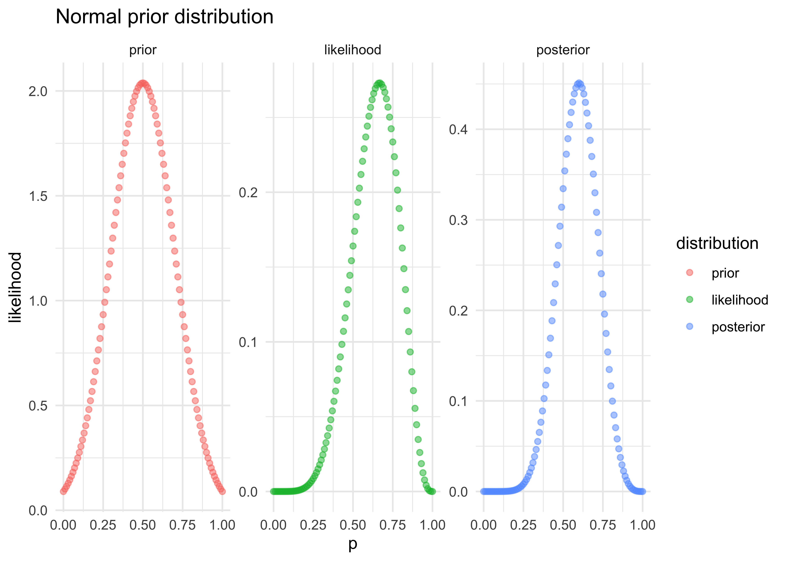

Chapter 2. Small Worlds and Large Worlds
================

  - all models contain a “small world” and a "large world
      - the small world is the self-contained logical world of the model
      - the large world is the broader context in which one deploys a
        model
  - Bayesian models learn from evidence that is optimal in the small
    world and must be demonstrated to perform well in the large world
  - this chapter focuses on the small world

## 2.1 The garden of forking data

  - this chapter is designed to build Bayesian inference from the group
    up
      - it’s really just counting and comparing possibilities
  - Bayesian inference works by considering everything that could have
    happened given the data

## 2.2. Building a model

  - Example:
      - we have a globe representing Earth
      - we are curious how much of the world is covered by water
      - we will solve this by tossing the globe in the air and catch it,
        recording whether our right index finger is on water or land
      - repeating this 9 times produces the following sequence (date):
        `W L W W W L W L W`
  - we can design a simple Bayesian model using the following process:
    1.  *data story*: motivate the model by describing how the data
        might arise
    2.  *update*: educate the model by feeding it data
    3.  *evaluate*: supervise the model and update when needed and
        repeating this process

### 2.2.1 A data story

  - the story for how the data was produced can be descriptive or causal
  - the story must be *complete*: they are sufficient for specifying an
    algorithm for generating new data
  - for this example:
      - the true proportion of water covering the globe is \(p\)
      - a single toss of the globe has a \(p\) probability of producing
        `W` and \(1-p\) of producing `L`
      - each toss of the globe is independent from the others

### 2.2.2 Bayesian updating

  - we now must the plausibility of each possible value of \(p\)
      - we can start with each value of \(p\) being equally likely (an
        “ignorant prior”)
      - with the first `W`, the possibility of \(p=0\) is 0 because we
        have found a `W`
      - with the next value of `L`, \(p=0.5\) is the most likely value
        for \(p\)
      - with each draw of `W`, the curve shifts right as the most likely
        value of \(p\) increases
      - notice that the maximum *height* of the curve increases with
        more data because fewer number of values of \(p\) can explain
        the data, limiting the pool to choose from


### 2.2.3 Evaluate

  - the Bayesian model learns in an optimal way
      - it guarantees perfect inference inthe small world
      - however, the calculations can malfunction, so the results must
        always be checked

## 2.3 Components of the model

  - we must count the following:
      - the number of ways each conjecture could produce an observation
      - the accumulated number of ways each conjecture could produce the
        entire data
      - the initial plausbility of each conjectured cause of the data
        (the prior distribution)

### 2.3.1 Variables

  - variables include things we wish to infer
  - there were three in the globe tossing example:
      - \(p\), the target of the inference, the proportion of water on
        the globe
          - this is an *unobserved* variable and is called a *parameter*
      - the counts of water `W` and land `L` are variables
      - the number of data points total

### 2.3.2 Definitions

  - defining the variables creates a model that relates the variables to
    one another
  - the goal is to count the number of ways the data could arise given
    the assumptions

#### 2.3.2.1 Observed variables

  - for the count of water \(W\) and land \(L\) we can define how
    plausible any combination of \(W\) and \(L\) would be for a
    specified \(p\)
      - use a mathematical function that tells us the right plausibility
      - *likelihood*: a distribution function assigned to an observed
        variable
  - we can use a binomial distribution where the probability of
    observing \(W\) waters and \(L\) lands with a probability \(p\) of
    water on each toss is:

\[
\text{Pr}(W,L|p) = \frac{(W + L)!}{W!L!} p^W (1-p)^L
\]

    * this can be modeled in R as follows, setting $p = 0.5$:

``` r
dbinom(6, size = 9, prob = 0.5)
```

    ## [1] 0.1640625

``` r
probs <- seq(0, 1, 0.01)
likelihoods <- map_dbl(probs, ~ dbinom(6, size = 9, prob = .x))
tibble(p = probs, y = likelihoods) %>%
    ggplot(aes(x = p, y = y)) +
    geom_point(size = 1.5) +
    labs(x = "p", 
         y = "likelihood", 
         title = "Likelihood for various values of 'p'")
```

<!-- -->

#### 2.3.2.2 Unobserved variables

  - each unobserved variable (i.e. *parameter*) must be given a prior
    distribution
      - the priors can be designed to help the machine learn
        (“engineering assumptions”) or to reflect previous knowledge
        of the phenomenon (“scientific prior”)
  - multiple priors should usually be tested
      - important to see how sensitive the model is to different priors

### 2.3.3 A model is born

  - the counts for the water and land variables can be written as the
    following equation where \(N = W+L\)
      - it is the assumption that the relative counts of ways to reliaze
        \(W\) in \(N\) trials with probability \(p\) on each trial comes
        from the binomial distribution

\[
W \sim \text{Binomial}(N,p)
\]

  - the unobserved parameter \(p\) is defined with the uniform
    (ignorant) distribution

\[
p \sim \text{Uniform}(0,1)
\]

## 2.4 Making the model go

  - once all of the variables have been chosen and defined, the priors
    can be updated to produce the *posterior* distribution for \(p\):
    \(\text{Pr}(p|W,L)\)

### 2.4.1 Bayes’ theorem

  - below is an abbreviated derivation of Bayes’ theorem using the
    globe-tossing example
  - the join probability of the data \(W\) and \(L\) and any particular
    \(p\) is below
      - it just says that the probability of \(W\), \(L\), and \(p\) is
        the same as the probability of \(W\) and \(L\) given \(p\) times
        the probability of \(p\)

\[
\text{Pr}(W,L,p) = \text{Pr}(W,L | p) \text{Pr}(p)
\]

  - a similar equation that just rearranges the order of the conditional
    is below

\[
\text{Pr}(W,L,p) = \text{Pr}(p | W,L) \text{Pr}(W,L)
\]

  - these two equations have the same left-hand side, so they can be
    equated and rearranged to produce Bayes’ theorem

\[
\text{Pr}(W,L | p) \text{Pr}(p) = \text{Pr}(p | W,L) \text{Pr}(W,L) \\
\text{Pr}(p | W,L) = \frac{\text{Pr}(W,L | p) \text{Pr}(p)}{\text{Pr}(W,L)}
\]

``` r
tibble(p = probs, 
       prior = dunif(probs),
       likelihood = likelihoods) %>%
    mutate(posterior = prior * likelihoods) %>%
    pivot_longer(-p, names_to = "distribution", values_to = "value") %>%
    mutate(distribution = factor(
        distribution, levels = c("prior", "likelihood", "posterior"))
    ) %>%
    ggplot(aes(x = p, y = value, color = distribution)) +
    facet_wrap(~ distribution, nrow = 1, scales = "free_y") +
    geom_point(alpha = 0.5) +
    labs(x = "p", y = "likelihood", title = "Uniform prior distribution")
```

<!-- -->

``` r
prior2 <- ifelse(probs < 0.5, 0, 1)
prior2 <- prior2 / mean(prior2)

tibble(p = probs, 
       prior = prior2,
       likelihood = likelihoods) %>%
    mutate(posterior = prior * likelihoods) %>%
    pivot_longer(-p, names_to = "distribution", values_to = "value") %>%
    mutate(distribution = factor(
        distribution, levels = c("prior", "likelihood", "posterior"))
    ) %>%
    ggplot(aes(x = p, y = value, color = distribution)) +
    facet_wrap(~ distribution, nrow = 1, scales = "free_y") +
    geom_point(alpha = 0.5) +
    labs(x = "p", y = "likelihood", title = "Stepped prior distribution")
```

<!-- -->

``` r
prior2 <- map_dbl(probs, ~ dnorm(.x, mean = 0.5, sd = 0.2))
prior2 <- prior2 / mean(prior2)

tibble(p = probs, 
       prior = prior2,
       likelihood = likelihoods) %>%
    mutate(posterior = prior * likelihoods) %>%
    pivot_longer(-p, names_to = "distribution", values_to = "value") %>%
    mutate(distribution = factor(
        distribution, levels = c("prior", "likelihood", "posterior"))
    ) %>%
    ggplot(aes(x = p, y = value, color = distribution)) +
    facet_wrap(~ distribution, nrow = 1, scales = "free_y") +
    geom_point(alpha = 0.5) +
    labs(x = "p", y = "likelihood", title = "Normal prior distribution")
```

<!-- -->

### 2.4.2 Motors

  - many of the models we will use cannot be conditioned formally, as
    done in the above examples
      - it depends on the types of distributions used, but we don’t want
        to limit our choice of distributions to those we can do math
        with
  - there are other solves that we will use later in this course
      - grid approximation
      - quadratic approximation
      - Markov chain Monte Carlo (MCMC)
  - we should consider how the model is fit as part of the model

### 2.4.3 Grid approximation

  - even for continuous variables, it is often sufficent to just try
    many different values of each parameter and calculate the posterior
    probability
      - though, for most real uses, it is impractically inefficent
  - we can use grid approximation for the globe-tossing example, the
    steps are:
    1.  define the grid by deciding how many points to use in the
        estimate
    2.  compute the value of the prior for each parameter value
    3.  compute the likelihood at each parameter value
    4.  compute the unstandardized posterior at each grid value by
        multiplying the prior and the likelihood
    5.  standardize the posterior by dividing by the sum

<!-- end list -->

``` r
# 1. define the grid
p_grid <- seq(0, 1, length.out = 20)

# 2. compute the values from the prior
prior <- dunif(p_grid)

# 3. compute the likelihood at each parameter
likelihood <- dbinom(6, size = 9, prob = p_grid)

# 4. compute the posterior values
posterior <- likelihood * prior

# 5. standardize the posteriors
posterior <- posterior / sum(posterior)

# Plot the results
tibble(p = p_grid, posterior = posterior) %>%
    ggplot(aes(x = p_grid, y = posterior)) +
    geom_path(size = 1, alpha = 0.5) +
    geom_point(size = 2) +
    labs(x = "probability of water",
         y = "posterior probability",
         title = "Grid approximation (n = 20)")
```

<!-- -->

### 2.4.4 Quadratic approximation

  - generally, the region near the peak of a posterior distribution is
    nearly Gaussian and can be approximated as such
  - the Gaussian distribution can be described by two numbers: mean and
    variance
  - the Gaussian approximation is called the “quadratic approximation”
    because the logarithm of the Gaussian is a porabola
      - thus, this method approximates the log-posterior with a porabola
  - we will use this method for the first half of this course before
    graduating to MCMC quadratic approximation can be accomplished in R
    with two steps:
    1.  find the posterior mode using a gradient descent algorithm at
        the peak of posterior, estimate the local curvature to compute a
        quadratic approximation of the entire posterior distribution
  - the following code performs this using the `quap()` function from
    the ‘rethinking’ package

<!-- end list -->

``` r
library(rethinking)
```

    ## Loading required package: rstan

    ## Loading required package: StanHeaders

    ## rstan (Version 2.19.3, GitRev: 2e1f913d3ca3)

    ## For execution on a local, multicore CPU with excess RAM we recommend calling
    ## options(mc.cores = parallel::detectCores()).
    ## To avoid recompilation of unchanged Stan programs, we recommend calling
    ## rstan_options(auto_write = TRUE)

    ## 
    ## Attaching package: 'rstan'

    ## The following object is masked from 'package:tidyr':
    ## 
    ##     extract

    ## Loading required package: parallel

    ## Loading required package: dagitty

    ## rethinking (Version 2.00)

    ## 
    ## Attaching package: 'rethinking'

    ## The following object is masked from 'package:purrr':
    ## 
    ##     map

    ## The following object is masked from 'package:stats':
    ## 
    ##     rstudent

``` r
globe_qa <- quap(
    alist(
        W ~ dbinom(W+L, p),  # binomial likelihood
        p ~ dunif(0, 1)      # uniform prior
    ),
    data = list(W = 6, L = 3)
)

globe_qa_res <- precis(globe_qa)
globe_qa_res
```

    ##        mean        sd      5.5%     94.5%
    ## p 0.6666668 0.1571337 0.4155368 0.9177969

``` r
qa_posterior <- dnorm(probs, mean = globe_qa_res$mean, sd = globe_qa_res$sd)
tibble(p = probs,
       posterior = qa_posterior) %>%
    ggplot(aes(x = p, y = posterior)) +
    geom_path(size = 1, alpha = 0.5) +
    geom_point(size = 2) +
    geom_vline(xintercept = globe_qa_res$mean, color = "tomato", size = 2) +
    geom_text(x = globe_qa_res$mean + 0.02, y = 0.08, label = "posterior mean", 
              hjust = 0, color = "tomato") +
    labs(x = "probability of water",
         y = "posterior probability",
         title = "Quadratic approximation")
```

<!-- -->

### 2.4.5 Markov chain Monte Carlo

  - we will use this technique later in the course so it is not
    discussed here

-----

## 2.6 Practice
