Chapter 3. Sampling the Imaginary
================

  - this chapter teaches the basic skills for working with samples from
    the posterior distribution

## 3.1 Sampling from a grid-approximate posterior

  - the following code generates a posterior distribution using grid
    approximation using the globe-tossing model from the previous
    chapter

<!-- end list -->

``` r
p_grid <- seq(from = 0, to = 1, length.out = 1e3)
prior <- rep(1, 1e3)
likelihood <- dbinom(6, size = 9, prob = p_grid)
posterior <- likelihood * prior
posterior <- posterior / sum(posterior)

plot(density(posterior))
```

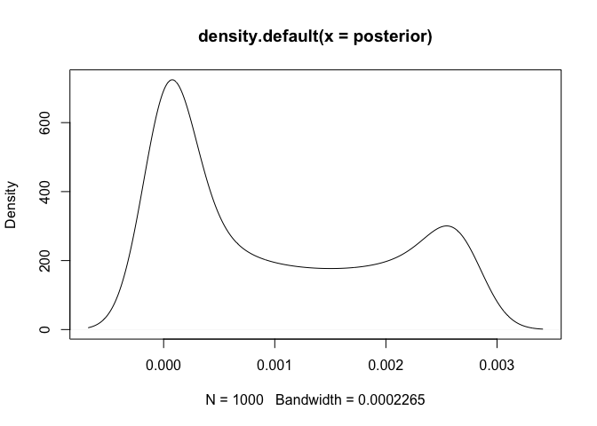<!-- -->

  - we can think of the posterior as a bucket full of parameter values
      - each value is present in proportion to its posterior probability
      - is we scoop out a bunch of parameters, we will scoop out more of
        the parameter values that are more likely by the posterior
  - parameter values are samples from `p_grid` with the probability of
    sampling each parameter given by its posterior

<!-- end list -->

``` r
samples <- sample(p_grid, prob = posterior, size = 1e4, replace = TRUE)
plot(samples)
```

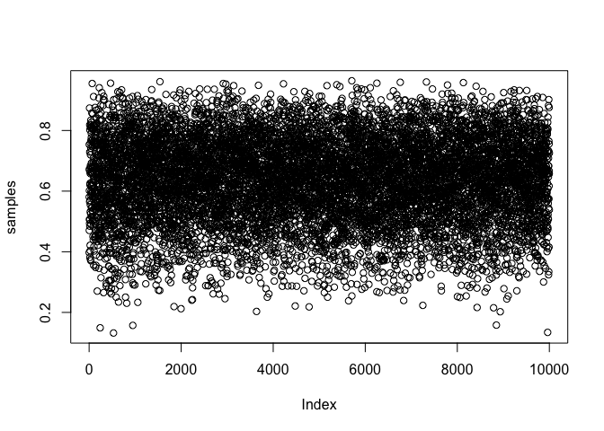<!-- -->

``` r
plot(density(samples))
```

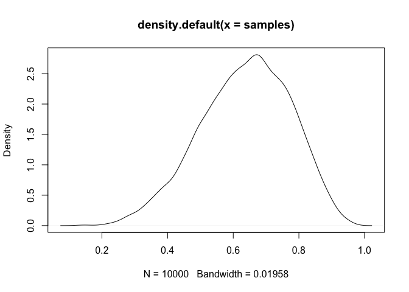<!-- -->

  - the estimated density (above) is very similar to the posterior
    computed via grid approximation
      - therefore we can use these samples to describe and understand
        the posterior

## 3.2 Sampling to summarize

  - here are some common questions to ask about the posterior:
      - how much posterior probability lies below some parameter value?
      - how much posterior probability lies between two parameter
        values?
      - which parameter value marks the lower 5% of the posterior
        probability?
      - which range of the parameter values contains 90% of the
        posterior probability?
      - which parameter value has the highest posterior probability?
  - these questions can be separated into 3 categories: *defined
    boundaries*, *defined probability mass*, and *point estimates*

### 3.2.1 Intervals of defined boundaries

  - we can be asked: What is the posterior probability that the
    proportion of water is less than 0.5?
      - this can be done by adding up the probabilities that correspond
        to a parameter value less than 0.5

<!-- end list -->

``` r
sum(posterior[p_grid < 0.5])
```

    ## [1] 0.1718746

  - however, this calculation using the grid approximation becomes far
    more complicated when there is more than one parameter
  - we can also find it using the samples from the posterior
      - we basically find the frequency of samples below 0.5

<!-- end list -->

``` r
sum(samples < 0.5) / length(samples)
```

    ## [1] 0.1696

  - we can also ask: How much of the posterior lies between 0.5 and
    0.75?

<!-- end list -->

``` r
sum(samples > 0.5 & samples < 0.75) / length(samples)
```

    ## [1] 0.6071

### 3.2.2 Intervals of defined mass

  - the “confidence interval” is an *interval of defined mass*
  - the interval of the posterior probability is called the *credible
    interval*
      - this is often referred to as a *percentile interval* (PI)
  - we can calculate the middle 80% of a posterior distribution using
    the `quantile()` function

<!-- end list -->

``` r
quantile(samples, c(0.1, 0.9))
```

    ##       10%       90% 
    ## 0.4514515 0.8098098

  - however, a credible interval can be misleading if the sampled
    posterior is too asymmetric
      - this is shown in the following example of the globe tossing
        where the data is only 3 `W` (waters) in 3 tosses
      - the 50% credible interval misses the most probable value, near
        \(p=1\)

<!-- end list -->

``` r
# Grid approximation of the posterior probabilities.
p_grid <- seq(from = 0, to = 1, length.out = 1e3)
prior <- rep(1, 1e3)
likelihood <- dbinom(3, size = 3, prob = p_grid)
posterior <- likelihood * prior
posterior <- posterior / sum(posterior)

# Sample the posterior.
samples <- sample(p_grid, prob = posterior, size = 1e4, replace = TRUE)

ci <- quantile(samples, c(0.25, 0.75))

tibble(x = samples) %>%
    ggplot(aes(x = x)) +
    geom_density(color = "grey50") +
    geom_vline(xintercept = as.numeric(ci), 
               lty = 1, size = 2, color = "dodgerblue") +
    scale_x_continuous(expand = c(0, 0.02)) +
    scale_y_continuous(expand = c(0, 0.1)) +
    labs(x = "parameter values", 
         y = "posterior probability")
```

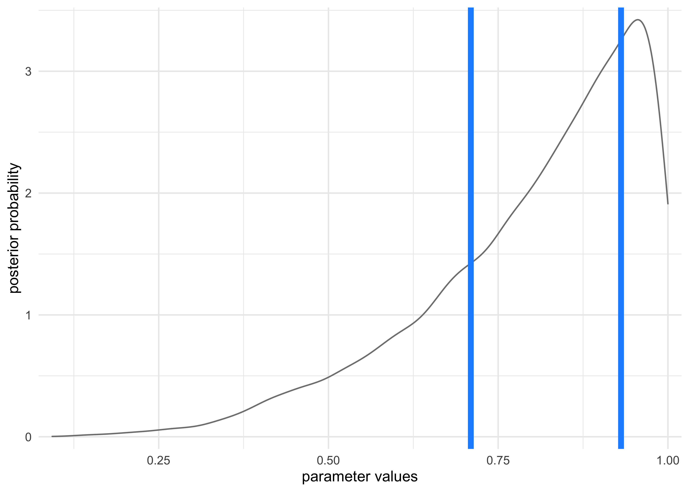<!-- -->

  - alternatively, the *highest posterior density interval* (HPDI) is
    the narrowest interval containing the specified probability mass
      - there are many intervals that can contain some percent of the
        mass, but the narrowest interval represents the most “dense”
        part of the posterior distribution
      - the ‘rethinking’ package has the `HPDI()` function for
        calculating this value

<!-- end list -->

``` r
HPDI(samples, prob = 0.5)
```

    ##      |0.5      0.5| 
    ## 0.8448448 1.0000000

``` r
tibble(x = samples) %>%
    ggplot(aes(x = x)) +
    geom_density(color = "grey50") +
    geom_vline(xintercept = as.numeric(HPDI(samples, prob = 0.5)), 
               lty = 1, size = 2, color = "dodgerblue") +
    scale_x_continuous(expand = c(0, 0.02)) +
    scale_y_continuous(expand = c(0, 0.1)) +
    labs(x = "parameter values", 
         y = "posterior probability")
```

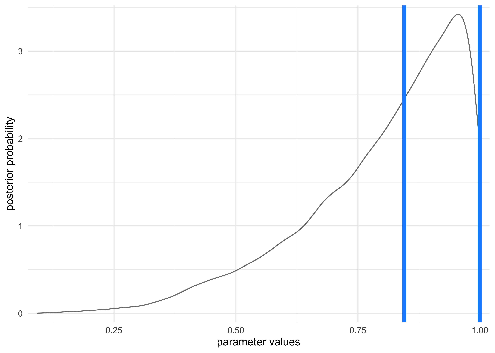<!-- -->

  - usually the PI and HPDI are quite similar
      - HDPI can be more computationally expensive to compute and have
        more *simulation variance* than the PI

### 3.2.2 Point estimates

  - *the entire posterior distribution is the Bayesian parameter
    estimate*
      - summarizing it with a single value is difficult and often
        unnecessary
  - the *maximum a posteriori* (MAP) estimate is the highest posterior
    probability
      - this is really just he mode of the sampled distribution

<!-- end list -->

``` r
p_grid[which.max(posterior)]
```

    ## [1] 1

  - when we only have samples from the posterior, it must be
    approximated

<!-- end list -->

``` r
chainmode(samples, adj = 0.01)
```

    ## [1] 0.9953597

  - we can also report the mean or median, but they all have different
    values in this example

<!-- end list -->

``` r
mean(samples)
```

    ## [1] 0.802544

``` r
median(samples)
```

    ## [1] 0.8448448

  - we can use a *loss function* to provide a cost to use any particular
    point estimate
      - one common loss function is the absolute loss function \(d-p\)
        which reports the loss as the absolute difference between the
        real and predicted
          - this results with the optimal choice as the median because
            it splits the density of the posterior distribution in half
      - the quadratic loss \((d-p)^2\) leads to the posterior mean being
        the best point estimate

## 3.3 Sampling to simulate prediction

  - the samples from the posterior allow for simulation of the model’s
    implied observations
  - this is useful for:
      - *model checking*: simulating implied observations to check for
        model fit and model behavior
      - *software validation*: check the model fitting procedure worked
      - *research design*: simulating observations from the hypothesis
        to evaluate whether the research design ca be effective
        (including “power analysis”)
      - *forecasting*: simulate new predictions from new cases and
        future observations
  - this chapter looks into model checking

### Dummy data

  - the globe-tossing model:
      - there is a fixed proportion of water \(p\) that we are trying to
        infer
      - tossing and catching the globe produces observations of “water”
        and “land” that appear in proportion to \(p\) and \(1-p\)
  - likelihood functions “work in both directions”:
      - given a realized observation, the likelihood function says how
        plausible the observation is
      - given the parameters, the likelihood defines a distribution of
        possible observations to sample from
          - *Bayesian models are always generative*
  - we will call the simulated data “dummy data”
      - it comes from a binomial likelihood where \(w\) is water and
        \(n\) is the number of tosses:

\[
\Pr(w | n,p) = \frac{n!}{w! (n-w)!} p^w (1-p)^{n-w}
\]

  - if we use \(p=0.7\), then we can sample from the binomial by
    sampling from the posterior we have from the modeling, or just use
    the `rbinom()` function
      - the following samples represent the number of waters expected
        from `size` tosses with a \(p=0.7\)

<!-- end list -->

``` r
rbinom(1, size = 2, prob = 0.7)
```

    ## [1] 1

``` r
rbinom(10, size = 2, prob = 0.7)
```

    ##  [1] 1 2 0 1 2 2 1 1 1 1

``` r
dummy_w <- rbinom(1e5, size = 2, prob = 0.7)
table(dummy_w) / length(dummy_w)
```

    ## dummy_w
    ##       0       1       2 
    ## 0.08910 0.42262 0.48828

  - the following samples 9 tosses and counts the number of waters
    expected given \(p=0.7\)

<!-- end list -->

``` r
dummy_w <- rbinom(1e5, size = 9, prob = 0.7)
simplehist(dummy_w, xlab = "dummy water count")
```

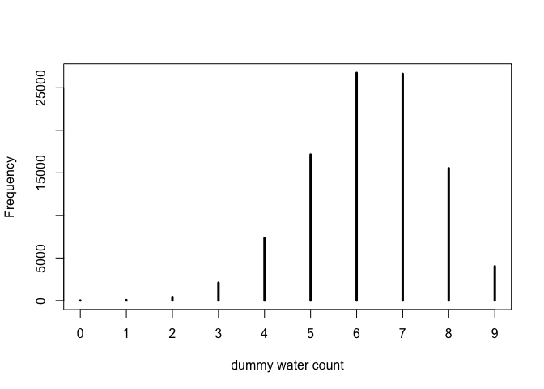<!-- -->

### 3.3.2 Model checking

  - this is:
    1.  ensuring the model fitting worked correctly
    2.  evaluating the adequacy of the model for some purpose

#### 3.3.2.1 Did the software work?

  - there is no perfect method for doing this
  - the globe-tossing example is so simple we cannot do much here, but
    this will be revisited in later chapters

#### 3.3.2.2 Is the model adequate?

  - the goal is to assess exactly how the model fails to describe the
    data
      - this is a path towards model comprehension, revision, and
        improvement
  - all models fail (they are not perfect representations), so we have
    to decide whether the failures are important or not
  - we will do some basic model checking using the simulated
    observations of the globe-tossing model
  - there are two types of uncertainty in the model predictions:
    1.  *observation uncertainty* is the uncertainty in the pattern of
        observations; even if we know \(p\), we do not know the next
        result of tossing the globe
    2.  *uncertainty about \(p\)* is embodied by the posterior
        distribution
  - we want to propagate the parameter uncertainty as we evaluate the
    implied predictions
      - this means averaging over the posterior density for \(p\) when
        computing predictions
      - compute the sampling distribution of outcomes at each \(p\) and
        average those distributions to make the *posterior predictive
        distribution*
  - this method provides a better idea of the uncertainty in the model
    by using the entire posterior distribution instead of a single point
    estimate
      - the following code shows the process of making the *posterior
        predictive distribution*
      - we can use the `samples` variable because it has draws of \(p\)
        in proportion to their posterior probabilities

<!-- end list -->

``` r
# Globe tossing model with 6 waters from 9 tosses
p_grid <- seq(from = 0, to = 1, length.out = 1e3)
prior <- rep(1, 1e3)
likelihood <- dbinom(6, size = 9, prob = p_grid)
posterior <- likelihood * prior
posterior <- posterior / sum(posterior)

# Sample from the posterior
samples <- sample(p_grid, prob = posterior, size = 1e5, replace = TRUE)
```

``` r
posterior_dist <- tibble(x = samples) %>%
    ggplot(aes(x = x)) +
    geom_density() +
    labs(x = "proportion of water (p)",
         y = "likelihood",
         title = "Posterior probability")

small_grid <- seq(0.1, 0.9, 0.1)
sampled_dists <- tibble(p = small_grid) %>%
    mutate(sampled_dists = purrr::map(p, ~ rbinom(1e4, size = 9, prob = .x))) %>%
    unnest(sampled_dists) %>%
    ggplot(aes(x = sampled_dists)) +
    facet_wrap(~ p, nrow = 1) +
    geom_histogram(binwidth = 1, fill = "grey90", color = "grey40") +
    theme(axis.text.x = element_blank()) +
    labs(x = "number of waters",
         y = "count",
         title = "Sampled data from different proportions of water")

w <- rbinom(1e4, size = 9, prob = samples)
posterior_predictive_dist <- tibble(x = w) %>%
    ggplot(aes(x = x)) +
    geom_histogram(binwidth = 1, fill = "grey90", color = "grey40") +
    labs(x = "number of waters",
         y = "count",
         title = "Posterior predictive distribution")


(posterior_dist / sampled_dists /posterior_predictive_dist) +
    plot_layout(heights = c(2, 1, 2))
```

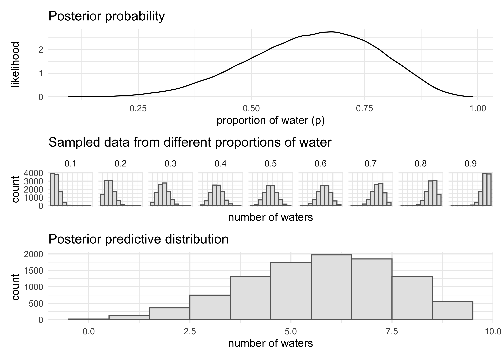<!-- -->

  - we can compare the posterior predictive distribution to the
    distribution if we only took samples from the MAP of the posterior

<!-- end list -->

``` r
posteior_map <- chainmode(samples, adj = 0.01)

map_samples <- rbinom(1e4, size = 9, prob = posteior_map)

tibble(ppd = list(w),
                         map_dist = list(map_samples)) %>%
    pivot_longer(ppd:map_dist, names_to = "distribution", values_to = "sampled_vals") %>%
    unnest(sampled_vals) %>%
    ggplot(aes(x = sampled_vals)) +
    geom_histogram(aes(fill = distribution, 
                       color = distribution), position = "identity",
                   alpha = 0.3, binwidth = 1) +
    scale_fill_brewer(type = "qual", palette = "Set1", 
                      labels = c("MAP dist.", "PPD")) +
    scale_color_brewer(type = "qual", palette = "Set1", 
                      labels = c("MAP dist.", "PPD")) +
    labs(x = "number of waters",
         y = "count",
         title = "Posterior predictive distribution vs. distribution using MAP")
```

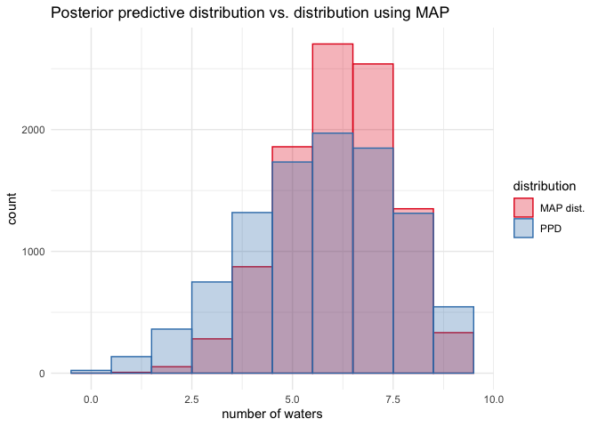<!-- -->

  - we can also look at the actual sequences of data
      - how long are the stretches of repeated “waters” when tossing the
        globe?
      - how many “switches” are there from “water” to “land”
  - these test how well the assumptions that the observed samples are
    independent from each other
      - inconsistencies here may or may not be important depending on
        the cause
      - for example:
          - the number of switches from “water” to “land” was higher in
            the observed data than predicted if the tosses were
            independent
          - this just means that each toss provides less information
            about the true coverage of the globe, but the model will
            still converge on the correct proportion
          - however, it will converge more slowly than the posterior
            distribution may lead us to believe

-----

## 3.5 Practice

### Easy

“These problems use the samples from the posterior distribution for the
globe tossing example. This code will give you a specific set of
samples, so that you can check your answers exactly.”

``` r
p_grid <- seq(from = 0, to = 1, length.out = 1000)
prior <- rep(1, 1000)
likelihood <- dbinom(6, size=9, prob = p_grid)
posterior <- likelihood * prior
posterior <- posterior / sum(posterior)
set.seed(100)
samples <- sample(p_grid, prob = posterior, size=1e4, replace = TRUE)
```

**3E1. How much posterior probability lies below p = 0.2?**

``` r
sum(samples < 0.2) / length(samples)
```

    ## [1] 4e-04

**3E2. How much posterior probability lies above p = 0.8?**

``` r
sum(samples > 0.8) / length(samples)
```

    ## [1] 0.1116

**3E3. How much posterior probability lies between p = 0.2 and p =
0.8?**

``` r
sum(samples > 0.2 & samples < 0.8) / length(samples)
```

    ## [1] 0.888

**3E4. 20% of the posterior probability lies below which value of p?**

``` r
quantile(samples, 0.2)
```

    ##       20% 
    ## 0.5185185

**3E5. 20% of the posterior probability lies above which value of p?**

``` r
quantile(samples, 0.8)
```

    ##       80% 
    ## 0.7557558

**3E6. Which values of p contain the narrowest interval equal to 66% of
the posterior probability?**

``` r
HPDI(samples, prob = 0.66)
```

    ##     |0.66     0.66| 
    ## 0.5085085 0.7737738

**3E7. Which values of p contain 66% of the posterior probability,
assuming equal posterior probability both below and above the
interval?**

``` r
PI(samples, prob = 0.66)
```

    ##       17%       83% 
    ## 0.5025025 0.7697698

### Medium

**3M1. Suppose the globe tossing data had turned out to be 8 water in 15
tosses. Construct the posterior distribution, using grid approximation.
Use the same flat prior as before.**

``` r
set.seed(0)

p_grid <- seq(0, 1, length.out = 1e4)
prior <- rep(1, 1e4)
likelihood <- dbinom(x = 8, size = 15, prob = p_grid)
posterior <- prior * likelihood
posterior <- posterior / sum(posterior)

plot(density(posterior))
```

<!-- -->

**3M2. Draw 10,000 samples from the grid approximation from above. Then
use the samples to calculate the 90% HPDI for p.**

``` r
set.seed(0)
samples <- sample(p_grid, size = 1e4, prob = posterior, replace = TRUE)

HPDI(samples, prob = 0.90)
```

    ##      |0.9      0.9| 
    ## 0.3304330 0.7166717

``` r
plot(density(samples))
```

<!-- -->

**3M3. Construct a posterior predictive check for this model and data.
This means simulate the distribution of samples, averaging over the
posterior uncertainty in p. What is the probability of observing 8 water
in 15 tosses?**

``` r
ppd <- rbinom(1e4, size = 15, prob = samples)
sum(ppd == 8) / length(ppd)
```

    ## [1] 0.1547

``` r
simplehist(ppd)
```

<!-- -->

**3M4. Using the posterior distribution constructed from the new (8/15)
data, now calculate the probability of observing 6 water in 9 tosses.**

``` r
ppd <- rbinom(1e4, size = 9, prob = samples)
sum(ppd == 6) / length(ppd)
```

    ## [1] 0.1735

``` r
simplehist(ppd)
```

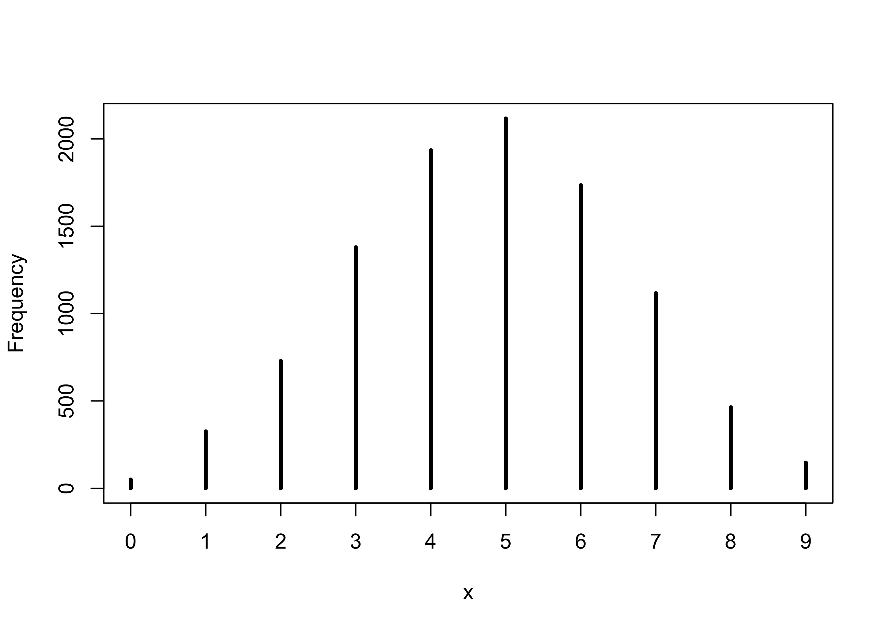<!-- -->

**3M5. Start over at 3M1, but now use a prior that is zero below p = 0.5
and a constant above p = 0.5. This corresponds to prior information that
a majority of the Earth’s surface is water. Repeat each problem above
and compare the inferences. What difference does the better prior make?
If it helps, compare inferences (using both priors) to the true value p
= 0.7.**

``` r
set.seed(0)

p_grid <- seq(0, 1, length.out = 1e4)
prior <- ifelse(p_grid < 0.5, 0, 1)
likelihood <- dbinom(x = 8, size = 15, prob = p_grid)
posterior <- prior * likelihood
posterior <- posterior / sum(posterior)

samples <- sample(p_grid, size = 1e4, prob = posterior, replace = TRUE)
cat("HPDI:\n")
```

    ## HPDI:

``` r
HPDI(samples, prob = 0.90)
```

    ##      |0.9      0.9| 
    ## 0.5000500 0.7119712

``` r
cat("\n")
```

``` r
ppd <- rbinom(1e4, size = 15, prob = samples)
glue("Prob of 8 waters of 15 tosses: {sum(ppd == 8) / length(ppd)}")
```

    ## Prob of 8 waters of 15 tosses: 0.1632

``` r
ppd <- rbinom(1e4, size = 9, prob = samples)
glue("Prob of 6 waters of 9 tosses: {sum(ppd == 6) / length(ppd)}")
```

    ## Prob of 6 waters of 9 tosses: 0.2266

### Hard

Introduction. The practice problems here all use the data below. These
data indicate the gender (male=1, female=0) of officially reported first
and second born children in 100 two-child families. So for example, the
first family in the data reported a boy (1) and then a girl (0). The
second family reported a girl (0) and then a boy (1). The third family
reported two girls. You can load these two vectors into R’s memory by
typing:

``` r
data(homeworkch3)

head(birth1)
```

    ## [1] 1 0 0 0 1 1

``` r
head(birth2)
```

    ## [1] 0 1 0 1 0 1

**3H1. Using grid approximation, compute the posterior distribution for
the probability of a birth being a boy. Assume a uniform prior
probability. Which parameter value maximizes the posterior
probability?**

``` r
set.seed(0)

all_births <- c(birth1, birth2)
num_boys <- sum(all_births == 1)
num_births <- length(all_births)

p_grid <- seq(0, 1, length.out = 1e4)
prior <- rep(1, 1e4)
likelihood <- dbinom(num_boys, size = num_births, prob = p_grid)
posterior <- prior * likelihood
posterior <- posterior / sum(posterior)

glue("MAP of prob of getting a boy: {round(p_grid[which.max(posterior)], 5)}")
```

    ## MAP of prob of getting a boy: 0.55496

**3H2. Using the sample function, draw 10,000 random parameter values
from the posterior distribution you calculated above. Use these samples
to estimate the 50%, 89%, and 97% highest posterior density intervals.**

``` r
birth_samples <- sample(p_grid, size = 1e4, replace = TRUE, prob = posterior)
plot(density(birth_samples))
```

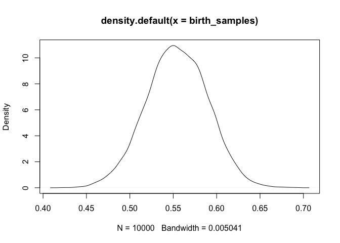<!-- -->

``` r
purrr::map(c(0.5, 0.89, 0.97), ~ HPDI(birth_samples, prob = .x))
```

    ## [[1]]
    ##      |0.5      0.5| 
    ## 0.5298530 0.5778578 
    ## 
    ## [[2]]
    ##     |0.89     0.89| 
    ## 0.5012501 0.6131613 
    ## 
    ## [[3]]
    ##     |0.97     0.97| 
    ## 0.4750475 0.6271627

**3H3. Use rbinom to simulate 10,000 replicates of 200 births. You
should end up with 10,000 numbers, each one a count of boys out of 200
births. Compare the distribution of predicted numbers of boys to the
actual count in the data (111 boys out of 200 births). There are many
good ways to visualize the simulations, but the dens command (part of
the rethinking package) is probably the easiest way in this case. Does
it look like the model fits the data well? That is, does the
distribution of predictions include the actual observation as a central,
likely outcome?**

``` r
boy_counts <- rbinom(1e4, 200, prob = birth_samples)
tibble(x = boy_counts) %>%
    ggplot(aes(x = x)) +
    geom_density(color = "grey40", fill = "grey95", size = 1) +
    geom_vline(xintercept = num_boys, color = "grey10", size = 1.3, lty = 2) +
    geom_text(data = tibble(x = num_boys + 1, y = 0, label = "actual num. boys"),
              aes(x = x, y = y, label = label),
              hjust = 0, vjust = -1, color = "grey10") +
    scale_y_continuous(expand = expansion(mult = c(0, 0.02))) +
    labs(x = "number of boys in 200 births",
         y = "probability density",
         title = "Comparing the model to number of boys in `birth1` and `birth2`",
         subtitle = "The density is the PPD of the model and the dashed line is the actual number of boys")
```

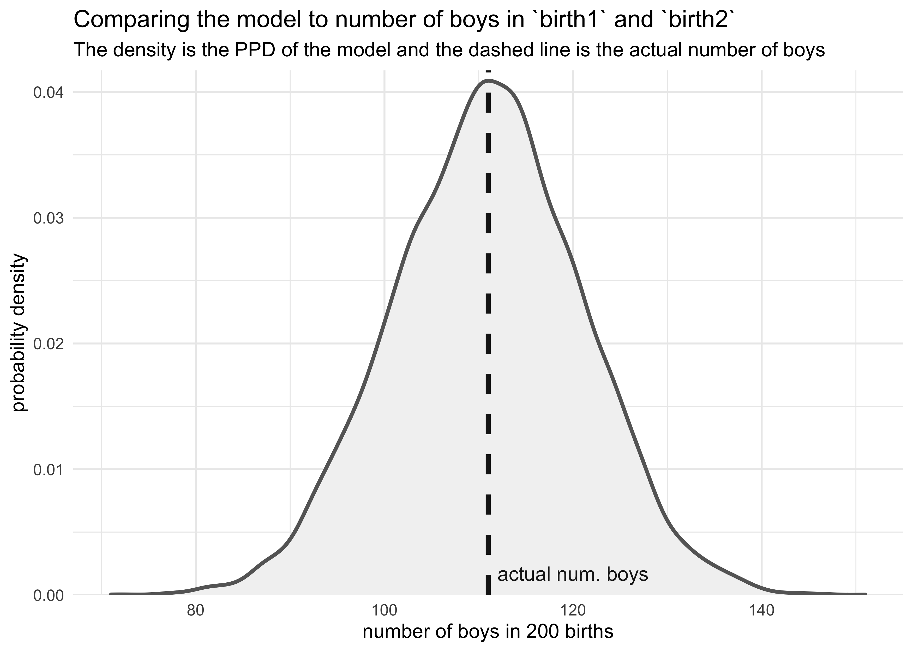<!-- -->

**3H4. Now compare 10,000 counts of boys from 100 simulated first borns
only to the number of boys in the first births, birth1. How does the
model look in this light?**

``` r
boy_counts <- rbinom(1e4, 100, prob = birth_samples)
tibble(x = boy_counts) %>%
    ggplot(aes(x = x)) +
    geom_density(color = "grey40", fill = "grey95", size = 1) +
    geom_vline(xintercept = sum(birth1), color = "grey10", size = 1.3, lty = 2) +
    geom_text(data = tibble(x = sum(birth1) + 1, 
                            y = 0, 
                            label = "actual num. boys"),
              aes(x = x, y = y, label = label),
              hjust = 0, vjust = -1, color = "grey10") +
    scale_y_continuous(expand = expansion(mult = c(0, 0.02))) +
    labs(x = "number of boys in 100 births",
         y = "probability density",
         title = "Comparing the model to number of boys in `birth1`",
         subtitle = "The density is the PPD of the model and the dashed line is the actual number of boys")
```

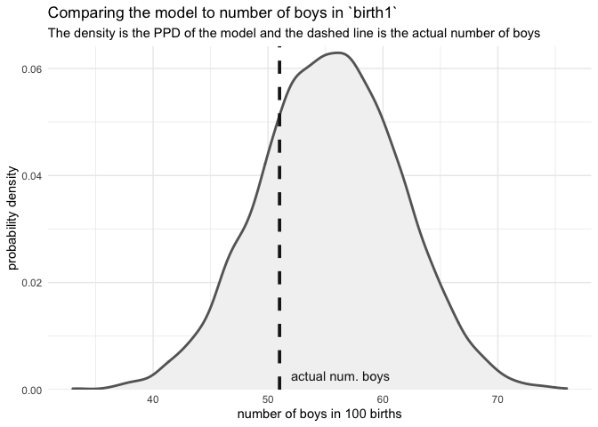<!-- -->

**3H5. The model assumes that sex of first and second births are
independent. To check this assumption, focus now on second births that
followed female first borns. Compare 10,000 simulated counts of boys to
only those second births that followed girls. To do this correctly, you
need to count the number of first borns who were girls and simulate that
many births, 10,000 times. Compare the counts of boys in your
simulations to the actual observed count of boys following girls. How
does the model look in this light? Any guesses what is going on in these
data?**

``` r
num_girls_first <- sum(birth1 == 0)
birth2_after_girl <- birth2[birth1 == 0]

glue("There were {num_girls_first} girls in `birth1`")
```

    ## There were 49 girls in `birth1`

``` r
glue("There were {sum(birth2_after_girl)} boys that followed girls.")
```

    ## There were 39 boys that followed girls.

``` r
boy_counts <- rbinom(1e4, num_girls_first, prob = birth_samples)
tibble(x = boy_counts) %>%
    ggplot(aes(x = x)) +
    geom_density(color = "grey40", fill = "grey95", size = 1) +
    geom_vline(xintercept = sum(birth2_after_girl), color = "grey10", size = 1.3, lty = 2) +
    geom_text(data = tibble(x = sum(birth2_after_girl) - 0.5, 
                            y = 0, 
                            label = "actual num. boys"),
              aes(x = x, y = y, label = label),
              hjust = 1, vjust = -2, color = "grey10") +
    scale_y_continuous(expand = expansion(mult = c(0, 0.02))) +
    labs(x = "number of boys in 100 births",
         y = "probability density",
         title = "Comparing the model to number of boys in `birth1`",
         subtitle = "The density is the PPD of the model and the dashed line is the actual number of boys")
```

<!-- -->
