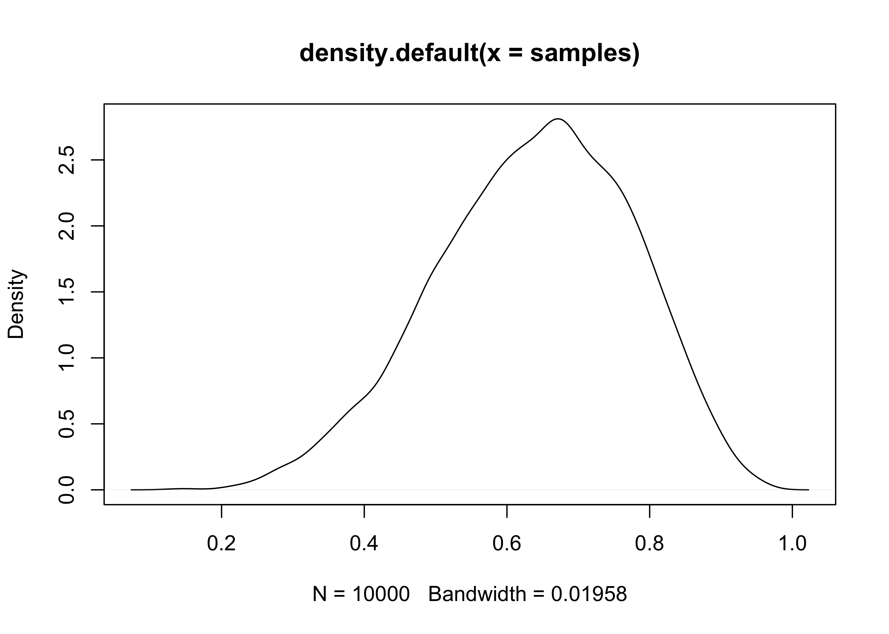

Chapter 3. Sampling the Imaginary
================

  - this chapter teaches the basic skills for working with samples from
    the posterior distribution

## 3.1 Sampling from a grid-approximate posterior

  - the following code generates a posterior distribution using grid
    approximation using the globe-tossing model from the previous
    chapter

<!-- end list -->

``` r
p_grid <- seq(from = 0, to = 1, length.out = 1e3)
prior <- rep(1, 1e3)
likelihood <- dbinom(6, size = 9, prob = p_grid)
posterior <- likelihood * prior
posterior <- posterior / sum(posterior)

plot(density(posterior))
```

<!-- -->

  - we can think of the posterior as a bucket full of parameter values
      - each value is present in proportion to its posterior probability
      - is we scoop out a bunch of parameters, we will scoop out more of
        the parameter values that are more likely by the posterior
  - parameter values are samples from `p_grid` with the probability of
    sampling each parameter given by its posterior

<!-- end list -->

``` r
samples <- sample(p_grid, prob = posterior, size = 1e4, replace = TRUE)
plot(samples)
```

<!-- -->

``` r
plot(density(samples))
```

<!-- -->

  - the estimated density (above) is very simillar to the posteior
    computed via grid approximation
      - therefore we can use these samples to describe and understand
        the posterior

## 3.2 Sampling to summarize

  - here are some common questions to ask about the posterior:
      - how much posterior probability lies below some parameter value?
      - how much posterior probability lies between two parameter
        values?
      - which parameter value marks the lower 5% of the posterior
        probability?
      - which range of the parameter values contains 90% of the
        posterior probability?
      - which parameter value has the highest posterior probability?
  - these questions can be seaprated into 3 categories: *defined
    boundaries*, *defined probability mass*, and *point estimates*

### 3.2.1 Intervals of defined boundaries

  - we can be asked: What is the posterior probability that the
    proportion of water is less than 0.5?
      - this can be done by adding up the probabilities that correspond
        to a parameter value less than 0.5

<!-- end list -->

``` r
sum(posterior[p_grid < 0.5])
```

    ## [1] 0.1718746

  - however, this calcualtion using the grid approximation becomes far
    more complicated when there is more than one parameter
  - we can also find it using the samples from the posterior
      - we basically find the frequency of samples below 0.5

<!-- end list -->

``` r
sum(samples < 0.5) / length(samples)
```

    ## [1] 0.1696

  - we can also ask: How much of the posterior lies between 0.5 and
    0.75?

<!-- end list -->

``` r
sum(samples > 0.5 & samples < 0.75) / length(samples)
```

    ## [1] 0.6071

### 3.2.2 Intervals of defined mass

  - the “confidence interval” is an *interval of defined mass*
  - the interval of the posterior probability is called the *credible
    interval*
      - this is often referred to as a *percentile interval* (PI)
  - we can calcuate the middle 80% of a posterior distribution using the
    `quantile()` function

<!-- end list -->

``` r
quantile(samples, c(0.1, 0.9))
```

    ##       10%       90% 
    ## 0.4514515 0.8098098

  - however, a credible interval can be misleading if the sampled
    posterior is too asymmetric
      - this is shown in the following example of the globe tossing
        where the data is only 3 `W` (waters) in 3 tosses
      - the 50% credible interval misses the most probable value, near
        \(p=1\)

<!-- end list -->

``` r
# Grid approximation of the posterior probabilities.
p_grid <- seq(from = 0, to = 1, length.out = 1e3)
prior <- rep(1, 1e3)
likelihood <- dbinom(3, size = 3, prob = p_grid)
posterior <- likelihood * prior
posterior <- posterior / sum(posterior)

# Sample the posterior.
samples <- sample(p_grid, prob = posterior, size = 1e4, replace = TRUE)

ci <- quantile(samples, c(0.25, 0.75))

tibble(x = samples) %>%
    ggplot(aes(x = x)) +
    geom_density(color = "grey50") +
    geom_vline(xintercept = as.numeric(ci), 
               lty = 1, size = 2, color = "dodgerblue") +
    scale_x_continuous(expand = c(0, 0.02)) +
    scale_y_continuous(expand = c(0, 0.1)) +
    labs(x = "parameter values", 
         y = "posterior probability")
```

<!-- -->

  - alternatively, the *highest posterior density interval* (HPDI) is
    the narrowest interval containing the specified probability mass
      - there are many intervals that can contain some percent of the
        mass, but the narrowest interval represents the most “dense”
        part of the posterior distribution
      - the ‘rethinking’ package has the `HPDI()` function for
        calculating this value

<!-- end list -->

``` r
HPDI(samples, prob = 0.5)
```

    ##      |0.5      0.5| 
    ## 0.8448448 1.0000000

``` r
tibble(x = samples) %>%
    ggplot(aes(x = x)) +
    geom_density(color = "grey50") +
    geom_vline(xintercept = as.numeric(HPDI(samples, prob = 0.5)), 
               lty = 1, size = 2, color = "dodgerblue") +
    scale_x_continuous(expand = c(0, 0.02)) +
    scale_y_continuous(expand = c(0, 0.1)) +
    labs(x = "parameter values", 
         y = "posterior probability")
```

<!-- -->

  - usually the PI and HPDI are quite simillar
      - HDPI can be more computationally expensive to compute and have
        more *simulation variance* than the PI

### 3.2.2 Point estimates

  - *the entire posterior distribution is the Bayesian parameter
    estimate*
      - summarizing it with a single value is difficult and often
        unnecessary
  - the *maximum a posteriori* (MAP) estimate is the highest posterior
    probability
      - this is really just he mode of the sampled distribution

<!-- end list -->

``` r
p_grid[which.max(posterior)]
```

    ## [1] 1

  - when we only have samples from the posterior, it must be
    approximated

<!-- end list -->

``` r
chainmode(samples, adj = 0.01)
```

    ## [1] 0.9953597

  - we can also report the mean or median, but they alls have different
    values in this example

<!-- end list -->

``` r
mean(samples)
```

    ## [1] 0.802544

``` r
median(samples)
```

    ## [1] 0.8448448

  - we can use a *loss function* to provide a cost to use any particular
    point estimate
      - one common loss function is the absolute loss function \(d-p\)
        which reports the loss as the absolute difference between the
        real and predicted
          - this results with the optimal choice as the median because
            it splits the density of the posterior distribution in half
      - the quadratic loss \((d-p)^2\) leads to the posterior mean being
        the best point estimate

## 3.3 Sampling to simulate prediction

  - the samples from the posterior allow for simulation of the model’s
    implied observations
  - this is useful for:
      - *model checking*: simulating implied observations to check for
        model fit and model behaviour
      - *software validation*: check the model fitting procedure worked
      - *research design*: simulating observations from the hypothesis
        to evaluate whether the research design ca be effective
        (including “power analysis”)
      - *forecasting*: simulate new predictions from new cases and
        future observations
  - this chapter looks into model checking

### Dummy data

  - the globe-tossing model:
      - there is a fixed proportion of water \(p\) that we are trying to
        infer
      - tossing and catching the globe produces observations of “water”
        and “land” that appear in proportion to \(p\) and \(1-p\)
  - likelihood functions “work in both directions”:
      - given a relaized observation, the likelihood function says how
        plausible the observation is
      - given the parameters, the likelihood defines a distribution of
        possible observations to samples from
          - *Bayesian models are always generative*
  - we will call the simulated data “dummy data”
      - it comes from a binomial likelihood where \(w\) is water and
        \(n\) is the number of tosses:

\[
\Pr(w | n,p) = \frac{n!}{w! (n-w)!} p^w (1-p)^{n-w}
\]

  - if we use \(p=0.7\), then we can sample from the binomial by
    sampling from the posterior we have from the modeling, or just use
    the `rbinom()` function
      - the following samples represent the number of waters expected
        from `size` tosses with a \(p=0.7\)

<!-- end list -->

``` r
rbinom(1, size = 2, prob = 0.7)
```

    ## [1] 1

``` r
rbinom(10, size = 2, prob = 0.7)
```

    ##  [1] 1 2 0 1 2 2 1 1 1 1

``` r
dummy_w <- rbinom(1e5, size = 2, prob = 0.7)
table(dummy_w) / length(dummy_w)
```

    ## dummy_w
    ##       0       1       2 
    ## 0.08910 0.42262 0.48828

  - the following samples 9 tosses and counts the number of waters
    expected given \(p=0.7\)

<!-- end list -->

``` r
dummy_w <- rbinom(1e5, size = 9, prob = 0.7)
simplehist(dummy_w, xlab = "dummy water count")
```

<!-- -->

### 3.3.2 Model checking

  - this is:
    1.  ensuring the model fitting worked correctly
    2.  evaluating the adequacy of the model for some purpose

#### 3.3.2.1 Did the software work?

  - there is no perfect method for doing this
  - the globe-tossing example is so simple we cannot do much here, but
    this will be revisted in later chapters

#### 3.3.2.2 IS the model adequate?

  - the goal is to assess exactly how the model fails to describe the
    data
      - this is a path towards model comprehension, revision, and
        improvement
  - all models fail (they are not perfect representations), so we have
    to decide whether the failures are important or not
  - we will do some basic model checking using the simulated
    observations of the globe-tossing model
  - there are two types of uncertainty in the model predictions:
    1.  *observation uncertainty* is the uncertainty in the pattern of
        observations; even if we know \(p\), we do not know the next
        result of tossing the globe
    2.  *uncertainty about \(p\)* is embodied by the posterior
        distribution
  - we want to propogate the parameter uncertainty as we evalute the
    implied predictions
      - this means averaging over the posterior density for \(p\) when
        computing predictions
      - compute the sampling distribution of outcomes at each \(p\) and
        average those distributions to make the *posterior predictive
        distribution*
  - this method provides a better idea of the uncertainty in the model
    by using the entire posteior distribution instead of a single point
    estimate
      - the following code shows the process of making the *posterior
        predictive distribution*
      - we can use the `samples` variable because it has draws of \(p\)
        in proportion to their posterior probabilities

<!-- end list -->

``` r
# Globe tossing model with 6 waters from 9 tosses
p_grid <- seq(from = 0, to = 1, length.out = 1e3)
prior <- rep(1, 1e3)
likelihood <- dbinom(6, size = 9, prob = p_grid)
posterior <- likelihood * prior
posterior <- posterior / sum(posterior)

# Sample from the posterior
samples <- sample(p_grid, prob = posterior, size = 1e5, replace = TRUE)
```

``` r
posterior_dist <- tibble(x = samples) %>%
    ggplot(aes(x = x)) +
    geom_density() +
    labs(x = "proportion of water (p)",
         y = "likelihood",
         title = "Posterior probability")

small_grid <- seq(0.1, 0.9, 0.1)
sampled_dists <- tibble(p = small_grid) %>%
    mutate(sampled_dists = purrr::map(p, ~ rbinom(1e4, size = 9, prob = .x))) %>%
    unnest(sampled_dists) %>%
    ggplot(aes(x = sampled_dists)) +
    facet_wrap(~ p, nrow = 1) +
    geom_histogram(binwidth = 1, fill = "grey90", color = "grey40") +
    theme(axis.text.x = element_blank()) +
    labs(x = "number of waters",
         y = "count",
         title = "Sampled data from different proportions of water")

w <- rbinom(1e4, size = 9, prob = samples)
posterior_predictive_dist <- tibble(x = w) %>%
    ggplot(aes(x = x)) +
    geom_histogram(binwidth = 1, fill = "grey90", color = "grey40") +
    labs(x = "number of waters",
         y = "count",
         title = "Posterior predictive distribution")


(posterior_dist / sampled_dists /posterior_predictive_dist) +
    plot_layout(heights = c(2, 1, 2))
```

<!-- -->

  - we can compare the posterior predictive distribution to the
    distribution if we only took samples from the MAP of the posterior

<!-- end list -->

``` r
posteior_map <- chainmode(samples, adj = 0.01)

map_samples <- rbinom(1e4, size = 9, prob = posteior_map)

tibble(ppd = list(w),
                         map_dist = list(map_samples)) %>%
    pivot_longer(ppd:map_dist, names_to = "distribution", values_to = "sampled_vals") %>%
    unnest(sampled_vals) %>%
    ggplot(aes(x = sampled_vals)) +
    geom_histogram(aes(fill = distribution, 
                       color = distribution), position = "identity",
                   alpha = 0.3, binwidth = 1) +
    scale_fill_brewer(type = "qual", palette = "Set1", 
                      labels = c("MAP dist.", "PPD")) +
    scale_color_brewer(type = "qual", palette = "Set1", 
                      labels = c("MAP dist.", "PPD")) +
    labs(x = "number of waters",
         y = "count",
         title = "Posterior predictive distribution vs. distribution using MAP")
```

<!-- -->

  - we can also look at the actual sequences of data
      - how long are the stretches of repeated “waters” when tossing the
        globe?
      - how many “switches” are there from “water” to “land”
  - these test how well the assumptions that the observed samples are
    independent from each other
      - inconsistencies here may or may not be important depending on
        the cause
      - for example:
          - the number of switches from “water” to “land” was higher in
            the observed data than predicted if the tosses were
            independent
          - this just means that each toss provides less information
            about the true coverage of the globe, but the model will
            still converge on the correct proportion
          - however, it will converge more slowly than the posterior
            distribution may lead us to believe

-----

## 3.5 Practice

“These problems use the samples from the posterior distribution for the
globe tossing example. This code will give you a specific set of
samples, so that you can check your answers exactly.”

``` r
p_grid <- seq(from = 0, to = 1, length.out = 1000)
prior <- rep(1, 1000)
likelihood <- dbinom(6, size=9, prob = p_grid)
posterior <- likelihood * prior
posterior <- posterior / sum(posterior)
set.seed(100)
samples <- sample(p_grid, prob = posterior, size=1e4, replace = TRUE)
```

**3E1. How much posterior probability lies below p = 0.2?**
