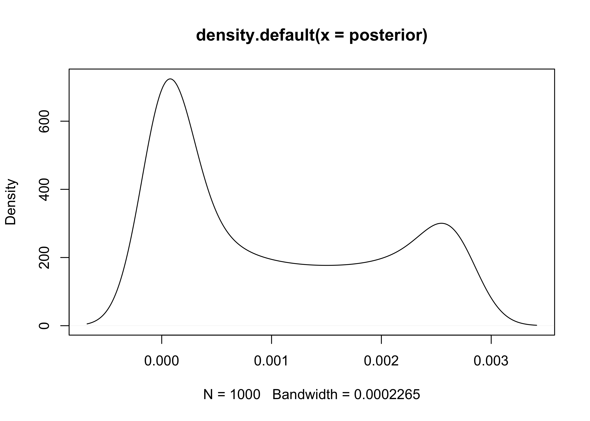

Chapter 3. Sampling the Imaginary
================

  - this chapter teaches the basic skills for working with samples from
    the posterior distribution

## 3.1 Sampling from a grid-approximate posterior

  - the following code generates a posterior distribution using grid
    approximation using the globe-tossing model from the previous
    chapter

<!-- end list -->

``` r
p_grid <- seq(from = 0, to = 1, length.out = 1e3)
prior <- rep(1, 1e3)
likelihood <- dbinom(6, size = 9, prob = p_grid)
posterior <- likelihood * prior
posterior <- posterior / sum(posterior)

plot(density(posterior))
```

<!-- -->

  - we can think of the posterior as a bucket full of parameter values
      - each value is present in proportion to its posterior probability
      - is we scoop out a bunch of parameters, we will scoop out more of
        the parameter values that are more likely by the posterior
  - parameter values are samples from `p_grid` with the probability of
    sampling each parameter given by its posterior

<!-- end list -->

``` r
samples <- sample(p_grid, prob = posterior, size = 1e4, replace = TRUE)
plot(samples)
```

<!-- -->

``` r
plot(density(samples))
```

<!-- -->

  - the estimated density (above) is very simillar to the posteior
    computed via grid approximation
      - therefore we can use these samples to describe and understand
        the posterior

## 3.2 Sampling to summarize

  - here are some common questions to ask about the posterior:
      - how much posterior probability lies below some parameter value?
      - how much posterior probability lies between two parameter
        values?
      - which parameter value marks the lower 5% of the posterior
        probability?
      - which range of the parameter values contains 90% of the
        posterior probability?
      - which parameter value has the highest posterior probability?
  - these questions can be seaprated into 3 categories: *defined
    boundaries*, *defined probability mass*, and *point estimates*

### 3.2.1 Intervals of defined boundaries

  - we can be asked: What is the posterior probability that the
    proportion of water is less than 0.5?
      - this can be done by adding up the probabilities that correspond
        to a parameter value less than 0.5

<!-- end list -->

``` r
sum(posterior[p_grid < 0.5])
```

    ## [1] 0.1718746

  - however, this calcualtion using the grid approximation becomes far
    more complicated when there is more than one parameter
  - we can also find it using the samples from the posterior
      - we basically find the frequency of samples below 0.5

<!-- end list -->

``` r
sum(samples < 0.5) / length(samples)
```

    ## [1] 0.1696

  - we can also ask: How much of the posterior lies between 0.5 and
    0.75?

<!-- end list -->

``` r
sum(samples > 0.5 & samples < 0.75) / length(samples)
```

    ## [1] 0.6071

### 3.2.2 Intervals of defined mass

  - the “confidence interval” is an *interval of defined mass*
  - the interval of the posterior probability is called the *credible
    interval*
      - this is often referred to as a *percentile interval* (PI)
  - we can calcuate the middle 80% of a posterior distribution using the
    `quantile()` function

<!-- end list -->

``` r
quantile(samples, c(0.1, 0.9))
```

    ##       10%       90% 
    ## 0.4514515 0.8098098

  - however, a credible interval can be misleading if the sampled
    posterior is too asymmetric
      - this is shown in the following example of the globe tossing
        where the data is only 3 `W` (waters) in 3 tosses
      - the 50% credible interval misses the most probable value, near
        \(p=1\)

<!-- end list -->

``` r
# Grid approximation of the posterior probabilities.
p_grid <- seq(from = 0, to = 1, length.out = 1e3)
prior <- rep(1, 1e3)
likelihood <- dbinom(3, size = 3, prob = p_grid)
posterior <- likelihood * prior
posterior <- posterior / sum(posterior)

# Sample the posterior.
samples <- sample(p_grid, prob = posterior, size = 1e4, replace = TRUE)

ci <- quantile(samples, c(0.25, 0.75))

tibble(x = samples) %>%
    ggplot(aes(x = x)) +
    geom_density(color = "grey50") +
    geom_vline(xintercept = as.numeric(ci), 
               lty = 1, size = 2, color = "dodgerblue") +
    scale_x_continuous(expand = c(0, 0.02)) +
    scale_y_continuous(expand = c(0, 0.1)) +
    labs(x = "parameter values", 
         y = "posterior probability")
```

<!-- -->

  - alternatively, the *highest posterior density interval* (HPDI) is
    the narrowest interval containing the specified probability mass
      - there are many intervals that can contain some percent of the
        mass, but the narrowest interval represents the most “dense”
        part of the posterior distribution
      - the ‘rethinking’ package has the `HPDI()` function for
        calculating this value

<!-- end list -->

``` r
HPDI(samples, prob = 0.5)
```

    ##      |0.5      0.5| 
    ## 0.8448448 1.0000000

``` r
tibble(x = samples) %>%
    ggplot(aes(x = x)) +
    geom_density(color = "grey50") +
    geom_vline(xintercept = as.numeric(HPDI(samples, prob = 0.5)), 
               lty = 1, size = 2, color = "dodgerblue") +
    scale_x_continuous(expand = c(0, 0.02)) +
    scale_y_continuous(expand = c(0, 0.1)) +
    labs(x = "parameter values", 
         y = "posterior probability")
```

<!-- -->

  - usually the PI and HPDI are quite simillar
      - HDPI can be more computationally expensive to compute and have
        more *simulation variance* than the PI

### 3.2.2 Point estimates

  - *the entire posterior distribution is the Bayesian parameter
    estimate*
      - summarizing it with a single value is difficult and often
        unnecessary
  - the *maximum a posteriori* (MAP) estimate is the highest posterior
    probability
      - this is really just he mode of the sampled distribution

<!-- end list -->

``` r
p_grid[which.max(posterior)]
```

    ## [1] 1

  - when we only have samples from the posterior, it must be
    approximated

<!-- end list -->

``` r
chainmode(samples, adj = 0.01)
```

    ## [1] 0.9953597

  - we can also report the mean or median, but they alls have different
    values in this example

<!-- end list -->

``` r
mean(samples)
```

    ## [1] 0.802544

``` r
median(samples)
```

    ## [1] 0.8448448

  - we can use a *loss function* to provide a cost to use any particular
    point estimate
      - one common loss function is the absolute loss function \(d-p\)
        which reports the loss as the absolute difference between the
        real and predicted
          - this results with the optimal choice as the median because
            it splits the density of the posterior distribution in half
      - the quadratic loss \((d-p)^2\) leads to the posterior mean being
        the best point estimate

## 3.3 Sampling to simulate prediction
