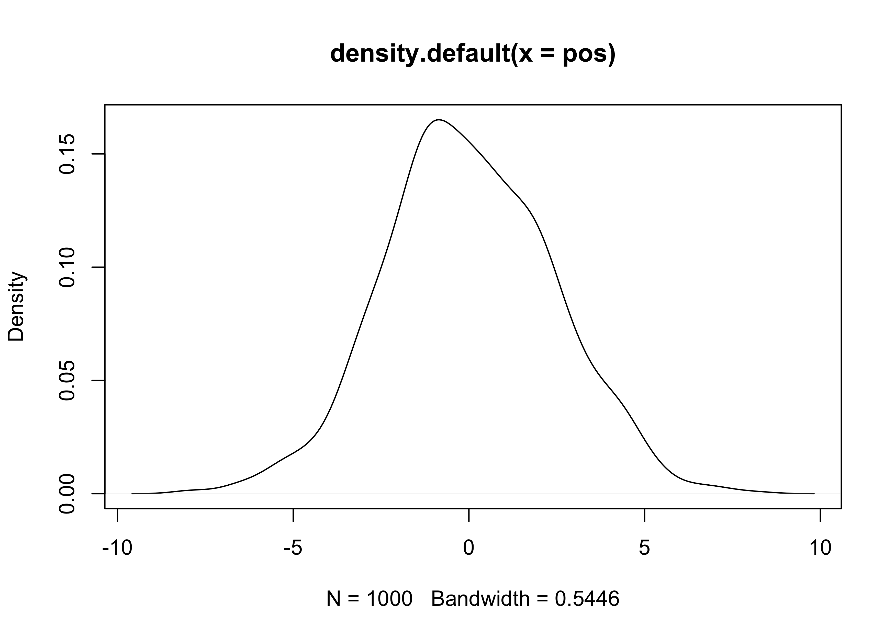
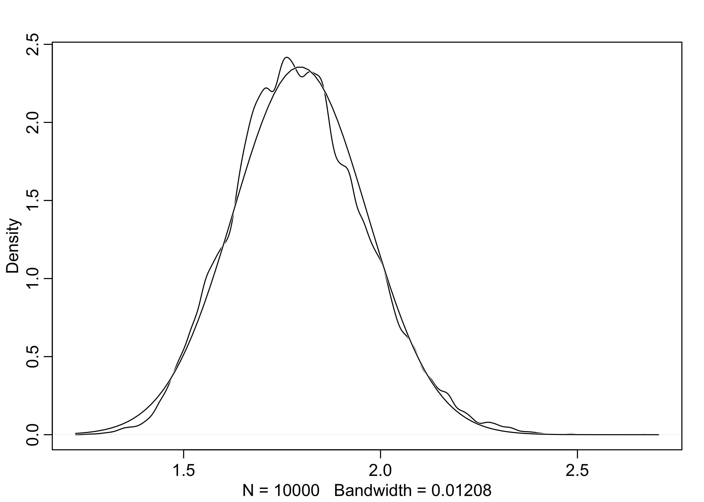
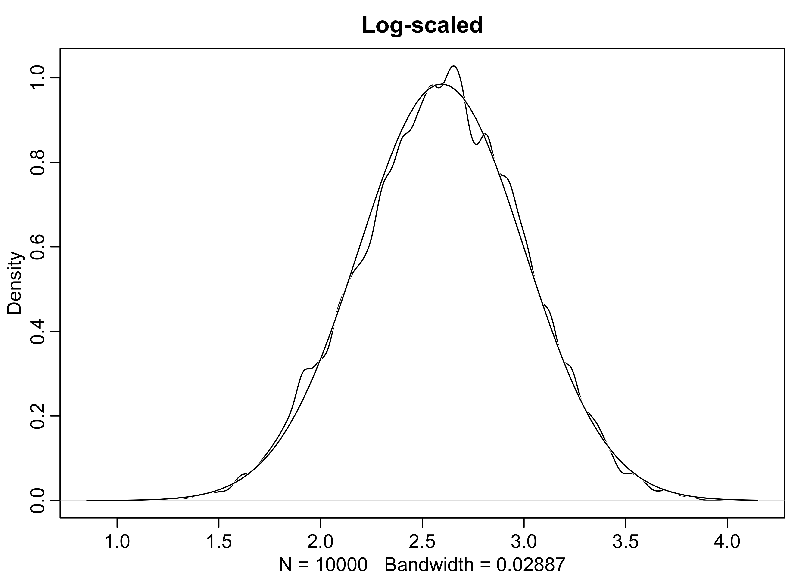
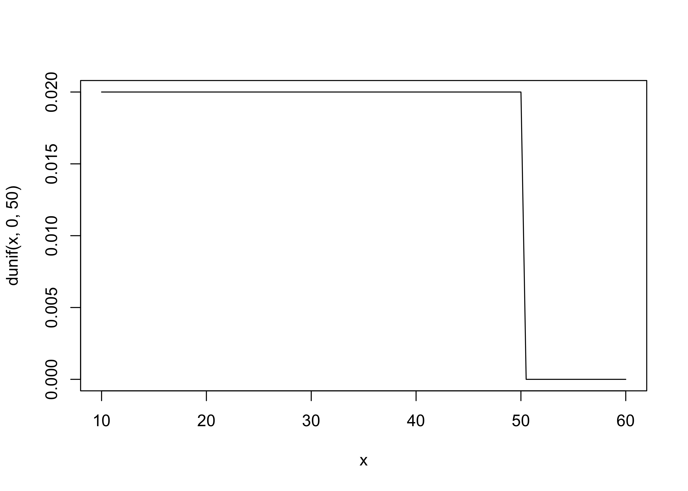
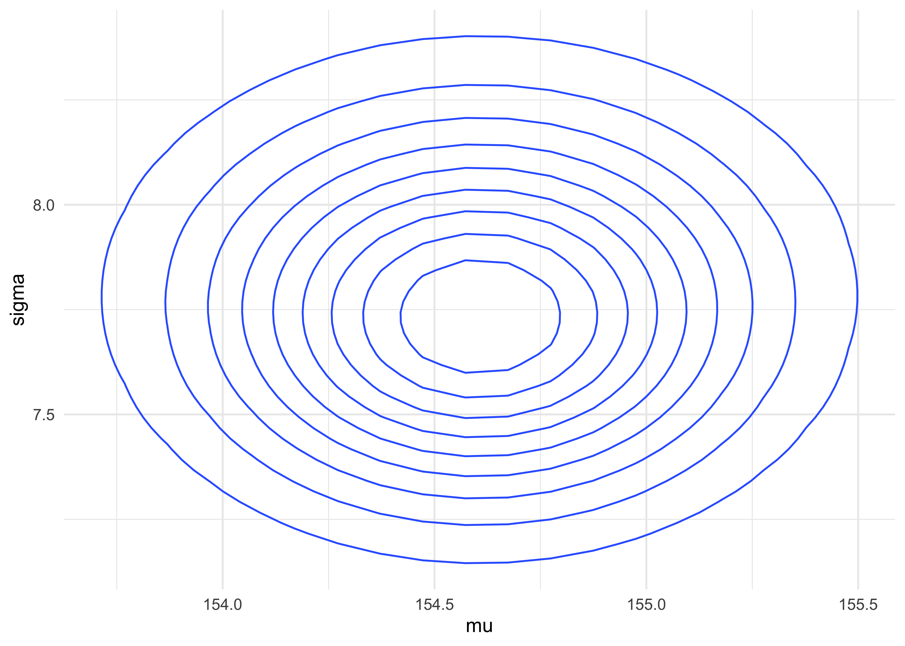
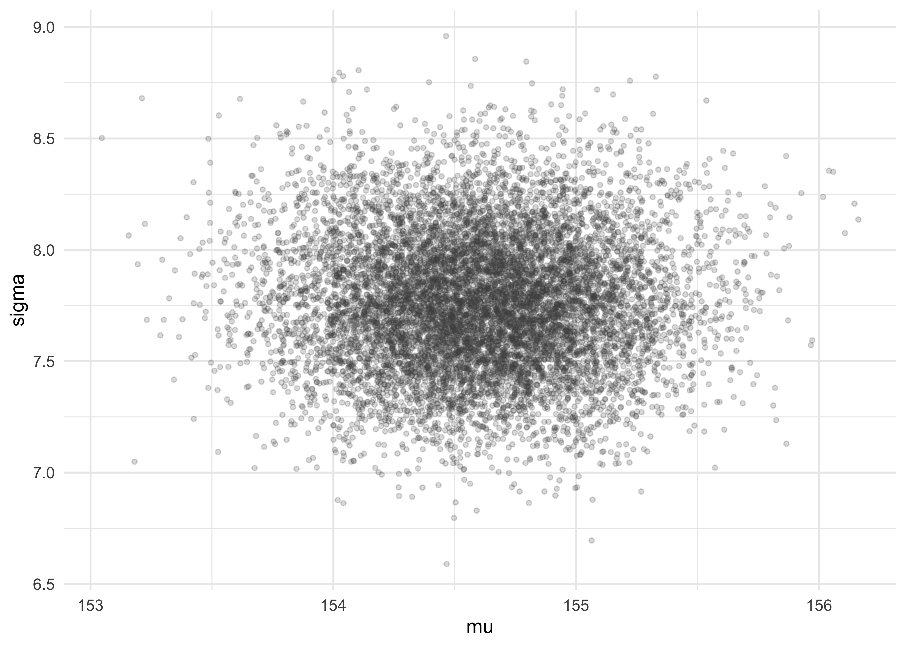
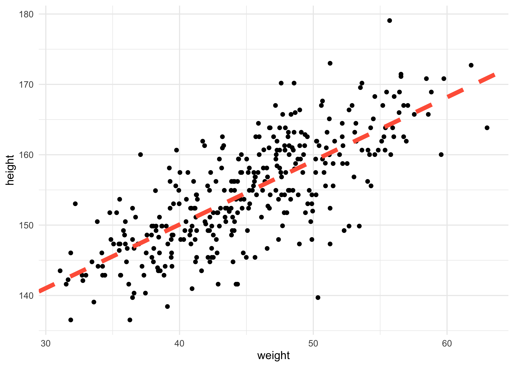
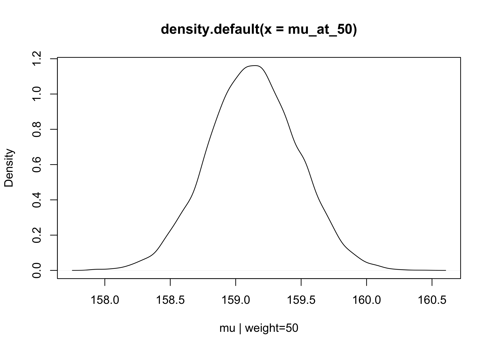

Chapter 4. Linear Models
================

  - this chapter introduce linear regresssion as a Bayesian procedure
      - under a probability interpretation (necessary for Bayesian
        word), linear reg. uses a Gaussian distribution for uncertainty
        about the measurement of interest

## 4.1 Why normal distributions are normal

  - example:
      - you have 1,000 people stand at the half-way line of a soccer
        field
      - they each flip a coin 16 times, moving left if the coin comes up
        heads, and right if it comes up tails
      - the final distribution of people around the half-way line will
        be Gaussian even though the underlying model is binomial

### 4.1.1 Normal by addition

  - we can simulate the above example
      - to show that the underlying coin-flip is nothing special, we
        will instead use a random values between -1 and 1 for each
        person to step

<!-- end list -->

``` r
pos <- replicate(1e3, sum(runif(16, -1, 1)))
plot(density(pos))
```

<!-- -->

``` r
set.seed(0)

n_steps <- 16

position_data <- tibble(person = 1:1e3) %>%
    mutate(position = purrr::map(person, ~ c(0, cumsum(runif(n_steps, -1, 1))))) %>%
    unnest(position) %>%
    group_by(person) %>%
    mutate(step = 0:n_steps) %>%
    ungroup()

walks_plot <- position_data %>%
    ggplot(aes(x = step, y = position, group = person)) +
    geom_line(alpha = 0.2, size = 0.1, color = "dodgerblue") +
    scale_x_continuous(expand = c(0, 0)) +
    scale_y_continuous(expand = c(0, 0)) +
    labs(x = "step", y = "position", 
         title = "Random-walks")

step_densities <- position_data %>%
    filter(step %in% c(4, 8, 16)) %>%
    ggplot(aes(x = position)) +
    facet_wrap(~ step, scales = "free_y", nrow = 1) +
    geom_density(fill = "grey90", color = "grey40") +
    scale_x_continuous(expand = c(0, 0)) +
    scale_y_continuous(expand = expansion(mult = c(0, 0.02))) +
    labs(x = "position",
         y = "density",
         title = "Position distribution at several steps")

walks_plot / step_densities + plot_layout(heights = c(3, 2))
```

<!-- -->

### 4.1.2 Normal by multiplication

  - another example of how to get a normal distribution:
      - the growth rate of an organism is influenced by a dozen loci,
        each with several alleles that code for more growth
      - suppose that these loci interact with one another, and each
        increase growth by a percentage
      - therefore, their effects multiply instead of add
      - below is a simulation of sampling growth rates
      - this distribution is approximately normal because the
        multiplication of small numbers is approximately the same as
        addition

<!-- end list -->

``` r
# A single growth rate
prod(1 + runif(12, 0, 0.1))
```

    ## [1] 1.846713

``` r
growth <- replicate(1e4, prod(1 + runif(12, 0, 0.1)))
dens(growth, norm.comp = TRUE)
```

<!-- -->

### 4.1.3 Normal by log-multiplication

  - large deviates multiplied together produce Gaussian distributions on
    the log-scale

<!-- end list -->

``` r
growth <- replicate(1e4, prod(1 + runif(12, 0, 0.5)))
dens(growth, norm.comp = TRUE, main = "Not scaled")
```

<!-- -->

``` r
dens(log(growth), norm.comp = TRUE, main = "Log-scaled")
```

<!-- -->

### 4.1.4 Using Gaussian distributions

  - we will build models of measurements as aggregations of normal
    distributions
  - this is appropriate because:
      - the world is full of approximately normal distributions
      - we often are quite ignorant of the underlying distribution so
        modeling it as a mean and variance is often the best we can do

## 4.2 A language for describing models

  - here is an outline of the process commonly used:
    1.  recognize a set of measurements to predict or understand - the
        *outcome* variables
    2.  for each variable, define a likelihood distribution that defines
        the plausibility of individual observations
          - this is always Gaussian for linear regression
    3.  recognize a set of other measurements to use to predict or
        understand the outcome - the *predictory* variables
    4.  relate the shape of the likelihood distribtuion to the predictor
        variables
    5.  choose priors for all parameters in the model; this is the
        initial state of the model before seeing any data
    6.  summarise the model with math expressions; for example:

\[
\text{outcome}_i \sim \text{Normal}(\mu_i, \sigma) \\
\mu_i = \beta \times \text{predictor}_i \\
\beta \sim \text{Normal}(0, 10) \\
\sigma \sim \text{HalfCauchy}(0, 1)
\]

### 4.2.1 Re-describing the globe tossing model

  - this example was trying to estimate the proportion of water \(p\) of
    a globe by tossing it and counting of how often our finger was on
    water upon catching the globe
      - it could be described as such where \(w\) is the number of
        waters observed, \(n\) is the total number of tosses, and \(p\)
        is the proportion of the water on the globe

\[
w \sim \text{Binomial(n,p)} \\
p \sim \text{Uniform}(0,1)
\]

  - this should be read as:
      - “The count \(w\) is distributed binomially with sample size
        \(n\) and probability \(p\).”
      - “The prior for \(p\) is assumed to be uniform between zero and
        one.”

## 4.3 A Gaussian model of height

  - we will now build a linear regression model
      - this section will build the scaffold
      - the next will construct the predictor variable
  - model a single measurement variable as a Gaussian distribution
      - two parameters: \(\mu\) = mean; \(\sigma\) = standard deviation
      - Bayesian updating will consider each possible combination of
        \(\mu\) and \(\sigma\) and provide a socre for the plausibility
        of each

### 4.3.1 The data

  - we will use the `Howll1` data from the ‘rethinking’ package
      - we will use height information for peple older that 18 years

<!-- end list -->

``` r
data("Howell1")
d <- Howell1
str(d)
```

    ## 'data.frame':    544 obs. of  4 variables:
    ##  $ height: num  152 140 137 157 145 ...
    ##  $ weight: num  47.8 36.5 31.9 53 41.3 ...
    ##  $ age   : num  63 63 65 41 51 35 32 27 19 54 ...
    ##  $ male  : int  1 0 0 1 0 1 0 1 0 1 ...

``` r
d2 <- d[d$age >= 18, ]
nrow(d2)
```

    ## [1] 352

### 4.3.2 The model

  - the goal is to model these values using a Gaussian distribution

<!-- end list -->

``` r
dens(d2$height)
```

<!-- -->

  - our model is

\[
h_i \sim \text{Normal}(\mu, \sigma) \quad \text{or} \quad h_i \sim \mathcal{N}(\mu, \sigma)
\]

  - the priors for the model parameters are below
      - the mean and s.d. for the normal distribution for \(\mu\) were
        just chosen by the author as likely a good guess for the average
        heights

\[
\mu \sim \mathcal{N}(178, 20) \\
\sigma \sim \text{Uniform}(0, 50)
\]

  - it is often good to plot the priors

<!-- end list -->

``` r
curve(dnorm(x, 178, 20), from = 100, to = 250)
```

<!-- -->

``` r
curve(dunif(x, 0, 50), from = 10, to = 60)
```

<!-- -->

  - we can sample from the priors to build our “expected” distribution
    of heights
      - its the relative plausibility of different heights before seeing
        any data

<!-- end list -->

``` r
sample_mu <- rnorm(1e4, 178, 20)
sample_sigma <- runif(1e4, 0, 50)

prior_h <- rnorm(1e4, sample_mu, sample_sigma)

dens(prior_h)
```

<!-- -->

### 4.3.3 Grid approximation of the posteior distribution

  - as an example, we will map the posterior distribution using brute
    force
      - later, we will switch to the quadratic approximation that we
        will use for the next few chapters
      - we use a few shortcuts here, including summing the log
        likelihood instead of multiplying the likelihoods

<!-- end list -->

``` r
mu_list <- seq(from = 140, to = 160, length.out = 200)
sigma_list <- seq(from = 4, to = 9, length.out = 200)

post <- expand.grid(mu = mu_list, sigma = sigma_list)
head(post)
```

    ##         mu sigma
    ## 1 140.0000     4
    ## 2 140.1005     4
    ## 3 140.2010     4
    ## 4 140.3015     4
    ## 5 140.4020     4
    ## 6 140.5025     4

``` r
set.seed(0)

post$LL <- pmap_dbl(post, function(mu, sigma, ...) {
    sum(dnorm(
        d2$height,
        mean = mu,
        sd = sigma,
        log = TRUE
    ))
})

post$prod <- post$LL + dnorm(post$mu, 178, 20, log = TRUE) + dunif(post$sigma, 0, 500, log = TRUE)

post$prob <- exp(post$prod - max(post$prod))
```

``` r
post %>% 
    as_tibble() %>%
    ggplot(aes(x = mu, y = sigma, z = prob)) +
    geom_contour()
```

<!-- -->

``` r
as_tibble(post) %>%
    ggplot(aes(x = mu, y = sigma, fill = prob)) +
    geom_tile(color = NA) +
    scale_fill_viridis_b()
```

<!-- -->

### 4.3.4 Sampling from the posterior

  - we sample from the posterior just like normal, except now we get
    pairs of parameters

<!-- end list -->

``` r
sample_rows <- sample(1:nrow(post), 
                      size = 1e4, 
                      replace = TRUE, 
                      prob = post$prob)
sample_mu <- post$mu[sample_rows]
sample_sigma <- post$sigma[sample_rows]
tibble(mu = sample_mu, sigma = sample_sigma) %>%
    ggplot(aes(x = mu, y = sigma)) +
    geom_jitter(size = 1, alpha = 0.2, color = "grey30", 
                width = 0.1, height = 0.1)
```

<!-- -->

  - now we can describe these parameters just like data
      - the distributions are the results

<!-- end list -->

``` r
tibble(name = c(rep("mu", 1e4), rep("sigma", 1e4)),
       value = c(sample_mu, sample_sigma)) %>%
    ggplot(aes(x = value)) +
    facet_wrap(~ name, nrow = 1, scales = "free") +
    geom_density(fill = "grey90", alpha = 0.5)
```

<!-- -->

``` r
cat("HPDI of mu:\n")
```

    ## HPDI of mu:

``` r
HPDI(sample_mu)
```

    ##    |0.89    0.89| 
    ## 153.8693 155.1759

``` r
cat("\nHPDI of sigma:\n")
```

    ## 
    ## HPDI of sigma:

``` r
HPDI(sample_sigma)
```

    ##    |0.89    0.89| 
    ## 7.291457 8.221106

4.3.5 Fitting the model with `map()`

**Note that the `map()` function has been changed to `quap()` in the 2nd
Edition of the course.**

  - now we can use the `quap()` function to conduct the quadratic
    approximation of the posterior
  - recall that this is the model definition:

\[
h_i \sim \text{Normal}(\mu, \sigma) \\
\mu \sim \text{Normal}(178, 20) \\
\sigma \sim \text{Uniform}(0, 50)
\]

  - first, we copy this formula into an `alist`

<!-- end list -->

``` r
formula_list <- alist(
    height ~ dnorm(mu, sigma),
    mu ~ dnorm(178, 20),
    sigma ~ dunif(0, 50)
)
formula_list
```

    ## [[1]]
    ## height ~ dnorm(mu, sigma)
    ## 
    ## [[2]]
    ## mu ~ dnorm(178, 20)
    ## 
    ## [[3]]
    ## sigma ~ dunif(0, 50)

  - then we can fit the model to the data using `quap()` and the data in
    `d2`

<!-- end list -->

``` r
m4_1 <- quap(formula_list, data = d2)
summary(m4_1)
```

    ##             mean        sd       5.5%     94.5%
    ## mu    154.607032 0.4120116 153.948558 155.26551
    ## sigma   7.731651 0.2914160   7.265912   8.19739

### 4.3.6 Sampling from a map fit

  - the quadratic approximation to a posterior dist. with multiple
    parameters is just a multidimensional Gaussian distribution
      - therefore, it can be described by its variance-covariance matrix

<!-- end list -->

``` r
vcov(m4_1)
```

    ##                 mu        sigma
    ## mu    0.1697535649 0.0002182476
    ## sigma 0.0002182476 0.0849232811

  - the variance-covariance matrix tells us how the parameters relate to
    each other
  - it can be decomposed into two pieces:
    1.  the vector of varainces for the parameters
    2.  a correlation matrix that tells us how the changes in one
        parameter lead to a correlated change in the others

<!-- end list -->

``` r
cat("Covariances:\n")
```

    ## Covariances:

``` r
diag(vcov(m4_1))
```

    ##         mu      sigma 
    ## 0.16975356 0.08492328

``` r
cat("\nCorrelations:\n")
```

    ## 
    ## Correlations:

``` r
cov2cor(vcov(m4_1))
```

    ##                mu       sigma
    ## mu    1.000000000 0.001817718
    ## sigma 0.001817718 1.000000000

  - instead of sampling single values from a simple Gaussian
    distribution, we sample vectors of values from a multi-dimensional
    Gaussian distribution
      - the `extract.samples()` function from ‘rethinking’ does this for
        us

<!-- end list -->

``` r
post <- extract.samples(m4_1, n = 1e4)
head(post)
```

    ##         mu    sigma
    ## 1 154.1145 7.599922
    ## 2 154.8011 7.305567
    ## 3 154.7124 7.813402
    ## 4 154.6557 7.511392
    ## 5 154.9872 8.218177
    ## 6 154.5500 7.601779

``` r
precis(post)
```

    ##             mean        sd       5.5%      94.5%    histogram
    ## mu    154.605370 0.4174050 153.935029 155.272336      ▁▁▅▇▂▁▁
    ## sigma   7.733771 0.2884477   7.275115   8.193431 ▁▁▁▂▅▇▇▃▁▁▁▁

## 4.4 Adding a predictor

  - above, we created a Gaussian model of height in a population of
    adults
      - by adding a predictor, we can make a linear regression
      - for this example, we will see how height covaries with height

<!-- end list -->

``` r
d2 %>%
    ggplot(aes(x = weight, y = height)) +
    geom_point()
```

<!-- -->

### 4.4.1 The linear model strategy

  - the strategy is to make the parameter for the mean of a Gaussian
    dist., \(\mu\), into a linear function of the predictor variable and
    other, new parameters we make
  - some of the parameters of the linear model indicate the strength of
    association between the mean of the outcome and the value of the
    predictor
      - the posterior provides relative plausibilities of the different
        possible strengths of association
  - here is the formula for the linear model
      - let \(x\) be the mathematical name for the weight measurements
      - we model the mean \(\mu\) as a function of \(x\)

\[
h_i \sim \text{Normal}(\mu_i, \sigma) \\
\mu_i = \alpha + \beta x_i \\
\alpha \sim \text{Normal}(178, 100) \\
\beta \sim \text{Normal}(0, 10) \\
\sigma \sim \text{Uniform}(0, 50) \\
\]

### 4.4.2 Fitting the model

``` r
m4_3 <- quap(
    alist(
        height ~ dnorm(mu, sigma),
        mu <- a + b*weight,
        a ~ dnorm(178, 100),
        b ~ dnorm(0, 10),
        sigma ~ dunif(0, 50)
    ),
    data = d2
)
summary(m4_3)
```

    ##              mean         sd        5.5%       94.5%
    ## a     113.9033852 1.90526701 110.8584005 116.9483699
    ## b       0.9045063 0.04192009   0.8375099   0.9715027
    ## sigma   5.0718671 0.19115324   4.7663673   5.3773669

4.4.3 Interpreting the model fit

  - we can inspect fit models using tables and plots
  - the following questions can be answered by plotting posterior
    distribution and posterior predictions
      - whether or not the model fitting procedure worked correctly
      - the absolute magnitude, rather than just relative magnitude, of
        a relationship between outcome and predictor
      - the uncertainty around an average relationship
      - the uncertainty surrounding the implied predictions of the model

#### 4.4.3.1 Tables of estimate

  - models cannot in general be understood by tables of estimates
      - only the simplest of models (such as our current example) can be
  - here is how to understand the summary results of our
    wieght-to-height model:
      - \(\beta\) is a slope of 0.90: “a person 1 kg heavier is expected
        to be 0.90 cm taller”
          - 89% of the posterior probability lies between 0.84 and 0.97
          - this suggests strong evidence for a postive relationship
            between weight and height
      - \(\alpha\) (intercept) indicates that a person of weight 0
        should be 114 cm tall
      - \(\sigma\) informs us of the width of the distribution of
        heights around the mean

<!-- end list -->

``` r
precis(m4_3)
```

    ##              mean         sd        5.5%       94.5%
    ## a     113.9033852 1.90526701 110.8584005 116.9483699
    ## b       0.9045063 0.04192009   0.8375099   0.9715027
    ## sigma   5.0718671 0.19115324   4.7663673   5.3773669

  - we can also inspect the correlation of parameters
      - there is strong correlation between `a` and `b` because this is
        such a simple model: chaning the slope would also change the
        intercept in the opposite direction
      - in more complex models, this can hinder fitting the model

<!-- end list -->

``` r
cov2cor(vcov(m4_3))
```

    ##                   a             b         sigma
    ## a      1.0000000000 -0.9898830254  0.0009488233
    ## b     -0.9898830254  1.0000000000 -0.0009398017
    ## sigma  0.0009488233 -0.0009398017  1.0000000000

  - one way to avoid correlation is by centering the data
      - subtracting the mean of the variable from each value
      - this removes the correlation between `a` and `b` in our model
      - but also \(\alpha\) (`a`, the y-intercept) became the value of
        the mean of the heights
          - this is because the intercept is the value when the
            predictors are 0 and now the mean of the predicotr is 0

<!-- end list -->

``` r
d2$weight_c <- d2$weight - mean(d2$weight)

m4_4 <- quap(
    alist(
        height ~ dnorm(mu, sigma),
        mu <- a + b*weight_c,
        a ~ dnorm(178, 100),
        b ~ dnorm(0, 10),
        sigma ~ dunif(0, 50)
    ),
    data = d2
)
summary(m4_4)
```

    ##              mean         sd        5.5%       94.5%
    ## a     154.5974770 0.27030258 154.1654813 155.0294727
    ## b       0.9050075 0.04192321   0.8380061   0.9720089
    ## sigma   5.0713444 0.19110397   4.7659234   5.3767655

``` r
cov2cor(vcov(m4_4))
```

    ##                   a             b         sigma
    ## a      1.000000e+00 -4.169566e-09  1.071719e-04
    ## b     -4.169566e-09  1.000000e+00 -3.890539e-05
    ## sigma  1.071719e-04 -3.890539e-05  1.000000e+00

#### 4.4.3.2 Plotting posterior inference against the data

  - we can start by adding the MAP values for the mean height over the
    actual data

<!-- end list -->

``` r
a_map <- coef(m4_3)["a"]
b_map <- coef(m4_3)["b"]

d2 %>%
    ggplot(aes(x = weight, y = height)) +
    geom_point() +
    geom_abline(slope = b_map, intercept = a_map, lty = 2, size = 2, color = "tomato")
```

<!-- -->

#### 4.4.3.3 Adding uncertainty around the mean

  - we could display uncertainty of the model by plotting many lines on
    the data

<!-- end list -->

``` r
post <- extract.samples(m4_3)
head(post)
```

    ##          a         b    sigma
    ## 1 116.4236 0.8412152 5.041186
    ## 2 114.0396 0.9071210 4.853101
    ## 3 115.1166 0.8780719 5.232571
    ## 4 118.4739 0.7949162 5.231642
    ## 5 113.7912 0.9102064 5.199805
    ## 6 116.0722 0.8559793 5.161445

``` r
d2 %>%
    ggplot(aes(x = weight, y = height)) +
    geom_point(color = "grey30") +
    geom_abline(data = post, 
                aes(slope = b, intercept = a), 
                alpha = 0.1, size = 0.1, color = "grey70") +
    geom_abline(slope = b_map, intercept = a_map, 
                lty = 2, size = 1.3, color = "tomato")
```

<!-- -->

#### 4.4.3.4 Plotting regression intervals and contours

  - we can compute any interval using this cloud of regression lines and
    plot a shaded region around the MAP line
  - lets begin by focusing just on a single weight value, 50
      - we can make a list of 10,000 values of \(\mu\) for an individual
        who weights 50 kg

<!-- end list -->

``` r
# mu = a + b * x
mu_at_50 <- post$a + post$b * 50
plot(density(mu_at_50), xlab = "mu | weight=50")
```

<!-- -->

  - since the posteior for \(\mu\) is a ditribution, we can calculate
    the HDPI intervals to find the 89% highest posterior density
    intervals

<!-- end list -->

``` r
HPDI(mu_at_50)
```

    ##    |0.89    0.89| 
    ## 158.5909 159.6806

  - we can use the `link()` function from ‘rethinking’ to sample from
    the posterior and compute \(\mu\) for eah case in the data and
    sample from the posterior

<!-- end list -->

``` r
mu <- link(m4_3)

# row: sample from the posterior; column: each individual in the data
dim(mu)
```

    ## [1] 1000  352

``` r
mu[1:5, 1:5]
```

    ##          [,1]     [,2]     [,3]     [,4]     [,5]
    ## [1,] 157.2735 146.5395 142.1654 162.2111 151.0746
    ## [2,] 156.8582 145.7179 141.1782 161.9828 150.4247
    ## [3,] 156.9177 145.9155 141.4321 161.9787 150.5639
    ## [4,] 157.5256 146.8543 142.5057 162.4343 151.3629
    ## [5,] 157.1968 146.7853 142.5426 161.9861 151.1841

  - however, we want something slightly different, so we must pass
    `link()` each value from the x-axis (weight)

<!-- end list -->

``` r
weight_seq <- seq(25, 70, by = 1)
mu <- link(m4_3, data = data.frame(weight = weight_seq))

dim(mu)
```

    ## [1] 1000   46

``` r
as_tibble(as.data.frame(mu)) %>%
    set_names(as.character(weight_seq)) %>%
    pivot_longer(tidyselect::everything(), 
                 names_to = "weight",
                 values_to = "height") %>%
    mutate(weight = as.numeric(weight)) %>%
    ggplot(aes(weight, height)) +
    geom_point(size = 0.5, alpha = 0.2)
```

<!-- -->

  - finally, we can get the HPDI at each value of weight

<!-- end list -->

``` r
mu_mean <- apply(mu, 2, mean)
mu_hpdi <- apply(mu, 2, HPDI, prob = 0.89)

mu_data <- tibble(weight = weight_seq,
                  mu = mu_mean) %>%
    bind_cols(as.data.frame(t(mu_hpdi))) %>%
    set_names(c("weight", "height", "hpdi_low", "hpdi_high"))

d2 %>%
    ggplot(aes(x = weight, y = height)) +
    geom_point() +
    geom_ribbon(data = mu_data,
                aes(x = weight, ymin = hpdi_low, ymax = hpdi_high),
                alpha = 0.5, color = NA, fill = "grey50") +
    geom_line(data = mu_data,
              aes(weight, height),
              color = "tomato", size = 1) +
    labs(title = "Bayesian estiamte for the relationship between weight and height",
         subtitle = "Line is the MAP of the weight and height; ribbon is the 89% HPDI")
```

<!-- -->

#### 4.4.3.5 Prediction intervals

  - now we can generate an 89% prediction interval for actual heights
      - so far we have been looking at the uncertainty in \(\mu\) which
        is the mean for the heights
      - there is also \(\sigma\) in the equation for heights
        \(h_i \sim \mathcal{N}(\mu_i, \sigma)\)
  - we can simulate height values for a given weight by sampling from a
    Gaussian with some mean and standard deviation sampled from the
    posterior
      - this will provide a collection of simulated heights with the
        uncertainty in the posterior distribution and the Gaussian
        likelihood of the heights
      - we can plot the 89% percentile interval on the simulated data
        which represents where the model thinks 89% of actual heights in
        the population at each weight

<!-- end list -->

``` r
sim_height <- sim(m4_3, data = list(weight = weight_seq))
str(sim_height)
```

    ##  num [1:1000, 1:46] 143 134 133 142 140 ...

``` r
height_pi <- apply(sim_height, 2, PI, prob = 0.89)
```

``` r
height_pi_data <- height_pi %>%
    t() %>%
    as.data.frame() %>%
    as_tibble() %>%
    set_names(c("low_pi", "high_pi")) %>%
    mutate(weight = weight_seq)

simulated_heights <- as.data.frame(sim_height) %>%
    as_tibble() %>%
    set_names(as.character(weight_seq)) %>%
    pivot_longer(tidyselect::everything(),
                 names_to = "weight",
                 values_to = "sim_height") %>%
    mutate(weight = as.numeric(weight)) %>%
    ggplot() +
    geom_jitter(aes(x = weight, y = sim_height), 
                size = 0.2, alpha = 0.1) + 
    labs(x = "weight",
         y = "height",
         title = "Simulated heights from the model")
    
height_pi_ribbon <- d2 %>%
    ggplot() +
    geom_point(aes(x = weight, y = height)) +
    geom_ribbon(data = height_pi_data,
                aes(x = weight, ymin = low_pi, ymax = high_pi),
                color = NA, fill = "black", alpha = 0.25) + 
    labs(x = "weight",
         y = "height",
         title = "89% percentile interval of the heights")

simulated_heights | height_pi_ribbon
```

<!-- -->

## 4.5 Polynomial regression

  - we can build a model using a curved function of a single predictor
  - in the following example, we will use all of the height and weight
    data in `Howell1`, not just that of adults

<!-- end list -->

``` r
d %>%
    ggplot(aes(x = weight, y = height)) +
    geom_point() +
    labs(title = "All data from `Howell1`")
```

<!-- -->

  - polynomials are often discouraged because they ard hard to interpret
      - it can be better to instead “build the non-linear relationship
        up from a principled beginning”
      - this is explored in the practice problems
  - here is the common polynomial regression
      - a parabolic model of the mean

\[
\mu_i = \alpha + \beta_1 x_i + \beta_2 x_i^2
\]

  - before fitting, we must standardize the predictor variable
      - center and divide by std. dev.
      - this helps with intepretation because one unit is equivalent to
        a change of one std. dev.
      - this also helps the software fit the model

<!-- end list -->

``` r
d$weight_std <- (d$weight - mean(d$weight)) / sd(d$weight)
d %>%
    ggplot(aes(x = weight_std, y = height)) +
    geom_point() +
    labs(title = "Standardized data from `Howell1`",
         x = "standardized weight")
```

<!-- -->

  - here is the model we will fit
      - it has very weak priors

\[
h_i \sim \text{Normal}(\mu_i, \sigma) \\
\mu_i = \alpha + \beta_1 x_i + \beta_2 x_i^2 \\
\alpha \sim \text{Normal}(178, 100) \\
\beta_1 \sim \text{Normal}(0, 10) \\
\beta_2 \sim \text{Normal}(0, 10) \\
\sigma \sim \text{Uniform}(0, 50)
\]

``` r
d$weight_std2 <- d$weight_std^2

m4_5 <- quap(
    alist(
        height ~ dnorm(mu, sigma),
        mu <- a + b1*weight_std + b2*weight_std2,
        a ~ dnorm(178, 100),
        b1 ~ dnorm(0, 10),
        b2 ~ dnorm(0, 10),
        sigma ~ dunif(0, 50)
    ),
    data = d
)

summary(m4_5)
```

    ##             mean        sd       5.5%      94.5%
    ## a     146.663373 0.3736588 146.066194 147.260552
    ## b1     21.400351 0.2898512  20.937113  21.863590
    ## b2     -8.415056 0.2813197  -8.864659  -7.965453
    ## sigma   5.749786 0.1743169   5.471194   6.028378

  - we have to plot the fit of the model to make sense of these values

<!-- end list -->

``` r
weight_seq <- seq(from = -2.2, to = 2.0, length.out = 30)
pred_dat <- list(weight_std = weight_seq, weight_std2 = weight_seq^2)
mu <- link(m4_5, data = pred_dat)
mu_mean <- apply(mu, 2, mean)
mu_pi <- apply(mu, 2, PI, prob = 0.89)
sim_height <- sim(m4_5, data = pred_dat)
height_pi <- apply(sim_height, 2, PI, prob = 0.89)
```

``` r
sim_height_data <- t(height_pi) %>%
    as.data.frame() %>%
    as_tibble() %>%
    set_names(c("pi5", "pi94")) %>%
    mutate(weight = weight_seq,
           mu = mu_mean)
    

d %>%
    ggplot() +
    geom_point(aes(x = weight_std, y = height), color = "grey50") +
    geom_line(data = sim_height_data,
              aes(x = weight, y = mu),
              size = 1, color = "blue") +
    geom_ribbon(data = sim_height_data,
                aes(x = weight, ymin = pi5, ymax = pi94),
                alpha = 0.2, color = NA) +
    scale_x_continuous(
        labels = function(x) { round(x * sd(d$weight) + mean(d$weight), 1) }
    ) +
    labs(title = "Polynomial model of height by weight",
         x = "weight")
```

<!-- -->

-----

## 4.7 Practice

### Easy

**4E1. In the model definition below, which line is the likelihood?**

\[
y_i \sim \text{Normal}(\mu, \sigma) \quad \text{(likelihood)}\\
\mu \sim \text{Normal}(0, 10) \\
\sigma \sim \text{Uniform}(0, 10)
\]

**4E2. In the model definition just above, how many parameters are in
the posterior distribution?**

2

**4E3. Using the model definition above, write down the appropriate form
of Bayes’ theorem that includes the proper likelihood and priors.**

\[
\Pr(y|\mu, \sigma) = \frac{\Pr(\mu, \sigma | y) \Pr(y)}{\Pr(\mu, \sigma)}
\]

4E4. In the model definition below, which line is the linear model?

\[
y_i \sim \text{Normal}(\mu, \sigma) \\
\mu = \alpha + \beta x_i \quad \text{(linear model)} \\
\alpha \sim \text{Normal}(0, 10) \\
\beta \sim \text{Normal(0, 1)} \\
\sigma \sim \text{Uniform}(0, 10)
\]

**4E5. In the model definition just above, how many parameters are in
the posterior distribution?**

3

### Medium

**4M1. For the model definition below, simulate observed heights from
the prior (not the posterior).**

\[
y_i \sim \text{Normal}(\mu, \sigma) \\
\mu \sim \text{Normal}(0, 10) \\
\sigma \sim \text{Uniform}(0, 10) \\
\]

``` r
mu_prior <- rnorm(1e4, 0, 10)
sigma_prior <- runif(1e4, 0, 10)
heights_prior <- rnorm(1e4, mu_prior, sigma_prior)

plot(density(heights_prior))
```

<!-- -->

**4M2. Translate the model just above into a map formula.**

``` r
alist(
    y ~ dnorm(mu, sigma),
    mu ~ dnorm(0, 10),
    sigma ~ dunif(0, 10)
)
```

    ## [[1]]
    ## y ~ dnorm(mu, sigma)
    ## 
    ## [[2]]
    ## mu ~ dnorm(0, 10)
    ## 
    ## [[3]]
    ## sigma ~ dunif(0, 10)

**4M3. Translate the map model formula below into a mathematical model
definition.**

``` r
flist <- alist(
    y ~ dnorm(mu, sigma),
    mu <- a + b*x,
    a ~ dnorm(0, 50),
    b ~ dunif(0, 10),
    sigma ~ dunif(0, 50)
)
```

\[
y_i \sim \text{Normal}(\mu, \sigma) \\
\mu = \alpha + \beta x_i \\
\alpha \sim \text{Normal}(0, 50) \\
\beta \sim \text{Uniform}(0, 10) \\
\sigma \sim \text{Uniform}(0, 50)
\]

**4M4. A sample of students is measured for height each year for 3
years. After the third year, you want to fit a linear regression
predicting height using year as a predictor. Write down the mathematical
model definition for this regression, using any variable names and
priors you choose. Be prepared to defend your choice of priors.**

\[
y_i \sim \text{Normal}(\mu, \sigma) \\
\mu = \alpha + \beta x_i \\
\alpha \sim \text{Normal}(0, 100) \\
\beta \sim \text{Normal}(0, 10) \\
\sigma \sim \text{Uniform}(0, 50)
\]

**4M5. Now suppose I tell you that the average height in the first year
was 120 cm and that every student got taller each year. Does this
information lead you to change your choice of priors? How?**

I would make the prior for \(\beta\) have a positive mean.

\[
\beta \sim \text{Normal}(1, 10)
\]

**4M6. Now suppose I tell you that the variance among heights for
students of the same age is never more than 64cm. How does this lead you
to revise your priors?**

I would reduce the standard deviation for the prior distribution of
\(alpha\).

\[
\alpha \sim \text{Normal}(0, 20)
\]

### Hard

**4H1. The weights listed below were recorded in the \!Kung census, but
heights were not recorded for these individuals. Provide predicted
heights and 89% intervals (either HPDI or PI) for each of these
individuals. That is, fill in the table below, using model-based
predictions.**

``` r
# Model created and fit in the notes above.
m4_5 <- quap(
    alist(
        height ~ dnorm(mu, sigma),
        mu <- a + b1*weight_std + b2*weight_std2,
        a ~ dnorm(178, 100),
        b1 ~ dnorm(0, 10),
        b2 ~ dnorm(0, 10),
        sigma ~ dunif(0, 50)
    ),
    data = d
)

new_data <- tibble(weight = c(46.95, 43.72, 64.78, 32.59, 54.63)) %>%
    mutate(individual = 1:n(),
           weight_std = (weight - mean(d$weight)) / sd(d$weight),
           weight_std2 = weight_std^2)
new_pred <- link(m4_5, new_data, n = 1e3)

new_data %>%
    mutate(expected_height = apply(new_pred, 2, chainmode),
           hpdi = apply(new_pred, 2, function(x) {
               pi <- round(HPDI(x), 2)
               glue("{pi[[1]]} - {pi[[2]]}")
           })) %>%
    select(individual, weight, expected_height, hpdi)
```

    ## # A tibble: 5 x 4
    ##   individual weight expected_height hpdi           
    ##        <int>  <dbl>           <dbl> <chr>          
    ## 1          1   47.0            158. 157.68 - 158.71
    ## 2          2   43.7            156. 155.42 - 156.4 
    ## 3          3   64.8            156. 154.15 - 158.01
    ## 4          4   32.6            142. 141.33 - 142.5 
    ## 5          5   54.6            160. 159.41 - 161.12

**4H2. Select out all the rows in the Howelll data with ages below 18
years of age. If you do it right, you should end up with a new data
frame with 192 rows in it.**

``` r
qh2_data <- Howell1[Howell1$age < 18, ]
dim(qh2_data)
```

    ## [1] 192   4

``` r
qh2_data %>%
    ggplot(aes(x = weight, y = height)) +
    geom_point()
```

<!-- -->

**(a) Fit a linear regression to these data, using map. Present and
interpret the estimates. For every 10 units of increase in weight, how
much taller does the model predict a child gets?**

``` r
qh2_data$weight_std <- (qh2_data$weight - mean(qh2_data$weight)) / sd(qh2_data$weight)

qh2_model <- quap(
    alist(
        height ~ dnorm(mu, sigma),
        mu <- a + b * weight_std,
        a ~ dnorm(100, 20),
        b ~ dnorm(10, 20),
        sigma ~ dunif(0, 10)
    ),
    data = qh2_data
)

summary(qh2_model)
```

    ##            mean        sd       5.5%      94.5%
    ## a     108.31112 0.6086166 107.338436 109.283810
    ## b      24.30242 0.6102073  23.327195  25.277653
    ## sigma   8.43714 0.4305592   7.749023   9.125257

``` r
# Change in 10 original units of weight.
weight_seq <- c(10, 20)
weight_seq_std <- (weight_seq - mean(qh2_data$weight)) / sd(qh2_data$weight)
diff(coef(qh2_model)["a"] +  weight_seq_std * coef(qh2_model)["b"])
```

    ## [1] 27.18601

**(b) Plot the raw data, with height on the vertical axis and weight on
the horizontal axis. Superimpose the MAP regression line and 89% HPDI
for the mean. Also superimpose the 89% HPDI for predicted heights.**

**(c) What aspects of the model fit concern you? Describe the kinds of
assumptions you would change, if any, to improve the model. You don’t
have to write any new code. Just explain what the model appears to be
doing a bad job of, and what you hypothesize would be a better model.**
