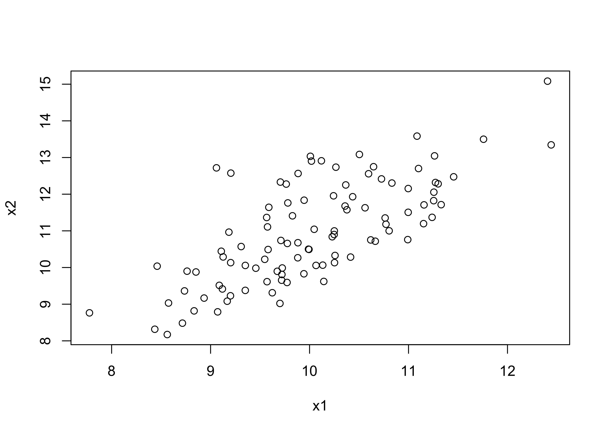
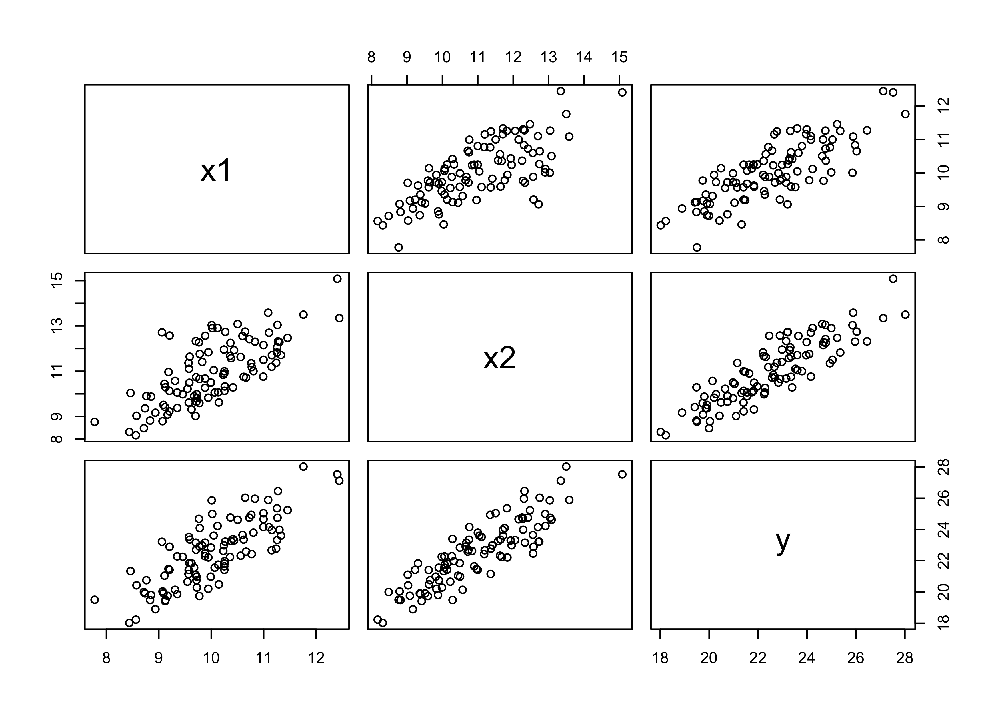
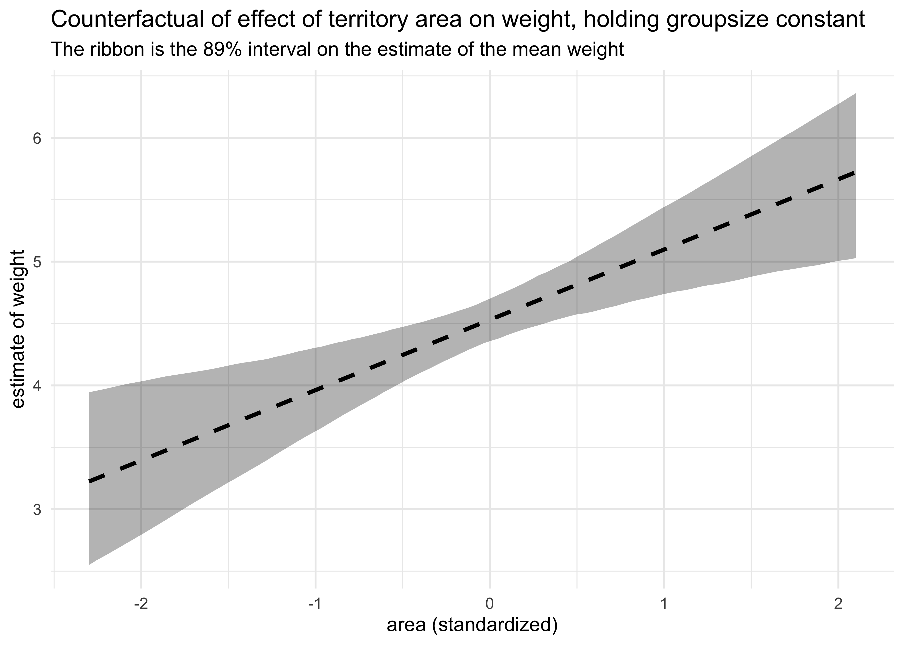

Chapter 5. Multivariate Linear Models
================

  - correlation is very common in the real world
  - *multivariate regression* is using more than one predictor variable
    to model an outcome
  - reasons to use multivariate regression:
      - a way of “controlling” for confounding variables
      - multiple causation
      - interaction between variables
  - this chapter focuses on two thing multivariate models can help with:
      - revealing spurious correlations
      - revealing important correlations masked by hidden correlations
        of other variables
  - this chapter will also discuss:
      - multicolinearity
      - categorical variables

## 5.1 Spurious association

  - example: correlation between divorce rate and marriage rate
      - need to be married to get divorced
      - perhaps higher rates of marriage indicate that marriage is more
        important, leading to fewer divorces
      - another predictor: median age at marriage
  - we can fit a model of median age predicting divorce rate
      - this is the same as in the previous chapter
      - \(D_i\): divorce rate for state \(i\); \(A_i\): median age at
        marriage in state \(i\)

\[
D_i \sim \text{Normal}(\mu_i, \sigma) \\
\mu_i = \alpha + \beta_A A_i \\
\alpha \sim \text{Normal}(10, 10) \\
\beta_A \sim \text{Normal}(0, 1) \\
\sigma \sim \text{Uniform}(0, 10)
\]

``` r
# Load data.
data("WaffleDivorce")
d <- WaffleDivorce

# Stadardize predictor.
d$MedianAgeMarriage_std <- (d$MedianAgeMarriage - mean(d$MedianAgeMarriage)) / sd(d$MedianAgeMarriage)

m5_1 <- quap(
    alist(
        Divorce ~ dnorm(mu, sigma),
        mu <- a + bA * MedianAgeMarriage_std,
        a ~ dnorm(10, 10),
        bA ~ dnorm(0, 1),
        sigma ~ dunif(0, 10)
    ),
    data = d
)

summary(m5_1)
```

    ##            mean        sd      5.5%      94.5%
    ## a      9.688130 0.2045094  9.361285 10.0149760
    ## bA    -1.042933 0.2025347 -1.366623 -0.7192433
    ## sigma  1.446402 0.1447690  1.215034  1.6777712

``` r
mam_seq <- seq(-3, 3.5, length.out = 30)

mu <- link(m5_1, data = data.frame(MedianAgeMarriage_std = mam_seq))
mu_map <- apply(mu, 2, chainmode)
m5_1_pred <- apply(mu, 2, PI) %>%
    t() %>%
    as.data.frame() %>%
    set_names(c("pi_5", "pi_94")) %>%
    as_tibble() %>%
    mutate(mam_std = mam_seq,
           mu_map = mu_map)

d %>%
    ggplot() +
    geom_point(aes(x = MedianAgeMarriage_std, y = Divorce)) +
    geom_ribbon(data = m5_1_pred,
                aes(x = mam_std, ymin = pi_5, ymax = pi_94),
                fill = "black", alpha = 0.2, color = NA) +
    geom_line(data = m5_1_pred,
                aes(x = mam_std, y = mu_map),
                color = "blue", alpha = 0.6, lty = 2, size = 1.3)
```

<!-- -->

  - and we can model the divorce rate on the number of marriages in a
    state:
      - \(R_i\): rate of marriage in state \(i\)

\[
D_i \sim \text{Normal}(\mu_i, \sigma) \\
\mu_i = \alpha + \beta_R R_i \\
\alpha \sim \text{Normal}(10, 10) \\
\beta_A \sim \text{Normal}(0, 1) \\
\sigma \sim \text{Uniform}(0, 10)
\]

``` r
# Stadardize predictor.
d$Marriage_std <- (d$Marriage - mean(d$Marriage)) / sd(d$Marriage)

m5_2 <- quap(
    alist(
        Divorce ~ dnorm(mu, sigma),
        mu <- a + bR * Marriage_std,
        a ~ dnorm(10, 10),
        bR ~ dnorm(0, 1),
        sigma ~ dunif(0, 10)
    ),
    data = d
)

summary(m5_2)
```

    ##           mean        sd      5.5%     94.5%
    ## a     9.688141 0.2364437 9.3102582 10.066024
    ## bR    0.643766 0.2324753 0.2722255  1.015306
    ## sigma 1.672377 0.1673248 1.4049596  1.939794

  - but individual single-variate models cannot tell us which variable
    is more important or if they cancel each other out
  - the question we want to answer: *“What is the predictive value of a
    variable, once I already know all of the other predictor
    variables?”*
      - after I know the marriage rate, what additional value is there
        in also knowing the age at marriage?
      - after I know the age at marriage, what additional value is there
        in also knowing the marriage rate?

### 5.1.1 Multivariate notation

  - the strategy for building a multivariate model:
    1.  nominate the predictor variables you want in the linear model of
        the mean
    2.  for each predictor, make a parameter that will measure its
        association with the outcome
    3.  multiply the parameter by the variable and add that term to the
        linear model
  - the formula for our multivariate model example on divorce rate:

\[
D_i \sim \text{Normal}(\mu_i, \sigma) \\
\mu_i = \alpha + \beta_R R_i + \beta_A A_i \\
\alpha \sim \text{Normal}(10, 10) \\
\beta_A \sim \text{Normal}(0, 1) \\
\beta_R \sim \text{Normal}(0, 1) \\
\sigma \sim \text{Uniform}(0, 10)
\]

  - what does \(\mu_i = \alpha + \beta_R R_i + \beta_A A_i\) mean:
      - the expected outcome for any state with marriage rate \(R_i\)
        and median age at marriage \(A_i\) is the sum of three
        independent terms
      - \(\alpha\) is a constant that every state gets
      - \(\beta_R R_i\) is the marriage rate multiplied against a
        coefficient \(\beta_R\) that measures the association between
        the marriage rate and divorce rate
      - \(\beta_A A_i\) is similar to the second term, but for the
        association with median age at marriage

### 5.1.2 Fitting the model

  - we can use the quadratic approximation to fit the model

<!-- end list -->

``` r
m5_3 <- quap(
    alist(
        Divorce ~ dnorm(mu, sigma),
        mu <- a + bR * Marriage_std + bA * MedianAgeMarriage_std,
        a ~ dnorm(10, 10),
        bA ~ dnorm(0, 1),
        bR ~ dnorm(0, 1),
        sigma ~ dunif(0, 10)
    ),
    data = d
)

summary(m5_3)
```

    ##             mean        sd       5.5%      94.5%
    ## a      9.6881295 0.2036122  9.3627178 10.0135412
    ## bA    -1.1347453 0.2797168 -1.5817868 -0.6877039
    ## bR    -0.1321716 0.2794281 -0.5787516  0.3144085
    ## sigma  1.4400545 0.1443456  1.2093623  1.6707466

``` r
plot(summary(m5_3))
```

<!-- -->

  - now, the coefficient for the marriage rate predictor is about zero
    and the coefficient of the median age is confidently below zero we
    can interpret these to mean: *“Once we know the median age at
    marriage for a state, there is little predictive power in also
    knowing the rate of marriage in that state.”*
  - we can make some plots to investigate how the model came to this
    conclusion

### 5.1.3 Plotting the multivariate posteriors

  - we will use three types of interpretive plots
    1.  *predictor residual plots*: show the outcome against residual
        predictor values
    2.  *counterfactual plots*: show the implied predictions for
        imaginary experiments in which the different predictor variables
        can be changed independently of one another
    3.  *posterior prediction plots*: show model-based predictions
        against raw data, or otherwise display the error in prediction

#### 5.1.3.1 Predictor residual plots

  - *predictor variable residual*: the average prediction error when
    using all other predictor variables to model a predictor of interest
      - plotting this against the outcome shows something like a
        bivariate regression that has already been “controlled” for all
        of the other predictors
      - it leaves the variation not expected by the model of the mean of
        the other predictors
  - this is best illustrated by an example:
      - we will model the marriage rate using the median age at marriage

\[
R_i \sim \text{Normal}(\mu_i \sigma) \\
\mu_i = \alpha + \beta A_i \\
\alpha \sim \text{Normal}(0, 10) \\
\beta \sim \text{Normal}(1, 0) \\
\sigma \sim \text{Uniform}(0, 10)
\]

  - since we are using centered variables, \(\apha\) should be zero

<!-- end list -->

``` r
m5_4 <- quap(
    alist(
        Marriage_std ~ dnorm(mu, sigma),
        mu <- a + b*MedianAgeMarriage_std,
        a ~ dnorm(0, 10),
        b ~ dnorm(0, 1),
        sigma ~ dunif(0, 10)
    ),
    data = d
)

summary(m5_4)
```

    ##                mean         sd       5.5%      94.5%
    ## a      2.099025e-05 0.09701186 -0.1550227  0.1550647
    ## b     -7.142865e-01 0.09754347 -0.8701798 -0.5583932
    ## sigma  6.860097e-01 0.06862260  0.5763376  0.7956819

  - we then compute the residuals by subtracting the observed marriage
    rate in each state from the predicted rate when using median age
      - a positive residual means the observed rate was greater than
        that expected given the median age in that state

<!-- end list -->

``` r
mu <- coef(m5_4)["a"] + coef(m5_4)["b"] * d$MedianAgeMarriage_std
m_resid <- d$Marriage_std - mu
str(m_resid)
```

    ##  num [1:50] -0.4104 1.0593 -0.0969 0.6477 0.1615 ...

``` r
d %>%
    mutate(mu = mu,
           resid = m_resid,
           resid_diff = mu + m_resid) %>%
    ggplot() +
    geom_linerange(aes(x = MedianAgeMarriage_std, 
                       ymin = mu, ymax = resid_diff),
                   size = 0.8, color = "grey60") +
    geom_point(aes(x = MedianAgeMarriage_std, y = Marriage_std),
               color = "black", size = 2) +
    geom_line(aes(x = MedianAgeMarriage_std, y = mu),
              color = "tomato", size = 1.3, alpha = 0.7) +
    labs(title = "Residual marriage rate estimated using the median age at marriage",
         subtitle = "The red line is the estimate, and the vertical lines are the residuals")
```

<!-- -->

  - we can then plot these residuals against the divorce rate
      - this is the linear relationship between divorce and marriage
        rates after “controlling” for median age

<!-- end list -->

``` r
d %>%
    mutate(mu = mu,
           resid = m_resid,
           resid_diff = mu + m_resid) %>%
    ggplot() +
    geom_point(aes(x = resid, y = Divorce),
               color = "black", size = 2) +
    geom_vline(xintercept = 0, lty = 2, color = "dodgerblue", size = 0.9) +
    labs(x = "residual marriage rate",
         title = "Residual marriage rate and Divorce",
         subtitle = "The linear relationship of marriage and divorce rates after correcting for median age at marriage")
```

<!-- -->

  - we can do the same calculation in the other direction: find the
    residual of the median age modeled on the rate

<!-- end list -->

``` r
m5_4_2 <- quap(
    alist(
        MedianAgeMarriage_std ~ dnorm(mu, sigma),
        mu <- a + b*Marriage_std,
        a ~ dnorm(0, 10),
        b ~ dnorm(0, 1),
        sigma ~ dunif(0, 10)
    ),
    data = d
)

summary(m5_4)
```

    ##                mean         sd       5.5%      94.5%
    ## a      2.099025e-05 0.09701186 -0.1550227  0.1550647
    ## b     -7.142865e-01 0.09754347 -0.8701798 -0.5583932
    ## sigma  6.860097e-01 0.06862260  0.5763376  0.7956819

``` r
mu <- coef(m5_4_2)["a"] + coef(m5_4_2)["b"] * d$Marriage_std
m_resid <- d$MedianAgeMarriage_std - mu


p1 <- d %>%
    mutate(mu = mu,
           resid = m_resid,
           resid_diff = mu + m_resid) %>%
    ggplot(aes(x = Marriage_std)) +
    geom_linerange(aes(ymin = mu, ymax = resid_diff),
                   size = 0.8, color = "grey60") +
    geom_point(aes(y = MedianAgeMarriage_std),
               color = "black", size = 2) +
    geom_line(aes(y = mu),
              color = "tomato", size = 1.3, alpha = 0.7) +
    labs(title = "Residual median age estimated\nusing the marriage rate",
         subtitle = "The red line is the estimate,\nand the vertical lines are the residuals")

p2 <- d %>%
    mutate(mu = mu,
           resid = m_resid,
           resid_diff = mu + m_resid) %>%
    ggplot() +
    geom_point(aes(x = resid, y = Divorce),
               color = "black", size = 2) +
    geom_vline(xintercept = 0, lty = 2, color = "dodgerblue", size = 0.9) +
    labs(x = "residual median age",
         title = "Residual median age and Divorce",
         subtitle = "The linear relationship of median age\nand divorce after correcting for marriage rate")

p1 | p2
```

<!-- -->

  - the negative slope of the residual median age vs. Divorce (on the
    right in the above plot) indicates that the median age contains
    information even after adjusting for marriage rate

#### 5.1.3.2 Counterfactual plots

  - this plot displays the *implied* predictions of the model
      - we can make predictions for inputs that were never seen or are
        technically impossible
      - e.g.: a high marriage rate and high median age
  - the simplest counterfactual plot is to see how predictions change
    while changing only one predictor
  - we will draw two counterfactual plots, one for each predictor

<!-- end list -->

``` r
# Make new "data" while holding median age constant.
A_avg <- mean(d$MedianAgeMarriage_std)
R_seq <- seq(-3, 3, length.out = 30)
pred_data <- tibble(Marriage_std = R_seq,
                    MedianAgeMarriage_std = A_avg)

# Compute the counterfactual mu values.
mu <- link(m5_3, data = pred_data)
mu_mean <- apply(mu, 2, mean)
mu_pi <- apply(mu, 2, PI) %>% 
    pi_to_df() %>%
    set_names(c("mu_5_pi", "mu_94_pi"))

# Simulate counterfactual divorce outcomes
R_sim <- sim(m5_3, data = pred_data, n = 1e4)
R_pi <- apply(R_sim, 2, PI) %>% 
    pi_to_df() %>%
    set_names(c("Rsim_5_pi", "Rsim_94_pi"))

R_counterfactual <- pred_data %>%
    mutate(mu = mu_mean) %>%
    bind_cols(mu_pi, R_pi)

R_counterfactual %>%
    ggplot(aes(x = Marriage_std)) +
    geom_ribbon(aes(ymin = Rsim_5_pi, ymax = Rsim_94_pi),
                color = NA, fill = "black", alpha = 0.2) +
    geom_ribbon(aes(ymin = mu_5_pi, ymax = mu_94_pi),
                color = NA, fill = "black", alpha = 0.4) +
    geom_line(aes(y = mu), color = "black", size = 1.4) +
    labs(x = "Marriage_std",
         y = "Divorce",
         title = "Counterfactual holding median age constant",
         subtitle = "The line is the mean divorce rate over marriage rate, holding age constant.
The inner ribbon (darker) is the 95% PI for the mean over marriage rate.
The outer ribbon is the 95% PI of the simulated divorce rates.")
```

<!-- -->

``` r
# Make new "data" while holding median age constant.
R_avg <- mean(d$Marriage_std)
A_seq <- seq(-3, 3, length.out = 30)
pred_data <- tibble(Marriage_std = R_avg,
                    MedianAgeMarriage_std = A_seq)

# Compute the counterfactual mu values.
mu <- link(m5_3, data = pred_data)
mu_mean <- apply(mu, 2, mean)
mu_pi <- apply(mu, 2, PI) %>% 
    pi_to_df() %>%
    set_names(c("mu_5_pi", "mu_94_pi"))

# Simulate counterfactual divorce outcomes
A_sim <- sim(m5_3, data = pred_data, n = 1e4)
A_pi <- apply(A_sim, 2, PI) %>% 
    pi_to_df() %>%
    set_names(c("Asim_5_pi", "Asim_94_pi"))

A_counterfactual <- pred_data %>%
    mutate(mu = mu_mean) %>%
    bind_cols(mu_pi, A_pi)

A_counterfactual %>%
    ggplot(aes(x = MedianAgeMarriage_std)) +
    geom_ribbon(aes(ymin = Asim_5_pi, ymax = Asim_94_pi),
                color = NA, fill = "black", alpha = 0.2) +
    geom_ribbon(aes(ymin = mu_5_pi, ymax = mu_94_pi),
                color = NA, fill = "black", alpha = 0.4) +
    geom_line(aes(y = mu), color = "black", size = 1.4) +
    labs(x = "MedianAgeMarriage_std",
         y = "Divorce",
         title = "Counterfactual holding marriage rate constant",
         subtitle = "The line is the mean divorce rate over median age, holding marriage rate constant.
The inner ribbon (darker) is the 95% PI for the mean over median age.
The outer ribbon is the 95% PI of the simulated divorce rates.")
```

<!-- -->

  - these show
      - that changing the marriage rate while holding the median age
        constant, does not cause much change to the predicted rates of
        divorce
      - but changing the median age, holding the marriage rate constant,
        does predict substantial effects on divorce rate
  - counterfactual plots are contentious because of their small-world
    nature

#### 5.1.3.3 Posterior prediction plots

  - it is important to check the model fit against the observed data:
    1.  Did the model fit correctly?
    2.  How does the model fail?
          - all models fail in some way; important to find the
            limitations of the predictions
  - begin by simulating predictions, averaging over the posterior

<!-- end list -->

``` r
# Simulate mu using the original data (by not providing new data)
mu <- link(m5_3)
mu_mean <- apply(mu, 2, mean)
mu_pi <- apply(mu, 2, PI)

# Simulate divorce rates using the original data (by not providing new data)
divorce_sim <- sim(m5_3, n = 1e4)
divorce_pi <- apply(divorce_sim, 2, PI)
```

  - for multivariate models, there are many ways to display these
    simulations
  - first, we can plot the predictions against the observed
      - the dashed line represents perfect correlation between the
        predicted and observed
      - we see that the model under-predicts for states with high
        divorce rates and over-predicts for those with low rates

<!-- end list -->

``` r
tibble(mu_mean = mu_mean,
       obs_divorce = d$Divorce,
       state = as.character(d$Loc)) %>%
    mutate(label = ifelse(state %in% c("ID", "UT"), state, NA_character_)) %>%
    bind_cols(pi_to_df(mu_pi)) %>%
    ggplot(aes(x = obs_divorce, y = mu_mean)) +
    geom_pointrange(aes(ymin = x5_percent, ymax = x94_percent)) +
    geom_abline(slope = 1, intercept = 0, lty = 2, alpha = 0.6) +
    ggrepel::geom_text_repel(aes(label = label), family = "Arial") +
    labs(x = "observed divorce",
         y = "predicted divorce")
```

    ## Warning: Removed 48 rows containing missing values (geom_text_repel).

<!-- -->

  - we can also show the residual of the predictions (the prediction
    error)
      - we can arrange this plot from least to most prediction error

<!-- end list -->

``` r
tibble(divorce = d$Divorce,
       mu_mean = mu_mean,
       state = as.character(d$Loc)) %>%
    mutate(divorce_resid = divorce - mu_mean,
           state = fct_reorder(state, divorce_resid)) %>%
    bind_cols(pi_to_df(mu_pi)) %>%
    mutate(x5_percent = divorce - x5_percent,
           x94_percent = divorce - x94_percent) %>%
    ggplot(aes(x = divorce_resid, y = state)) +
    geom_pointrange(aes(xmin = x5_percent, xmax = x94_percent)) +
    labs(x = "residual divorce", y = "state")
```

<!-- -->

  - a third type of plot is to compare the divorce residual against new
    predictors
      - this can show if there are additional predictors that add
        information
      - in the following example, I compare the divorce residual against
        the number of Waffle Houses per capita in the state

<!-- end list -->

``` r
label_states <- c("ME", "AR", "AL", "MS", "GA", "SC", "ID", "UT")

tibble(divorce = d$Divorce,
       mu_mean = mu_mean,
       waffle_houses = d$WaffleHouses,
       population = d$Population,
       state = as.character(d$Loc)) %>%
    mutate(divorce_resid = divorce - mu_mean,
           waffles_per_capita = waffle_houses / population,
           label = ifelse(state %in% label_states, state, NA_character_)) %>%
    bind_cols(pi_to_df(mu_pi)) %>%
    ggplot(aes(x = waffles_per_capita, y = divorce_resid)) +
    geom_point() +
    geom_smooth(method = "lm", formula = "y ~ x") +
    ggrepel::geom_text_repel(aes(label = label), family = "Arial") +
    labs(x = "Waffle Houses per capita",
         y = "residual divorce")
```

    ## Warning: Removed 42 rows containing missing values (geom_text_repel).

<!-- -->

## 5.2 Masked relationship

  - another reason to use a multivariate model is to identify influences
    of multiple factors when none of them show an individual bivariate
    relationship with the outcome
  - for this section, we will use a new data set: the composition of
    milk across primate species
      - for now, we will use:
          - `kcal_per_g`: Calories per gram of milk (in Cal/g)
          - `mass`: average female body mass (in kg)
          - `neocortex_perc`: percent of total brain mass that is the
            neocortex

<!-- end list -->

``` r
data(milk)
d <- janitor::clean_names(milk)
str(d)
```

    ## 'data.frame':    29 obs. of  8 variables:
    ##  $ clade         : Factor w/ 4 levels "Ape","New World Monkey",..: 4 4 4 4 4 2 2 2 2 2 ...
    ##  $ species       : Factor w/ 29 levels "A palliata","Alouatta seniculus",..: 11 8 9 10 16 2 1 6 28 27 ...
    ##  $ kcal_per_g    : num  0.49 0.51 0.46 0.48 0.6 0.47 0.56 0.89 0.91 0.92 ...
    ##  $ perc_fat      : num  16.6 19.3 14.1 14.9 27.3 ...
    ##  $ perc_protein  : num  15.4 16.9 16.9 13.2 19.5 ...
    ##  $ perc_lactose  : num  68 63.8 69 71.9 53.2 ...
    ##  $ mass          : num  1.95 2.09 2.51 1.62 2.19 5.25 5.37 2.51 0.71 0.68 ...
    ##  $ neocortex_perc: num  55.2 NA NA NA NA ...

  - the following plots provide a little information about these columns
    - this was not included in the course

<!-- end list -->

``` r
d %>%
    select(clade, kcal_per_g, mass, neocortex_perc) %>%
    pivot_longer(-clade, names_to = "name", values_to = "value") %>%
    ggplot(aes(x = clade, y = value, color = clade)) +
    facet_wrap(~ name, nrow = 1, scales = "free") +
    geom_jitter() +
    theme(axis.text.x = element_text(angle = 30, hjust = 1),
          legend.position = "none")
```

    ## Warning: Removed 12 rows containing missing values (geom_point).

<!-- -->

``` r
d %>%
    ggplot(aes(x = kcal_per_g, y = neocortex_perc, color = clade, size = mass)) +
    geom_point()
```

    ## Warning: Removed 12 rows containing missing values (geom_point).

<!-- -->

  - the first model is just a bivariate regression between kilocalories
    and neocortex percent
      - we dropped rows with missing values (in neocortex percent)

<!-- end list -->

``` r
dcc <- d[complete.cases(d), ]
dim(dcc)
```

    ## [1] 17  8

``` r
m5_5 <- quap(
    alist(
        kcal_per_g ~ dnorm(mu, sigma),
        mu <- a + bn*neocortex_perc,
        a ~ dnorm(0, 100),
        bn ~ dnorm(0, 1),
        sigma ~ dunif(0, 1)
    ),
    data = dcc
)

precis(m5_5, digits = 4)
```

    ##              mean         sd         5.5%      94.5%
    ## a     0.353339079 0.47071829 -0.398959667 1.10563782
    ## bn    0.004503203 0.00694034 -0.006588801 0.01559521
    ## sigma 0.165702599 0.02841440  0.120290904 0.21111429

  - the estimate for the coefficient for the neocortex percent is near
    zero and not very precise
      - the 89% interval is wide on both side of 0
  - the next model will use the logarithm of the mother’s body mass to
    predict the kilocalories of the milk
      - use the logarithm because we are curious about changes in
        magnitude

<!-- end list -->

``` r
dcc$log_mass <- log(dcc$mass)

m5_6 <- quap(
    alist(
        kcal_per_g ~ dnorm(mu, sigma),
        mu <- a + bm*log_mass,
        a ~ dnorm(0, 100),
        bm ~ dnorm(0, 1),
        sigma ~ dunif(0, 1)
    ),
    data = dcc
)

precis(m5_6)
```

    ##              mean         sd       5.5%        94.5%
    ## a      0.70513782 0.04870574  0.6272966 0.7829789961
    ## bm    -0.03167464 0.02028338 -0.0640914 0.0007421243
    ## sigma  0.15686289 0.02689801  0.1138747 0.1998511120

  - the mean coefficient is still very small and imprecise (large 89%
    interval)
  - the next model includes both the neocortex percent and mother’s mass
    as predictors of kilocalories

\[
k_i \sim \text{Normal}(\mu_i, \sigma) \\
\mu_i = \alpha + \beta_n n_i + \beta_m \log(m_i) \\
\alpha \sim \text{Normal}(0, 100) \\
\beta_n \sim \text{Normal}(0, 1) \\
\beta_m \sim \text{Normal}(0, 1) \\
\sigma \sim \text{Uniform}(0, 1)
\]

``` r
m5_7 <- quap(
    alist(
        kcal_per_g ~ dnorm(mu, sigma),
        mu <- a + bn*neocortex_perc + bm*log_mass,
        a ~ dnorm(0, 100),
        bn ~ dnorm(0, 1),
        bm ~ dnorm(0, 1),
        sigma ~ dunif(0, 1)
    ),
    data = dcc
)

precis(m5_7)
```

    ##              mean          sd        5.5%       94.5%
    ## a     -1.08440983 0.467561011 -1.83166263 -0.33715703
    ## bn     0.02791699 0.007272703  0.01629380  0.03954017
    ## bm    -0.09634937 0.022454232 -0.13223557 -0.06046317
    ## sigma  0.11479315 0.019681988  0.08333753  0.14624876

  - incorporating both predictor variables the estimation association of
    both with the kilocalories of the milk has increased
      - the posterior mean for the neocortex has increased almost a
        magnitude and the 89% interval is confidently beyond 0
      - the posterior mean for the log mass is even more negative
  - the following plot shows this relationship with the size of the
    point as the kilocalories of the milk

<!-- end list -->

``` r
dcc %>%
    ggplot(aes(x = log_mass, y = neocortex_perc, size = kcal_per_g)) +
    geom_point()
```

<!-- -->

  - we can make counterfactual plots for each variable

<!-- end list -->

``` r
# Counterfactual holding log mass constant.
avg_log_mass <- mean(dcc$log_mass)
neocortex_seq <- seq(50, 80, length.out = 30)
data_n <- tibble(neocortex_perc = neocortex_seq,
                 log_mass = avg_log_mass)
mu_n <- link(m5_7, data = data_n)
mu_n_mean <- apply(mu_n, 2, mean)
mu_n_pi <- apply(mu_n, 2, PI) %>% 
    pi_to_df()

# Counterfactual holding neocortex percent constant.
avg_neopct <- mean(dcc$neocortex_perc)
logmass_seq <- seq(-2.2, 4.5, length.out = 30)
data_m <- tibble(neocortex_perc = avg_neopct,
                 log_mass = logmass_seq)
mu_m <- link(m5_7, data = data_m)
mu_m_mean <- apply(mu_m, 2, mean)
mu_m_pi <- apply(mu_m, 2, PI) %>% 
    pi_to_df()

# Combine data and plot.
bind_rows(
    tibble(counterfactual = "neocortex percent",
           mu_mean = mu_n_mean,
           x = neocortex_seq) %>%
        bind_cols(mu_n_pi),
    tibble(counterfactual = "log mass",
           mu_mean = mu_m_mean,
           x = logmass_seq) %>%
        bind_cols(mu_m_pi)
) %>%
    ggplot(aes(x = x)) +
    facet_wrap(~ counterfactual, scales = "free", nrow = 1) +
    geom_ribbon(aes(ymin = x5_percent, ymax = x94_percent),
                fill = "black", alpha = 0.3, color = "black", lty = 2) +
    geom_line(aes(y = mu_mean),
              color = "black", lty = 1) +
    labs(title = "Counterfactual plots for model 'm5_7'",
         subtitle = "For each plot, the other variable was set constant",
         x = "variable value",
         y = "kilocalorie energy")
```

<!-- -->

  - these variables only became useful when used together because they
    both correlate with the outcome, but one is positive and the other
    is negative
      - also, these two variables are positively correlated
      - therefore, they tend to “mask” each other until both are used in
        the model

## 5.3 When adding variables hurts

  - why not use all of the available predictors for the model?
    1.  *multicolinearity*
    2.  *post-treatment bias*
    3.  *overfitting*

### 5.3.1 Multicollinear legs

  - we start with an example: predicting height using length of a
    persons leg
      - they are correlated, but problems happen when both legs are
        included in the model
  - we simulate 100 individuals
      - height is sampled from a Gaussian
      - each person gets a simulated proportion of height for their
        legs, ranging from 0.4 to 0.5
      - the second leg is made from the first with a touch of error

<!-- end list -->

``` r
# Create data.
N <- 100
height <- rnorm(N, 10, 2)
leg_prop <- runif(N, 0.4, 0.5)
leg_left <- leg_prop * height + rnorm(N, 0, 0.02)
leg_right <- leg_prop * height + rnorm(N, 0, 0.02)
d <- tibble(height, leg_left, leg_right)

# Model.
m5_8 <- quap(
    alist(
        height ~ dnorm(mu, sigma),
        mu <- a + bl*leg_left + br*leg_right,
        a ~ dnorm(10, 100),
        bl ~ dnorm(2, 10),
        br ~ dnorm(2, 10),
        sigma ~ dunif(0, 10)
    ),
    data = d
)

summary(m5_8)
```

    ##            mean         sd       5.5%    94.5%
    ## a     0.9988430 0.28722014  0.5398097 1.457876
    ## bl    1.1322740 2.00199583 -2.0673020 4.331850
    ## br    0.8518110 1.99728504 -2.3402363 4.043858
    ## sigma 0.6187491 0.04375183  0.5488252 0.688673

``` r
plot(summary(m5_8))
```

<!-- -->

  - the model fit correctly, remember the question that linear
    regression answers:
      - “What is the value of knowing each predictor, after already
        knowing all of the other predictors?”
      - for this example: “What is the value of knowing each leg’s
        length, after already knowing the other leg’s length?”
  - another way of thinking about this is that we have fitted the
    following formula
      - there are almost an infinite number of pairs of \(\beta_1\) and
        \(\beta_2\) that would produce a given \(y\) value for a given
        \(x\)

\[
y_i \sim \text{Normal}(\mu_i, \sigma) \\
\mu_i = \alpha + \beta_1 x_i + \beta_2 x_i \\
\mu_i = \alpha + (\beta_1 + \beta_2) x_i = \alpha + \beta_3 x_i
\]

  - *when two predictor variables are very strongly correlated,
    including both in a model may lead to confusion*
  - importantly, this model makes fine predictions about height given
    the length of the left and right legs, it just doesn’t say anything
    about which leg is more important

### 5.3.2 Multicollinear milk

  - the leg example above is a bit obvious, but how do we identify this
    colinear effect in real data
      - for this we return to the milk example
  - we will model `kcal_per_g` using `perc_fat` and `perc_lactose` in
    two bivariate regressions

<!-- end list -->

``` r
d <- milk %>% as_tibble() %>% janitor::clean_names()

# kilocalories per gram regressed on percent fat
m5_10 <- quap(
    alist(
        kcal_per_g ~ dnorm(mu, sigma),
        mu <- a + bf*perc_fat,
        a ~ dnorm(0.6, 10),
        bf ~ dnorm(0, 1),
        sigma ~ dunif(0, 10)
    ),
    data = d
)

# kilocalories per gram regressed on percent lactose
m5_11 <- quap(
    alist(
        kcal_per_g ~ dnorm(mu, sigma),
        mu <- a + bl*perc_lactose,
        a ~ dnorm(0.6, 10),
        bl ~ dnorm(0, 1),
        sigma ~ dunif(0, 10)
    ),
    data = d
)

precis(m5_10, digits = 3)
```

    ##             mean           sd        5.5%      94.5%
    ## a     0.30114320 0.0356380683 0.244186683 0.35809972
    ## bf    0.01001996 0.0009690801 0.008471187 0.01156874
    ## sigma 0.07326090 0.0096134500 0.057896752 0.08862505

``` r
precis(m5_11, digits = 3)
```

    ##              mean           sd        5.5%        94.5%
    ## a      1.16643928 0.0427429275  1.09812783  1.234750733
    ## bl    -0.01057776 0.0008300758 -0.01190438 -0.009251139
    ## sigma  0.06173576 0.0080962666  0.04879637  0.074675162

  - summary of `m5_10` and `m5_11`:
      - posterior mean for \(\beta_f\) is 0.010 with 89% interval
        \[0.008, 0.012\]
      - posterior mean for \(\beta_l\) is -0.011 with 89% interval
        \[-0.012, -0.009\]
  - now we model kilocalories per gram using both predictors

<!-- end list -->

``` r
# kilocalories per gram regressed on percent fat and percent lactose
m5_12 <- quap(
    alist(
        kcal_per_g ~ dnorm(mu, sigma),
        mu <- a + bf*perc_fat + bl*perc_lactose,
        a ~ dnorm(0.6, 10),
        bf ~ dnorm(0, 1),
        bl ~ dnorm(0, 1),
        sigma ~ dunif(0, 10)
    ),
    data = d
)

precis(m5_10, digits = 3)
```

    ##             mean           sd        5.5%      94.5%
    ## a     0.30114320 0.0356380683 0.244186683 0.35809972
    ## bf    0.01001996 0.0009690801 0.008471187 0.01156874
    ## sigma 0.07326090 0.0096134500 0.057896752 0.08862505

  - summary of `m5_12`:
      - both posterior means for \(\beta_f\) and \(\beta_l\) are closer
        to 0
      - the standard deviations of both coefficient’s posteriors are
        larger, too
      - the estimate of \(\beta_f\) is effectively 0
  - the problem is the same as in the leg example: the percent fat and
    lactose contain roughly the same information
      - the plot below shows these correlations
      - in the middle-right scatter plot we can see the strong
        correlation between fat and lactose
      - below that the correlations are shown

<!-- end list -->

``` r
pairs(~ kcal_per_g + perc_fat + perc_lactose, data = d)
```

<!-- -->

``` r
cor(d$perc_fat, d$perc_lactose)
```

    ## [1] -0.9416373

  - not only does the correlation between pairs of variables matter, but
    also the correlation that remains after accounting for any other
    predictors
  - if we run simulations of fitting the model predicting kilocalories
    per gram with percent fat and a new variable that is correlated with
    percent fat at different amounts, we can plot the standard deviation
    of the coefficient of percent fat against the correlation of the two
    predictors
      - this shows that the effect is not linear
      - instead, as the correlation coefficient increases, the standard
        deviation of the posterior of the estimate increases
        exponentially
  - it is difficult to identify colinearity, especially with many
    variates in the model
      - just keep an eye out for large standard deviations of the
        posteriors
      - one technique for demonstrating multicolinearity is to make a
        model with each variable and show that the models make nearly
        the same predictions
  - multicolinearity is in a family of problems with fitting models
    called *non-identifiability*
      - when a parameter is non-identifiable, it means the structure of
        the data and model do not make it possible to estimate the
        parameter’s value

### 5.3.3 Post-treatment bias

  - *omitted variable bias*: mistaken inferences from omitting predictor
    variables
  - *post-treatment bias*: mistaken inferences from including variables
    that are consequences of other variables
  - example with plants:
      - growing some plants in a greenhouse
      - want to know the difference in growth under different antifungal
        soil treatments
      - plants are grown from seed, their heights measured, treated with
        antifungals, final measures of heights are taken
      - the presence of fungus is also measured
      - if we are trying to make a causal inference on height, we should
        not include the presence of fungus
          - the presence of fungus is a *post-treatment effect*
  - below is a simulation to help show what goes wrong when included a
    post-treatment effect
      - probability of fungus was 0.5 without treatment and 0.1 with
        treatment
      - the final height was the starting height plus a sample from a
        normal distribution with mean of either 5 or 2 for no treatment
        or treatment

<!-- end list -->

``` r
set.seed(123)

# Number of plants
N <- 100
# Simulate initial heights
h0 <- rnorm(N, 10, 2)
# Assign treatments and simulate fungus and growth
treatment <- rep(0:1, each = N/2)
fungus <- rbinom(N, size = 1, prob = 0.5 - treatment * 0.4)
h1 <- h0 + rnorm(N, 5 - 3 * fungus)

# Final data frame
d <- tibble(h0, h1, treatment, fungus)
d
```

    ## # A tibble: 100 x 4
    ##       h0    h1 treatment fungus
    ##    <dbl> <dbl>     <int>  <int>
    ##  1  8.88  14.7         0      0
    ##  2  9.54  12.3         0      1
    ##  3 13.1   15.4         0      1
    ##  4 10.1   11.1         0      1
    ##  5 10.3   15.1         0      0
    ##  6 13.4   15.1         0      1
    ##  7 10.9   16.5         0      0
    ##  8  7.47  12.1         0      0
    ##  9  8.63  14.6         0      0
    ## 10  9.11  13.7         0      0
    ## # … with 90 more rows

  - we can model the final height on the starting height, if treated,
    and if fungus

<!-- end list -->

``` r
m5_13 <- quap(
    alist(
        h1 ~ dnorm(mu, sigma),
        mu <- a + bh*h0 + bt*treatment + bf*fungus,
        a ~ dnorm(0, 100),
        c(bh, bt, bf) ~ dnorm(0, 10),
        sigma ~ dunif(0, 10)
    ),
    data = d
)

precis(m5_13, digits = 3)
```

    ##               mean         sd       5.5%      94.5%
    ## a      5.668728543 0.53070106  4.8205658  6.5168913
    ## bh     0.933440564 0.05125802  0.8515203  1.0153608
    ## bt     0.001391461 0.20928826 -0.3330916  0.3358745
    ## bf    -2.919532111 0.23096892 -3.2886651 -2.5503992
    ## sigma  0.921904330 0.06518793  0.8177214  1.0260872

  - summary of `m5_13`:
      - the coefficient for treatment is basically 0 with the 89%
        intervals straddling 0
      - the coefficients for starting height and presence of fungus were
        very strong
  - the problem is that we built this data manually and know that
    treatment should matter
      - however, fungus is mostly a consequence of treatment and should
        be omitted
      - this is done below and now the impact of treatment is strong as
        positive, as expected

<!-- end list -->

``` r
m5_14 <- quap(
    alist(
        h1 ~ dnorm(mu, sigma),
        mu <- a + bh*h0 + bt*treatment,
        a ~ dnorm(0, 100),
        c(bh, bt) ~ dnorm(0, 10),
        sigma ~ dunif(0, 10)
    ),
    data = d
)

precis(m5_14, digits = 3)
```

    ##            mean         sd      5.5%     94.5%
    ## a     5.0327321 0.85158105 3.6717411 6.3937231
    ## bh    0.8517318 0.08196086 0.7207425 0.9827211
    ## bt    1.2441102 0.29764926 0.7684092 1.7198112
    ## sigma 1.4860732 0.10507787 1.3181385 1.6540080

## 5.4 Categorical variables

### 5.4.1 Binary categories

  - the simplest case is when the variable has only two cases
  - we will use the `Howell1` Kalahari data again
      - the `male` predictor is binary
      - it is an example of a *dummy variable*

<!-- end list -->

``` r
data("Howell1")
d <- Howell1
skimr::skim(d)
```

|                                                  |      |
| :----------------------------------------------- | :--- |
| Name                                             | d    |
| Number of rows                                   | 544  |
| Number of columns                                | 4    |
| \_\_\_\_\_\_\_\_\_\_\_\_\_\_\_\_\_\_\_\_\_\_\_   |      |
| Column type frequency:                           |      |
| numeric                                          | 4    |
| \_\_\_\_\_\_\_\_\_\_\_\_\_\_\_\_\_\_\_\_\_\_\_\_ |      |
| Group variables                                  | None |

Data summary

**Variable type: numeric**

| skim\_variable | n\_missing | complete\_rate |   mean |    sd |    p0 |    p25 |    p50 |    p75 |   p100 | hist  |
| :------------- | ---------: | -------------: | -----: | ----: | ----: | -----: | -----: | -----: | -----: | :---- |
| height         |          0 |              1 | 138.26 | 27.60 | 53.98 | 125.09 | 148.59 | 157.48 | 179.07 | ▁▂▂▇▇ |
| weight         |          0 |              1 |  35.61 | 14.72 |  4.25 |  22.01 |  40.06 |  47.21 |  62.99 | ▃▂▃▇▂ |
| age            |          0 |              1 |  29.34 | 20.75 |  0.00 |  12.00 |  27.00 |  43.00 |  88.00 | ▇▆▅▂▁ |
| male           |          0 |              1 |   0.47 |  0.50 |  0.00 |   0.00 |   0.00 |   1.00 |   1.00 | ▇▁▁▁▇ |

  - the dummy variable turns a parameter “on” for those cases in the
    category
  - here is the formula for a model predicting height using `male`
      - the parameter \(\beta_m\) only influences the cases where
        \(\m_i = 1\) and is canceled out when \(\mu_i = 0\)

\[
h_i \sim \text{Normal}(\mu_i, \sigma) \\
\mu_i \sim \alpha + \beta_m \mu_i \\
\alpha \sim \text{Normal}(178, 100) \\
\beta_m \sim \text{Normal}(0, 10) \\
\sigma \sim \text{Uniform}(0, 50)
\]

``` r
m5_15 <- quap(
    alist(
        height ~ dnorm(mu, sigma),
        mu <- a + bm*male,
        a ~ dnorm(178, 100),
        bm ~ dnorm(0, 10),
        sigma ~ dunif(0, 50)
    ),
    data = d
)

summary(m5_15)
```

    ##             mean        sd       5.5%     94.5%
    ## a     134.830728 1.5918784 132.286599 137.37486
    ## bm      7.279024 2.2833512   3.629788  10.92826
    ## sigma  27.309266 0.8279791  25.985995  28.63254

  - summary of `m5_15`:
      - \(\alpha\) is now the average height of females:
          - \(\mu_i = \alpha + \beta_m (0) = \alpha\)
          - therefore, the expected height of the average female is 135
            cm
      - the parameter \(\beta_m\) is the average difference between
        males and females
          - therefore, the average male height is 135 cm + 7.27 cm =
            142.3 cm
  - we can get posterior distribution for male height by sampling
    \(\alpha\) and \(\beta_m\) from the model and adding them together
      - we cannot just add the 89% interval values together because
        \(\alpha\) and \(\beta_m\) are correlated

<!-- end list -->

``` r
post <- extract.samples(m5_15)
mu_male <- post$a + post$bm
chainmode(mu_male)
```

    ## [1] 141.9889

``` r
PI(mu_male)
```

    ##       5%      94% 
    ## 139.4176 144.8044

### 5.4.2 Many categories

  - need one dummy variable per category except for one which will be in
    the intercept
  - we will use the primate milk data for an example

<!-- end list -->

``` r
d <- as_tibble(milk) %>% janitor::clean_names()
unique(d$clade)
```

    ## [1] Strepsirrhine    New World Monkey Old World Monkey Ape             
    ## Levels: Ape New World Monkey Old World Monkey Strepsirrhine

  - (for now) we will make the dummy variables by hand

<!-- end list -->

``` r
d$clade_nwm <- as.numeric(d$clade == "New World Monkey")
d$clade_owm <- as.numeric(d$clade == "Old World Monkey")
d$clade_s <- as.numeric(d$clade == "Strepsirrhine")
```

  - the model we will fit is below
      - it really defines 4 separate linear models, one for each clade
        (ape is in \(\alpha\))

\[
k_i \sim \text{Normal}(\mu_i, \sigma) \\
\mu_i = \alpha + \beta_{\text{NWM}} \text{NWM}_i + \beta_{\text{OWM}} \text{OWM}_i + \beta_{S} \text{NWM}_i \\
\alpha \sim \text{Normal}(0.6, 10) \\
\beta_{\text{NWM}} \sim \text{Normal}(0, 1) \\
\beta_{\text{OWM}} \sim \text{Normal}(0, 1) \\
\beta_{\text{S}} \sim \text{Normal}(0, 1) \\
\sigma \sim \text{Uniform}(0, 10)
\]

``` r
m5_16 <- quap(
    alist(
        kcal_per_g ~ dnorm(mu, sigma),
        mu <- a + bNWM * clade_nwm + bOWM * clade_owm + bS * clade_s,
        a ~ dnorm(0.6, 10),
        c(bNWM, bOWM, bS) ~ dnorm(0, 1),
        sigma ~ dunif(0, 10)
    ),
    data = d
)

precis(m5_16, digits = 4)
```

    ##             mean         sd        5.5%      94.5%
    ## a      0.5460930 0.03808543  0.48522507 0.60696083
    ## bNWM   0.1681041 0.05386106  0.08202375 0.25418451
    ## bOWM   0.2417117 0.06020562  0.14549154 0.33793194
    ## bS    -0.0379969 0.06370516 -0.13981005 0.06381626
    ## sigma  0.1145052 0.01503088  0.09048299 0.13852749

  - sample from the posteriors to get the posteriors for the heights of
    each ape

<!-- end list -->

``` r
post <- extract.samples(m5_16)

mu_ape <- post$a
mu_nwm <- post$a + post$bNWM
mu_owm <- post$a + post$bOWM
mu_s <- post$a + post$bS

precis(tibble(mu_ape, mu_nwm, mu_owm, mu_s))
```

    ##             mean         sd      5.5%     94.5% histogram
    ## mu_ape 0.5457440 0.03805410 0.4838328 0.6062117   ▁▂▇▇▁▁▁
    ## mu_nwm 0.7146146 0.03841843 0.6538651 0.7766511   ▁▁▅▇▂▁▁
    ## mu_owm 0.7880270 0.04670493 0.7136646 0.8620845 ▁▁▁▃▇▇▂▁▁
    ## mu_s   0.5074211 0.05099688 0.4253128 0.5894189 ▁▁▂▇▇▃▁▁▁

  - additional comparisons between the clades can be made with these
    estimates
      - we can estimate the difference between new world and old world
        monkeys

<!-- end list -->

``` r
diff_nwm_old <- mu_nwm - mu_owm
quantile(diff_nwm_old, probs = c(0.025, 0.5, 0.975))
```

    ##        2.5%         50%       97.5% 
    ## -0.19117777 -0.07295865  0.04523712

### 5.4.3 Adding regular predictor variables

  - can still include other predictor variables in the model with the
    dummy variables for clade
      - here is the model for the clades and percent fat
        (\(\beta_F F_i\))

\[
\mu_i = \alpha + \beta_{\text{NWM}} \text{NWM}_i + \beta_{\text{OWM}} \text{OWM}_i + \beta_{S} \text{NWM}_i + \beta_F F_i \\
\]

## 5.5 Ordinary least squares and lm

  - *ordinary least squares*: (OLS) way of estimating the parameters of
    linear regression
      - tries to minimize the sum of squared residuals
      - generally similar to maximizing the posterior probability or
        maximizing the likelihood
  - we will explore `lm()` in R and understand the estimates of OLS from
    a Bayesian perspective

### 5.5.1 Design formulas

  - use *design formula* for `lm()`, separating predictors by `+`
      - the coefficients get created automatically
      - all priors are flat (uninformative)
  - linear regression below is modeled in R shown in the following
    design formula

\[
y_i \sim \text{Normal}(\mu_i, \sigma) \\
\mu_i = \alpha + \beta x_i
\]

``` r
y ~ 1 + x
```

  - for a model with multiple predictors, the design formula looks like
    this:

<!-- end list -->

``` r
y ~ 1 + x + z + w
```

### 5.5.2 Using lm

  - just provide the design formula and data to `lm()`

<!-- end list -->

``` r
m5_17 <- lm(y ~ 1 + x, data = d)
m5_18 <- lm(y + 1 + x + z + w, data = d)
```

  - the parameter estimates will be named after the predictors
  - the following subsections explain a few quirks of `lm()`

#### 5.5.2.1 Intercepts are optional

  - need not include the explicit `1` in the design formula
  - it can be omitted by instead including a `0` or `-1` parameter

<!-- end list -->

``` r
m5_20 <- lm(y ~ 0 + x, data = d)
m5_21 <- lm(y ~ x - 1, data = d)
```

#### 5.5.2.2 Categorical variables

  - categorical variables are automatically expanded into the necessary
    dummy variables
      - if the categorical variable is encoded with numbers, you must
        change it to a factor (or character)

<!-- end list -->

``` r
m5_22 <- lm(y ~ 1 + as.factor(season), data = d)
```

#### 5.5.2.3 Transform variables first

  - `lm()` can be confused by transformations to the data included in
    the model, so it is usually best to do these before hand
      - e.g.: log, square, cube, center, scale

#### 5.5.2.4 No estimate for \(\sigma\)

  - `lm()` does not provide a posterior for the standard deviation
    \(\sigma\)
      - it can provide the “residual standard error”
          - can be an estimate of \(\sigma\) but without any uncertainty
            in this value

### 5.5.3 Building map (quap) formulas from lm formulas

  - the ‘rethinking’ package has the function `glimmer()` to turn a
    design formula into a quap-style model formula

<!-- end list -->

``` r
glimmer(dist ~ speed, data = cars)
```

    ## alist(
    ##     dist ~ dnorm( mu , sigma ),
    ##     mu <- Intercept +
    ##         b_speed*speed,
    ##     Intercept ~ dnorm(0,10),
    ##     b_speed ~ dnorm(0,10),
    ##     sigma ~ dcauchy(0,2)
    ## )

## 5.7 Practice

### Easy

**5E1. Which of the linear models below are multiple linear
regressions?**

\(\text{(2)} \quad \mu_i = \beta_x x_i + \beta_z z_i\)  
\(\text{(4)} \quad \mu_i = \alpha + \beta_x x_i + \beta_z z_i\)

**5E2. Write down a multiple regression to evaluate the claim: Animal
diversity is linearly related to latitude, but only after controlling
for plant diversity. You just need to write down the model definition.**

\[
A_i \sim \text{Normal}(\mu_i, \sigma) \\
\mu_i = \alpha + \beta_L x_L + \beta_P x_P
\]

**5E3. Write down a multiple regression to evaluate the claim: Neither
amount of funding nor size of laboratory is by itself a good predictor
of time to PhD degree; but together these variables are both positively
associated with time to degree. Write down the model definition and
indicate which side of zero each slope parameter should be on.**

\[
T_i \sim \text{Normal}(\mu, \sigma) \\
\mu_i = \alpha + \beta_F x_F + \beta_S x_S
\]

Both coefficients (\(\beta_F\) and \(\beta_S\)) should be positive.

**5E4. Suppose you have a single categorical predictor with 4 levels
(unique values), labeled A, B, C and D. Let \(A_i\) be an indicator
variable that is 1 where case \(i\) is in category A. Also suppose
\(B_i\), \(C_i\), and \(D_i\) for the other categories. Now which of the
following linear models are inferentially equivalent ways to include the
categorical variable in a regression? Models are inferentially
equivalent when it’s possible to compute one posterior distribution from
the posterior distribution of another model.**

(Refer to the text to see which models these numbers refer to.)

Models 1, 3, 4 and 5 are inferentially equivalent.

### Medium

**5M1. Invent your own example of a spurious correlation. An outcome
variable should be correlated with both predictor variables. But when
both predictors are entered in the same model, the correlation between
the outcome and one of the predictors should mostly vanish (or at least
be greatly reduced).**

``` r
set.seed(0)

N <- 100  # number of samples
x1 <- rnorm(N, 10, 1)
x2 <- x1 + 1 * rnorm(N, 1, 1)

plot(x1, x2)
```

<!-- -->

``` r
y <- x1 + x2 + runif(N, 0, 3)

d <- tibble(x1, x2, y)
pairs(d)
```

<!-- -->

``` r
# Just model y with x1
m5_23 <- quap(
    alist(
        y ~ dnorm(mu, sigma),
        mu <- a + b1*x1,
        a ~ dnorm(0, 20),
        b1 ~ dnorm(0, 50),
        sigma ~ dunif(0, 20)
    ),
    data = d
)

# Model with both predictors.
m5_24 <- quap(
    alist(
        y ~ dnorm(mu, sigma),
        mu <- a + b1*x1 + b2*x2,
        a ~ dnorm(0, 20),
        c(b1, b2) ~ dnorm(0, 50),
        sigma ~ dunif(0, 20)
    ),
    data = d
)

precis(m5_23)
```

    ##           mean         sd     5.5%    94.5%
    ## a     3.549139 1.42786049 1.267142 5.831136
    ## b1    1.892405 0.14192208 1.665586 2.119224
    ## sigma 1.249563 0.08832099 1.108409 1.390717

``` r
precis(m5_24)
```

    ##            mean         sd      5.5%     94.5%
    ## a     3.9691468 1.00377643 2.3649182 5.5733754
    ## b1    0.8264943 0.14460601 0.5953859 1.0576026
    ## b2    0.9349963 0.09199352 0.7879729 1.0820198
    ## sigma 0.8765970 0.06198458 0.7775337 0.9756604

**5M2. Invent your own example of a masked relationship. An outcome
variable should be correlated with both predictor variables, but in
opposite directions. And the two predictor variables should be
correlated with one another.**

``` r
set.seed(0)
N <- 100

x1 <- rnorm(N, 10, 1)
x2 <- -x1 * rnorm(N, mean = 1, sd = 0.1)
plot(x1, x2)
```

<!-- -->

``` r
y <- x1 + x2 + runif(N, 0.5, 1.5)

d <- tibble(x1, x2, y)
pairs(d)
```

<!-- -->

``` r
# Just model y ~ x1
m5_25 <- quap(
    alist(
        y ~ dnorm(mu, sigma),
        mu <- a + b1*x1,
        a ~ dnorm(0, 20),
        b1 ~ dnorm(0, 50),
        sigma ~ dunif(0, 20)
    ),
    data = d
)

# Model with both predictors, unmasking the relationship
m5_26 <- quap(
    alist(
        y ~ dnorm(mu, sigma),
        mu <- a + b1*x1 + b2*x2,
        a ~ dnorm(0, 20),
        c(b1, b2) ~ dnorm(0, 50),
        sigma ~ dunif(0, 20)
    ),
    data = d
)

precis(m5_25)
```

    ##             mean        sd       5.5%       94.5%
    ## a      3.2331102 1.1579883  1.3824213  5.08379906
    ## b1    -0.2187724 0.1150974 -0.4027203 -0.03482455
    ## sigma  1.0125024 0.0715946  0.8980804  1.12692442

``` r
precis(m5_26)
```

    ##            mean         sd      5.5%     94.5%
    ## a     1.8044153 0.33748449 1.2650499 2.3437807
    ## b1    0.9421736 0.04830170 0.8649781 1.0193690
    ## b2    1.0219554 0.03080180 0.9727281 1.0711826
    ## sigma 0.2921878 0.02065997 0.2591691 0.3252064

**5M3. It is sometimes observed that the best predictor of fire risk is
the presence of firefighters—States and localities with many
firefighters also have more fires. Presumably firefighters do not cause
fires. Nevertheless, this is not a spurious correlation. Instead fires
cause firefighters. Consider the same reversal of causal inference in
the context of the divorce and marriage data. How might a high divorce
rate cause a higher marriage rate? Can you think of a way to evaluate
this relationship, using multiple regression?**

Higher divorce rate could cause a higher marriage rate because it gives
each person more opportunities to get married. Also, people who marry
first when they are younger have more time to get multiple marriages
afterwards. Finally, population can also be a factor here as that offers
more chances to marry someone. We can try modeling this relationship
using divorce rate, population, and median age at marriage

``` r
d <- as_tibble(WaffleDivorce) %>% 
    janitor::clean_names() %>%
    mutate_if(is.factor, as.character) %>%
    mutate(pop_log = log(population),
           pop_log_std = (pop_log - mean(pop_log)) / sd(pop_log),
           age_std = (median_age_marriage - mean(median_age_marriage)) / sd(median_age_marriage),
           divorce_std = (divorce - mean(divorce)) / sd(divorce))

pairs(~ marriage + pop_log_std + age_std + divorce_std, data = d)
```

<!-- -->

``` r
m5_27 <- quap(
    alist(
        marriage ~ dnorm(mu, sigma),
        mu <- a + bp*pop_log_std + ba*age_std + bd*divorce_std,
        a ~ dnorm(0, 50),
        c(bp, ba, bd) ~ dnorm(0, 10),
        sigma ~ dunif(0, 10)
    ),
    data = d
)

precis(m5_27)
```

    ##             mean        sd      5.5%      94.5%
    ## a     20.1130587 0.3426248 19.565478 20.6606393
    ## bp    -0.9404989 0.3508610 -1.501243 -0.3797552
    ## ba    -2.8784839 0.4314736 -3.568062 -2.1889057
    ## bd    -0.4505912 0.4332385 -1.142990  0.2418076
    ## sigma  2.4227795 0.2422785  2.035572  2.8099873

**5M4. In the divorce data, States with high numbers of Mormons (members
of The Church of Jesus Christ of Latter-day Saints, LDS) have much lower
divorce rates than the regression models expected. Find a list of LDS
population by State and use those numbers as a predictor variable,
predicting divorce rate using marriage rate, median age at marriage, and
percent LDS population (possibly standardized). You may want to consider
transformations of the raw percent LDS variable.**

I got my statistics from the *Wikipedia* article [“The Church of Jesus
Christ of Latter-day Saints membership statistics (United
States)”](https://en.wikipedia.org/wiki/The_Church_of_Jesus_Christ_of_Latter-day_Saints_membership_statistics_\(United_States\))
(05/06/2020).

``` r
lds_data <- file.path("assets", "ch5", "mormon-population-stats.tsv") %>%
    read_tsv(col_types = cols(.default = "c")) %>%
    janitor::clean_names() %>%
    select(state, perc_lds = lds) %>%
    mutate(perc_lds = as.numeric(str_remove(perc_lds, "\\%")),
           perc_lds_std = (perc_lds - mean(perc_lds)) / sd(perc_lds)) %>%
    inner_join(d, by = c("state" = "location")) %>%
    mutate(marriage_std = (marriage - mean(marriage)) / sd(marriage))

m5_28 <- quap(
    alist(
        divorce ~ dnorm(mu, sigma),
        mu <- a + bm*marriage_std + ba*age_std + bl*perc_lds_std,
        a ~ dnorm(0, 50),
        c(bm, ba, bl) ~ dnorm(0, 10),
        sigma ~ dunif(0, 10)
    ),
    data = lds_data
)

precis(m5_28)
```

    ##               mean        sd       5.5%      94.5%
    ## a      9.684618398 0.1896023  9.3815973  9.9876395
    ## bm     0.008057667 0.2879958 -0.4522153  0.4683306
    ## ba    -1.372922791 0.2803681 -1.8210052 -0.9248404
    ## bl    -0.614625647 0.2240546 -0.9727082 -0.2565431
    ## sigma  1.340674975 0.1340638  1.1264152  1.5549348

**5M5. One way to reason through multiple causation hypotheses is to
imagine detailed mechanisms through which predictor variables may
influence outcomes. For example, it is sometimes argued that the price
of gasoline (predictor variable) is positively associated with lower
obesity rates (outcome variable). However, there are at least two
important mechanisms by which the price of gas could reduce obesity.
First, it could lead to less driving and therefore more exercise.
Second, it could lead to less driving, which leads to less eating out,
which leads to less consumption of huge restaurant meals. Can you
outline one or more multiple regressions that address these two
mechanisms? Assume you can have any predictor data you need.**

I would begin by modeling the obesity rate on just the about of exercise
and number of restaurant meals per month (or some other period) to see
if they directly predict obesity. Further, I would model obesity with
both of these predictors as they could be negatively correlated with
each other, causing a masked relationship. I would then look at the
counterfactual plots and residuals to see if either predictor is more
influential than the other.

### Hard

**All three exercises below use the same data, `data(foxes)` (part of
rethinking).81 The urban fox (Vulpes vulpes) is a successful exploiter
of human habitat. Since urban foxes move in packs and defend
territories, data on habitat quality and population density is also
included. The data frame has five columns:**

| group     | Number of the social group the individual fox belongs to |
| --------- | -------------------------------------------------------- |
| avgfood   | The average amount of food available in the territory    |
| groupsize | The number of foxes in the social group                  |
| area      | Size of the territory                                    |
| weight    | Body weight of the individual fox                        |

``` r
data("foxes")
d <- as_tibble(foxes)
```

**5H1. Fit two bivariate Gaussian regressions, using map: (1) body
weight as a linear function of territory size (area), and (2) body
weight as a linear function of groupsize. Plot the results of these
regressions, displaying the MAP regression line and the 95% interval of
the mean. Is either variable important for predicting fox body weight?**

``` r
d <- d %>%
    mutate(area_std = scale_nums(area),
           groupsize_std = scale_nums(groupsize))

m5_29 <- quap(
    alist(
        weight ~ dnorm(mu, sigma),
        mu <- a + ba*area_std,
        a ~ dnorm(0, 10),
        ba ~ dnorm(0, 10),
        sigma ~ dunif(0, 10)
    ),
    data = d
)

m5_30 <- quap(
    alist(
        weight ~ dnorm(mu, sigma),
        mu <- a + bg*groupsize_std,
        a ~ dnorm(0, 10),
        bg ~ dnorm(0, 10),
        sigma ~ dunif(0, 10)
    ),
    data = d
)

precis(m5_29, digits = 3)
```

    ##            mean        sd       5.5%     94.5%
    ## a     4.5291226 0.1094314  4.3542301 4.7040151
    ## ba    0.0230637 0.1099061 -0.1525875 0.1987149
    ## sigma 1.1786827 0.0773839  1.0550083 1.3023571

``` r
precis(m5_30, digits = 3)
```

    ##             mean         sd       5.5%       94.5%
    ## a      4.5291263 0.10802808  4.3564766  4.70177604
    ## bg    -0.1905837 0.10849667 -0.3639823 -0.01718508
    ## sigma  1.1635657 0.07639513  1.0414715  1.28565982

``` r
mu_area <- link(m5_29)
mu_area_avg <- apply(mu_area, 2, mean)
mu_area_pi <- apply(mu_area, 2, PI, prob = 0.95) %>% pi_to_df()
d %>% 
    mutate(mu_avg = mu_area_avg) %>%
    bind_cols(mu_area_pi) %>%
    ggplot(aes(x = area_std)) +
    geom_ribbon(aes(ymin = x3_percent, ymax = x98_percent),
                fill = "black", color = NA, alpha = 0.3) +
    geom_line(aes(y = mu_avg), color = "black", size = 1.1) +
    geom_point(aes(y = weight), size = 1, color = "grey50") +
    labs(title = "Predicting fox weight by area of territory",
         subtitle = "Ribbon is the 95% interval of the estimated average of weight",
         y = "weight")
```

<!-- -->

``` r
mu_size <- link(m5_30)
mu_size_avg <- apply(mu_size, 2, mean)
mu_size_pi <- apply(mu_size, 2, PI, prob = 0.95) %>% pi_to_df()
d %>% 
    mutate(mu_avg = mu_size_avg) %>%
    bind_cols(mu_size_pi) %>%
    ggplot(aes(x = groupsize_std)) +
    geom_ribbon(aes(ymin = x3_percent, ymax = x98_percent),
                fill = "black", color = NA, alpha = 0.3) +
    geom_line(aes(y = mu_avg), color = "black", size = 1.1) +
    geom_point(aes(y = weight), size = 1, color = "grey50") +
    labs(title = "Predicting fox weight by group size",
         subtitle = "Ribbon is the 95% interval of the estimated average of weight",
         y = "weight")
```

<!-- -->

On its own, area of the territory does not seem to be an informative
predictor of weight. On its own, group size has a very slight negative
association with weight.

**5H2. Now fit a multiple linear regression with weight as the outcome
and both area and groupsize as predictor variables. Plot the predictions
of the model for each predictor, holding the other predictor constant at
its mean. What does this model say about the importance of each
variable? Why do you get different results than you got in the exercise
just above?**

``` r
m5_31 <- quap(
    alist(
        weight ~ dnorm(mu, sigma),
        mu <- a + ba*area_std + bg*groupsize_std,
        a ~ dnorm(0, 10),
        ba ~ dnorm(0, 10),
        bg ~ dnorm(0, 10),
        sigma ~ dunif(0, 10)
    ),
    data = d
)

precis(m5_31, digits = 3)
```

    ##             mean         sd       5.5%      94.5%
    ## a      4.5291668 0.10383998  4.3632105  4.6951232
    ## ba     0.5734772 0.18574891  0.2766146  0.8703399
    ## bg    -0.6651545 0.18574891 -0.9620171 -0.3682918
    ## sigma  1.1184510 0.07342973  1.0010961  1.2358058

``` r
area_data <- data.frame(area_std = seq(-2.3, 2.1, length.out = 100),
                        groupsize_std = mean(d$groupsize_std))
mu_area <- link(m5_31, data = area_data)
area_data %>%
    mutate(mu_avg = apply(mu_area, 2, mean)) %>%
    bind_cols(apply(mu_area, 2, PI) %>% pi_to_df()) %>%
    ggplot(aes(x = area_std)) +
    geom_ribbon(aes(ymin = x5_percent, ymax = x94_percent),
                color = NA, fill = "black", alpha = 0.3) +
    geom_line(aes(y = mu_avg), lty = 2, size = 1.1) +
    labs(title = "Counterfactual of effect of territory area on weight, holding groupsize constant",
         subtitle = "The ribbon is the 89% interval on the estimate of the mean weight",
         x = "area (standardized)", y = "estimate of weight")
```

<!-- -->

``` r
size_data <- data.frame(area_std = mean(d$area_std),
                        groupsize_std = seq(-1.6, 2.4, length.out = 100))
mu_size <- link(m5_31, data = size_data)
size_data %>%
    mutate(mu_avg = apply(mu_size, 2, mean)) %>%
    bind_cols(apply(mu_size, 2, PI) %>% pi_to_df()) %>%
    ggplot(aes(x = groupsize_std)) +
    geom_ribbon(aes(ymin = x5_percent, ymax = x94_percent),
                color = NA, fill = "black", alpha = 0.3) +
    geom_line(aes(y = mu_avg), lty = 2, size = 1.1) +
    labs(title = "Counterfactual of effect of groupsize on weight, holding territory area constant",
         subtitle = "The ribbon is the 89% interval on the estimate of the mean weight",
         x = "group size (standardized)", y = "estimate of weight")
```

<!-- -->

Now each variable is quite important with the territory area as a
positive indicator of weight and group size as a negative indicator.
They are negatively correlated with each other, thus masking their
individual contributions to weight in individual models.

**5H3. Finally, consider the avgfood variable. Fit two more multiple
regressions: (1) body weight as an additive function of avgfood and
groupsize, and (2) body weight as an additive function of all three
variables, avgfood and groupsize and area. Compare the results of these
models to the previous models you’ve fit, in the first two exercises.
(a) Is avgfood or area a better predictor of body weight? If you had to
choose one or the other to include in a model, which would it be?
Support your assessment with any tables or plots you choose. (b) When
both avgfood or area are in the same model, their effects are reduced
(closer to zero) and their standard errors are larger than when they are
included in separate models. Can you explain this result?**

``` r
pairs(~ groupsize + area + avgfood + weight, data = d)
```

<!-- -->

``` r
d <- d %>% mutate(avgfood_std = scale_nums(avgfood))

m5_32 <- quap(
    alist(
        weight ~ dnorm(mu, sigma),
        mu <- a + bf*avgfood_std + bg*groupsize_std,
        a ~ dnorm(0, 10),
        bf ~ dnorm(0, 10),
        bg ~ dnorm(0, 10),
        sigma ~ dunif(0, 10)
    ),
    data = d
)

m5_33 <- quap(
    alist(
        weight ~ dnorm(mu, sigma),
        mu <- a + ba*area_std + bf*avgfood_std + bg*groupsize_std,
        a ~ dnorm(0, 10),
        ba ~ dnorm(0, 10),
        bf ~ dnorm(0, 10),
        bg ~ dnorm(0, 10),
        sigma ~ dunif(0, 10)
    ),
    data = d
)

precis(m5_32, digits = 3)
```

    ##             mean         sd       5.5%      94.5%
    ## a      4.5291592 0.10366869  4.3634766  4.6948418
    ## bf     0.7581821 0.24044806  0.3738996  1.1424645
    ## bg    -0.8740002 0.24044806 -1.2582826 -0.4897177
    ## sigma  1.1166057 0.07330899  0.9994438  1.2337676

``` r
precis(m5_33, digits = 3)
```

    ##             mean         sd         5.5%      94.5%
    ## a      4.5291790 0.10253072  4.365315056  4.6930428
    ## ba     0.3573858 0.22209466  0.002435633  0.7123359
    ## bf     0.4968562 0.28797316  0.036619437  0.9570929
    ## bg    -0.9341993 0.24073370 -1.318938290 -0.5494604
    ## sigma  1.1043475 0.07250373  0.988472543  1.2202225

Average food seems to be a better predictor of weight than area of the
territory when included in a model with the group size as another
predictor.

I would choose average food to be in the model as it is likely to have a
more direct impact on weight than the size of the territory. This is
assuming that it is not a post-treatment variable; I would need to know
how the data was collected to accurately address that concern.

Average food and area are highly correlated (shown below and in the
pairs plot above), therefore, when included in the same model, their
estimates are weakened due to shared information.

``` r
cor(d$avgfood, d$area)
```

    ## [1] 0.8831038
