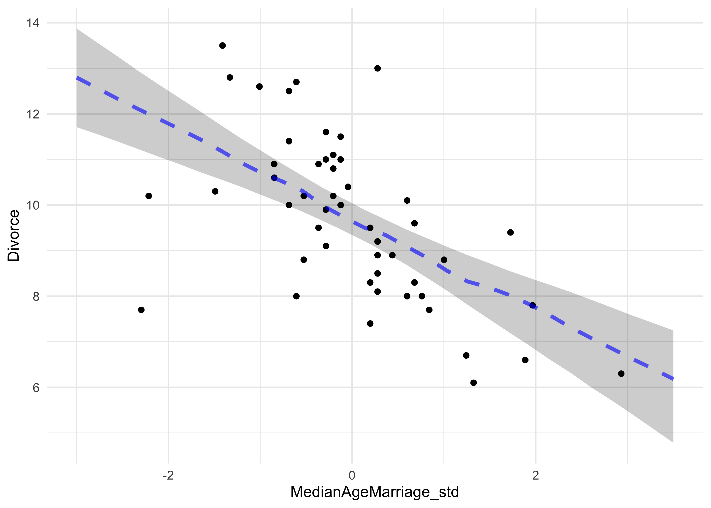
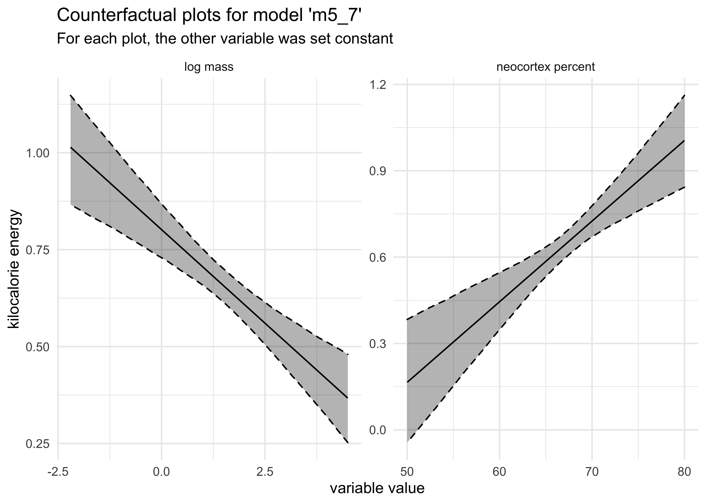
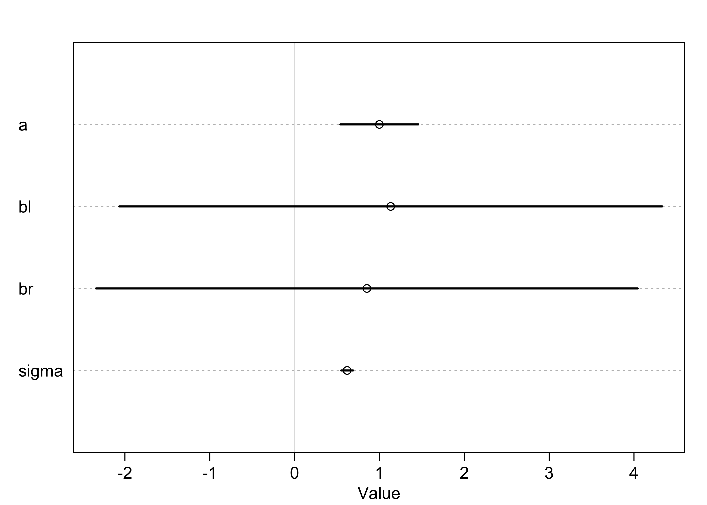

Chapter 4. Linear Models
================

  - correlation is very common in the real world
  - *multivariate regression* is using more than one predictor variable
    to model an outcome
  - reasons to use multivariate regression:
      - a way of “controlling” for confounding variables
      - multiple causation
      - interaction between variables
  - this chapter focuses on two thing multivariate models can help with:
      - revealing spurious correlations
      - revealing important correlations masked by hidden correlations
        of other variables
  - this chapter will also discuss:
      - multicolinearity
      - categorical variables

## 5.1 Spurious association

  - example: correlation between divorce rate and marriage rate
      - need to be married to get divorced
      - perhaps higher rates of marriage indicate that marriage is more
        important, leading to fewer divorces
      - another predictor: median age at marriage
  - we can fit a model of median age predicting divorce rate
      - this is the same as in the previous chapter
      - \(D_i\): divorce rate for state \(i\); \(A_i\): median age at
        marriage in state \(i\)

\[
D_i \sim \text{Normal}(\mu_i, \sigma) \\
\mu_i = \alpha + \beta_A A_i \\
\alpha \sim \text{Normal}(10, 10) \\
\beta_A \sim \text{Normal}(0, 1) \\
\sigma \sim \text{Uniform}(0, 10)
\]

``` r
# Load data.
data("WaffleDivorce")
d <- WaffleDivorce

# Stadardize predictor.
d$MedianAgeMarriage_std <- (d$MedianAgeMarriage - mean(d$MedianAgeMarriage)) / sd(d$MedianAgeMarriage)

m5_1 <- quap(
    alist(
        Divorce ~ dnorm(mu, sigma),
        mu <- a + bA * MedianAgeMarriage_std,
        a ~ dnorm(10, 10),
        bA ~ dnorm(0, 1),
        sigma ~ dunif(0, 10)
    ),
    data = d
)

summary(m5_1)
```

    ##            mean        sd      5.5%      94.5%
    ## a      9.688130 0.2045094  9.361285 10.0149760
    ## bA    -1.042933 0.2025347 -1.366623 -0.7192433
    ## sigma  1.446402 0.1447690  1.215034  1.6777712

``` r
mam_seq <- seq(-3, 3.5, length.out = 30)

mu <- link(m5_1, data = data.frame(MedianAgeMarriage_std = mam_seq))
mu_map <- apply(mu, 2, chainmode)
m5_1_pred <- apply(mu, 2, PI) %>%
    t() %>%
    as.data.frame() %>%
    set_names(c("pi_5", "pi_94")) %>%
    as_tibble() %>%
    mutate(mam_std = mam_seq,
           mu_map = mu_map)

d %>%
    ggplot() +
    geom_point(aes(x = MedianAgeMarriage_std, y = Divorce)) +
    geom_ribbon(data = m5_1_pred,
                aes(x = mam_std, ymin = pi_5, ymax = pi_94),
                fill = "black", alpha = 0.2, color = NA) +
    geom_line(data = m5_1_pred,
                aes(x = mam_std, y = mu_map),
                color = "blue", alpha = 0.6, lty = 2, size = 1.3)
```

<!-- -->

  - and we can model the divorce rate on the number of marriages in a
    state:
      - \(R_i\): rate of marriage in state \(i\)

\[
D_i \sim \text{Normal}(\mu_i, \sigma) \\
\mu_i = \alpha + \beta_R R_i \\
\alpha \sim \text{Normal}(10, 10) \\
\beta_A \sim \text{Normal}(0, 1) \\
\sigma \sim \text{Uniform}(0, 10)
\]

``` r
# Stadardize predictor.
d$Marriage_std <- (d$Marriage - mean(d$Marriage)) / sd(d$Marriage)

m5_2 <- quap(
    alist(
        Divorce ~ dnorm(mu, sigma),
        mu <- a + bR * Marriage_std,
        a ~ dnorm(10, 10),
        bR ~ dnorm(0, 1),
        sigma ~ dunif(0, 10)
    ),
    data = d
)

summary(m5_2)
```

    ##           mean        sd      5.5%     94.5%
    ## a     9.688141 0.2364437 9.3102582 10.066024
    ## bR    0.643766 0.2324753 0.2722255  1.015306
    ## sigma 1.672377 0.1673248 1.4049596  1.939794

  - but individual single-variate models cannot tell us which variable
    is more important or if they cancel each other out
  - the question we want to answer: *“What is the predictive value of a
    variable, once I already know all of the other predictor
    variables?”*
      - after I know the marriage rate, what additional value is there
        in also knowing the age at marriage?
      - after I know the age at marriage, what additional value is there
        in also knowing the marriage rate?

### 5.1.1 Multivariate notation

  - the strategy for building a multivariate model:
    1.  nominate the predictor variables you want in the linear model of
        the mean
    2.  for each predictor, make a parameter that will measure its
        association with the outcome
    3.  multiply the parameter by the variable and add that term to the
        linear model
  - the formula for our multivariate model example on divorce rate:

\[
D_i \sim \text{Normal}(\mu_i, \sigma) \\
\mu_i = \alpha + \beta_R R_i + \beta_A A_i \\
\alpha \sim \text{Normal}(10, 10) \\
\beta_A \sim \text{Normal}(0, 1) \\
\beta_R \sim \text{Normal}(0, 1) \\
\sigma \sim \text{Uniform}(0, 10)
\]

  - what does \(\mu_i = \alpha + \beta_R R_i + \beta_A A_i\) mean:
      - the expected outcome for any state with marriage rate \(R_i\)
        and median age at marriage \(A_i\) is the sum of three
        independent terms
      - \(\alpha\) is a constant that every state gets
      - \(\beta_R R_i\) is the marriage rate multiplied against a
        coefficient \(\beta_R\) that measures the association between
        the marriage rate and divorce rate
      - \(\beta_A A_i\) is similar to the second term, but for the
        association with median age at marriage

### 5.1.2 Fitting the model

  - we can use the quadratic approximation to fit the model

<!-- end list -->

``` r
m5_3 <- quap(
    alist(
        Divorce ~ dnorm(mu, sigma),
        mu <- a + bR * Marriage_std + bA * MedianAgeMarriage_std,
        a ~ dnorm(10, 10),
        bA ~ dnorm(0, 1),
        bR ~ dnorm(0, 1),
        sigma ~ dunif(0, 10)
    ),
    data = d
)

summary(m5_3)
```

    ##             mean        sd       5.5%      94.5%
    ## a      9.6881295 0.2036122  9.3627178 10.0135412
    ## bA    -1.1347453 0.2797168 -1.5817868 -0.6877039
    ## bR    -0.1321716 0.2794281 -0.5787516  0.3144085
    ## sigma  1.4400545 0.1443456  1.2093623  1.6707466

``` r
plot(summary(m5_3))
```

<!-- -->

  - now, the coefficient for the marriage rate predictor is about zero
    and the coefficient of the median age is confidently below zero we
    can interpret these to mean: *“Once we know the median age at
    marriage for a state, there is little predictive power in also
    knowing the rate of marriage in that state.”*
  - we can make some plots to investigate how the model came to this
    conclusion

### 5.1.3 Plotting the multivariate posteriors

  - we will use three types of interpretive plots
    1.  *predictor residual plots*: show the outcome against residual
        predictor values
    2.  *counterfactual plots*: show the implied predictions for
        imaginary experiments in which the different predictor variables
        can be changed independently of one another
    3.  *posterior prediction plots*: show model-based predictions
        against raw data, or otherwise display the error in prediction

#### 5.1.3.1 Predictor residual plots

  - *predictor variable residual*: the average prediction error when
    using all other predictor variables to model a predictor of interest
      - plotting this against the outcome shows something like a
        bivariate regression that has already been “controlled” for all
        of the other predictors
      - it leaves the variation not expected by the model of the mean of
        the other predictors
  - this is best illustrated by an example:
      - we will model the marriage rate using the median age at marriage

\[
R_i \sim \text{Normal}(\mu_i \sigma) \\
\mu_i = \alpha + \beta A_i \\
\alpha \sim \text{Normal}(0, 10) \\
\beta \sim \text{Normal}(1, 0) \\
\sigma \sim \text{Uniform}(0, 10)
\]

  - since we are using centered variables, \(\apha\) should be zero

<!-- end list -->

``` r
m5_4 <- quap(
    alist(
        Marriage_std ~ dnorm(mu, sigma),
        mu <- a + b*MedianAgeMarriage_std,
        a ~ dnorm(0, 10),
        b ~ dnorm(0, 1),
        sigma ~ dunif(0, 10)
    ),
    data = d
)

summary(m5_4)
```

    ##                mean         sd       5.5%      94.5%
    ## a      2.099025e-05 0.09701186 -0.1550227  0.1550647
    ## b     -7.142865e-01 0.09754347 -0.8701798 -0.5583932
    ## sigma  6.860097e-01 0.06862260  0.5763376  0.7956819

  - we then compute the residuals by subtracting the observed marriage
    rate in each state from the predicted rate when using median age
      - a positive residual means the observed rate was greater than
        that expected given the median age in that state

<!-- end list -->

``` r
mu <- coef(m5_4)["a"] + coef(m5_4)["b"] * d$MedianAgeMarriage_std
m_resid <- d$Marriage_std - mu
str(m_resid)
```

    ##  num [1:50] -0.4104 1.0593 -0.0969 0.6477 0.1615 ...

``` r
d %>%
    mutate(mu = mu,
           resid = m_resid,
           resid_diff = mu + m_resid) %>%
    ggplot() +
    geom_linerange(aes(x = MedianAgeMarriage_std, 
                       ymin = mu, ymax = resid_diff),
                   size = 0.8, color = "grey60") +
    geom_point(aes(x = MedianAgeMarriage_std, y = Marriage_std),
               color = "black", size = 2) +
    geom_line(aes(x = MedianAgeMarriage_std, y = mu),
              color = "tomato", size = 1.3, alpha = 0.7) +
    labs(title = "Residual marriage rate estimated using the median age at marriage",
         subtitle = "The red line is the estimate, and the vertical lines are the residuals")
```

<!-- -->

  - we can then plot these residuals against the divorce rate
      - this is the linear relationship between divorce and marriage
        rates after “controlling” for median age

<!-- end list -->

``` r
d %>%
    mutate(mu = mu,
           resid = m_resid,
           resid_diff = mu + m_resid) %>%
    ggplot() +
    geom_point(aes(x = resid, y = Divorce),
               color = "black", size = 2) +
    geom_vline(xintercept = 0, lty = 2, color = "dodgerblue", size = 0.9) +
    labs(x = "residual marriage rate",
         title = "Residual marriage rate and Divorce",
         subtitle = "The linear relationship of marriage and divorce rates after correcting for median age at marriage")
```

<!-- -->

  - we can do the same calculation in the other direction: find the
    residual of the median age modeled on the rate

<!-- end list -->

``` r
m5_4_2 <- quap(
    alist(
        MedianAgeMarriage_std ~ dnorm(mu, sigma),
        mu <- a + b*Marriage_std,
        a ~ dnorm(0, 10),
        b ~ dnorm(0, 1),
        sigma ~ dunif(0, 10)
    ),
    data = d
)

summary(m5_4)
```

    ##                mean         sd       5.5%      94.5%
    ## a      2.099025e-05 0.09701186 -0.1550227  0.1550647
    ## b     -7.142865e-01 0.09754347 -0.8701798 -0.5583932
    ## sigma  6.860097e-01 0.06862260  0.5763376  0.7956819

``` r
mu <- coef(m5_4_2)["a"] + coef(m5_4_2)["b"] * d$Marriage_std
m_resid <- d$MedianAgeMarriage_std - mu


p1 <- d %>%
    mutate(mu = mu,
           resid = m_resid,
           resid_diff = mu + m_resid) %>%
    ggplot(aes(x = Marriage_std)) +
    geom_linerange(aes(ymin = mu, ymax = resid_diff),
                   size = 0.8, color = "grey60") +
    geom_point(aes(y = MedianAgeMarriage_std),
               color = "black", size = 2) +
    geom_line(aes(y = mu),
              color = "tomato", size = 1.3, alpha = 0.7) +
    labs(title = "Residual median age estimated\nusing the marriage rate",
         subtitle = "The red line is the estimate,\nand the vertical lines are the residuals")

p2 <- d %>%
    mutate(mu = mu,
           resid = m_resid,
           resid_diff = mu + m_resid) %>%
    ggplot() +
    geom_point(aes(x = resid, y = Divorce),
               color = "black", size = 2) +
    geom_vline(xintercept = 0, lty = 2, color = "dodgerblue", size = 0.9) +
    labs(x = "residual median age",
         title = "Residual median age and Divorce",
         subtitle = "The linear relationship of median age\nand divorce after correcting for marriage rate")

p1 | p2
```

<!-- -->

  - the negative slope of the residual median age vs. Divorce (on the
    right in the above plot) indicates that the median age contains
    information even after adjusting for marriage rate

#### 5.1.3.2 Counterfactual plots

  - this plot displays the *implied* predictions of the model
      - we can make predictions for inputs that were never seen or are
        technically impossible
      - e.g.: a high marriage rate and high median age
  - the simplest counterfactual plot is to see how predictions change
    while changing only one predictor
  - we will draw two counterfactual plots, one for each predictor

<!-- end list -->

``` r
# Make new "data" while holding median age constant.
A_avg <- mean(d$MedianAgeMarriage_std)
R_seq <- seq(-3, 3, length.out = 30)
pred_data <- tibble(Marriage_std = R_seq,
                    MedianAgeMarriage_std = A_avg)

# Compute the counterfactual mu values.
mu <- link(m5_3, data = pred_data)
mu_mean <- apply(mu, 2, mean)
mu_pi <- apply(mu, 2, PI) %>% 
    pi_to_df() %>%
    set_names(c("mu_5_pi", "mu_94_pi"))

# Simulate counterfactual divorce outcomes
R_sim <- sim(m5_3, data = pred_data, n = 1e4)
R_pi <- apply(R_sim, 2, PI) %>% 
    pi_to_df() %>%
    set_names(c("Rsim_5_pi", "Rsim_94_pi"))

R_counterfactual <- pred_data %>%
    mutate(mu = mu_mean) %>%
    bind_cols(mu_pi, R_pi)

R_counterfactual %>%
    ggplot(aes(x = Marriage_std)) +
    geom_ribbon(aes(ymin = Rsim_5_pi, ymax = Rsim_94_pi),
                color = NA, fill = "black", alpha = 0.2) +
    geom_ribbon(aes(ymin = mu_5_pi, ymax = mu_94_pi),
                color = NA, fill = "black", alpha = 0.4) +
    geom_line(aes(y = mu), color = "black", size = 1.4) +
    labs(x = "Marriage_std",
         y = "Divorce",
         title = "Counterfactual holding median age constant",
         subtitle = "The line is the mean divorce rate over marriage rate, holding age constant.
The inner ribbon (darker) is the 95% PI for the mean over marriage rate.
The outer ribbon is the 95% PI of the simulated divorce rates.")
```

<!-- -->

``` r
# Make new "data" while holding median age constant.
R_avg <- mean(d$Marriage_std)
A_seq <- seq(-3, 3, length.out = 30)
pred_data <- tibble(Marriage_std = R_avg,
                    MedianAgeMarriage_std = A_seq)

# Compute the counterfactual mu values.
mu <- link(m5_3, data = pred_data)
mu_mean <- apply(mu, 2, mean)
mu_pi <- apply(mu, 2, PI) %>% 
    pi_to_df() %>%
    set_names(c("mu_5_pi", "mu_94_pi"))

# Simulate counterfactual divorce outcomes
A_sim <- sim(m5_3, data = pred_data, n = 1e4)
A_pi <- apply(A_sim, 2, PI) %>% 
    pi_to_df() %>%
    set_names(c("Asim_5_pi", "Asim_94_pi"))

A_counterfactual <- pred_data %>%
    mutate(mu = mu_mean) %>%
    bind_cols(mu_pi, A_pi)

A_counterfactual %>%
    ggplot(aes(x = MedianAgeMarriage_std)) +
    geom_ribbon(aes(ymin = Asim_5_pi, ymax = Asim_94_pi),
                color = NA, fill = "black", alpha = 0.2) +
    geom_ribbon(aes(ymin = mu_5_pi, ymax = mu_94_pi),
                color = NA, fill = "black", alpha = 0.4) +
    geom_line(aes(y = mu), color = "black", size = 1.4) +
    labs(x = "MedianAgeMarriage_std",
         y = "Divorce",
         title = "Counterfactual holding median age constant",
         subtitle = "The line is the mean divorce rate over median age, holding marriage rate constant.
The inner ribbon (darker) is the 95% PI for the mean over median age.
The outer ribbon is the 95% PI of the simulated divorce rates.")
```

<!-- -->

  - these show
      - that changing the marriage rate while holding the median age
        constant, does not cause much change to the predicted rates of
        divorce
      - but changing the median age, holding the marriage rate constant,
        does predict substantial effects on divorce rate
  - counterfactual plots are contentious because of their small-world
    nature

#### 5.1.3.3 Posterior prediction plots

  - it is important to check the model fit against the observed data:
    1.  Did the model fit correctly?
    2.  How does the model fail?
          - all models fail in some way; important to find the
            limitations of the predictions
  - begin by simulating predictions, averaging over the posterior

<!-- end list -->

``` r
# Simulate mu using the original data (by not providing new data)
mu <- link(m5_3)
mu_mean <- apply(mu, 2, mean)
mu_pi <- apply(mu, 2, PI)

# Simulate divorce rates using the original data (by not providing new data)
divorce_sim <- sim(m5_3, n = 1e4)
divorce_pi <- apply(divorce_sim, 2, PI)
```

  - for multivariate models, there are many ways to display these
    simulations
  - first, we can plot the predictions against the observed
      - the dashed line represents perfect correlation between the
        predicted and observed
      - we see that the model under-predicts for states with high
        divorce rates and over-predicts for those with low rates

<!-- end list -->

``` r
tibble(mu_mean = mu_mean,
       obs_divorce = d$Divorce,
       state = as.character(d$Loc)) %>%
    mutate(label = ifelse(state %in% c("ID", "UT"), state, NA_character_)) %>%
    bind_cols(pi_to_df(mu_pi)) %>%
    ggplot(aes(x = obs_divorce, y = mu_mean)) +
    geom_pointrange(aes(ymin = x5_percent, ymax = x94_percent)) +
    geom_abline(slope = 1, intercept = 0, lty = 2, alpha = 0.6) +
    ggrepel::geom_text_repel(aes(label = label), family = "Arial") +
    labs(x = "observed divorce",
         y = "predicted divorce")
```

    ## Warning: Removed 48 rows containing missing values (geom_text_repel).

<!-- -->

  - we can also show the residual of the predictions (the prediction
    error)
      - we can arrange this plot from least to most prediction error

<!-- end list -->

``` r
tibble(divorce = d$Divorce,
       mu_mean = mu_mean,
       state = as.character(d$Loc)) %>%
    mutate(divorce_resid = divorce - mu_mean,
           state = fct_reorder(state, divorce_resid)) %>%
    bind_cols(pi_to_df(mu_pi)) %>%
    mutate(x5_percent = divorce - x5_percent,
           x94_percent = divorce - x94_percent) %>%
    ggplot(aes(x = divorce_resid, y = state)) +
    geom_pointrange(aes(xmin = x5_percent, xmax = x94_percent)) +
    labs(x = "residual divorce", y = "state")
```

<!-- -->

  - a third type of plot is to compare the divorce residual against new
    predictors
      - this can show if there are additional predictors that add
        information
      - in the following example, I compare the divorce residual against
        the number of Waffle Houses per capita in the state

<!-- end list -->

``` r
label_states <- c("ME", "AR", "AL", "MS", "GA", "SC", "ID", "UT")

tibble(divorce = d$Divorce,
       mu_mean = mu_mean,
       waffle_houses = d$WaffleHouses,
       population = d$Population,
       state = as.character(d$Loc)) %>%
    mutate(divorce_resid = divorce - mu_mean,
           waffles_per_capita = waffle_houses / population,
           label = ifelse(state %in% label_states, state, NA_character_)) %>%
    bind_cols(pi_to_df(mu_pi)) %>%
    ggplot(aes(x = waffles_per_capita, y = divorce_resid)) +
    geom_point() +
    geom_smooth(method = "lm", formula = "y ~ x") +
    ggrepel::geom_text_repel(aes(label = label), family = "Arial") +
    labs(x = "Waffle Houses per capita",
         y = "residual divorce")
```

    ## Warning: Removed 42 rows containing missing values (geom_text_repel).

<!-- -->

## 5.2 Masked relationship

  - another reason to use a multivariate model is to identify influences
    of multiple factors when none of them show an individual bivariate
    relationship with the outcome
  - for this section, we will use a new data set: the composition of
    milk across primate species
      - for now, we will use:
          - `kcal_per_g`: Calories per gram of milk (in Cal/g)
          - `mass`: average female body mass (in kg)
          - `neocortex_perc`: percent of total brain mass that is the
            neocortex

<!-- end list -->

``` r
data(milk)
d <- janitor::clean_names(milk)
str(d)
```

    ## 'data.frame':    29 obs. of  8 variables:
    ##  $ clade         : Factor w/ 4 levels "Ape","New World Monkey",..: 4 4 4 4 4 2 2 2 2 2 ...
    ##  $ species       : Factor w/ 29 levels "A palliata","Alouatta seniculus",..: 11 8 9 10 16 2 1 6 28 27 ...
    ##  $ kcal_per_g    : num  0.49 0.51 0.46 0.48 0.6 0.47 0.56 0.89 0.91 0.92 ...
    ##  $ perc_fat      : num  16.6 19.3 14.1 14.9 27.3 ...
    ##  $ perc_protein  : num  15.4 16.9 16.9 13.2 19.5 ...
    ##  $ perc_lactose  : num  68 63.8 69 71.9 53.2 ...
    ##  $ mass          : num  1.95 2.09 2.51 1.62 2.19 5.25 5.37 2.51 0.71 0.68 ...
    ##  $ neocortex_perc: num  55.2 NA NA NA NA ...

  - the following plots provide a little information about these columns
    - this was not included in the course

<!-- end list -->

``` r
d %>%
    select(clade, kcal_per_g, mass, neocortex_perc) %>%
    pivot_longer(-clade, names_to = "name", values_to = "value") %>%
    ggplot(aes(x = clade, y = value, color = clade)) +
    facet_wrap(~ name, nrow = 1, scales = "free") +
    geom_jitter() +
    theme(axis.text.x = element_text(angle = 30, hjust = 1),
          legend.position = "none")
```

    ## Warning: Removed 12 rows containing missing values (geom_point).

<!-- -->

``` r
d %>%
    ggplot(aes(x = kcal_per_g, y = neocortex_perc, color = clade, size = mass)) +
    geom_point()
```

    ## Warning: Removed 12 rows containing missing values (geom_point).

<!-- -->

  - the first model is just a bivariate regression between kilocalories
    and neocortex percent
      - we dropped rows with missing values (in neocortex percent)

<!-- end list -->

``` r
dcc <- d[complete.cases(d), ]
dim(dcc)
```

    ## [1] 17  8

``` r
m5_5 <- quap(
    alist(
        kcal_per_g ~ dnorm(mu, sigma),
        mu <- a + bn*neocortex_perc,
        a ~ dnorm(0, 100),
        bn ~ dnorm(0, 1),
        sigma ~ dunif(0, 1)
    ),
    data = dcc
)

precis(m5_5, digits = 4)
```

    ##              mean         sd         5.5%      94.5%
    ## a     0.353339079 0.47071829 -0.398959667 1.10563782
    ## bn    0.004503203 0.00694034 -0.006588801 0.01559521
    ## sigma 0.165702599 0.02841440  0.120290904 0.21111429

  - the estimate for the coefficient for the neocortex percent is near
    zero and not very precise
      - the 89% interval is wide on both side of 0
  - the next model will use the logarithm of the mother’s body mass to
    predict the kilocalories of the milk
      - use the logarithm because we are curious about changes in
        magnitude

<!-- end list -->

``` r
dcc$log_mass <- log(dcc$mass)

m5_6 <- quap(
    alist(
        kcal_per_g ~ dnorm(mu, sigma),
        mu <- a + bm*log_mass,
        a ~ dnorm(0, 100),
        bm ~ dnorm(0, 1),
        sigma ~ dunif(0, 1)
    ),
    data = dcc
)

precis(m5_6)
```

    ##              mean         sd       5.5%        94.5%
    ## a      0.70513782 0.04870574  0.6272966 0.7829789961
    ## bm    -0.03167464 0.02028338 -0.0640914 0.0007421243
    ## sigma  0.15686289 0.02689801  0.1138747 0.1998511120

  - the mean coefficient is still very small and imprecise (large 89%
    interval)
  - the next model includes both the neocortex percent and mother’s mass
    as predictors of kilocalories

\[
k_i \sim \text{Normal}(\mu_i, \sigma) \\
\mu_i = \alpha + \beta_n n_i + \beta_m \log(m_i) \\
\alpha \sim \text{Normal}(0, 100) \\
\beta_n \sim \text{Normal}(0, 1) \\
\beta_m \sim \text{Normal}(0, 1) \\
\sigma \sim \text{Uniform}(0, 1)
\]

``` r
m5_7 <- quap(
    alist(
        kcal_per_g ~ dnorm(mu, sigma),
        mu <- a + bn*neocortex_perc + bm*log_mass,
        a ~ dnorm(0, 100),
        bn ~ dnorm(0, 1),
        bm ~ dnorm(0, 1),
        sigma ~ dunif(0, 1)
    ),
    data = dcc
)

precis(m5_7)
```

    ##              mean          sd        5.5%       94.5%
    ## a     -1.08440983 0.467561011 -1.83166263 -0.33715703
    ## bn     0.02791699 0.007272703  0.01629380  0.03954017
    ## bm    -0.09634937 0.022454232 -0.13223557 -0.06046317
    ## sigma  0.11479315 0.019681988  0.08333753  0.14624876

  - incorporating both predictor variables the estimation association of
    both with the kilocalories of the milk has increased
      - the posterior mean for the neocortex has increased almost a
        magnitude and the 89% interval is confidently beyond 0
      - the posterior mean for the log mass is even more negative
  - the following plot shows this relationship with the size of the
    point as the kilocalories of the milk

<!-- end list -->

``` r
dcc %>%
    ggplot(aes(x = log_mass, y = neocortex_perc, size = kcal_per_g)) +
    geom_point()
```

<!-- -->

  - we can make counterfactual plots for each variable

<!-- end list -->

``` r
# Counterfactual holding log mass constant.
avg_log_mass <- mean(dcc$log_mass)
neocortex_seq <- seq(50, 80, length.out = 30)
data_n <- tibble(neocortex_perc = neocortex_seq,
                 log_mass = avg_log_mass)
mu_n <- link(m5_7, data = data_n)
mu_n_mean <- apply(mu_n, 2, mean)
mu_n_pi <- apply(mu_n, 2, PI) %>% 
    pi_to_df()

# Counterfactual holding neocortex percent constant.
avg_neopct <- mean(dcc$neocortex_perc)
logmass_seq <- seq(-2.2, 4.5, length.out = 30)
data_m <- tibble(neocortex_perc = avg_neopct,
                 log_mass = logmass_seq)
mu_m <- link(m5_7, data = data_m)
mu_m_mean <- apply(mu_m, 2, mean)
mu_m_pi <- apply(mu_m, 2, PI) %>% 
    pi_to_df()

# Combine data and plot.
bind_rows(
    tibble(counterfactual = "neocortex percent",
           mu_mean = mu_n_mean,
           x = neocortex_seq) %>%
        bind_cols(mu_n_pi),
    tibble(counterfactual = "log mass",
           mu_mean = mu_m_mean,
           x = logmass_seq) %>%
        bind_cols(mu_m_pi)
) %>%
    ggplot(aes(x = x)) +
    facet_wrap(~ counterfactual, scales = "free", nrow = 1) +
    geom_ribbon(aes(ymin = x5_percent, ymax = x94_percent),
                fill = "black", alpha = 0.3, color = "black", lty = 2) +
    geom_line(aes(y = mu_mean),
              color = "black", lty = 1) +
    labs(title = "Counterfactual plots for model 'm5_7'",
         subtitle = "For each plot, the other variable was set constant",
         x = "variable value",
         y = "kilocalorie energy")
```

<!-- -->

  - these variables only became useful when used together because they
    both correlate with the outcome, but one is positive and the other
    is negative
      - also, these two variables are positively correlated
      - therefore, they tend to “mask” each other until both are used in
        the model

## 5.3 When adding variables hurts

  - why not use all of the available predictors for the model?
    1.  *multicolinearity*
    2.  *post-treatment bias*
    3.  *overfitting*

### 5.3.1 Multicollinear legs

  - we start with an example: predicting height using length of a
    persons leg
      - they are correlated, but problems happen when both legs are
        included in the model
  - we simulate 100 individuals
      - height is sampled from a Gaussian
      - each person gets a simulated proportion of height for their
        legs, ranging from 0.4 to 0.5
      - the second leg is made from the first with a touch of error

<!-- end list -->

``` r
# Create data.
N <- 100
height <- rnorm(N, 10, 2)
leg_prop <- runif(N, 0.4, 0.5)
leg_left <- leg_prop * height + rnorm(N, 0, 0.02)
leg_right <- leg_prop * height + rnorm(N, 0, 0.02)
d <- tibble(height, leg_left, leg_right)

# Model.
m5_8 <- quap(
    alist(
        height ~ dnorm(mu, sigma),
        mu <- a + bl*leg_left + br*leg_right,
        a ~ dnorm(10, 100),
        bl ~ dnorm(2, 10),
        br ~ dnorm(2, 10),
        sigma ~ dunif(0, 10)
    ),
    data = d
)

summary(m5_8)
```

    ##            mean         sd       5.5%    94.5%
    ## a     0.9988430 0.28722014  0.5398097 1.457876
    ## bl    1.1322740 2.00199583 -2.0673020 4.331850
    ## br    0.8518110 1.99728504 -2.3402363 4.043858
    ## sigma 0.6187491 0.04375183  0.5488252 0.688673

``` r
plot(summary(m5_8))
```

<!-- -->

  - the model fit correctly, remember the question that linear
    regression answers:
      - “What is the value of knowing each predictor, after already
        knowing all of the other predictors?”
      - for this example: “What is the value of knowing each leg’s
        length, after already knowing the other leg’s length?”
  - another way of thinking about this is that we have fitted the
    following formula
      - there are almost an infinite number of pairs of \(\beta_1\) and
        \(\beta_2\) that would produce a given \(y\) value for a given
        \(x\)

\[
y_i \sim \text{Normal}(\mu_i, \sigma) \\
\mu_i = \alpha + \beta_1 x_i + \beta_2 x_i \\
\mu_i = \alpha + (\beta_1 + \beta_2) x_i = \alpha + \beta_3 x_i
\]

  - *when two predictor variables are very strongly correlated,
    including both in a model may lead to confusion*
  - importantly, this model makes fine predictions about height given
    the length of the left and right legs, it just doesn’t say anything
    about which leg is more important

### 5.3.2 Multicollinear milk
