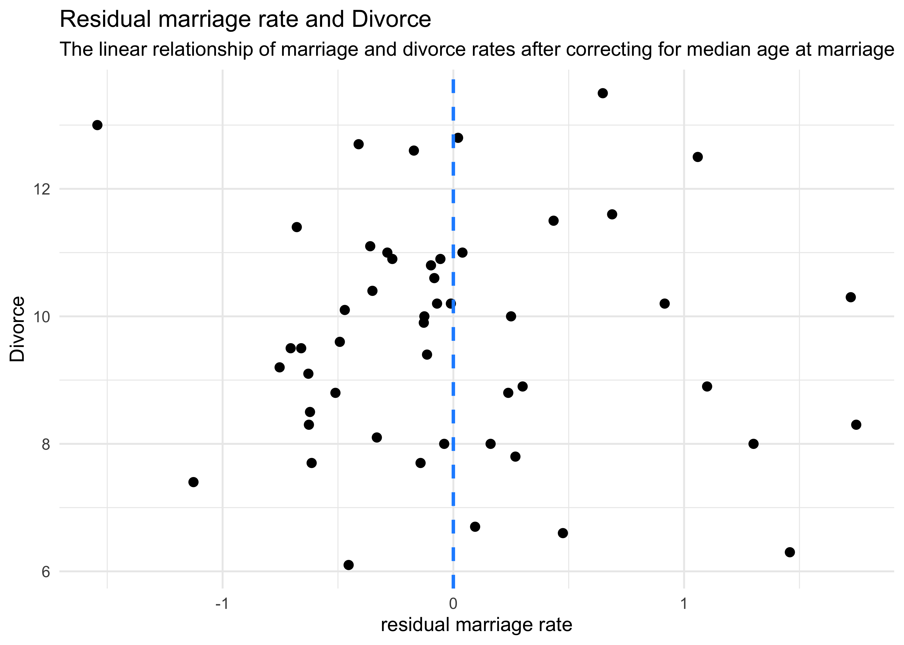

Chapter 4. Linear Models
================

  - correlation is very common in the real world
  - *multivariate regresssion* is using more than one predictor variable
    to model an outcome
  - reasons to use multivariate regression:
      - a way of “controlling” for confounding variables
      - multiple causation
      - interaction between variables
  - this chapter focuses on two thing multivate models can help with:
      - revealing spurious correlations
      - revealing important correlations masked by hidden correlations
        of other variables
  - this chapter will also discuss:
      - multicolinearity
      - categorical variables

## 5.1 Spurious association

  - example: correlation between divorce rate and marriage rate
      - need to be married to get divorced
      - perhaps higher rates of marriage indicate that marriage is more
        important, leading to fewer divorces
      - another predictor: median age at marriage
  - we can fit a model of median age predicting divorce rate
      - this is the same as in the previous chapter
      - \(D_i\): divorce rate for state \(i\); \(A_i\): median age at
        marriage in state \(i\)

\[
D_i \sim \text{Normal}(\mu_i, \sigma) \\
\mu_i = \alpha + \beta_A A_i \\
\alpha \sim \text{Normal}(10, 10) \\
\beta_A \sim \text{Normal}(0, 1) \\
\sigma \sim \text{Uniform}(0, 10)
\]

``` r
# Load data.
data("WaffleDivorce")
d <- WaffleDivorce

# Stadardize predictor.
d$MedianAgeMarriage_std <- (d$MedianAgeMarriage - mean(d$MedianAgeMarriage)) / sd(d$MedianAgeMarriage)

m5_1 <- quap(
    alist(
        Divorce ~ dnorm(mu, sigma),
        mu <- a + bA * MedianAgeMarriage_std,
        a ~ dnorm(10, 10),
        bA ~ dnorm(0, 1),
        sigma ~ dunif(0, 10)
    ),
    data = d
)

summary(m5_1)
```

    ##            mean        sd      5.5%      94.5%
    ## a      9.688130 0.2045094  9.361285 10.0149760
    ## bA    -1.042933 0.2025347 -1.366623 -0.7192433
    ## sigma  1.446402 0.1447690  1.215034  1.6777712

``` r
mam_seq <- seq(-3, 3.5, length.out = 30)

mu <- link(m5_1, data = data.frame(MedianAgeMarriage_std = mam_seq))
mu_map <- apply(mu, 2, chainmode)
m5_1_pred <- apply(mu, 2, PI) %>%
    t() %>%
    as.data.frame() %>%
    set_names(c("pi_5", "pi_94")) %>%
    as_tibble() %>%
    mutate(mam_std = mam_seq,
           mu_map = mu_map)

d %>%
    ggplot() +
    geom_point(aes(x = MedianAgeMarriage_std, y = Divorce)) +
    geom_ribbon(data = m5_1_pred,
                aes(x = mam_std, ymin = pi_5, ymax = pi_94),
                fill = "black", alpha = 0.2, color = NA) +
    geom_line(data = m5_1_pred,
                aes(x = mam_std, y = mu_map),
                color = "blue", alpha = 0.6, lty = 2, size = 1.3)
```

<!-- -->

  - and we can model the divorce rate on the number of mariages in a
    state:
      - \(R_i\): rate of marriage in state \(i\)

\[
D_i \sim \text{Normal}(\mu_i, \sigma) \\
\mu_i = \alpha + \beta_R R_i \\
\alpha \sim \text{Normal}(10, 10) \\
\beta_A \sim \text{Normal}(0, 1) \\
\sigma \sim \text{Uniform}(0, 10)
\]

``` r
# Stadardize predictor.
d$Marriage_std <- (d$Marriage - mean(d$Marriage)) / sd(d$Marriage)

m5_2 <- quap(
    alist(
        Divorce ~ dnorm(mu, sigma),
        mu <- a + bR * Marriage_std,
        a ~ dnorm(10, 10),
        bR ~ dnorm(0, 1),
        sigma ~ dunif(0, 10)
    ),
    data = d
)

summary(m5_2)
```

    ##           mean        sd      5.5%     94.5%
    ## a     9.688141 0.2364437 9.3102582 10.066024
    ## bR    0.643766 0.2324753 0.2722255  1.015306
    ## sigma 1.672377 0.1673248 1.4049596  1.939794

  - but individual single-variate models cannot tell us which variable
    is more important or if they cancel each other out
  - the question we want to answer: *“What is the predictive value of a
    variable, once I already know all of the other predictor
    variables?”*
      - after I know the marriage rate, what additional value is there
        in also knowing the age at marraige?
      - after I know the age at marriage, what additional value is there
        in also knowing the marriage rate?

### 5.1.1 Multivariate notation

  - the strategy for building a multivariate model:
    1.  nominate the predictor variables you want in the linear model of
        the mean
    2.  for each predictor, make a parameter that will measure its
        association with the outcome
    3.  multiply the parameter by the variable and add that term to the
        linear model
  - the formula for our multiate model example on divorce rate:

\[
D_i \sim \text{Normal}(\mu_i, \sigma) \\
\mu_i = \alpha + \beta_R R_i + \beta_A A_i \\
\alpha \sim \text{Normal}(10, 10) \\
\beta_A \sim \text{Normal}(0, 1) \\
\beta_R \sim \text{Normal}(0, 1) \\
\sigma \sim \text{Uniform}(0, 10)
\]

  - what does \(\mu_i = \alpha + \beta_R R_i + \beta_A A_i\) mean:
      - the expected outcome for any state with marriage rate \(R_i\)
        and median age at marriage \(A_i\) is the sum of three
        independent terms
      - \(\alpha\) is a constant that every state gets
      - \(\beta_R R_i\) is the marriage rate multiplied against a
        coefficient \(\beta_R\) that measures the association between
        the marriage rate and divorce rate
      - \(\beta_A A_i\) is simillar to the second term, but for the
        association with median age at marriage

### 5.1.2 Fitting the model

  - we can use the quadratic approximation to fit the model

<!-- end list -->

``` r
m5_3 <- quap(
    alist(
        Divorce ~ dnorm(mu, sigma),
        mu <- a + bR * Marriage_std + bA * MedianAgeMarriage_std,
        a ~ dnorm(10, 10),
        bA ~ dnorm(0, 1),
        bR ~ dnorm(0, 1),
        sigma ~ dunif(0, 10)
    ),
    data = d
)

summary(m5_3)
```

    ##             mean        sd       5.5%      94.5%
    ## a      9.6881295 0.2036122  9.3627178 10.0135412
    ## bA    -1.1347453 0.2797168 -1.5817868 -0.6877039
    ## bR    -0.1321716 0.2794281 -0.5787516  0.3144085
    ## sigma  1.4400545 0.1443456  1.2093623  1.6707466

``` r
plot(summary(m5_3))
```

<!-- -->

  - now, the coefficient for the marriage rate predictor is about zero
    and the coefficient of the median age is confidently below zero we
    can interpret these to mean: *“Once we know the median age at
    marriage for a state, there is little predictive power in also
    knowing the rate of marriage in that state.”*
  - we can make some plots to investigate how the model came to this
    conclusion

### 5.1.3 Plotting the multivariate posteriors

  - we will use three types of interpretive plots
    1.  *predictor residual plots*: show the outcome against residual
        predictor values
    2.  *counterfactual plots*: show the implied predictions for
        imaginary experiments in which the different predictor variables
        can be changed independently of one another
    3.  *posterior prediction plots*: show model-based predictions
        against raw data, or otherwise diplay the error in prediction

#### 5.1.3.1 Predictor residual plots

  - *predictor variable residual*: the average prediction error when
    using all other predictor variables to model a predictor of interest
      - plotting this against the outcome shows something like a
        bivariate regression that has already been “controlled” for all
        of the other predictors
      - it leaves the variation not expected by the model of the mean of
        the other predictors
  - this is best illustrated by an example:
      - we will model the marriage rate using the meadian age at
        marriage

\[
R_i \sim \text{Normal}(\mu_i \sigma) \\
\mu_i = \alpha + \beta A_i \\
\alpha \sim \text{Normal}(0, 10) \\
\beta \sim \text{Normal}(1, 0) \\
\sigma \sim \text{Uniform}(0, 10)
\]

  - since we are using centered variables, \(\apha\) should be zero

<!-- end list -->

``` r
m5_4 <- quap(
    alist(
        Marriage_std ~ dnorm(mu, sigma),
        mu <- a + b*MedianAgeMarriage_std,
        a ~ dnorm(0, 10),
        b ~ dnorm(0, 1),
        sigma ~ dunif(0, 10)
    ),
    data = d
)

summary(m5_4)
```

    ##                mean         sd       5.5%      94.5%
    ## a      2.099025e-05 0.09701186 -0.1550227  0.1550647
    ## b     -7.142865e-01 0.09754347 -0.8701798 -0.5583932
    ## sigma  6.860097e-01 0.06862260  0.5763376  0.7956819

  - we then compute the residuals by subtracting the observed marriage
    rate in each state from the predicted rate when using age at
    marriage
      - a positive residual means the observed rate was in excess of
        that expected given the median age in that state

<!-- end list -->

``` r
mu <- coef(m5_4)["a"] + coef(m5_4)["b"] * d$MedianAgeMarriage_std
m_resid <- d$Marriage_std - mu
str(m_resid)
```

    ##  num [1:50] -0.4104 1.0593 -0.0969 0.6477 0.1615 ...

``` r
d %>%
    mutate(mu = mu,
           resid = m_resid,
           resid_diff = mu + m_resid) %>%
    ggplot() +
    geom_linerange(aes(x = MedianAgeMarriage_std, 
                       ymin = mu, ymax = resid_diff),
                   size = 0.8, color = "grey60") +
    geom_point(aes(x = MedianAgeMarriage_std, y = Marriage_std),
               color = "black", size = 2) +
    geom_line(aes(x = MedianAgeMarriage_std, y = mu),
              color = "tomato", size = 1.3, alpha = 0.7) +
    labs(title = "Residual marriage rate estimated using the median age at marriage",
         subtitle = "The red line is the estimate, and the vertical lines are the residuals")
```

<!-- -->

  - we can then plot these residuals against the divorce rate
      - this is the linear relationship between divorce and marriage
        rates after “controlling” for median age of marriage

<!-- end list -->

``` r
d %>%
    mutate(mu = mu,
           resid = m_resid,
           resid_diff = mu + m_resid) %>%
    ggplot() +
    geom_point(aes(x = resid, y = Divorce),
               color = "black", size = 2) +
    geom_vline(xintercept = 0, lty = 2, color = "dodgerblue", size = 0.9) +
    labs(x = "residual marriage rate",
         title = "Residual marriage rate and Divorce",
         subtitle = "The linear relationship of marriage rate and divorce after correcting for median age at marriage")
```

<!-- -->

  - we can do the same caluclation in the other direction: find the
    residual of the median age modeled on the rate

<!-- end list -->

``` r
m5_4_2 <- quap(
    alist(
        MedianAgeMarriage_std ~ dnorm(mu, sigma),
        mu <- a + b*Marriage_std,
        a ~ dnorm(0, 10),
        b ~ dnorm(0, 1),
        sigma ~ dunif(0, 10)
    ),
    data = d
)

summary(m5_4)
```

    ##                mean         sd       5.5%      94.5%
    ## a      2.099025e-05 0.09701186 -0.1550227  0.1550647
    ## b     -7.142865e-01 0.09754347 -0.8701798 -0.5583932
    ## sigma  6.860097e-01 0.06862260  0.5763376  0.7956819

``` r
mu <- coef(m5_4_2)["a"] + coef(m5_4_2)["b"] * d$Marriage_std
m_resid <- d$MedianAgeMarriage_std - mu


p1 <- d %>%
    mutate(mu = mu,
           resid = m_resid,
           resid_diff = mu + m_resid) %>%
    ggplot(aes(x = Marriage_std)) +
    geom_linerange(aes(ymin = mu, ymax = resid_diff),
                   size = 0.8, color = "grey60") +
    geom_point(aes(y = MedianAgeMarriage_std),
               color = "black", size = 2) +
    geom_line(aes(y = mu),
              color = "tomato", size = 1.3, alpha = 0.7) +
    labs(title = "Residual median age estimated\nusing the marriage rate",
         subtitle = "The red line is the estimate,\nand the vertical lines are the residuals")

p2 <- d %>%
    mutate(mu = mu,
           resid = m_resid,
           resid_diff = mu + m_resid) %>%
    ggplot() +
    geom_point(aes(x = resid, y = Divorce),
               color = "black", size = 2) +
    geom_vline(xintercept = 0, lty = 2, color = "dodgerblue", size = 0.9) +
    labs(x = "residual median age",
         title = "Residual median age and Divorce",
         subtitle = "The linear relationship of median age\nand divorce after correcting for marriage rate")

p1 | p2
```

<!-- -->

  - the negative slope of the residual median age vs. Divorce (on the
    right in the above plot) indicates that the median age contains
    information even after adjusting for marriage rate

#### 5.1.3.2 Counterfactual plots
