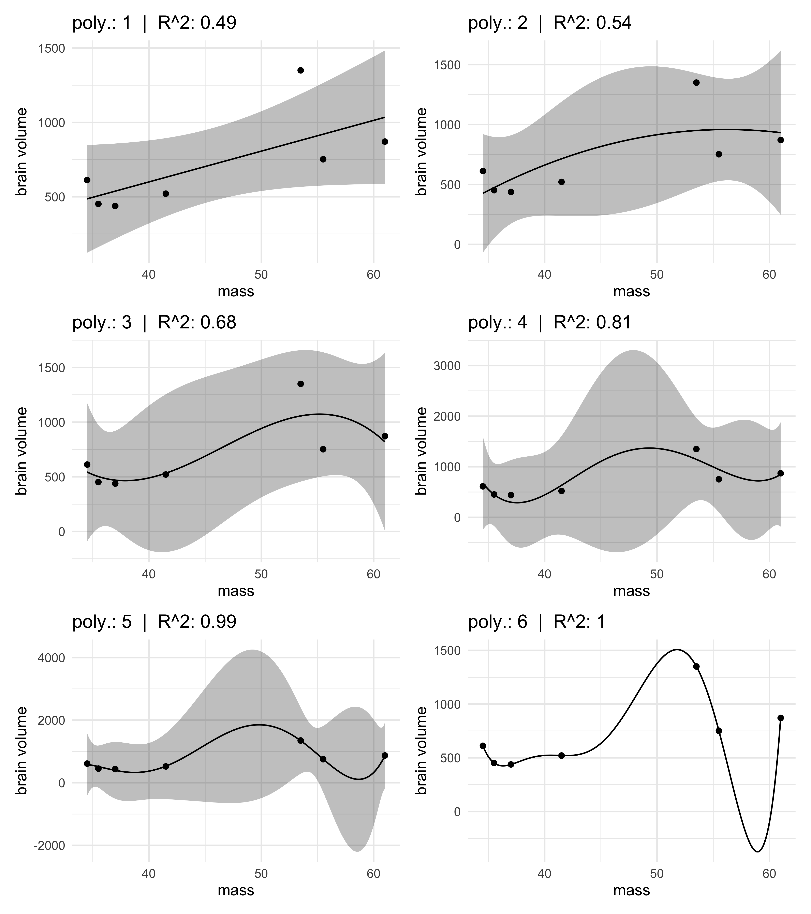

Chapter 6. Overfitting, Regularization, and Information Criteria
================

  - simpler models tend to be preferred
      - this chapter deals with comparing explanatory value of a model
        and its complexity
  - there are two general families:
      - *regularization*
      - use a scoring mechanism like *information criteria*
          - this chapter introduces *information theory* to cover these
            metrics

## 6.1 The problem with parameters

  - we should not just add all variables even if they are not correlated
    with each other
      - adding parameters will generally improve the fit of the model to
        the data
      - however, they can often predict worse on new data
      - this is *overfitting*

### 6.1.1 More parameters always improve fit

  - *overfitting*: a model learns to much from a sample
  - for an example, we will use fake data on average brain volumes and
    body mass of hominid species

<!-- end list -->

``` r
sppnames <- c("afarensis", "africanus", "habilis", "boisei",
              "rudolfensis", "ergaster", "sapiens")
brainvolcc <- c(438, 452, 612, 521, 752, 871, 1350)
masskg <- c(37.0, 35.5, 34.5, 41.5, 55.5, 61.0, 53.5)
d <- tibble(species=sppnames, brain=brainvolcc, mass=masskg)
```

  - we will use `lm()` instead of `quap()` for this part of the lesson
    as it is a bit faster and easier to use
      - the main points will still apply
  - we will build increasingly complex models of this data
      - the simplest is below, modelling brain volume of body size

\[
v_i \sim \text{Normal}(\mu_i, \sigma) \\
\mu_i = \alpha + \beta_1 m_i
\]

  - this model is fit below and the \(R^2\) is calculated.

<!-- end list -->

``` r
m6_1 <- lm(brain ~ mass, data = d)
1 - var(resid(m6_1)) / var(d$brain)  # R-squared
```

    ## [1] 0.490158

  - consider 5 more models, each more complex with higher degree
    polynomials
      - below is the formula for the 2nd-degree polynomial

\[
v_i \sim \text{Normal}(\mu_i, \sigma) \\
\mu_i = \alpha + \beta_1 m_i + \beta_2 m_i^2
\]

``` r
m6_1 <- lm(brain ~ mass, data = d)
m6_2 <- lm(brain ~ mass + I(mass^2), data = d)
m6_3 <- lm(brain ~ mass + I(mass^2) + I(mass^3), data = d)
m6_4 <- lm(brain ~ mass + I(mass^2) + I(mass^3) + I(mass^4), data = d)
m6_5 <- lm(brain ~ mass + I(mass^2) + I(mass^3) + I(mass^4) + I(mass^5), data = d)
m6_6 <- lm(brain ~ mass + I(mass^2) + I(mass^3) + I(mass^4) + I(mass^5) + I(mass^6), data = d)
```

  - all of the fit models are shown against the original data, below
      - the 5th order model has an \(R^2 = 0.99\) and the 6th-order is 1
      - the 6th order goes through every point
      - there were enough parameters to assign one to each point of the
        data

<!-- end list -->

``` r
fitted_plot <- function(fit, idx, ...) {
    mass_seq <- data.frame(mass = seq(min(fit$model$mass), max(fit$model$mass), 
                                      length.out = 200))
    predict(fit, newdata = mass_seq, interval = "confidence") %>%
        cbind(mass_seq) %>%
        ggplot() +
        geom_ribbon(aes(x = mass, ymin = lwr, ymax = upr), 
                    alpha = 0.3, color = NA) +
        geom_line(aes(x = mass, y = fit)) +
        geom_point(data = fit, aes(x = mass, y = brain)) +
        labs(title = glue("poly.: {idx}  |  R^2: {round(glance(fit)$r.squared, 2)}"),
             x = "mass", y = "brain volume")
}

list(m6_1, m6_2, m6_3, m6_4, m6_5, m6_6) %>%
    purrr::imap(fitted_plot) %>%
    patchwork::wrap_plots(ncol = 2)
```

    ## Warning in qt((1 - level)/2, df): NaNs produced

    ## Warning in max(ids, na.rm = TRUE): no non-missing arguments to max; returning -
    ## Inf

<!-- -->

### 6.1.2 Too few parameters hurts, too

  - too few parameters means the model has learned too little from the
    data

## 6.2 Information theory and model performance

<span style="color:gray">(My notes on this section are relatively brief
and focused on the main points application.)</span>

  - must choose a *target* criterion of model performance
      - this can be based on regularization or information criteria
  - then must choose a metric

### 6.2.1 Firing the weatherperson

  - accuracy depends on definition of the target
      - two dimensions to accuracy:
        1.  *cost-benefit analysis*: how much does it cost to be wrong?
        2.  *accuracy in context:* how much can the model improve
            prediction?
  - we will use a weather prediction for example
      - two weathermen make the following predictions for the
        probability of rain over the next 10 days in the same city
      - the bottom row is the observed outcome

| Day    | 1 | 2 | 3 | 4   | 5   | 6   | 7   | 8   | 9   | 10  |
| ------ | - | - | - | --- | --- | --- | --- | --- | --- | --- |
| Pred 1 | 1 | 1 | 1 | 0.6 | 0.6 | 0.6 | 0.6 | 0.6 | 0.6 | 0.6 |
| Pred 2 | 0 | 0 | 0 | 0   | 0   | 0   | 0   | 0   | 0   | 0   |
| Obs    | R | R | R | S   | S   | S   | S   | S   | S   | S   |

  - the second prediction was correct more often than the first
      - a higher *hit rate* (rate of correct predictions)

#### 6.2.1.1 Costs and benefits

  - if we weight being caught in the rain as -5 and carrying an umbrella
    as -1:
      - prediction 1 score: -7.2
      - prediction 2 score: -15

#### 6.2.1.2 Measuring accuracy

  - hit rate is not the only measure of accuracy
  - perhaps compute the probability of predicting the exact sequence of
    days:
      - compute the probability of a correct prediction for each day
      - multiply each probability together to get the joint probability
        of correctly predicting the sequence
      - this is the joint likelihood for Bayes’ theorem
  - prediction 1 had a probability of \(1^3 \times 0.4^7 \approx 0.005\)
    and prediction 2 had \(0^3 \times 1^7 = 0\)
      - the 2nd prediction had no chance of being correct
      - the 2nd prediction had a high average probability of being
        correct, it had a bad join probability of being correct
  - the joint probability is the likelihood in Bayes’ theorem
      - the number of ways each event (sequence of rain and shine) could
        happen
  - now need to find a way to measure how incorrect the prediction is
      - needs to account for how hard getting the correct prediction is

### 6.2.2 Information and uncertainty

  - *How much is our uncertainty reduced by learning an outcome?*
      - how much is learned when we actually observe the day’s weather
      - need a measure of uncertainty
  - *information*: the reduction in uncertainty derived from learning an
    outcome
  - need a way to quantify uncertainty inherent in a probability
    distribution
      - use *information entropy*: “The uncertainty contained in a
        probability distribution is the average log-probability of an
        event.”

\[
H(p) = -E \log(p_i) = \ \sum_{i=1}^{n} p_i \log(p_i)
\]

### 6.2.3 From entropy to accuracy

  - now need a measure of how far a model is from the target:
    *divergence*
  - *divergence*: “The additional uncertainty induced by using
    probabilities from one distribution to describe another
    distribution.”
      - also known as *Kullback-Leibler divergence* (K-L divergence)
  - suppose the probabilities for two events are \(p_1 = 0.3\),
    \(p_2 = 0.7\)
      - if we instead believe these events have the probabilities
        \(q_1 = 0.25\), \(q_2 = 0.75\)
      - measure how much additional uncertainty has been introduced by
        using \(q = {q_1, q_2}\) to estimate \(p = {p_1, p_2}\)?

\[
D_\text{KL}(p, q) = \sum_i p_i (\log(p_i) - \log(q_i)) = \sum_i p_i \log(\frac{p_i}{q_i})
\]

  - “the divergence is the average difference in log probability between
    the target (p) and model (q)”
      - the difference between the entropy of the target \(p\) and the
        *cross entropy* from using \(q\) to predict \(p\)

### 6.2.4 From divergence to deviance
