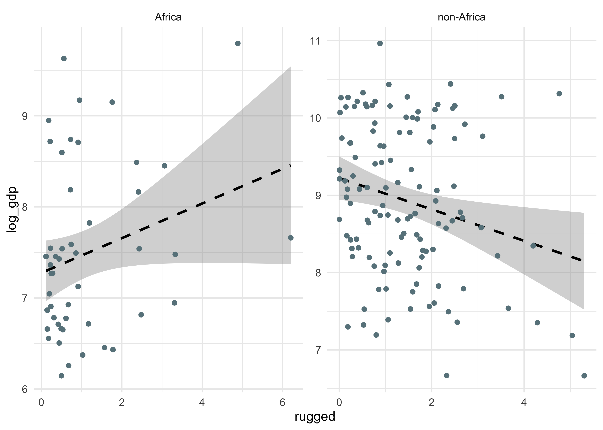
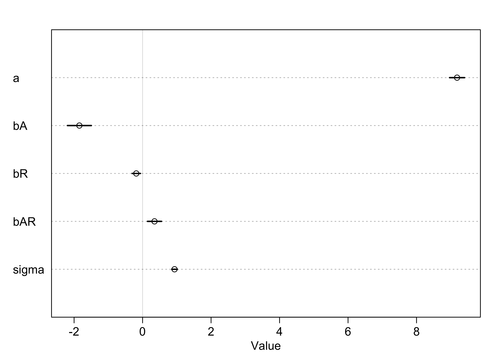
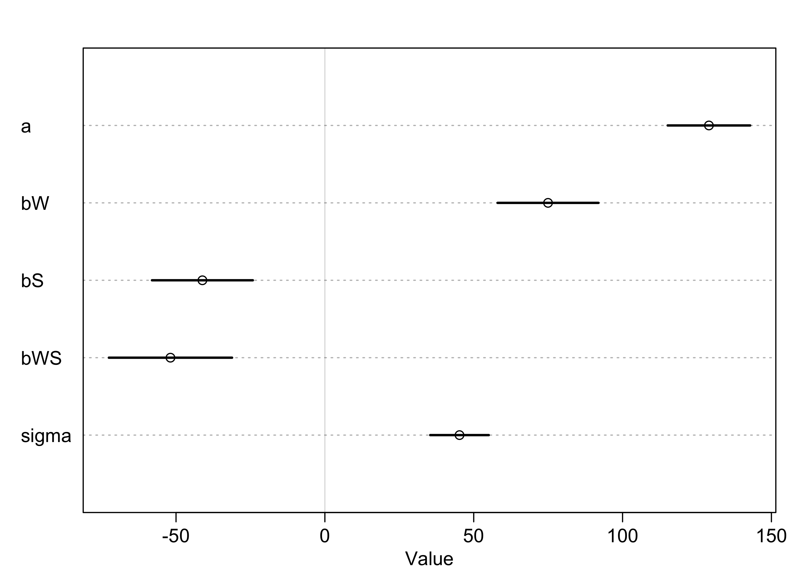
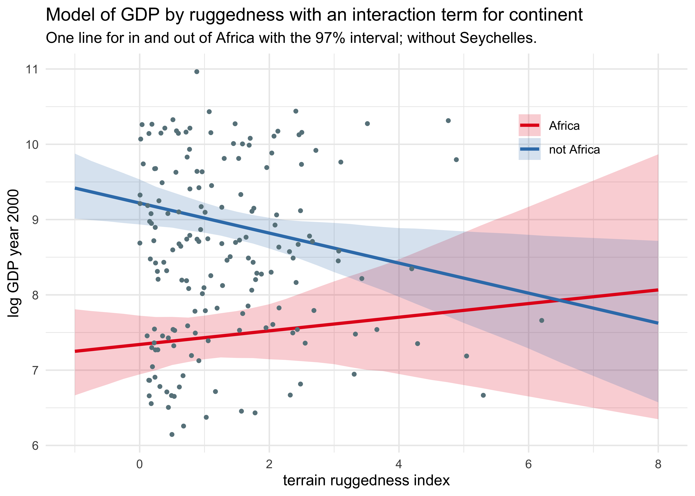

Chapter 7. Interactions
================

  - so far, we have assumed that each predictor has an independent
    association with the mean of the outcome
      - now we will look at conditioning this estimate on another
        predictor using *interactions*
  - fitting a model with interactions is easy, but understanding them
    can be harder

## 7.1 Building an interaction

  - for examples, we will use information on the economy countries and
    geographic properties

<!-- end list -->

``` r
data("rugged")

d <- rugged
d$log_gdp <- log(d$rgdppc_2000)
dd <- d[complete.cases(d$rgdppc_2000), ]
dd <- as_tibble(dd)
```

  - one peculiarity is how the GDP of a country is associated to the
    ruggedness of the terrain.
      - the association is opposite for African and non-African
        countries

<!-- end list -->

``` r
dd %>%
    mutate(is_africa = ifelse(cont_africa == 1, "Africa", "non-Africa")) %>%
    ggplot(aes(x = rugged, y = log_gdp)) +
    facet_wrap(~ is_africa, nrow = 1, scales = "free") +
    geom_smooth(method = "lm", formula = "y ~ x", color = "black", lty = 2) +
    geom_point(color = "lightblue4")
```

<!-- -->

### 7.1.1 Adding a dummy variable doesn’t work

  - two models to begin with:
    1.  linear regression of log-GDP on ruggedness
    2.  the same model with a dummy variable for the African nations

<!-- end list -->

``` r
m7_3 <- quap(
    alist(
        log_gdp ~ dnorm(mu, sigma),
        mu <- a + bR*rugged,
        a ~ dnorm(8, 100),
        bR ~ dnorm(0, 1),
        sigma ~ dunif(0, 10)
    ),
    data = dd
)

m7_4 <- quap(
    alist(
        log_gdp ~ dnorm(mu, sigma),
        mu <- a + bR*rugged + bA*cont_africa,
        a ~ dnorm(8, 100),
        bR ~ dnorm(0, 1),
        bA ~ dnorm(0, 1),
        sigma ~ dunif(0, 10)
    ),
    data = dd
)

precis(m7_3)
```

    #>              mean         sd       5.5%     94.5%
    #> a     8.513367248 0.13533686  8.2970728 8.7296617
    #> bR    0.002812495 0.07634323 -0.1191987 0.1248237
    #> sigma 1.163054440 0.06307531  1.0622479 1.2638610

``` r
precis(m7_4)
```

    #>              mean         sd       5.5%       94.5%
    #> a      9.01583987 0.12505582  8.8159765  9.21570322
    #> bR    -0.06479984 0.06337639 -0.1660875  0.03648787
    #> bA    -1.43051778 0.16128018 -1.6882747 -1.17276091
    #> sigma  0.95759964 0.05194951  0.8745743  1.04062499

``` r
compare(m7_3, m7_4)
```

    #>          WAIC      SE    dWAIC      dSE    pWAIC       weight
    #> m7_4 476.2639 15.2637  0.00000       NA 4.328950 1.000000e+00
    #> m7_3 539.5791 13.3171 63.31523 15.05468 2.682669 1.783499e-14

  - plot the posterior distribution mean and intervals for African
    countries and the rest
      - we can see that the WAIC for the model with the dummy variable
        was lower because African countries tend to have lower GDP, not
        because it fit the different slope

<!-- end list -->

``` r
rugged_seq <- seq(-1, 8, 0.25)

mu_notafrica <- link(m7_4, data = data.frame(cont_africa = 0, 
                                             rugged = rugged_seq))
mu_africa <- link(m7_4, data = data.frame(cont_africa = 1, 
                                          rugged = rugged_seq))

mu_notafrica_mean <- apply(mu_notafrica, 2, mean)
mu_notafrica_pi <- apply(mu_notafrica, 2, PI, prob = 0.97) %>% pi_to_df()

mu_africa_mean <- apply(mu_africa, 2, mean)
mu_africa_pi <- apply(mu_africa, 2, PI, prob = 0.97) %>% pi_to_df()

bind_rows(
    tibble(cont_africa = "not Africa", 
           rugged = rugged_seq, 
           mu = mu_notafrica_mean) %>%
        bind_cols(mu_notafrica_pi),
    tibble(cont_africa = "Africa", 
           rugged = rugged_seq, 
           mu = mu_africa_mean) %>%
        bind_cols(mu_africa_pi)
) %>%
    ggplot(aes(x = rugged)) +
    geom_ribbon(aes(ymin = x2_percent, ymax = x98_percent, fill = cont_africa), 
                alpha = 0.2, color = NA) +
    geom_line(aes(y = mu, color = cont_africa), size = 1.1) +
    geom_point(data = dd, aes(y = log_gdp), size = 1, color = "lightblue4") +
    scale_color_brewer(palette = "Set1") +
    scale_fill_brewer(palette = "Set1") +
    theme(legend.position = c(0.8, 0.8)) +
    labs(x = "terrain ruggedness index",
         y = "log GDP year 2000",
         color = NULL, fill = NULL,
         title = "Model of GDP by ruggedness with a dummy variable for continent",
         subtitle = "One line for in and out of Africa with the 97% interval.")
```

<!-- -->

### 7.1.2 Adding a linear interaction does work

  - we have just used the model below:

\[
Y_i \sim \text{Normal}(\mu_i, \sigma) \\
\mu_i = \alpha + \beta_R R_i + \beta_A A_i
\]

  - now we want to allow the relationship of \(Y\) and \(R\) to vary as
    a function of \(A\)
      - add in \(\gamma\) as a placeholder for another linear function
        that defines the slope between GDP and ruggedness
      - this is the *linear interaction effect*
      - explicitly modeling that the slope between GDP and ruggedness is
        *conditional upon* whether or not a nation is in Africa

\[
Y_i \sim \text{Normal}(\mu_i, \sigma) \\
\mu_i = \alpha + \gamma_i R_i + \beta_A A_i \\
\gamma_i = \beta_R + \beta_{AR}A_i
\]

  - rearranging the above formula results in the following

\[
\mu_i = \alpha + \beta_R R_i + \beta_{AR} A_i R_i + \beta_A A_i
\]

  - fit the model using `quap()` like normal

<!-- end list -->

``` r
m7_5 <- quap(
    alist(
        log_gdp ~ dnorm(mu, sigma),
        mu <- a + gamma*rugged + bA*cont_africa,
        gamma <- bR + bAR*cont_africa,
        a ~ dnorm(8, 100),
        c(bA, bR, bAR) ~ dnorm(0, 1),
        sigma ~ dunif(0, 10)
    ),
    data = dd
)

precis(m7_5)
```

    #>             mean         sd       5.5%       94.5%
    #> a      9.1836228 0.13642358  8.9655916  9.40165401
    #> bA    -1.8460606 0.21849326 -2.1952550 -1.49686613
    #> bR    -0.1843913 0.07569178 -0.3053614 -0.06342126
    #> bAR    0.3482859 0.12750672  0.1445055  0.55206624
    #> sigma  0.9333055 0.05067821  0.8523120  1.01429910

``` r
plot(precis(m7_5))
```

<!-- -->

  - the new model is far better than the previous two

<!-- end list -->

``` r
compare(m7_3, m7_4,  m7_5)
```

    #>          WAIC       SE     dWAIC     dSE    pWAIC       weight
    #> m7_5 469.7522 15.18797  0.000000      NA 5.359607 9.603456e-01
    #> m7_4 476.1263 15.22849  6.374185  6.1519 4.269052 3.965435e-02
    #> m7_3 539.6364 13.22767 69.884269 15.2575 2.715930 6.415809e-16

### 7.1.3 Plotting the interaction

  - nothing new, just make two plots, one for African and one for
    non-African

<!-- end list -->

``` r
rugged_seq <- seq(-1, 8, 0.25)

mu_africa <- link(m7_5, 
                  data = data.frame(cont_africa = 1, rugged = rugged_seq))
mu_africa_mean <- apply(mu_africa$mu, 2, mean)
mu_africa_pi <- apply(mu_africa$mu, 2, PI, prob = 0.97) %>% pi_to_df()

mu_notafrica <- link(m7_5, 
                     data = data.frame(cont_africa = 0, rugged = rugged_seq))
mu_notafrica_mean <- apply(mu_notafrica$mu, 2, mean)
mu_notafrica_pi <- apply(mu_notafrica$mu, 2, PI, prob = 0.97) %>% pi_to_df()

bind_rows(
    tibble(cont_africa = "not Africa", 
           rugged = rugged_seq, 
           mu = mu_notafrica_mean) %>%
        bind_cols(mu_notafrica_pi),
    tibble(cont_africa = "Africa", 
           rugged = rugged_seq, 
           mu = mu_africa_mean) %>%
        bind_cols(mu_africa_pi)
) %>%
    ggplot(aes(x = rugged)) +
    geom_ribbon(aes(ymin = x2_percent, ymax = x98_percent, fill = cont_africa), 
                alpha = 0.2, color = NA) +
    geom_line(aes(y = mu, color = cont_africa), size = 1.1) +
    geom_point(data = dd, aes(y = log_gdp), size = 1, color = "lightblue4") +
    scale_color_brewer(palette = "Set1") +
    scale_fill_brewer(palette = "Set1") +
    theme(legend.position = c(0.8, 0.8)) +
    labs(x = "terrain ruggedness index",
         y = "log GDP year 2000",
         color = NULL, fill = NULL,
         title = "Model of GDP by ruggedness with an interaction term for continent",
         subtitle = "One line for in and out of Africa with the 97% interval.")
```

<!-- -->

### 7.1.4 Interpreting the interaction estimate

  - helpful to plot implied predictions
  - often only numbers are reported, though they are difficult to
    interpret because:
      - the parameters have different meanings because they are no
        longer independent
      - it is very difficult to propagate the uncertainty when trying to
        understand multiple parameters simultaneously
  - remember that the interaction term \(y\) is a distribution
      - we can sample from it for African and non-African countries

<!-- end list -->

``` r
post <- extract.samples(m7_5)
gamma_africa <- post$bR + post$bAR*1
gamma_notafrica <- post$bR + post$bAR*0

tibble(Africa = gamma_africa,
       `not Africa` = gamma_notafrica) %>%
    pivot_longer(everything()) %>%
    ggplot(aes(x = value)) +
    geom_density(aes(fill = name, color = name), alpha = 0.3) +
    scale_color_brewer(palette = "Set1") +
    scale_fill_brewer(palette = "Set1") +
    labs(x = "posterior estimates of gamma",
         y = "probability density",
         title = "Probability distribution for the estimates of gamma",
         subtitle = "Gamma is the slope of the interaction term")
```

<!-- -->

  - can use these estimates like normal:
      - e.g.: what is the probability that the slope within Africa is
        less than the slope outside of Africa

<!-- end list -->

``` r
# The probability that the slope within Africa is less than that outside.
sum(gamma_africa < gamma_notafrica) / length(gamma_africa)
```

    #> [1] 0.0031

## 7.2 Symmetry of the linear interaction

  - the interaction term we have fit has two different phrasings:
    1.  “How much does the influence of ruggedness (on GDP) depend upon
        whether the nation is in Africa?”
    2.  How much does the influence of being in Africa (on GDP) depend
        upon ruggedness?
  - the model interprets these as the same statement

7.2.1 Buridan’s interaction

  - the model’s formula can be rearranged
      - the same model can be reformulated to group the \(A_i\) terms
        together
      - shows that *linear interactions are symmetric*

\[
Y_i \sim \text{Normal}(\mu_i, \sigma) \\
\mu_i = \alpha + \gamma_i R_i + \beta_A A_i \\
\gamma_i = \beta_R + \beta_{AR}A_i \\
\ \\
\mu_i = \alpha + (\beta_R + \beta_{AR}A_i) R_i + \beta_A A_i \\
\mu_i = \alpha + \beta_R R_i + \beta_{AR}A_i R_i + \beta_A A_i \\
\ \\
\mu_i = \alpha + \beta_R R_i + (\beta_{AR} R_i + \beta_A) A_i \\
\]

### 7.2.2 Africa depends upon ruggedness

  - below is a plot of the reverse interpretation of the interaction
    term
      - the x-axis is now whether the country is in Africa
      - the points are the ruggedness separated by high and low (using
        the median as the cut-off)
      - the blue slope is the expected reduction in log GDP for a
        non-rugged terrain if it was moved to Africa
      - for countries in very rugged terrains, the continent has little
        effect

<!-- end list -->

``` r
q_rugged  <- range(dd$rugged)

mu_ruggedlo <- link(m7_5,
                    data = data.frame(rugged = q_rugged[1],
                                      cont_africa = 0:1))
mu_ruggedlo_mean <- apply(mu_ruggedlo$mu, 2, mean)
mu_ruggedlo_pi <- apply(mu_ruggedlo$mu, 2, PI) %>% pi_to_df()

mu_ruggedhi <- link(m7_5,
                    data = data.frame(rugged = q_rugged[2],
                                      cont_africa = 0:1))
mu_ruggedhi_mean <- apply(mu_ruggedhi$mu, 2, mean)
mu_ruggedhi_pi <- apply(mu_ruggedhi$mu, 2, PI) %>% pi_to_df()

bind_rows(
    tibble(rugged = "low",
           cont_africa = 0:1,
           name = "low",
           mu_rugged = mu_ruggedlo_mean) %>%
        bind_cols(mu_ruggedlo_pi),
    tibble(rugged = "high",
           cont_africa = 0:1,
           mu_rugged = mu_ruggedhi_mean) %>%
        bind_cols(mu_ruggedhi_pi)
) %>%
    ggplot(aes(x = cont_africa)) +
    geom_ribbon(aes(ymin = x5_percent, ymax = x94_percent, 
                    fill = factor(rugged)), alpha = 0.2) +
    geom_line(aes(y = mu_rugged, color = factor(rugged))) +
    geom_jitter(
        data = dd, 
        aes(x = cont_africa, y = log_gdp, 
            color = ifelse(rugged < median(rugged), "low", "high")),
        alpha = 0.4, width = 0.03
    ) +
    scale_color_brewer(palette = "Set1") +
    scale_fill_brewer(palette = "Set1") +
    scale_x_continuous(breaks = c(0, 1), labels = c("not Africa", "Africa")) +
    labs(x = NULL,
         y  = "log GDP year 2000",
         fill = "ruggedness", color = "ruggedness",
         title = "Symmetric interpretation of the interaction term")
```

<!-- -->

  - it is simultaneously true that:
    1.  the influence of ruggedness depends on the continent
    2.  the influence of continent depends in the ruggedness

## 7.3 Continuous interactions

  - interaction effects are difficult to interpret
      - especially with only tables of posterior means and std. devs.
      - we will look at using a *triptych plot* to understand these
        effects
  - it is very important to center and standardize the predictors when
    using interactions

### 7.3.1 The data

  - for examples we will use sizes of blooms from beds of tulips grown
    in greenhouses with different soil and light
      - we are interested in the interaction of light and water

<!-- end list -->

``` r
data("tulips")
d <- as_tibble(tulips)
str(d)
```

    #> tibble [27 × 4] (S3: tbl_df/tbl/data.frame)
    #>  $ bed   : Factor w/ 3 levels "a","b","c": 1 1 1 1 1 1 1 1 1 2 ...
    #>  $ water : int [1:27] 1 1 1 2 2 2 3 3 3 1 ...
    #>  $ shade : int [1:27] 1 2 3 1 2 3 1 2 3 1 ...
    #>  $ blooms: num [1:27] 0 0 111 183.5 59.2 ...

### 7.3.2 The un-centered models

  - the author demonstrates fitting and interpreting the models without
    centering the data

### 7.3.3 Center and re-estimate

``` r
d$shade_c <- d$shade - mean(d$shade)
d$water_c <- d$water - mean(d$water)
```

  - fit two models for predicting number of blooms with water and shade
      - the second model includes their interactions
      - starting places for the fitting are provided because the priors
        are very flat

<!-- end list -->

``` r
m7_8 <- quap(
    alist(
        blooms ~ dnorm(mu, sigma),
        mu <- a + bW*water_c + bS*shade_c,
        a ~ dnorm(130, 100),
        c(bW, bS) ~ dnorm(0, 100),
        sigma ~ dunif(0, 100)
    ),
    data = d,
    start = list(a = mean(d$blooms), 
                 bW = 0, bS = 0, 
                 sigma = sd(d$blooms))
)

m7_9 <- quap(
    alist(
        blooms ~ dnorm(mu, sigma),
        mu <- a + bW*water_c + bS*shade_c + bWS*water_c*shade_c,
        a ~ dnorm(130, 100),
        c(bW, bS, bWS) ~ dnorm(0, 100),
        sigma ~ dunif(0, 100)
    ),
    data = d,
    start = list(a = mean(d$blooms), 
                 bW = 0, bS = 0, bWS = 0, 
                 sigma = sd(d$blooms))
)

plot(precis(m7_8))
```

<!-- -->

``` r
plot(precis(m7_9))
```

<!-- -->

``` r
coeftab(m7_8, m7_9)
```

    #>       m7_8    m7_9   
    #> a      129.00  129.01
    #> bW      74.22   74.96
    #> bS     -40.74  -41.14
    #> sigma   57.35   45.22
    #> bWS        NA  -51.87
    #> nobs       27      27

``` r
compare(m7_8, m7_9)
```

    #>          WAIC        SE    dWAIC      dSE    pWAIC     weight
    #> m7_9 295.9624 10.252522  0.00000       NA 6.565320 0.99593805
    #> m7_8 306.9664  9.254801 11.00404 8.473258 5.848144 0.00406195

  - the main effects are the same between the two models
      - if the predictors were not centered, the coefficient for shade
        in the model with the interaction would have been positive
  - with the data centered, the intercept has meaning - it is the mean
    number of blooms
  - interpretations of the estimates for the model with the interaction
    term `m7_9`:
      - \(\alpha\): the expected value of blooms when both water and
        shade are at their average values (0 from centering)
      - \(\beta_W\): the expected change in blooms when water increases
        by 1 unit and shade is at its average value
      - \(\beta_S\): the expected change in blooms when shade increases
        by 1 unit and water is at its average value
      - \(\beta_{WS}\): the interaction term has multiple
        interpretations:
          - the expected change in the influence of water on blooms when
            increasing shade by one unit
          - the expected change in the influence of shade on blooms when
            increasing water by one unit

### 7.3.4 Plotting implied predictions

  - make a *triptych plot* to help understand interactions:
      - plot the bivariate relationship between shade and blooms
      - each of the 3 plots will show predictions for different values
        of water

<!-- end list -->

``` r
shade_seq <- seq(-1, 1)

purrr::map(seq(-1, 1), function(w) {
    dt <- d[d$water_c == w, ]
    pred_data <- tibble(water_c = w, shade_c = shade_seq)
    mu <- link(m7_9, data = pred_data)
    pred_data %>%
        mutate(mu_mean = apply(mu, 2, mean)) %>%
        bind_cols(apply(mu, 2, PI) %>% pi_to_df())
}) %>%
    bind_rows() %>%
    ggplot(aes(x = shade_c)) +
    facet_wrap(~ water_c) +
    geom_ribbon(aes(ymin = x5_percent, ymax = x94_percent), alpha = 0.2) +
    geom_line(aes(y = mu_mean)) +
    geom_point(data = d, aes(y = blooms)) +
    labs(x = "shade (centered)",
         y = "blooms",
         title = "Effect of amount of light on impact of shade on blooms",
         subtitle = "Each panel is a different level of light.")
```

<!-- -->

  - this makes the interaction of the effects of shade and water easily
    understandable
      - plot on the left: when there is little water, the impact of
        shade is negligible
      - plot on the right: when there is plenty of water, the shade has
        a larger impact on the number of blooms

7.4 Interactions in design formulas

  - mathematical formula with an interaction between \(x\) and \(z\):

\[
y_i \sim \text{Normal}(\mu_i, \sigma) \\
\mu_i = \alpha + \beta_x x_i + \beta_z z_i + \beta_{xz} x_i z_i
\]

``` r
# Two equivalent model specifications.
m7_x <- lm(y ~ x + z + x*z, data = d)
m7_x <- lm(y ~ x*z, data = d)
```

  - can also remove main effects by subtracting them out
      - useful when we know *a priori* there is know effect of \(z\) on
        \(y\)

<!-- end list -->

``` r
m7_x <- lm(y ~ x + x*z - z, data = d)
```

  - can use the following trick to see how R is interpreting a formula

<!-- end list -->

``` r
x <- z <- w <- 1
colnames(model.matrix(~ x*z*w))
```

    #> [1] "(Intercept)" "x"           "z"           "w"           "x:z"        
    #> [6] "x:w"         "z:w"         "x:z:w"

## 7.6 Practice

### Hard.

**7H1. Return to the data(tulips) example in the chapter. Now include
the bed variable as a predictor in the interaction model. Don’t interact
bed with the other predictors; just include it as a main effect. Note
that bed is categorical. So to use it properly, you will need to either
construct dummy variables or rather an index variable, as explained in
Chapter 6.**

``` r
# Add bed as a set of dummy variables.
# Bed "a" will be part of the intercept.
beds_dummy <- model.matrix(~ bed, data = d) %>% 
    as.matrix() %>%
    as.data.frame() %>%
    set_names(paste0("bed_", letters[1:3]))
dd <- bind_cols(d, beds_dummy)

m_7h1 <- quap(
    alist(
        blooms ~ dnorm(mu, sigma),
        mu <- a + bW*water_c + bS*shade_c + bWS*water_c*shade_c + bb*bed_b + bc*bed_c,
        a ~ dnorm(130, 100),
        c(bW, bS, bWS, bb, bc) ~ dnorm(0, 50),
        sigma ~ dunif(0, 100)
    ),
    data = dd,
    start = list(a = mean(d$blooms), 
                 bW = 0, bS = 0, bWS = 0,
                 bb = 0, bc = 0,
                 sigma = sd(d$blooms))
)

precis(m_7h1)
```

    #>            mean        sd       5.5%     94.5%
    #> a     103.19330 12.377857  83.411091 122.97550
    #> bW     73.25915  9.184091  58.581194  87.93710
    #> bS    -40.20735  9.166522 -54.857220 -25.55748
    #> bWS   -50.18906 11.146401 -68.003157 -32.37496
    #> bb     36.75643 17.277136   9.144226  64.36863
    #> bc     41.14658 17.286259  13.519803  68.77336
    #> sigma  39.52689  5.462863  30.796179  48.25760

**7H2. Use WAIC to compare the model from 7H1 to a model that omits bed.
What do you infer from this comparison? Can you reconcile the WAIC
results with the posterior distribution of the bed coefficients?**

``` r
compare(m_7h1, m7_9)
```

    #>           WAIC        SE    dWAIC      dSE    pWAIC    weight
    #> m_7h1 293.9713  9.720705 0.000000       NA 9.151898 0.7203902
    #> m7_9  295.8641 10.292275 1.892796 6.531838 6.484775 0.2796098

It seems that the model that includes the bed information produced a
better model. However, the improvement was not overwhelming as the
difference in WAIC value is less than the standard error of the WAIC
values and the weights are split about 75:25.

The beds seem to hold some information, perhaps some sort of batch
effect. From the standard deviation and 89% interval of these
coefficients, they are not very informative, given the other variables.

**7H3. Consider again the data(rugged) data on economic development and
terrain ruggedness, examined in this chapter. One of the African
countries in that example, Seychelles, is far outside the cloud of other
nations, being a rare country with both relatively high GDP and high
ruggedness. Seychelles is also unusual, in that it is a group of islands
far from the coast of mainland Africa, and its main economic activity is
tourism.**

**One might suspect that this one nation is exerting a strong influence
on the conclusions. In this problem, I want you to drop Seychelles from
the data and re-evaluate the hypothesis that the relationship of African
economies with ruggedness is different from that on other continents.**

**(a) Begin by using map to fit just the interaction model:**

\[
y_i \sim \text{Normal}(\mu_i, \sigma) \\
\mu_i = \alpha + \beta_A A_i + \beta_R R_i + \beta_{AR} A_i R_i
\]

**where \(y\) is log GDP per capita in the year 2000 (log of
`rgdppc_2000`); \(A\) is `cont_africa`, the dummy variable for being an
African nation; and \(R\) is the variable `rugged`. Choose your own
priors. Compare the inference from this model fit to the data without
Seychelles to the same model fit to the full data. Does it still seem
like the effect of ruggedness depends upon continent? How much has the
expected relationship changed?**

``` r
d <- rugged
d$log_gdp <- log(d$rgdppc_2000)
dd <- d[complete.cases(d$rgdppc_2000), ]
dd <- as_tibble(dd)

m7h3_1 <- quap(
    alist(
        log_gdp ~ dnorm(mu, sigma),
        mu <- a + bA*cont_africa + bR*rugged + bAR*cont_africa*rugged,
        a ~ dnorm(0, 20),
        c(bA, bR, bAR) ~ dnorm(0, 10),
        sigma ~ dunif(0, 10)
    ),
    data = dd
)

dd_noS <- dd %>% filter(country != "Seychelles")
m7h3_2 <- quap(
    alist(
        log_gdp ~ dnorm(mu, sigma),
        mu <- a + bA*cont_africa + bR*rugged + bAR*cont_africa*rugged,
        a ~ dnorm(0, 20),
        c(bA, bR, bAR) ~ dnorm(0, 10),
        sigma ~ dunif(0, 10)
    ),
    data = dd_noS
)

precis(m7h3_1)
```

    #>             mean         sd       5.5%       94.5%
    #> a      9.2229240 0.13798718  9.0023938  9.44345413
    #> bA    -1.9470530 0.22451300 -2.3058681 -1.58823784
    #> bR    -0.2027848 0.07647286 -0.3250032 -0.08056636
    #> bAR    0.3931005 0.13005556  0.1852466  0.60095442
    #> sigma  0.9327394 0.05058950  0.8518876  1.01359118

``` r
precis(m7h3_2)
```

    #>             mean         sd        5.5%       94.5%
    #> a      9.2223995 0.13689685  9.00361191  9.44118713
    #> bA    -1.8810255 0.22532873 -2.24114429 -1.52090664
    #> bR    -0.2024847 0.07586857 -0.32373733 -0.08123206
    #> bAR    0.2970241 0.13828676  0.07601514  0.51803303
    #> sigma  0.9253668 0.05033314  0.84492472  1.00580888

Removing Seychelles from the data reduced the MAP for the coefficient
for continent \(\beta_A\) and the interaction term \(\beta_{AR}\). This
suggests that Seychelles did have a relatively large impact on the
effect from being in Africa and the interaction between being in Africa
and terrain ruggedness.

**(b) Now plot the predictions of the interaction model, with and
without Seychelles. Does it still seem like the effect of ruggedness
depends upon continent? How much has the expected relationship
changed?**

``` r
rugged_seq <- seq(-1, 8, 0.25)

plot_effect_of_africa <- function(mdl, original_data) {
    mu_africa <- link(mdl, 
                      data = data.frame(cont_africa = 1, 
                                        rugged = rugged_seq))
    mu_africa_mean <- apply(mu_africa, 2, mean)
    mu_africa_pi <- apply(mu_africa, 2, PI, prob = 0.97) %>% pi_to_df()
    
    mu_notafrica <- link(mdl, 
                         data = data.frame(cont_africa = 0, 
                                           rugged = rugged_seq))
    mu_notafrica_mean <- apply(mu_notafrica, 2, mean)
    mu_notafrica_pi <- apply(mu_notafrica, 2, PI, prob = 0.97) %>% pi_to_df()
    
    bind_rows(
        tibble(cont_africa = "not Africa", 
               rugged = rugged_seq, 
               mu = mu_notafrica_mean) %>%
            bind_cols(mu_notafrica_pi),
        tibble(cont_africa = "Africa", 
               rugged = rugged_seq, 
               mu = mu_africa_mean) %>%
            bind_cols(mu_africa_pi)
    ) %>%
        ggplot(aes(x = rugged)) +
        geom_ribbon(aes(ymin = x2_percent, ymax = x98_percent,
                        fill = cont_africa), 
                    alpha = 0.2, color = NA) +
        geom_line(aes(y = mu, color = cont_africa), size = 1.1) +
        geom_point(data = original_data, aes(y = log_gdp), 
                   size = 1, color = "lightblue4") +
        scale_color_brewer(palette = "Set1") +
        scale_fill_brewer(palette = "Set1") +
        theme(legend.position = c(0.8, 0.8)) +
        labs(x = "terrain ruggedness index",
             y = "log GDP year 2000",
             color = NULL, fill = NULL,
             title = "Model of GDP by ruggedness with an interaction term for continent",
             subtitle = "One line for in and out of Africa with the 97% interval.")
}

plot_effect_of_africa(m7h3_1, dd)
```

<!-- -->

``` r
plot_effect_of_africa(m7h3_2, dd) +
    labs(subtitle = "One line for in and out of Africa with the 97% interval; without Seychelles.")
```

<!-- -->

The angle of the red line decreases when Seychelles is removed. This
suggests that Seychelles increased the impact of being in Africa as
terrain ruggedness increased (and similarly for the symmetric
interpretation of the interaction term).
