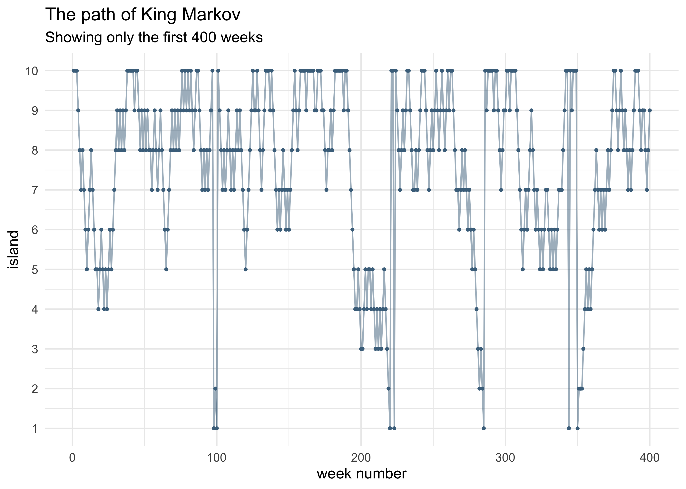
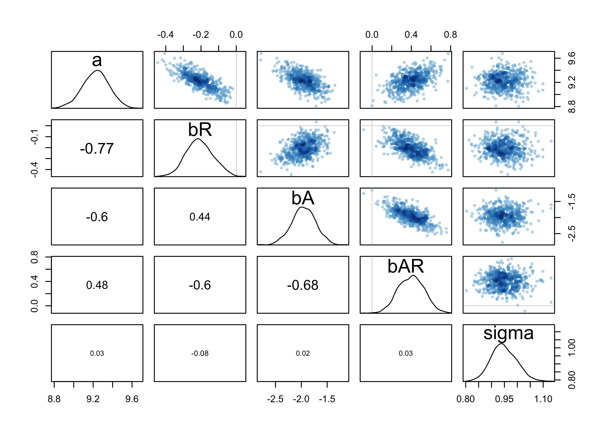

Chapter 8. Markov Chain Monte Carlo
================

  - estimation of posterior probability distributions using a stochastic
    process called \*Markov chain Monte Carlo (MCMC)\*\* estimation
      - sample directly from the posterior instead of approximating
        curves (like the quadratic approximation)
      - allows for models that do not assume a multivariate normality
          - can use generalized linear and multilevel models
  - use \*\*Stan\* to fit these models

## 8.1 Good King Markov and His island kingdom

  - a tale of the Good King Markov
      - he was kings of a ring of 10 islands
      - the second island had twice the population of the first, the
        third had three times the populaiton of the first, etc.
      - the king wanted to visit the islands in proportion to the
        population size, but didn’t want to have to keep track of a
        schedule
      - he would also only travel between adjacent islands
      - he used the *Metropolis algorithm* to decide which island to
        visit next
        1.  the king decides to stay or travel by a cion flip
        2.  if the coin is heads, the king considers moving clockwise;
            if tails, he considers moving counter-clockwise; call this
            next island the “proposal” island
        3.  to decide whether not to move, the king collects the number
            of seashells in proportion to the population size of the
            proposed island, and collects the number of stones relative
            to the population of the current island
        4.  if there are more seashells, the king moves to the poposed
            island; else he discards the number of stones equal to the
            number of seashells and randomly selects from the remaining
            seashells and stones; if he selects a shell, he travels to
            the proposed island, else he stays
  - below is a simulation of this process

<!-- end list -->

``` r
set.seed(0)

current_island <- 10
num_weeks <- 1e5
visited_islands <- rep(0, num_weeks)

flip_coin_to_decide_proposal_island <- function(x) {
    a <- sample(c(0, 1), 1)
    if (a == 0) {
        y <- x - 1
    } else {
        y <- x + 1
    }
    
    if (y == 0) {
        y <- 10
    } else if (y == 11) {
        y <- 1
    }
    return(y)
}

for (wk in seq(1, num_weeks)) {
    visited_islands[[wk]] <- current_island
    
    proposal_island <- flip_coin_to_decide_proposal_island(current_island)
    if (proposal_island > current_island) {
        current_island <- proposal_island
    } else {
        shells <- rep("shell", proposal_island)
        stones <- rep("stone", current_island - proposal_island)
        selection <- sample(unlist(c(shells, stones)), 1)
        if (selection == "shell") {
            current_island <- proposal_island
        }
    }
}
```

``` r
tibble(wk = seq(1, num_weeks),
       islands = visited_islands) %>%
    ggplot(aes(x = factor(islands))) + 
    geom_bar(fill = "skyblue4") +
    labs(x = "islands",
         y = "number of weeks visited",
         title = "Distribution of King Markov's visits")
```

<!-- -->

``` r
tibble(wk = seq(1, num_weeks),
       islands = visited_islands) %>%
    slice(1:400) %>%
    ggplot(aes(x = wk, y = islands)) +
    geom_line(color = "skyblue4", alpha = 0.5) +
    geom_point(color = "skyblue4", size = 0.7) +
    scale_y_continuous(breaks = c(1:10)) +
    labs(x = "week number", y = "island",
         title = "The path of King Markov",
         subtitle = "Showing only the first 400 weeks")
```

<!-- -->

  - this algorithm still works if the king is equally likely to propose
    a move to any island from the current island
      - still use the proportion of the islands’ populations as the
        probability of moving
  - at any point, the king only needs to know the population of the
    current island and the proposal island

## 8.2 Markov chain Monte Carlo

  - the *Metropolis algorithm* used above is an example of a *Markov
    chain Monte Carlo*
      - the goal is to draw samples from an unknown and complex target
        distribution
          - “islands”: the parameter values (they can be continuous,
            too)
          - “population sizes”: the posterior probabilities at each
            parameter value
          - “week”: samples taken from the joint posterior of the
            parameters
      - we can use the samples from the Metropolis algorithm just like
        any other sampled distributions so far
  - we will also cover *Gibbs sampling* and *Hamiltonian Monte Carlo*

### 8.2.1 Gibbs sampling

  - can achieve a more efficient sampling procedure
      - *adaptive proposals*: the distribution of proposed parameter
        values adjusts itself intelligently depending upon the parameter
        values at the moment
      - the adaptive proposals depend on using particular combinations
        of prior distributions and likelihoods known as conjugate pairs
          - these pairs have analytical solutions for the posterior of
            an individual parameter
          - can use these solutions to make smart jumps around the joint
            posterior
  - Gibbs sampling is used in BUGS (Bayesian inference Using Gibbs
    Sampling) and JAGS (Just Another Gibbs Sampler)
  - limitations:
      - don’t always want to use the conjugate priors
      - Gibbs sampling becomes very innefficient for models with
        hundreds or thousands of parameters

### 8.2.2 Hamiltonian Monte Carlo (HMC)

  - more computationally expensive than Gibbs sampling and the
    Metropolis algorithm, but more efficient
      - doesn’t require as many samples to describe the posterior
        distribution
  - an analogy using King Monty:
      - king of a continuous stretch of land, not discrete islands
      - wants to visit his citizens in proportion to their local density
      - decides to travel back and forth across the length of the
        country, slowing down the vehicle when houses grow more dense,
        and speeing up when the houses are more sparse
      - requires knowledge of how quickly the population is changing at
        the current location
  - in this analogy:
      - “royal vehicle”: the current vector of parameter values
      - the log-posterior forms a bowl with the MAP at the nadir
      - the vehicle sweeps across the bowl, adjust the speed in
        proportion to the height on the bowl
  - HMC does run a sort of physics simultation
      - a vector of parameters gives the position of a frictionless
        particle
      - the log-posterior provides the surface
  - limitations:
      - HMC requires continuous parameters
      - HMC needs to be tuned to a particular model and its data
          - the particle needs mass (so it can have momentum)
          - other hyperparameters of MCMC is handeled by Stan

## 8.3 Easy HMC: `map2stan`

  - `map2stan()` provides an interface to Stan similar to how we have
    used `quap()`
      - need to preprocess and variables transformations
      - input data frame can only have columns used in the formulae
  - example: look at terrain ruggedness data

<!-- end list -->

``` r
data("rugged")
dd <- as_tibble(rugged) %>%
    mutate(log_gdp = log(rgdppc_2000)) %>%
    filter(!is.na(rgdppc_2000))
```

  - fit a model to predict log-GDP with terrain ruggedness, continent,
    and the interaction of the two
  - first fit with `quap()` like before

<!-- end list -->

``` r
m8_1 <- quap(
    alist(
        log_gdp ~ dnorm(mu, sigma),
        mu <- a + bR*rugged + bA*cont_africa + bAR*rugged*cont_africa,
        a ~ dnorm(0, 100),
        bR ~ dnorm(0, 10),
        bA ~ dnorm(0, 10),
        bAR ~ dnorm(0, 10),
        sigma ~ dunif(0, 10)
    ),
    data = dd
)
precis(m8_1)
```

    ##             mean         sd       5.5%       94.5%
    ## a      9.2227717 0.13798197  9.0022499  9.44329359
    ## bR    -0.2026506 0.07646932 -0.3248634 -0.08043786
    ## bA    -1.9469424 0.22450135 -2.3057389 -1.58814589
    ## bAR    0.3929006 0.13004832  0.1850583  0.60074296
    ## sigma  0.9326829 0.05058184  0.8518433  1.01352241

### 8.3.1 Preparation

  - must:
      - do any transformations beforehand (e.g. logarithm, squared,
        etc.)
      - reduce data frame to only used variables

<!-- end list -->

``` r
dd_trim <- dd %>%
    select(log_gdp, rugged, cont_africa)
```

### 8.3.2 Estimation

  - can now fit the model with HMC using `map2stan()`

<!-- end list -->

``` r
m8_1stan <- map2stan(
    alist(
        log_gdp ~ dnorm(mu, sigma),
        mu <- a + bR*rugged + bA*cont_africa + bAR*rugged*cont_africa,
        a ~ dnorm(0, 100),
        bR ~ dnorm(0, 10),
        bA ~ dnorm(0, 10),
        bAR ~ dnorm(0, 10),
        sigma ~ dcauchy(0, 2)
    ),
    data = dd_trim
)
```

    ## Trying to compile a simple C file

    ## Running /Library/Frameworks/R.framework/Resources/bin/R CMD SHLIB foo.c
    ## clang -I"/Library/Frameworks/R.framework/Resources/include" -DNDEBUG   -I"/Library/Frameworks/R.framework/Versions/3.6/Resources/library/Rcpp/include/"  -I"/Library/Frameworks/R.framework/Versions/3.6/Resources/library/RcppEigen/include/"  -I"/Library/Frameworks/R.framework/Versions/3.6/Resources/library/RcppEigen/include/unsupported"  -I"/Library/Frameworks/R.framework/Versions/3.6/Resources/library/BH/include" -I"/Library/Frameworks/R.framework/Versions/3.6/Resources/library/StanHeaders/include/src/"  -I"/Library/Frameworks/R.framework/Versions/3.6/Resources/library/StanHeaders/include/"  -I"/Library/Frameworks/R.framework/Versions/3.6/Resources/library/rstan/include" -DEIGEN_NO_DEBUG  -D_REENTRANT  -DBOOST_DISABLE_ASSERTS -DBOOST_PENDING_INTEGER_LOG2_HPP -include stan/math/prim/mat/fun/Eigen.hpp   -isysroot /Library/Developer/CommandLineTools/SDKs/MacOSX.sdk -I/usr/local/include  -fPIC  -Wall -g -O2  -c foo.c -o foo.o
    ## In file included from <built-in>:1:
    ## In file included from /Library/Frameworks/R.framework/Versions/3.6/Resources/library/StanHeaders/include/stan/math/prim/mat/fun/Eigen.hpp:13:
    ## In file included from /Library/Frameworks/R.framework/Versions/3.6/Resources/library/RcppEigen/include/Eigen/Dense:1:
    ## In file included from /Library/Frameworks/R.framework/Versions/3.6/Resources/library/RcppEigen/include/Eigen/Core:88:
    ## /Library/Frameworks/R.framework/Versions/3.6/Resources/library/RcppEigen/include/Eigen/src/Core/util/Macros.h:613:1: error: unknown type name 'namespace'
    ## namespace Eigen {
    ## ^
    ## /Library/Frameworks/R.framework/Versions/3.6/Resources/library/RcppEigen/include/Eigen/src/Core/util/Macros.h:613:16: error: expected ';' after top level declarator
    ## namespace Eigen {
    ##                ^
    ##                ;
    ## In file included from <built-in>:1:
    ## In file included from /Library/Frameworks/R.framework/Versions/3.6/Resources/library/StanHeaders/include/stan/math/prim/mat/fun/Eigen.hpp:13:
    ## In file included from /Library/Frameworks/R.framework/Versions/3.6/Resources/library/RcppEigen/include/Eigen/Dense:1:
    ## /Library/Frameworks/R.framework/Versions/3.6/Resources/library/RcppEigen/include/Eigen/Core:96:10: fatal error: 'complex' file not found
    ## #include <complex>
    ##          ^~~~~~~~~
    ## 3 errors generated.
    ## make: *** [foo.o] Error 1
    ## 
    ## SAMPLING FOR MODEL 'e3427aaee5ad40daea09a9a2e19cfcf3' NOW (CHAIN 1).
    ## Chain 1: 
    ## Chain 1: Gradient evaluation took 0.000137 seconds
    ## Chain 1: 1000 transitions using 10 leapfrog steps per transition would take 1.37 seconds.
    ## Chain 1: Adjust your expectations accordingly!
    ## Chain 1: 
    ## Chain 1: 
    ## Chain 1: Iteration:    1 / 2000 [  0%]  (Warmup)
    ## Chain 1: Iteration:  200 / 2000 [ 10%]  (Warmup)
    ## Chain 1: Iteration:  400 / 2000 [ 20%]  (Warmup)
    ## Chain 1: Iteration:  600 / 2000 [ 30%]  (Warmup)
    ## Chain 1: Iteration:  800 / 2000 [ 40%]  (Warmup)
    ## Chain 1: Iteration: 1000 / 2000 [ 50%]  (Warmup)
    ## Chain 1: Iteration: 1001 / 2000 [ 50%]  (Sampling)
    ## Chain 1: Iteration: 1200 / 2000 [ 60%]  (Sampling)
    ## Chain 1: Iteration: 1400 / 2000 [ 70%]  (Sampling)
    ## Chain 1: Iteration: 1600 / 2000 [ 80%]  (Sampling)
    ## Chain 1: Iteration: 1800 / 2000 [ 90%]  (Sampling)
    ## Chain 1: Iteration: 2000 / 2000 [100%]  (Sampling)
    ## Chain 1: 
    ## Chain 1:  Elapsed Time: 0.35654 seconds (Warm-up)
    ## Chain 1:                0.369299 seconds (Sampling)
    ## Chain 1:                0.725839 seconds (Total)
    ## Chain 1:

    ## Computing WAIC

``` r
precis(m8_1stan)
```

    ##             mean         sd       5.5%       94.5%    n_eff     Rhat4
    ## a      9.2182611 0.14034806  8.9999067  9.43564460 381.7565 1.0081349
    ## bR    -0.2002538 0.08066235 -0.3253604 -0.07468424 348.7989 1.0179494
    ## bA    -1.9413043 0.23158324 -2.2990252 -1.56245440 475.1342 0.9990503
    ## bAR    0.3897727 0.14112017  0.1729353  0.60830114 452.2939 0.9999791
    ## sigma  0.9504754 0.05263645  0.8721904  1.03751376 454.5194 1.0041046

  - a half-Cauchy prior was used for \(\sigma\)
      - a uniform distribution would work here, too
      - it is a useful, “thick-tailed” probability
      - related to the Student \(t\) distribution
      - can think of it as a weakly-regularizing prior for the standard
        deviation
  - the estimates from this model are simillar to those from the
    quadratic prior
  - a few differences to note about the output of `precis()`
    (`summary()`):
      - the *highest probability density intervals* (HPDI) are shown,
        not just percentiles intervals (PI), like before
      - two new columns (they will be discussed further later):
          - `n_eff`: a crude estimate of the number of independent
            samples that were collected
          - `Rhat4`: an estimate of the convergence of the Markov chains
            (1 is good)

### 8.3.3 Sampling again, in parallel

  - specific advice on the number of samples to run will be given later
  - a compiled model can be resampled from again
      - multiple chains can also be used and run in parallel

<!-- end list -->

``` r
m8_1stan_4chains <- map2stan(m8_1stan, chains = 4, cores = 4)
```

    ## Warning in .local(object, ...): some chains had errors; consider specifying
    ## chains = 1 to debug

    ## here are whatever error messages were returned

    ## [[1]]
    ## Stan model 'e3427aaee5ad40daea09a9a2e19cfcf3' does not contain samples.
    ## 
    ## [[2]]
    ## Stan model 'e3427aaee5ad40daea09a9a2e19cfcf3' does not contain samples.

    ## Computing WAIC

``` r
precis(m8_1stan_4chains)
```

    ##             mean         sd       5.5%       94.5%     n_eff     Rhat4
    ## a      9.2256832 0.14362460  8.9906977  9.45258878  877.9440 1.0034584
    ## bR    -0.2045680 0.08014458 -0.3281884 -0.07372293  894.0294 1.0031833
    ## bA    -1.9464960 0.23749000 -2.3392785 -1.58143450  890.1520 1.0032003
    ## bAR    0.3933826 0.13793937  0.1767777  0.62174432  872.0515 1.0013379
    ## sigma  0.9505496 0.05415063  0.8688302  1.04002911 1357.1632 0.9997233

### 8.3.4 Visualization

  - can plot the samples
      - interesting to see how Gaussian the distribution actually was

<!-- end list -->

``` r
post <- extract.samples(m8_1stan)
str(post)
```

    ## List of 5
    ##  $ a    : num [1:1000(1d)] 9.01 9.25 9.26 9.29 9.23 ...
    ##  $ bR   : num [1:1000(1d)] -0.0536 -0.1974 -0.3163 -0.3114 -0.1873 ...
    ##  $ bA   : num [1:1000(1d)] -1.82 -1.93 -2.04 -2.03 -1.84 ...
    ##  $ bAR  : num [1:1000(1d)] 0.189 0.436 0.568 0.526 0.319 ...
    ##  $ sigma: num [1:1000(1d)] 0.879 0.917 0.957 0.875 0.903 ...

``` r
pairs(m8_1stan)
```

<!-- -->

### 8.3.5 Using the samples

  - we can use the samples just like before
      - simulate predictions
      - compute differences of parameters
      - calculate DIC and WAIC,
      - etc.

<!-- end list -->

``` r
show(m8_1stan)
```

    ## map2stan model
    ## 1000 samples from 1 chain
    ## 
    ## Sampling durations (seconds):
    ##         warmup sample total
    ## chain:1   0.36   0.37  0.73
    ## 
    ## Formula:
    ## log_gdp ~ dnorm(mu, sigma)
    ## mu <- a + bR * rugged + bA * cont_africa + bAR * rugged * cont_africa
    ## a ~ dnorm(0, 100)
    ## bR ~ dnorm(0, 10)
    ## bA ~ dnorm(0, 10)
    ## bAR ~ dnorm(0, 10)
    ## sigma ~ dcauchy(0, 2)
    ## 
    ## WAIC (SE): 470 (14.8)
    ## pWAIC: 5.2

``` r
WAIC(m8_1stan)
```

    ##       WAIC      lppd penalty  std_err
    ## 1 469.5071 -229.5579 5.19567 14.76377

### 8.3.6 Checking the chain

  - the MC is guarunteed to converge eventually
      - need to check it actually did in the time we gave it
  - use the *trace plot* to plot the samples in sequential order
      - this is the first plot that should be looked at after fitting
        with MCMC
      - grey region is the warm up (“adaptation”) where the chain is
        learning to more efficiently sample from the posterior
  - look for 2 characteristics of a “good” chain:
      - *stationarity*: the path staying within the posterior
        distribution
          - the center of each path is relatively stable from start to
            end
      - *good mixing*: each successive sample within each parameter is
        not highly correlated with the sample before it
          - this is representated by a rapid zig-zap of the paths

<!-- end list -->

``` r
plot(m8_1stan)
```

<!-- -->

  - can access the raw Stan code in case we want to make specific
    changes not possible through `map2stan()`

<!-- end list -->

``` r
str_split(m8_1stan@model, "\n")
```

    ## [[1]]
    ##  [1] "//2020-05-12 07:22:09"                                                                       
    ##  [2] "data{"                                                                                       
    ##  [3] "    int<lower=1> N;"                                                                         
    ##  [4] "    real log_gdp[N];"                                                                        
    ##  [5] "    real rugged[N];"                                                                         
    ##  [6] "    int cont_africa[N];"                                                                     
    ##  [7] "}"                                                                                           
    ##  [8] "parameters{"                                                                                 
    ##  [9] "    real a;"                                                                                 
    ## [10] "    real bR;"                                                                                
    ## [11] "    real bA;"                                                                                
    ## [12] "    real bAR;"                                                                               
    ## [13] "    real<lower=0> sigma;"                                                                    
    ## [14] "}"                                                                                           
    ## [15] "model{"                                                                                      
    ## [16] "    vector[N] mu;"                                                                           
    ## [17] "    sigma ~ cauchy( 0 , 2 );"                                                                
    ## [18] "    bAR ~ normal( 0 , 10 );"                                                                 
    ## [19] "    bA ~ normal( 0 , 10 );"                                                                  
    ## [20] "    bR ~ normal( 0 , 10 );"                                                                  
    ## [21] "    a ~ normal( 0 , 100 );"                                                                  
    ## [22] "    for ( i in 1:N ) {"                                                                      
    ## [23] "        mu[i] = a + bR * rugged[i] + bA * cont_africa[i] + bAR * rugged[i] * cont_africa[i];"
    ## [24] "    }"                                                                                       
    ## [25] "    log_gdp ~ normal( mu , sigma );"                                                         
    ## [26] "}"                                                                                           
    ## [27] "generated quantities{"                                                                       
    ## [28] "    vector[N] mu;"                                                                           
    ## [29] "    for ( i in 1:N ) {"                                                                      
    ## [30] "        mu[i] = a + bR * rugged[i] + bA * cont_africa[i] + bAR * rugged[i] * cont_africa[i];"
    ## [31] "    }"                                                                                       
    ## [32] "}"                                                                                           
    ## [33] ""                                                                                            
    ## [34] ""

## 8.4 Care and feeding of your Markov chain

  - it is not necessary to fully understand the MCMC, but some
    understadning of the process is necessary to be able to check if it
    worked

### 8.4.1 How many samples do you need?

  - defaults: `iter = 2000` and `warmup = iter/2`
      - gives 1000 warmups and 1000 samples
      - this is a good place to start to make sure the model is defined
        correctly
  - the number of samples needed for inference depends on many factors:
      - the *effective* number of samples is the important part
          - is an estimate of the number of independent samples from the
            posterior distribution
          - chains can become *autocorrelated*
      - what do we want to know?
          - if we just want posterior means, not many samples are needed
          - if we care about the shape of the posterior tails/extreme
            values, then need many samples
          - Gaussian posterior distributions should need about 2000
            samples, but skewed distribtuions likely need more
  - for warmup, we want as few as possible so more time is spent on
    sampling, but more warmups helps the MCMC sample more efficiently
      - for Stan models, it is good to devote half of the total samples
        to warmup
      - for the very simple models we have fit so far, don’t need very
        much warmup

### 8.4.2 How many chains do you need?

  - general workflow
    1.  when debugging a model, use one chain
    2.  run multiple chains to make sure the chains are working
    3.  for final model (whose samples will be use for inference), only
        one chain is really needed, but running multiple in parallel can
        help speed it up
  - for typical regression models: “four short chains to check, one long
    chain for inference”
  - when sampling is not working right, it is usually very obvious
      - we will see some bad chains in the sections below
  - Rhat tells us if the chains converged
      - use it as a diagnositc signal of danger (when it is above 1.00),
        but not as a sign of safety (when it is 1.00)

### 8.4.3 Taming a wild chain
