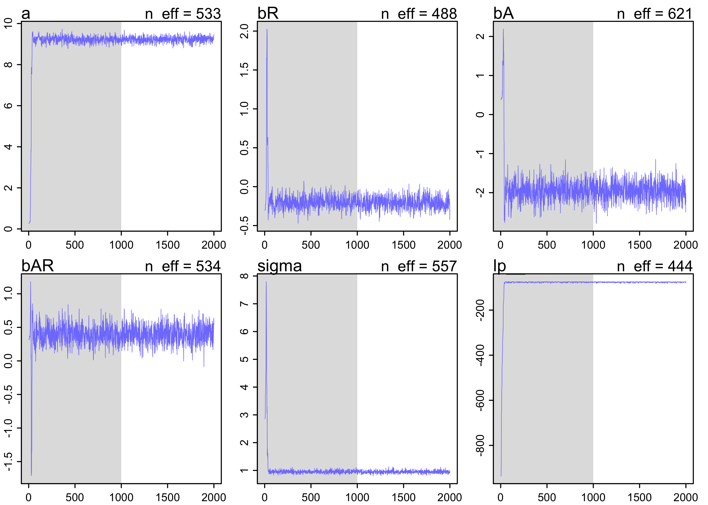
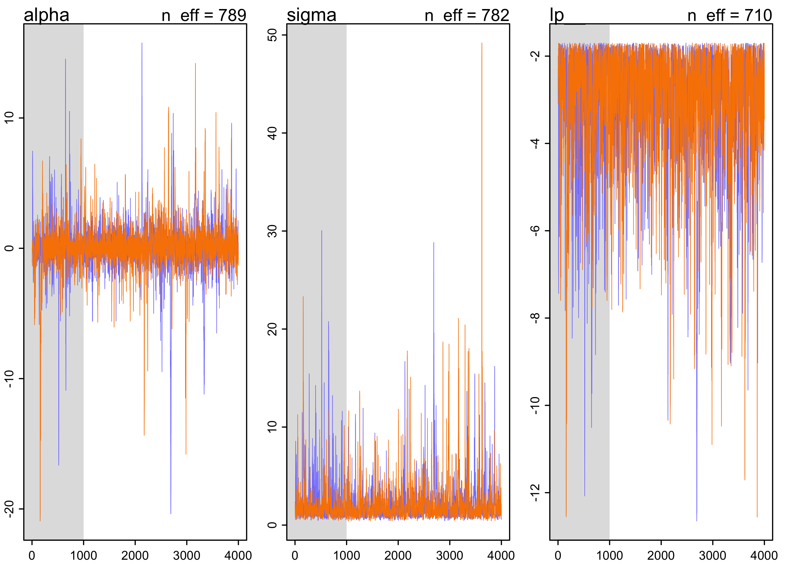
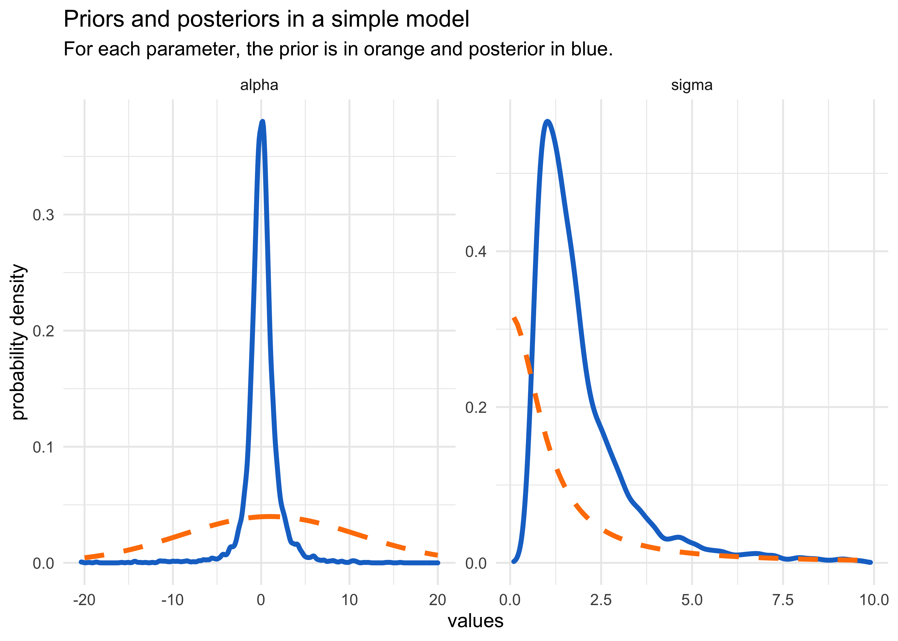
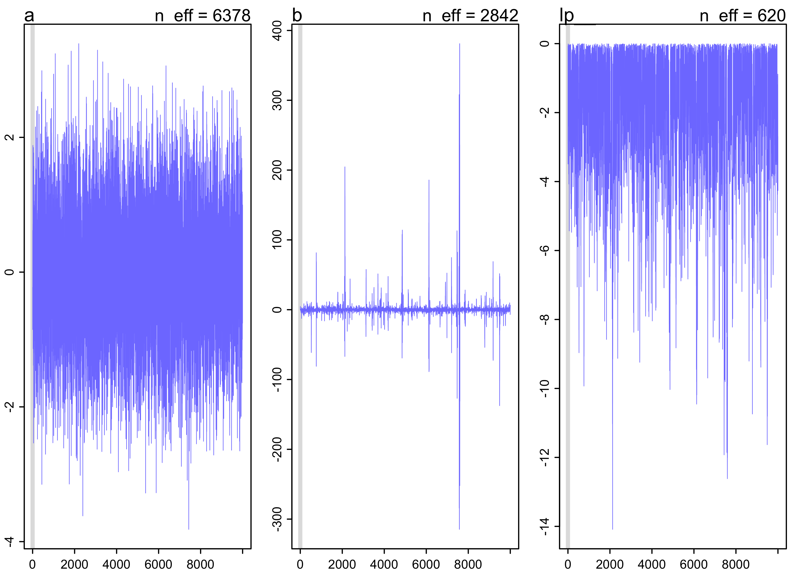

Chapter 8. Markov Chain Monte Carlo
================

  - estimation of posterior probability distributions using a stochastic
    process called \*Markov chain Monte Carlo (MCMC)\*\* estimation
      - sample directly from the posterior instead of approximating
        curves (like the quadratic approximation)
      - allows for models that do not assume a multivariate normality
          - can use generalized linear and multilevel models
  - use *Stan* to fit these models

## 8.1 Good King Markov and His island kingdom

  - a tale of the Good King Markov
      - he was kings of a ring of 10 islands
      - the second island had twice the population of the first, the
        third had three times the population of the first, etc.
      - the king wanted to visit the islands in proportion to the
        population size, but didn’t want to have to keep track of a
        schedule
      - he would also only travel between adjacent islands
      - he used the *Metropolis algorithm* to decide which island to
        visit next
        1.  the king decides to stay or travel by a coin flip
        2.  if the coin is heads, the king considers moving clockwise;
            if tails, he considers moving counter-clockwise; call this
            next island the “proposal” island
        3.  to decide whether not to move, the king collects the number
            of seashells in proportion to the population size of the
            proposed island, and collects the number of stones relative
            to the population of the current island
        4.  if there are more seashells, the king moves to the proposed
            island; else he discards the number of stones equal to the
            number of seashells and randomly selects from the remaining
            seashells and stones; if he selects a shell, he travels to
            the proposed island, else he stays
  - below is a simulation of this process

<!-- end list -->

``` r
set.seed(0)

current_island <- 10
num_weeks <- 1e5
visited_islands <- rep(0, num_weeks)

flip_coin_to_decide_proposal_island <- function(x) {
    a <- sample(c(0, 1), 1)
    if (a == 0) {
        y <- x - 1
    } else {
        y <- x + 1
    }
    
    if (y == 0) {
        y <- 10
    } else if (y == 11) {
        y <- 1
    }
    return(y)
}

for (wk in seq(1, num_weeks)) {
    visited_islands[[wk]] <- current_island
    
    proposal_island <- flip_coin_to_decide_proposal_island(current_island)
    if (proposal_island > current_island) {
        current_island <- proposal_island
    } else {
        shells <- rep("shell", proposal_island)
        stones <- rep("stone", current_island - proposal_island)
        selection <- sample(unlist(c(shells, stones)), 1)
        if (selection == "shell") {
            current_island <- proposal_island
        }
    }
}
```

``` r
tibble(wk = seq(1, num_weeks),
       islands = visited_islands) %>%
    ggplot(aes(x = factor(islands))) + 
    geom_bar(fill = "skyblue4") +
    labs(x = "islands",
         y = "number of weeks visited",
         title = "Distribution of King Markov's visits")
```

<!-- -->

``` r
tibble(wk = seq(1, num_weeks),
       islands = visited_islands) %>%
    slice(1:400) %>%
    ggplot(aes(x = wk, y = islands)) +
    geom_line(color = "skyblue4", alpha = 0.5) +
    geom_point(color = "skyblue4", size = 0.7) +
    scale_y_continuous(breaks = c(1:10)) +
    labs(x = "week number", y = "island",
         title = "The path of King Markov",
         subtitle = "Showing only the first 400 weeks")
```

<!-- -->

  - this algorithm still works if the king is equally likely to propose
    a move to any island from the current island
      - still use the proportion of the islands’ populations as the
        probability of moving
  - at any point, the king only needs to know the population of the
    current island and the proposal island

## 8.2 Markov chain Monte Carlo

  - the *Metropolis algorithm* used above is an example of a *Markov
    chain Monte Carlo*
      - the goal is to draw samples from an unknown and complex target
        distribution
          - “islands”: the parameter values (they can be continuous,
            too)
          - “population sizes”: the posterior probabilities at each
            parameter value
          - “week”: samples taken from the joint posterior of the
            parameters
      - we can use the samples from the Metropolis algorithm just like
        any other sampled distributions so far
  - we will also cover *Gibbs sampling* and *Hamiltonian Monte Carlo*

### 8.2.1 Gibbs sampling

  - can achieve a more efficient sampling procedure
      - *adaptive proposals*: the distribution of proposed parameter
        values adjusts itself intelligently depending upon the parameter
        values at the moment
      - the adaptive proposals depend on using particular combinations
        of prior distributions and likelihoods known as conjugate pairs
          - these pairs have analytical solutions for the posterior of
            an individual parameter
          - can use these solutions to make smart jumps around the joint
            posterior
  - Gibbs sampling is used in BUGS (Bayesian inference Using Gibbs
    Sampling) and JAGS (Just Another Gibbs Sampler)
  - limitations:
      - don’t always want to use the conjugate priors
      - Gibbs sampling becomes very inefficient for models with hundreds
        or thousands of parameters

### 8.2.2 Hamiltonian Monte Carlo (HMC)

  - more computationally expensive than Gibbs sampling and the
    Metropolis algorithm, but more efficient
      - doesn’t require as many samples to describe the posterior
        distribution
  - an analogy using King Monty:
      - king of a continuous stretch of land, not discrete islands
      - wants to visit his citizens in proportion to their local density
      - decides to travel back and forth across the length of the
        country, slowing down the vehicle when houses grow more dense,
        and speeding up when the houses are more sparse
      - requires knowledge of how quickly the population is changing at
        the current location
  - in this analogy:
      - “royal vehicle”: the current vector of parameter values
      - the log-posterior forms a bowl with the MAP at the nadir
      - the vehicle sweeps across the bowl, adjust the speed in
        proportion to the height on the bowl
  - HMC does run a sort of physics simulation
      - a vector of parameters gives the position of a friction-less
        particle
      - the log-posterior provides the surface
  - limitations:
      - HMC requires continuous parameters
      - HMC needs to be tuned to a particular model and its data
          - the particle needs mass (so it can have momentum)
          - other hyperparameters of MCMC is handled by Stan

## 8.3 Easy HMC: `map2stan`

  - `map2stan()` provides an interface to Stan similar to how we have
    used `quap()`
      - need to preprocess and variables transformations
      - input data frame can only have columns used in the formulae
  - example: look at terrain ruggedness data

<!-- end list -->

``` r
data("rugged")
dd <- as_tibble(rugged) %>%
    mutate(log_gdp = log(rgdppc_2000)) %>%
    filter(!is.na(rgdppc_2000))
```

  - fit a model to predict log-GDP with terrain ruggedness, continent,
    and the interaction of the two
  - first fit with `quap()` like before

<!-- end list -->

``` r
m8_1 <- quap(
    alist(
        log_gdp ~ dnorm(mu, sigma),
        mu <- a + bR*rugged + bA*cont_africa + bAR*rugged*cont_africa,
        a ~ dnorm(0, 100),
        bR ~ dnorm(0, 10),
        bA ~ dnorm(0, 10),
        bAR ~ dnorm(0, 10),
        sigma ~ dunif(0, 10)
    ),
    data = dd
)
precis(m8_1)
```

    #>             mean         sd       5.5%       94.5%
    #> a      9.2227717 0.13798197  9.0022499  9.44329359
    #> bR    -0.2026506 0.07646932 -0.3248634 -0.08043786
    #> bA    -1.9469424 0.22450135 -2.3057389 -1.58814589
    #> bAR    0.3929006 0.13004832  0.1850583  0.60074296
    #> sigma  0.9326829 0.05058184  0.8518433  1.01352241

### 8.3.1 Preparation

  - must:
      - do any transformations beforehand (e.g. logarithm, squared,
        etc.)
      - reduce data frame to only used variables

<!-- end list -->

``` r
dd_trim <- dd %>%
    select(log_gdp, rugged, cont_africa)
```

### 8.3.2 Estimation

  - can now fit the model with HMC using `map2stan()`

<!-- end list -->

``` r
stash("m8_1stan", depends_on = "dd_trim", {
    m8_1stan <- map2stan(
        alist(
            log_gdp ~ dnorm(mu, sigma),
            mu <- a + bR*rugged + bA*cont_africa + bAR*rugged*cont_africa,
            a ~ dnorm(0, 100),
            bR ~ dnorm(0, 10),
            bA ~ dnorm(0, 10),
            bAR ~ dnorm(0, 10),
            sigma ~ dcauchy(0, 2)
        ),
        data = dd_trim
    )
})
```

    #> Loading stashed object.

``` r
precis(m8_1stan)
```

    #>             mean         sd       5.5%       94.5%    n_eff     Rhat4
    #> a      9.2279802 0.13623705  9.0088339  9.43951036 533.1568 0.9996015
    #> bR    -0.2073055 0.07649824 -0.3246416 -0.08044154 488.1808 0.9990947
    #> bA    -1.9543006 0.23002089 -2.3383725 -1.57899659 620.7081 0.9990050
    #> bAR    0.3981646 0.13082165  0.1962853  0.60559040 534.1085 0.9989998
    #> sigma  0.9483330 0.05010279  0.8736709  1.02811206 557.1305 1.0012550

  - a half-Cauchy prior was used for \(\sigma\)
      - a uniform distribution would work here, too
      - it is a useful, “thick-tailed” probability
      - related to the Student \(t\) distribution
      - can think of it as a weakly-regularizing prior for the standard
        deviation
  - the estimates from this model are similar to those from the
    quadratic prior
  - a few differences to note about the output of `precis()`
    (`summary()`):
      - the *highest probability density intervals* (HPDI) are shown,
        not just percentiles intervals (PI), like before
      - two new columns (they will be discussed further later):
          - `n_eff`: a crude estimate of the number of independent
            samples that were collected
          - `Rhat4`: an estimate of the convergence of the Markov chains
            (1 is good)

### 8.3.3 Sampling again, in parallel

  - specific advice on the number of samples to run will be given later
  - a compiled model can be resampled from again
      - multiple chains can also be used and run in parallel

<!-- end list -->

``` r
stash("m8_1stan_4chains", {
    m8_1stan_4chains <- map2stan(m8_1stan, chains = 4, cores = 4)
})
```

    #> Loading stashed object.

``` r
precis(m8_1stan_4chains)
```

    #>             mean         sd       5.5%       94.5%    n_eff    Rhat4
    #> a      9.2208308 0.14563430  8.9854237  9.45860657 1754.883 1.001898
    #> bR    -0.2016824 0.08038236 -0.3308949 -0.07520045 1696.929 1.000701
    #> bA    -1.9430034 0.23543180 -2.3190455 -1.56646767 1804.943 1.002227
    #> bAR    0.3887506 0.13646037  0.1660543  0.60290154 1705.157 1.003037
    #> sigma  0.9510894 0.05287941  0.8711512  1.04114772 2878.768 1.000296

### 8.3.4 Visualization

  - can plot the samples
      - interesting to see how Gaussian the distribution actually was

<!-- end list -->

``` r
post <- extract.samples(m8_1stan)
str(post)
```

    #> List of 5
    #>  $ a    : num [1:1000(1d)] 9.26 9.46 9.3 9.07 9.37 ...
    #>  $ bR   : num [1:1000(1d)] -0.236 -0.385 -0.207 -0.18 -0.225 ...
    #>  $ bA   : num [1:1000(1d)] -1.92 -2.38 -1.95 -2.12 -2.04 ...
    #>  $ bAR  : num [1:1000(1d)] 0.449 0.645 0.292 0.435 0.32 ...
    #>  $ sigma: num [1:1000(1d)] 0.951 0.985 0.888 0.915 0.935 ...

``` r
pairs(m8_1stan)
```

<!-- -->

### 8.3.5 Using the samples

  - we can use the samples just like before
      - simulate predictions
      - compute differences of parameters
      - calculate DIC and WAIC,
      - etc.

<!-- end list -->

``` r
show(m8_1stan)
```

    #> map2stan model
    #> 1000 samples from 1 chain
    #> 
    #> Sampling durations (seconds):
    #>         warmup sample total
    #> chain:1   0.33   0.34  0.67
    #> 
    #> Formula:
    #> log_gdp ~ dnorm(mu, sigma)
    #> mu <- a + bR * rugged + bA * cont_africa + bAR * rugged * cont_africa
    #> a ~ dnorm(0, 100)
    #> bR ~ dnorm(0, 10)
    #> bA ~ dnorm(0, 10)
    #> bAR ~ dnorm(0, 10)
    #> sigma ~ dcauchy(0, 2)
    #> 
    #> WAIC (SE): 469 (14.9)
    #> pWAIC: 5.09

``` r
WAIC(m8_1stan)
```

    #>       WAIC     lppd  penalty  std_err
    #> 1 469.2187 -229.516 5.093422 14.86534

### 8.3.6 Checking the chain

  - the MC is guaranteed to converge eventually
      - need to check it actually did in the time we gave it
  - use the *trace plot* to plot the samples in sequential order
      - this is the first plot that should be looked at after fitting
        with MCMC
      - grey region is the warm up (“adaptation”) where the chain is
        learning to more efficiently sample from the posterior
  - look for 2 characteristics of a “good” chain:
      - *stationary*: the path staying within the posterior distribution
          - the center of each path is relatively stable from start to
            end
      - *good mixing*: each successive sample within each parameter is
        not highly correlated with the sample before it
          - this is represented by a rapid zig-zap of the paths

<!-- end list -->

``` r
plot(m8_1stan)
```

<!-- -->

  - can access the raw Stan code in case we want to make specific
    changes not possible through `map2stan()`

<!-- end list -->

``` r
str_split(m8_1stan@model, "\n")
```

    #> [[1]]
    #>  [1] "//2020-06-28 08:59:43"                                                                       
    #>  [2] "data{"                                                                                       
    #>  [3] "    int<lower=1> N;"                                                                         
    #>  [4] "    real log_gdp[N];"                                                                        
    #>  [5] "    real rugged[N];"                                                                         
    #>  [6] "    int cont_africa[N];"                                                                     
    #>  [7] "}"                                                                                           
    #>  [8] "parameters{"                                                                                 
    #>  [9] "    real a;"                                                                                 
    #> [10] "    real bR;"                                                                                
    #> [11] "    real bA;"                                                                                
    #> [12] "    real bAR;"                                                                               
    #> [13] "    real<lower=0> sigma;"                                                                    
    #> [14] "}"                                                                                           
    #> [15] "model{"                                                                                      
    #> [16] "    vector[N] mu;"                                                                           
    #> [17] "    sigma ~ cauchy( 0 , 2 );"                                                                
    #> [18] "    bAR ~ normal( 0 , 10 );"                                                                 
    #> [19] "    bA ~ normal( 0 , 10 );"                                                                  
    #> [20] "    bR ~ normal( 0 , 10 );"                                                                  
    #> [21] "    a ~ normal( 0 , 100 );"                                                                  
    #> [22] "    for ( i in 1:N ) {"                                                                      
    #> [23] "        mu[i] = a + bR * rugged[i] + bA * cont_africa[i] + bAR * rugged[i] * cont_africa[i];"
    #> [24] "    }"                                                                                       
    #> [25] "    log_gdp ~ normal( mu , sigma );"                                                         
    #> [26] "}"                                                                                           
    #> [27] "generated quantities{"                                                                       
    #> [28] "    vector[N] mu;"                                                                           
    #> [29] "    for ( i in 1:N ) {"                                                                      
    #> [30] "        mu[i] = a + bR * rugged[i] + bA * cont_africa[i] + bAR * rugged[i] * cont_africa[i];"
    #> [31] "    }"                                                                                       
    #> [32] "}"                                                                                           
    #> [33] ""                                                                                            
    #> [34] ""

## 8.4 Care and feeding of your Markov chain

  - it is not necessary to fully understand the MCMC, but some
    understanding of the process is necessary to be able to check if it
    worked

### 8.4.1 How many samples do you need?

  - defaults: `iter = 2000` and `warmup = iter/2`
      - gives 1000 warm-ups and 1000 samples
      - this is a good place to start to make sure the model is defined
        correctly
  - the number of samples needed for inference depends on many factors:
      - the *effective* number of samples is the important part
          - is an estimate of the number of independent samples from the
            posterior distribution
          - chains can become *autocorrelated*
      - what do we want to know?
          - if we just want posterior means, not many samples are needed
          - if we care about the shape of the posterior tails/extreme
            values, then need many samples
          - Gaussian posterior distributions should need about 2000
            samples, but skewed distributions likely need more
  - for warm-up, we want as few as possible so more time is spent on
    sampling, but more warm-ups helps the MCMC sample more efficiently
      - for Stan models, it is good to devote half of the total samples
        to warm-up
      - for the very simple models we have fit so far, don’t need very
        much warm-up

### 8.4.2 How many chains do you need?

  - general workflow
    1.  when debugging a model, use one chain
    2.  run multiple chains to make sure the chains are working
    3.  for final model (whose samples will be use for inference), only
        one chain is really needed, but running multiple in parallel can
        help speed it up
  - for typical regression models: “four short chains to check, one long
    chain for inference”
  - when sampling is not working right, it is usually very obvious
      - we will see some bad chains in the sections below
  - Rhat tells us if the chains converged
      - use it as a diagnostic signal of danger (when it is above 1.00),
        but not as a sign of safety (when it is 1.00)

### 8.4.3 Taming a wild chain

  - a common problem is the model has a broad, flat posterior density
      - happens most often with flat priors
      - this causes the Markov chain to wander erratically
      - a simple example with flat priors:

<!-- end list -->

``` r
y <- c(-1, 1)
stash("m8_2", depends_on = "y", {
    m8_2 <- map2stan(
        alist(
            y ~ dnorm(mu, sigma),
            mu <- alpha
        ),
        data = list(y = y),
        start = list(alpha = 0, sigma = 1),
        chains = 2,
        iter = 4000,
        warmup = 1000
    )
})
```

    #> Loading stashed object.

``` r
precis(m8_2)
```

    #>             mean          sd          5.5%      94.5%      n_eff    Rhat4
    #> alpha  340932479   676743337 -1447269.4408 1944065744   3.843847 1.845591
    #> sigma 2478059834 21092479052      979.8273 6291182718 123.015633 1.017844

``` r
plot(m8_2)
```

<!-- -->

  - even weakly informative priors can fix this problem
      - the above example just has such little data with two y values
        and uninformative priors
      - with little data, the priors become more important
  - here’s the same model with weak, but more informative priors

<!-- end list -->

``` r
stash("m8_3", depends_on = "y", {
    m8_3 <- map2stan(
        alist(
            y ~ dnorm(mu, sigma),
            mu <- alpha,
            alpha ~ dnorm(1, 10),
            sigma ~ dcauchy(0, 1)
        ),
        data = list(y = y),
        start = list(alpha = 0, sigma = 1),
        chains = 2,
        iter = 4e3,
        warmup = 1e3
    )

})
```

    #> Loading stashed object.

``` r
precis(m8_3)
```

    #>             mean       sd       5.5%    94.5%    n_eff   Rhat4
    #> alpha 0.08573212 1.993184 -2.1229459 2.659450 789.2122 1.00402
    #> sigma 2.11063133 2.155345  0.7041848 5.041159 782.4874 1.00443

``` r
plot(m8_3)
```

<!-- -->

  - below is a plot of the prior and posterior distributions used above

<!-- end list -->

``` r
post <- extract.samples(m8_3, n = 1e4, clean = FALSE)
post_tibble <- tibble(parameter = c("alpha", "sigma"),
                      value = c(list(post$alpha), list(post$sigma))) %>%
    unnest(value) %>%
    filter((parameter == "sigma" & value > 0 & value < 10) | 
               parameter == "alpha")
prior_tibble <- tibble(parameter = c("alpha", "sigma"),
                       x = rep(list(seq(-20, 20, 0.1)), each = 2),
                       value = c(
                           list(dnorm(seq(-20, 20, 0.1), 1, 10)),
                           list(dcauchy(seq(-20, 20, 0.1), 0, 1))
                       )) %>%
    unnest(c(x, value)) %>%
    filter((parameter == "sigma" & x > 0 & x < 10) | parameter == "alpha")

post_tibble %>%
    ggplot() +
    facet_wrap(~ parameter, scales = "free", nrow = 1) +
    geom_density(aes(x = value), color = "dodgerblue3", size = 1.3) +
    geom_line(data = prior_tibble, aes(x = x, y = value), 
              color = "darkorange1", size = 1.3, lty = 2) +
    labs(x = "values",
         y = "probability density",
         title = "Priors and posteriors in a simple model",
         subtitle = "For each parameter, the prior is in orange and posterior in blue.")
```

<!-- -->

### 8.4.4. Non-identifiable parameters

  - see the result of highly correlated predictors on a Markov chain
      - produce a characteristic shape in the chain
      - as an example, fit the following model without any priors on the
        \(\alpha\)’s.

\[
y_i \sim \text{Normal}(\mu, \sigma) \\
\mu = \alpha_1 + \alpha_2 \\
\sigma \sim \text{HalfCauchy}(0, 1)
\]

``` r
y <- rnorm(100, 0, 1)

stash("m8_4", depends_on = "y", {
    m8_4 <- map2stan(
        alist(
            y ~ dnorm(mu, sigma),
            mu <- a1 + a2,
            sigma ~ dcauchy(0, 1)
        ),
        data = list(y = y),
        start = list(a1 = 0, a2 = 0, sigma = 1),
        chains = 2,
        iter = 4e3,
        warmup = 1e3
    )
})
```

    #> Updating stash.

    #> 
    #> SAMPLING FOR MODEL 'c93922ce2e5a19632999ef5afa9615eb' NOW (CHAIN 1).
    #> Chain 1: 
    #> Chain 1: Gradient evaluation took 3.4e-05 seconds
    #> Chain 1: 1000 transitions using 10 leapfrog steps per transition would take 0.34 seconds.
    #> Chain 1: Adjust your expectations accordingly!
    #> Chain 1: 
    #> Chain 1: 
    #> Chain 1: Iteration:    1 / 4000 [  0%]  (Warmup)
    #> Chain 1: Iteration:  400 / 4000 [ 10%]  (Warmup)
    #> Chain 1: Iteration:  800 / 4000 [ 20%]  (Warmup)
    #> Chain 1: Iteration: 1001 / 4000 [ 25%]  (Sampling)
    #> Chain 1: Iteration: 1400 / 4000 [ 35%]  (Sampling)
    #> Chain 1: Iteration: 1800 / 4000 [ 45%]  (Sampling)
    #> Chain 1: Iteration: 2200 / 4000 [ 55%]  (Sampling)
    #> Chain 1: Iteration: 2600 / 4000 [ 65%]  (Sampling)
    #> Chain 1: Iteration: 3000 / 4000 [ 75%]  (Sampling)
    #> Chain 1: Iteration: 3400 / 4000 [ 85%]  (Sampling)
    #> Chain 1: Iteration: 3800 / 4000 [ 95%]  (Sampling)
    #> Chain 1: Iteration: 4000 / 4000 [100%]  (Sampling)
    #> Chain 1: 
    #> Chain 1:  Elapsed Time: 3.43336 seconds (Warm-up)
    #> Chain 1:                11.9183 seconds (Sampling)
    #> Chain 1:                15.3517 seconds (Total)
    #> Chain 1: 
    #> 
    #> SAMPLING FOR MODEL 'c93922ce2e5a19632999ef5afa9615eb' NOW (CHAIN 2).
    #> Chain 2: 
    #> Chain 2: Gradient evaluation took 6e-06 seconds
    #> Chain 2: 1000 transitions using 10 leapfrog steps per transition would take 0.06 seconds.
    #> Chain 2: Adjust your expectations accordingly!
    #> Chain 2: 
    #> Chain 2: 
    #> Chain 2: Iteration:    1 / 4000 [  0%]  (Warmup)
    #> Chain 2: Iteration:  400 / 4000 [ 10%]  (Warmup)
    #> Chain 2: Iteration:  800 / 4000 [ 20%]  (Warmup)
    #> Chain 2: Iteration: 1001 / 4000 [ 25%]  (Sampling)
    #> Chain 2: Iteration: 1400 / 4000 [ 35%]  (Sampling)
    #> Chain 2: Iteration: 1800 / 4000 [ 45%]  (Sampling)
    #> Chain 2: Iteration: 2200 / 4000 [ 55%]  (Sampling)
    #> Chain 2: Iteration: 2600 / 4000 [ 65%]  (Sampling)
    #> Chain 2: Iteration: 3000 / 4000 [ 75%]  (Sampling)
    #> Chain 2: Iteration: 3400 / 4000 [ 85%]  (Sampling)
    #> Chain 2: Iteration: 3800 / 4000 [ 95%]  (Sampling)
    #> Chain 2: Iteration: 4000 / 4000 [100%]  (Sampling)
    #> Chain 2: 
    #> Chain 2:  Elapsed Time: 3.75279 seconds (Warm-up)
    #> Chain 2:                11.317 seconds (Sampling)
    #> Chain 2:                15.0698 seconds (Total)
    #> Chain 2:

    #> Warning: There were 4894 transitions after warmup that exceeded the maximum treedepth. Increase max_treedepth above 10. See
    #> http://mc-stan.org/misc/warnings.html#maximum-treedepth-exceeded

    #> Warning: Examine the pairs() plot to diagnose sampling problems

    #> Warning: The largest R-hat is 1.89, indicating chains have not mixed.
    #> Running the chains for more iterations may help. See
    #> http://mc-stan.org/misc/warnings.html#r-hat

    #> Warning: Bulk Effective Samples Size (ESS) is too low, indicating posterior means and medians may be unreliable.
    #> Running the chains for more iterations may help. See
    #> http://mc-stan.org/misc/warnings.html#bulk-ess

    #> Warning: Tail Effective Samples Size (ESS) is too low, indicating posterior variances and tail quantiles may be unreliable.
    #> Running the chains for more iterations may help. See
    #> http://mc-stan.org/misc/warnings.html#tail-ess

    #> Computing WAIC

``` r
precis(m8_4, digits = 3)
```

    #>               mean           sd          5.5%       94.5%     n_eff    Rhat4
    #> a1    -964.4899479 541.57700570 -1818.8111659 -223.393210  1.265054 2.369022
    #> a2     964.5184129 541.57708579   223.3781135 1818.810016  1.265051 2.369030
    #> sigma    0.9676124   0.07157624     0.8599235    1.076977 24.046541 1.016680

``` r
plot(m8_4)
```

<!-- -->
- the chains wander very far and never converge \* the `n_eff` and
`Rhat` values are horrible \* these samples should not be used - using
weak priors helps a lot

``` r
stash("m8_5", depends_on = "y", {
    m8_5 <- map2stan(
        alist(
            y ~ dnorm(mu, sigma),
            mu <- a1 + a2,
            c(a1, a2) ~ dnorm(0, 10),
            sigma ~ dcauchy(0, 1)
        ),
        data = list(y = y),
        start = list(a1 = 0, a2 = 0, sigma = 1),
        chains = 2,
        iter = 4e3,
        warmup = 1e3
    )
})
```

    #> Updating stash.

    #> 
    #> SAMPLING FOR MODEL 'cf0d22bd53d28861a38ec9ae005b13e6' NOW (CHAIN 1).
    #> Chain 1: 
    #> Chain 1: Gradient evaluation took 1.3e-05 seconds
    #> Chain 1: 1000 transitions using 10 leapfrog steps per transition would take 0.13 seconds.
    #> Chain 1: Adjust your expectations accordingly!
    #> Chain 1: 
    #> Chain 1: 
    #> Chain 1: Iteration:    1 / 4000 [  0%]  (Warmup)
    #> Chain 1: Iteration:  400 / 4000 [ 10%]  (Warmup)
    #> Chain 1: Iteration:  800 / 4000 [ 20%]  (Warmup)
    #> Chain 1: Iteration: 1001 / 4000 [ 25%]  (Sampling)
    #> Chain 1: Iteration: 1400 / 4000 [ 35%]  (Sampling)
    #> Chain 1: Iteration: 1800 / 4000 [ 45%]  (Sampling)
    #> Chain 1: Iteration: 2200 / 4000 [ 55%]  (Sampling)
    #> Chain 1: Iteration: 2600 / 4000 [ 65%]  (Sampling)
    #> Chain 1: Iteration: 3000 / 4000 [ 75%]  (Sampling)
    #> Chain 1: Iteration: 3400 / 4000 [ 85%]  (Sampling)
    #> Chain 1: Iteration: 3800 / 4000 [ 95%]  (Sampling)
    #> Chain 1: Iteration: 4000 / 4000 [100%]  (Sampling)
    #> Chain 1: 
    #> Chain 1:  Elapsed Time: 1.339 seconds (Warm-up)
    #> Chain 1:                4.29824 seconds (Sampling)
    #> Chain 1:                5.63724 seconds (Total)
    #> Chain 1: 
    #> 
    #> SAMPLING FOR MODEL 'cf0d22bd53d28861a38ec9ae005b13e6' NOW (CHAIN 2).
    #> Chain 2: 
    #> Chain 2: Gradient evaluation took 7e-06 seconds
    #> Chain 2: 1000 transitions using 10 leapfrog steps per transition would take 0.07 seconds.
    #> Chain 2: Adjust your expectations accordingly!
    #> Chain 2: 
    #> Chain 2: 
    #> Chain 2: Iteration:    1 / 4000 [  0%]  (Warmup)
    #> Chain 2: Iteration:  400 / 4000 [ 10%]  (Warmup)
    #> Chain 2: Iteration:  800 / 4000 [ 20%]  (Warmup)
    #> Chain 2: Iteration: 1001 / 4000 [ 25%]  (Sampling)
    #> Chain 2: Iteration: 1400 / 4000 [ 35%]  (Sampling)
    #> Chain 2: Iteration: 1800 / 4000 [ 45%]  (Sampling)
    #> Chain 2: Iteration: 2200 / 4000 [ 55%]  (Sampling)
    #> Chain 2: Iteration: 2600 / 4000 [ 65%]  (Sampling)
    #> Chain 2: Iteration: 3000 / 4000 [ 75%]  (Sampling)
    #> Chain 2: Iteration: 3400 / 4000 [ 85%]  (Sampling)
    #> Chain 2: Iteration: 3800 / 4000 [ 95%]  (Sampling)
    #> Chain 2: Iteration: 4000 / 4000 [100%]  (Sampling)
    #> Chain 2: 
    #> Chain 2:  Elapsed Time: 1.40992 seconds (Warm-up)
    #> Chain 2:                4.5868 seconds (Sampling)
    #> Chain 2:                5.99672 seconds (Total)
    #> Chain 2:

    #> Computing WAIC

``` r
precis(m8_5, digits = 3)
```

    #>              mean         sd        5.5%     94.5%    n_eff    Rhat4
    #> a1     0.07448717 7.12488901 -11.4065536 11.737317 1728.953 1.001785
    #> a2    -0.04792736 7.12207247 -11.7474133 11.449899 1727.991 1.001795
    #> sigma  0.94616936 0.06909494   0.8411724  1.061703 2139.499 1.001511

``` r
plot(m8_5)
```

<!-- -->

## 8.6 Practice

(I skipped to the problems that seemed interesting.)

**8H1. Run the model below and then inspect the posterior distribution
and explain what it is accomplishing. Compare the samples for the
parameters a and b. Can you explain the different trace plots, using
what you know about the Cauchy distribution?**

``` r
# Code from the question:
stash("mp", {
    mp <- map2stan(
        alist(
            a ~ dnorm(0, 1),
            b ~ dcauchy(0, 1)
        ),
        data = list(y = 1),
        start = list(a = 0, b = 0),
        iter = 1e4,
        warmup = 1e2,
        WAIC = FALSE
    )
})
```

    #> Loading stashed object.

``` r
###
```

``` r
precis(mp, digits = 3)
```

    #>          mean         sd      5.5%    94.5%    n_eff     Rhat4
    #> a -0.01937564  0.9901903 -1.639211 1.551454 6378.180 0.9999028
    #> b  0.13195629 16.1875973 -5.871213 6.160236 2842.154 1.0009003

``` r
plot(mp)
```

<!-- -->

``` r
post <- extract.samples(mp, clean = FALSE)
enframe(post) %>%
    unnest(value) %>%
    ggplot(aes(x = value, color = name)) +
    geom_density(size = 1.3) +
    scale_x_continuous(limits = c(-10, 10)) +
    scale_color_brewer(palette = "Set1")
```

    #> Warning: Removed 666 rows containing non-finite values (stat_density).

<!-- -->

The posterior plots basically look like their priors. Parameter `b` has
fatter tails which are descriptive of the Cauchy compared to a Gaussian.
With only one data point, the priors will be very important in defining
the posterior distributions.
