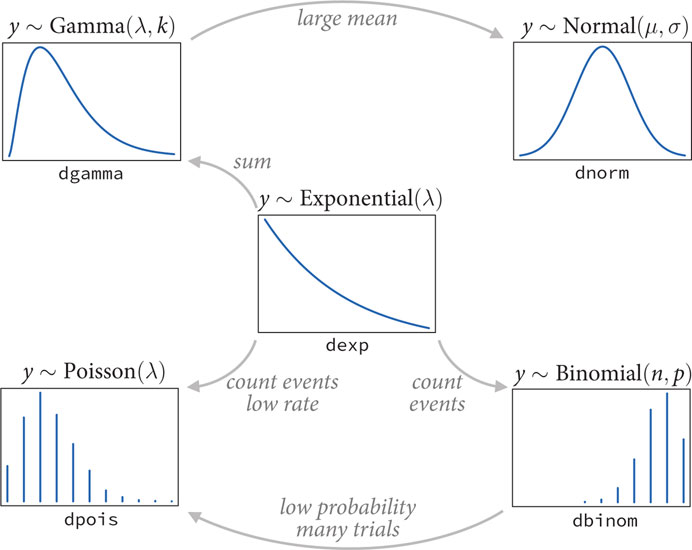
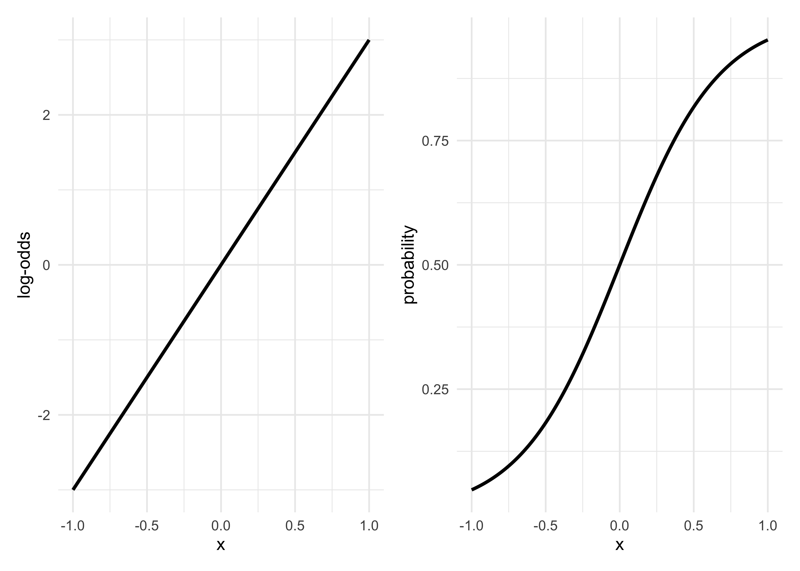

Chapter 9. Big Entropy and the Generalized Linear Model
================

  - Gaussian distributions work well very frequently
  - there are times it is better to use a different distribution
  - if using a different distribution: *use the distribution with the
    biggest entropy*, because:
    1.  the biggest entory is the widest and least informative
        distribution that still contrains the problem to values that are
        possible
    2.  nature tends to produce emperical distributions with high
        entropy
    3.  it works (pragmatic justification)
  - this chapter is an introduction to *generalized linear models* (GLM)
    and the principle of *maximum entropy*
  - GLMs are similar to the linear regressions we have used previously
      - but they need not use Gaussian likelihoods
      - any likelihood function can be used
      - parameters can be atached to any of the parameters that describe
        its shape
  - the principle of maximum entropy helps choose the likelihood
    functions
      - choose the most conservative prior with the known constraints
  - the following chapters look more closely as a few specific GLM types
    (counts, ordinal outcomes, mixtures)

## 9.1 Maximum entropy

  - information theory *seeks to find a measure of uncertainty that
    satisfies the following criteria*:
    1.  measure should be continuous
    2.  it should increase as the number of possible events increases
    3.  should be additive
  - the resulting measure of uncertainty of a probability distribution
    \(p\) with probabilities \(p_i\) for each possible event \(i\) is
    the average log-probability, *information entropy*:

\[
H(p) = -\sum_i p_i \log p_i
\]

  - the principle of maximum entropy applied this measure of uncertainty
    to the problem of chooseing among probability distributions:
      - *The distribution that can happen the most ways is also the
        distribution with the biggest information entropy. The
        distribution with the biggest entropy is the most conservative
        distribution that obeys its constraints.*
  - *maximum entropy distribution*: the most plausible distribution

### 9.1.1 Gaussian

  - a collection of continuous variables is most likely to create
    Gaussian because it represents the greatest entropy
      - as long as it has some finite variance
          - the uniform distribution has infinite variance
          - this constraint very important to keeping the bell-shaped
            curve
  - if we are only willing to assume that a collection of measurements
    is they have finite variance, then the Gaussian distribution
    represents the most conservative probability distribution
      - if we are willing to assume more, then there are more choices

### 9.1.2 Binomial

  - *binaomial distribution*: two possible outcomes with a constant
    chance \(p\) over \(n\) trials, the probability of observing \(y\)
    events of type 1 and \(n-y\) events of type 2:
      - the fraction just counts the number of sequencies of \(n\)
        outcomes have a count \(y\)

\[
\Pr(y | n,p) = \frac{n1}{y! (n-y)!} (1-p)^{n-y}
\]

  - the binomial distribution has the most entropy given the following
    constraints:
      - only two unordered events
      - constant expected value for the probability \(p\)

## 9.2 Generalized linear models

  - when a outcome variable is either discrete or bounded, a Gaussian is
    not the more powerful choice
      - e.g. a count outcome where the variable is constrained to 0 or 1
  - to overcome this, just generalize the linear regression strategy by
    placing a parameter describing the shape of the likelihood with a
    linear model
  - previously, we have fit linear models of the following form

\[
y_i \sim \text{Normal}(\mu_i, \sigma) \\
\mu_i = \alpha + \beta x_x
\]

  - the analogous binomial distribution has the following form
      - the likelihood function is a binomial instead of a Gaussian
      - the second function, \(f(p_i)\), is the *link function*
          - this is revisited later

\[
y_i \sim \text{Binomial}(n, p_i) \\
f(p_i) = \alpha + \beta x_x
\]

### 9.2.1 Meet the family

  - *exponential family*: a group of probability distributions
      - each is a maximum entropy distribution for some set of
        constraints
  - *exponential distribution*: distribution of distance and duration;
    displacement from some point of reference
      - if the probability of an even is constant in time or across
        space
      - constrained to be zero or positive
      - single parameter for the rate of events \(\lambda\)
  - *gamma distribution*: distribution of distance and duration; if an
    event can only happen after two or more exponentially distributed
    event happen
      - can have a peak above 0
      - age of cancer of gamma distributed since multiple events are
        necessary for onset
      - two parameters to describe the shape
  - *poisson distribution*: a count distribution; the probability of a
    number of events occurring in a fixed interval
      - a special case of the binomial distribution
      - covered more in the next chapter



### 9.2.2 Linking linear models to distributions

  - to build a regression model from any of the exponential family
    distributions, must attach one or more linear models to one or more
    of the parameters that describe the distribution
  - requires a *link function* to map the linear space of a model like
    \(\alpha + \beta x_i\) onto the non-linear space of a parameter of
    the distribution
      - most often use the *logit link* or *log link*
  - *logit link* maps a parameter that is defined as a probability mass
    onto a linear model
      - the probability mass parameter is constrained between 0 and 1,
        but the linear model can take on any real value
      - this is common when using binomial GLMs

\[
y_i \sim \text{Binomial}(n, p_i) \\
\text{logit}(p_i) = \alpha + \beta x_i
\]

  - the logit function is the *log-odds*, the probability something
    happens divided by the probability that it does not happen
      - solving for \(p_i\) produces the *logistic* equation

\[
\text{logit}(p_i) = \log \frac{p_i}{1-p_i} \\
\log \frac{p_i}{1-p_i} = \alpha + \beta x_i \\
p_i = \frac{\exp(\alpha + \beta x_i)}{1 + \exp(\alpha + \beta x_i)}
\]

  - logit link function transforms a linear model to a probability
      - this is shown below comparing the left plot to the right plot

<!-- end list -->

``` r
x <- seq(-1, 1, 0.01)
a <- 0
b <- 3
y_logodds <- a + b*x
y_prob <- (exp(a + b*x)) / (1 + exp(a + b*x))

p1 <- tibble(x = x, y = y_logodds) %>%
    ggplot(aes(x, y)) +
    geom_line(size = 1) +
    labs(x = "x", y = "log-odds")

p2 <- tibble(x = x, y = y_prob) %>%
    ggplot(aes(x, y)) +
    geom_line(size = 1) +
    labs(x = "x", y = "probability")

p1 | p2
```

<!-- -->

  - we can think of the logistic function as compressing the continous
    space to lie between 0 and 1
      - this changes the interpretation of the parameter estimates from
        fitting the GLM
      - starting at \(x = 0\), the linear model has a value of 0 on the
        log-odds scale
      - increasing \(x\) by 0.5 results in a 0.25 increase in
        probability, but another 0.5 increase in \(x\) results in an
        increase of probability less than 0.25
  - *log link*: maps a parameter that is defined over postivie real
    values onto a linear model
      - implies that an exponential scaling of the outcome with the
        predictor variable
      - logarithms are magnitudes, so scaling one unit increases an
        order of magnitude
  - example: the standard deviation of a Gaussian must be positive

\[
y_i \sim \text{Normal}(\mu, \sigma_i) \\
\log(\sigma_i) = \alpha + \beta x_i \\
\sigma_i = \exp(\alpha + \beta x_i)
\]

### 9.2.3. Absolute and relative differences

  - because a link function compresses or expands the different portions
    of a linear model’s range, *parameter estimates alone do not report
    the importance of a predictor on the outcome*
      - each parameter is a *relative* difference on the scale of the
        linear model ignoring other parameters, but we are interested in
        *absolute* differences in outcome that incorporates all
        parameters
      - this is better illustrated by example later

### GLMs and information criteria

  - can use the AIC/DIC/WAIC with GLMs like before
  - *cannot* use these criteria to compare models with different types
    of likelihoods

## 9.3. Maximum entropy priors

  - it is possible to use maximum entropy to determine priors for
    parameters that we have some background information about
      - this is not covered in this book as it is quite rare
